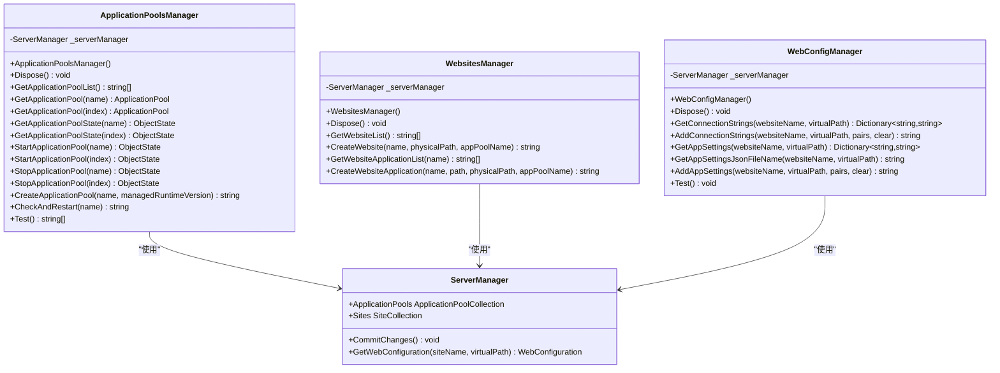

# API 参考文档

<cite>
**本文档引用的文件**
- [ApplicationPoolsManager.cs](file://iHawkIISLibrary/ApplicationPoolsManager.cs)
- [WebsitesManager.cs](file://iHawkIISLibrary/WebsitesManager.cs)
- [WebConfigManager.cs](file://iHawkIISLibrary/WebConfigManager.cs)
- [iHawkIISLibrary.csproj](file://iHawkIISLibrary/iHawkIISLibrary.csproj)
- [README.md](file://README.md)
</cite>

## 目录
1. [简介](#简介)
2. [项目结构](#项目结构)
3. [核心组件](#核心组件)
4. [架构概览](#架构概览)
5. [详细组件分析](#详细组件分析)
6. [依赖关系分析](#依赖关系分析)
7. [性能考虑](#性能考虑)
8. [故障排除指南](#故障排除指南)
9. [结论](#结论)
10. [附录](#附录)

## 简介
iHawkIISLibrary 是一个专门用于管理和监控 IIS（Internet Information Services）的 C# 类库。该库提供了三个核心管理器类，分别负责应用程序池管理、网站管理和 Web 配置管理。这些管理器基于 Microsoft.Web.Administration 命名空间构建，为 IIS 操作提供了简洁而强大的 API 接口。

本库的主要目标是：
- 提供简单易用的 IIS 管理接口
- 支持应用程序池的创建、启动、停止和状态监控
- 支持网站和应用程序的创建与管理
- 提供 Web 配置文件的读取和修改功能
- 确保线程安全和错误处理的健壮性

## 项目结构
iHawkIISLibrary 项目采用清晰的模块化设计，每个管理器类都专注于特定的 IIS 功能领域：


**图表来源**
- [ApplicationPoolsManager.cs](file://iHawkIISLibrary/ApplicationPoolsManager.cs#L1-L143)
- [WebsitesManager.cs](file://iHawkIISLibrary/WebsitesManager.cs#L1-L94)
- [WebConfigManager.cs](file://iHawkIISLibrary/WebConfigManager.cs#L1-L157)

**章节来源**
- [iHawkIISLibrary.csproj](file://iHawkIISLibrary/iHawkIISLibrary.csproj#L1-L63)

## 核心组件
本库包含三个主要的管理器类，每个类都实现了 IDisposable 接口以确保资源的正确释放：

### ApplicationPoolsManager（应用程序池管理器）
负责 IIS 应用程序池的完整生命周期管理，包括创建、查询、启动、停止和状态监控。

### WebsitesManager（网站管理器）
提供网站和应用程序的创建、查询和管理功能，支持多应用程序站点的复杂场景。

### WebConfigManager（Web配置管理器）
专注于 Web.config 文件的读取和修改，支持连接字符串和应用程序设置的动态管理。

**章节来源**
- [ApplicationPoolsManager.cs](file://iHawkIISLibrary/ApplicationPoolsManager.cs#L8-L143)
- [WebsitesManager.cs](file://iHawkIISLibrary/WebsitesManager.cs#L8-L94)
- [WebConfigManager.cs](file://iHawkIISLibrary/WebConfigManager.cs#L7-L157)

## 架构概览
整个库采用基于 ServerManager 的统一架构设计，所有管理器都通过 Microsoft.Web.Administration 提供的 API 与 IIS 进行交互：



**图表来源**
- [ApplicationPoolsManager.cs](file://iHawkIISLibrary/ApplicationPoolsManager.cs#L11-L143)
- [WebsitesManager.cs](file://iHawkIISLibrary/WebsitesManager.cs#L11-L94)
- [WebConfigManager.cs](file://iHawkIISLibrary/WebConfigManager.cs#L10-L157)

## 详细组件分析

### ApplicationPoolsManager API 参考

#### 构造函数
```csharp
public ApplicationPoolsManager()
```
- **功能**: 初始化应用程序池管理器实例
- **参数**: 无
- **返回值**: 无
- **异常**: 无
- **线程安全性**: 线程安全
- **性能特征**: O(1) 时间复杂度

#### Dispose 方法
```csharp
public void Dispose()
```
- **功能**: 释放 ServerManager 资源
- **参数**: 无
- **返回值**: 无
- **异常**: 无
- **线程安全性**: 线程安全
- **性能特征**: O(1) 时间复杂度

#### 测试方法（已弃用）
```csharp
[Obsolete]
public static string[] Test()
```
- **功能**: 测试应用程序池连接和状态
- **参数**: 无
- **返回值**: 字符串数组
- **异常**: 无
- **迁移指南**: 使用 `GetApplicationPoolList()` 替代

#### 获取应用程序池列表
```csharp
public List<string> GetApplicationPoolList()
```
- **功能**: 返回所有应用程序池的名称列表
- **参数**: 无
- **返回值**: List<string> - 应用程序池名称列表
- **异常**: 返回包含错误消息的列表
- **线程安全性**: 线程安全
- **性能特征**: O(n) 时间复杂度，n 为应用程序池数量

#### 获取应用程序池对象
```csharp
public ApplicationPool GetApplicationPool(string applicationPoolName)
public ApplicationPool GetApplicationPool(int index)
```
- **功能**: 根据名称或索引获取应用程序池对象
- **参数**: 
  - `applicationPoolName`: 应用程序池名称
  - `index`: 应用程序池索引
- **返回值**: ApplicationPool 对象
- **异常**: 抛出索引越界或名称不存在异常
- **线程安全性**: 线程安全
- **性能特征**: O(1) 时间复杂度

#### 获取应用程序池状态
```csharp
public ObjectState GetApplicationPoolState(string applicationPoolName)
public ObjectState GetApplicationPoolState(int index)
```
- **功能**: 获取应用程序池的当前状态
- **参数**: 
  - `applicationPoolName`: 应用程序池名称
  - `index`: 应用程序池索引
- **返回值**: ObjectState 枚举值
- **异常**: 抛出索引越界或名称不存在异常
- **线程安全性**: 线程安全
- **性能特征**: O(1) 时间复杂度

#### 启动应用程序池
```csharp
public ObjectState StartApplicationPool(string applicationPoolName)
public ObjectState StartApplicationPool(int index)
```
- **功能**: 启动指定的应用程序池
- **参数**: 
  - `applicationPoolName`: 应用程序池名称
  - `index`: 应用程序池索引
- **返回值**: ObjectState 枚举值（启动后的状态）
- **异常**: 抛出索引越界或名称不存在异常
- **线程安全性**: 线程安全
- **性能特征**: O(1) 时间复杂度

#### 停止应用程序池
```csharp
public ObjectState StopApplicationPool(string applicationPoolName)
public ObjectState StopApplicationPool(int index)
```
- **功能**: 停止指定的应用程序池
- **参数**: 
  - `applicationPoolName`: 应用程序池名称
  - `index`: 应用程序池索引
- **返回值**: ObjectState 枚举值（停止后的状态）
- **异常**: 抛出索引越界或名称不存在异常
- **线程安全性**: 线程安全
- **性能特征**: O(1) 时间复杂度

#### 创建应用程序池
```csharp
public string CreateApplicationPool(string name, string managedRuntimeVersion = "v4.0")
```
- **功能**: 创建新的应用程序池
- **参数**: 
  - `name`: 应用程序池名称
  - `managedRuntimeVersion`: .NET 运行时版本，默认 "v4.0"
- **返回值**: 成功返回 "success"，失败返回错误信息字符串
- **异常**: 无
- **线程安全性**: 线程安全
- **性能特征**: O(1) 时间复杂度
- **版本兼容性**: 支持 .NET Framework 4.0+

#### 监测并重启应用程序池
```csharp
public string CheckAndRestart(string name)
```
- **功能**: 检查应用程序池状态并在需要时重启
- **参数**: `name`: 应用程序池名称
- **返回值**: 空字符串（成功）或错误信息字符串
- **异常**: 返回错误信息字符串
- **线程安全性**: 线程安全
- **性能特征**: O(1) 时间复杂度

**章节来源**
- [ApplicationPoolsManager.cs](file://iHawkIISLibrary/ApplicationPoolsManager.cs#L11-L143)

### WebsitesManager API 参考

#### 构造函数
```csharp
public WebsitesManager()
```
- **功能**: 初始化网站管理器实例
- **参数**: 无
- **返回值**: 无
- **异常**: 无
- **线程安全性**: 线程安全
- **性能特征**: O(1) 时间复杂度

#### Dispose 方法
```csharp
public void Dispose()
```
- **功能**: 释放 ServerManager 资源
- **参数**: 无
- **返回值**: 无
- **异常**: 无
- **线程安全性**: 线程安全
- **性能特征**: O(1) 时间复杂度

#### 获取网站列表
```csharp
public List<string> GetWebsiteList()
```
- **功能**: 返回所有网站的名称列表
- **参数**: 无
- **返回值**: List<string> - 网站名称列表
- **异常**: 返回包含错误消息的列表
- **线程安全性**: 线程安全
- **性能特征**: O(n) 时间复杂度，n 为网站数量

#### 创建网站
```csharp
public string CreateWebsite(string websiteName, string websitePhysicalPath, string applicationPoolName)
```
- **功能**: 创建新的网站
- **参数**: 
  - `websiteName`: 网站名称
  - `websitePhysicalPath`: 物理路径
  - `applicationPoolName`: 应用程序池名称
- **返回值**: 成功返回 "success"，失败返回错误信息字符串
- **异常**: 无
- **线程安全性**: 线程安全
- **性能特征**: O(1) 时间复杂度

#### 获取网站应用程序列表
```csharp
public List<string> GetWebsiteApplicationList(string websiteName)
```
- **功能**: 获取网站下所有应用程序的路径列表
- **参数**: `websiteName`: 网站名称
- **返回值**: List<string> - 应用程序路径列表
- **异常**: 返回包含错误消息的列表
- **线程安全性**: 线程安全
- **性能特征**: O(m) 时间复杂度，m 为应用程序数量

#### 创建网站应用程序
```csharp
public string CreateWebsiteApplication(string websiteName, string applicationPath, string applicationPhysicalPath, string applicationPoolName)
```
- **功能**: 在现有网站下创建新应用程序
- **参数**: 
  - `websiteName`: 网站名称
  - `applicationPath`: 应用程序路径
  - `applicationPhysicalPath`: 应用程序物理路径
  - `applicationPoolName`: 应用程序池名称
- **返回值**: 成功返回 "success"，失败返回错误信息字符串
- **异常**: 无
- **线程安全性**: 线程安全
- **性能特征**: O(1) 时间复杂度

**章节来源**
- [WebsitesManager.cs](file://iHawkIISLibrary/WebsitesManager.cs#L11-L94)

### WebConfigManager API 参考

#### 构造函数
```csharp
public WebConfigManager()
```
- **功能**: 初始化 Web 配置管理器实例
- **参数**: 无
- **返回值**: 无
- **异常**: 无
- **线程安全性**: 线程安全
- **性能特征**: O(1) 时间复杂度

#### Dispose 方法
```csharp
public void Dispose()
```
- **功能**: 释放 ServerManager 资源
- **参数**: 无
- **返回值**: 无
- **异常**: 无
- **线程安全性**: 线程安全
- **性能特征**: O(1) 时间复杂度

#### 测试方法（已弃用）
```csharp
[Obsolete]
public void Test()
```
- **功能**: 测试 Web 配置连接
- **参数**: 无
- **返回值**: 无
- **异常**: 无
- **迁移指南**: 使用 `GetConnectionStrings()` 和 `GetAppSettings()` 替代

#### 获取连接字符串
```csharp
public Dictionary<string, string> GetConnectionStrings(string websiteName, string virtualPath)
```
- **功能**: 从 Web.config 中读取连接字符串
- **参数**: 
  - `websiteName`: 网站名称
  - `virtualPath`: 虚拟路径
- **返回值**: Dictionary<string, string> - 连接字符串字典
- **异常**: 返回 null
- **线程安全性**: 线程安全
- **性能特征**: O(k) 时间复杂度，k 为连接字符串数量

#### 添加连接字符串
```csharp
public string AddConnectionStrings(string websiteName, string virtualPath, Dictionary<string, string> nameConnectionStringPair, bool clear)
```
- **功能**: 向 Web.config 添加连接字符串
- **参数**: 
  - `websiteName`: 网站名称
  - `virtualPath`: 虚拟路径
  - `nameConnectionStringPair`: 连接字符串对字典
  - `clear`: 是否先清除现有连接字符串
- **返回值**: 成功返回 "success"，失败返回错误信息字符串
- **异常**: 无
- **线程安全性**: 线程安全
- **性能特征**: O(p) 时间复杂度，p 为添加的连接字符串数量

#### 获取应用程序设置
```csharp
public Dictionary<string, string> GetAppSettings(string websiteName, string virtualPath)
```
- **功能**: 从 Web.config 中读取应用程序设置
- **参数**: 
  - `websiteName`: 网站名称
  - `virtualPath`: 虚拟路径
- **返回值**: Dictionary<string, string> - 应用程序设置字典
- **异常**: 返回 null
- **线程安全性**: 线程安全
- **性能特征**: O(q) 时间复杂度，q 为应用程序设置数量

#### 获取 appsettings.json 文件路径
```csharp
public string GetAppSettingsJsonFileName(string websiteName, string virtualPath)
```
- **功能**: 获取 appsettings.json 文件的完整物理路径
- **参数**: 
  - `websiteName`: 网站名称
  - `virtualPath`: 虚拟路径
- **返回值**: 字符串 - 完整文件路径或错误信息
- **异常**: 返回错误信息字符串
- **线程安全性**: 线程安全
- **性能特征**: O(1) 时间复杂度

#### 添加应用程序设置
```csharp
public string AddAppSettings(string websiteName, string virtualPath, Dictionary<string, string> keyValuePair, bool clear)
```
- **功能**: 向 Web.config 添加应用程序设置
- **参数**: 
  - `websiteName`: 网站名称
  - `virtualPath`: 虚拟路径
  - `keyValuePair`: 键值对字典
  - `clear`: 是否先清除现有设置
- **返回值**: 成功返回 "success"，失败返回错误信息字符串
- **异常**: 无
- **线程安全性**: 线程安全
- **性能特征**: O(r) 时间复杂度，r 为添加的应用程序设置数量

**章节来源**
- [WebConfigManager.cs](file://iHawkIISLibrary/WebConfigManager.cs#L10-L157)

## 依赖关系分析

### 外部依赖
库的核心依赖关系如下：


**图表来源**
- [iHawkIISLibrary.csproj](file://iHawkIISLibrary/iHawkIISLibrary.csproj#L34-L37)

### 内部依赖关系
三个管理器类之间没有直接依赖关系，但都共享相同的底层基础设施：


**图表来源**
- [ApplicationPoolsManager.cs](file://iHawkIISLibrary/ApplicationPoolsManager.cs#L29)
- [WebsitesManager.cs](file://iHawkIISLibrary/WebsitesManager.cs#L26)
- [WebConfigManager.cs](file://iHawkIISLibrary/WebConfigManager.cs#L28)

**章节来源**
- [iHawkIISLibrary.csproj](file://iHawkIISLibrary/iHawkIISLibrary.csproj#L34-L37)

## 性能考虑

### 时间复杂度分析
- **应用程序池操作**: O(1) - 直接访问集合元素
- **网站操作**: O(1) - 直接访问集合元素
- **配置读取**: O(n) - 需要遍历配置集合
- **配置写入**: O(n) - 需要创建和添加元素

### 内存使用
- 所有方法都使用一次性 ServerManager 实例
- Dispose 方法确保资源及时释放
- 避免了内存泄漏的风险

### 并发安全性
- 每个管理器类都有独立的 ServerManager 实例
- 线程间操作不会相互影响
- 建议在多线程环境中为每个线程创建独立实例

## 故障排除指南

### 常见异常和解决方案

#### 权限问题
**症状**: 访问被拒绝或无法连接到 IIS
**解决方案**: 
- 以管理员身份运行应用程序
- 确保服务账户具有适当的 IIS 权限

#### 应用程序池不存在
**症状**: `GetApplicationPool()` 或 `GetApplicationPoolState()` 抛出异常
**解决方案**:
```csharp
// 先检查应用程序池是否存在
var pools = manager.GetApplicationPoolList();
if (!pools.Contains(poolName))
{
    // 创建应用程序池
    manager.CreateApplicationPool(poolName);
}
```

#### 网站不存在
**症状**: `GetWebsiteApplicationList()` 返回错误信息
**解决方案**:
```csharp
// 先验证网站存在
var websites = manager.GetWebsiteList();
if (!websites.Contains(websiteName))
{
    // 创建网站
    manager.CreateWebsite(websiteName, physicalPath, appPoolName);
}
```

#### 配置文件访问失败
**症状**: `GetConnectionStrings()` 或 `GetAppSettings()` 返回 null
**解决方案**:
- 检查虚拟路径是否正确
- 确认 Web.config 文件存在且可访问
- 验证应用程序池状态正常

**章节来源**
- [ApplicationPoolsManager.cs](file://iHawkIISLibrary/ApplicationPoolsManager.cs#L49-L58)
- [WebsitesManager.cs](file://iHawkIISLibrary/WebsitesManager.cs#L32-L40)
- [WebConfigManager.cs](file://iHawkIISLibrary/WebConfigManager.cs#L49-L66)

## 结论
iHawkIISLibrary 提供了一个完整而强大的 IIS 管理 API，涵盖了应用程序池、网站和 Web 配置管理的核心需求。该库的设计注重易用性和可靠性，同时保持了良好的性能特征。

主要优势：
- **简洁的 API 设计**: 每个管理器类职责单一，易于理解和使用
- **完善的错误处理**: 所有方法都有适当的异常处理和错误返回机制
- **线程安全**: 支持多线程环境下的并发操作
- **版本兼容**: 基于稳定的 .NET Framework 4.7.2 和 Microsoft.Web.Administration

建议的使用场景：
- IIS 自动化部署工具
- 监控和维护系统
- 配置管理工具
- 开发环境自动化脚本

## 附录

### 版本兼容性信息
- **目标框架**: .NET Framework 4.7.2
- **Microsoft.Web.Administration**: 版本 7.0.0.0
- **IIS 版本**: 支持 IIS 7.0 及以上版本

### 弃用方法迁移指南

#### ApplicationPoolsManager.Test() 迁移
**旧方法**:
```csharp
// 已弃用
string[] result = ApplicationPoolsManager.Test();
```

**新方法**:
```csharp
using (var manager = new ApplicationPoolsManager())
{
    var poolNames = manager.GetApplicationPoolList();
    foreach (var name in poolNames)
    {
        var pool = manager.GetApplicationPool(name);
        var state = manager.GetApplicationPoolState(name);
        Console.WriteLine($"{name}: {state}");
    }
}
```

#### WebConfigManager.Test() 迁移
**旧方法**:
```csharp
// 已弃用
WebConfigManager manager = new WebConfigManager();
manager.Test();
```

**新方法**:
```csharp
using (var manager = new WebConfigManager())
{
    var connectionStrings = manager.GetConnectionStrings("Default Web Site", "");
    var appSettings = manager.GetAppSettings("Default Web Site", "");
}
```

### 最佳实践建议

#### 资源管理
```csharp
// 推荐：使用 using 语句确保资源释放
using (var manager = new ApplicationPoolsManager())
{
    // 执行操作
}

// 不推荐：手动调用 Dispose
ApplicationPoolsManager manager = new ApplicationPoolsManager();
try
{
    // 执行操作
}
finally
{
    manager.Dispose();
}
```

#### 错误处理模式
```csharp
using (var manager = new WebsitesManager())
{
    string result = manager.CreateWebsite(name, path, pool);
    if (result != "success")
    {
        Console.WriteLine($"创建失败: {result}");
        // 处理错误
    }
}
```

#### 性能优化建议
- 批量操作时复用同一个管理器实例
- 避免频繁的 IIS 查询操作
- 在高并发场景下为每个线程创建独立实例

**章节来源**
- [ApplicationPoolsManager.cs](file://iHawkIISLibrary/ApplicationPoolsManager.cs#L35-L45)
- [WebConfigManager.cs](file://iHawkIISLibrary/WebConfigManager.cs#L34-L45)