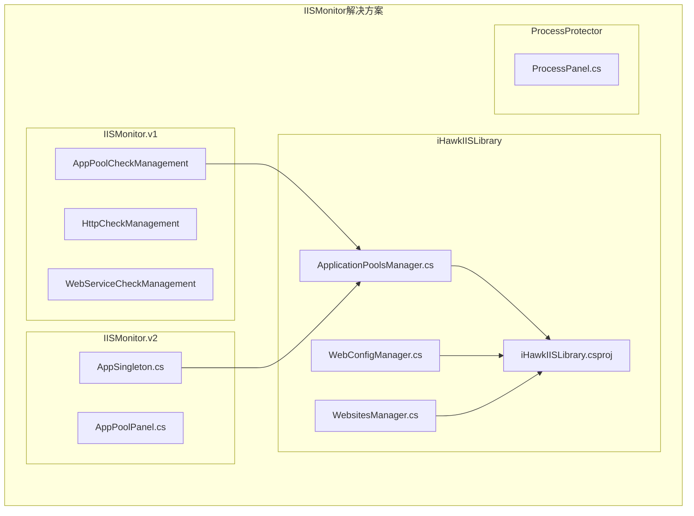
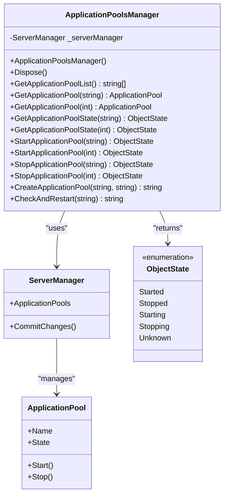
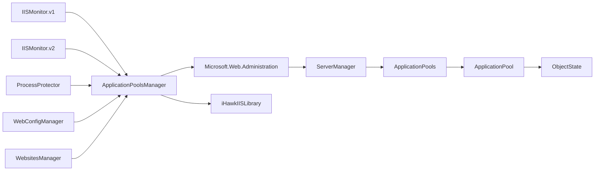

# 应用程序池管理API

<cite>
**本文档引用的文件**
- [ApplicationPoolsManager.cs](file://iHawkIISLibrary/ApplicationPoolsManager.cs)
- [WebConfigManager.cs](file://iHawkIISLibrary/WebConfigManager.cs)
- [WebsitesManager.cs](file://iHawkIISLibrary/WebsitesManager.cs)
- [iHawkIISLibrary.csproj](file://iHawkIISLibrary/iHawkIISLibrary.csproj)
- [AppPoolCheckManagerPanel.cs](file://IISMonitor.v1/AppPoolCheckManagement/AppPoolCheckManagerPanel.cs)
- [AppSingleton.cs](file://IISMonitor.v2/AppSingleton.cs)
- [README.md](file://README.md)
</cite>

## 目录
1. [简介](#简介)
2. [项目结构](#项目结构)
3. [核心组件](#核心组件)
4. [架构概览](#架构概览)
5. [详细组件分析](#详细组件分析)
6. [依赖关系分析](#依赖关系分析)
7. [性能考虑](#性能考虑)
8. [故障排除指南](#故障排除指南)
9. [结论](#结论)
10. [附录](#附录)

## 简介

ApplicationPoolsManager类是iHawkIISLibrary库中的核心组件，专门负责IIS应用程序池的管理和操作。该类提供了完整的应用程序池生命周期管理功能，包括查询、启动、停止、创建和监控等操作。通过封装Microsoft.Web.Administration命名空间，该类为上层应用提供了简洁易用的API接口。

本类采用单例模式设计，在IISMonitor.v2中通过AppSingleton静态实例提供全局访问点。所有操作都基于ServerManager对象进行，确保与IIS服务器的稳定连接和数据一致性。

## 项目结构

该项目采用分层架构设计，主要包含以下核心模块：



**图表来源**
- [iHawkIISLibrary.csproj](file://iHawkIISLibrary/iHawkIISLibrary.csproj#L1-L63)
- [ApplicationPoolsManager.cs](file://iHawkIISLibrary/ApplicationPoolsManager.cs#L1-L143)

**章节来源**
- [README.md](file://README.md#L1-L10)
- [iHawkIISLibrary.csproj](file://iHawkIISLibrary/iHawkIISLibrary.csproj#L1-L63)

## 核心组件

ApplicationPoolsManager类是整个IIS管理功能的核心，它继承自IDisposable接口，确保资源的正确释放。类内部维护一个私有的ServerManager实例，用于与IIS服务器进行通信。

### 主要特性
- **线程安全**: 通过单例模式和ServerManager的线程安全特性保证并发访问的安全性
- **异常处理**: 完善的try-catch机制，提供友好的错误信息反馈
- **资源管理**: 实现IDisposable接口，确保ServerManager资源的及时释放
- **状态查询**: 提供应用程序池状态的实时查询能力

### 关键属性
- `_serverManager`: 私有readonly字段，存储ServerManager实例
- 支持多种重载方法，既支持按名称也支持按索引访问应用程序池

**章节来源**
- [ApplicationPoolsManager.cs](file://iHawkIISLibrary/ApplicationPoolsManager.cs#L11-L31)

## 架构概览

ApplicationPoolsManager类在整体架构中扮演着关键角色，作为IIS管理的抽象层，向上层应用提供统一的接口。



**图表来源**
- [ApplicationPoolsManager.cs](file://iHawkIISLibrary/ApplicationPoolsManager.cs#L11-L143)

## 详细组件分析

### 公共方法详解

#### GetApplicationPoolList() 方法
**方法签名**: `public List<string> GetApplicationPoolList()`

**功能描述**: 获取系统中所有应用程序池的名称列表。

**返回值**: `List<string>` - 包含所有应用程序池名称的列表

**异常处理**: 
- 捕获任何异常并返回包含错误信息的列表
- 异常信息会输出到控制台

**使用场景**: 
- 初始化应用程序池选择界面
- 批量显示应用程序池状态
- 验证应用程序池存在性

**性能特征**: 
- 时间复杂度: O(n)，其中n为应用程序池数量
- 内存使用: O(n)用于存储结果列表

**章节来源**
- [ApplicationPoolsManager.cs](file://iHawkIISLibrary/ApplicationPoolsManager.cs#L47-L58)

#### GetApplicationPool() 方法
**方法签名**: 
- `public ApplicationPool GetApplicationPool(string applicationPoolName)`
- `public ApplicationPool GetApplicationPool(int index)`

**功能描述**: 根据名称或索引获取指定的应用程序池对象。

**参数**:
- `applicationPoolName`: 应用程序池名称
- `index`: 应用程序池在集合中的索引位置

**返回值**: `ApplicationPool` - 对应的应用程序池对象

**异常处理**: 
- 直接委托给ServerManager的索引器
- 可能抛出ArgumentOutOfRangeException或ArgumentNullException

**使用场景**: 
- 获取应用程序池的详细配置信息
- 进行更复杂的操作前的状态检查

**章节来源**
- [ApplicationPoolsManager.cs](file://iHawkIISLibrary/ApplicationPoolsManager.cs#L60-L68)

#### GetApplicationPoolState() 方法
**方法签名**: 
- `public ObjectState GetApplicationPoolState(string applicationPoolName)`
- `public ObjectState GetApplicationPoolState(int index)`

**功能描述**: 获取指定应用程序池的当前运行状态。

**参数**:
- `applicationPoolName`: 应用程序池名称
- `index`: 应用程序池在集合中的索引位置

**返回值**: `ObjectState` - 应用程序池的运行状态枚举值

**状态枚举值**:
- `Started`: 已启动
- `Stopped`: 已停止  
- `Starting`: 启动中
- `Stopping`: 停止中
- `Unknown`: 状态未知

**异常处理**: 
- 直接从ApplicationPool.State属性获取
- 可能抛出异常当应用程序池不存在时

**使用场景**: 
- 状态监控和显示
- 条件判断逻辑的基础
- 日志记录和报告生成

**章节来源**
- [ApplicationPoolsManager.cs](file://iHawkIISLibrary/ApplicationPoolsManager.cs#L70-L78)

#### StartApplicationPool() 方法
**方法签名**: 
- `public ObjectState StartApplicationPool(string applicationPoolName)`
- `public ObjectState StartApplicationPool(int index)`

**功能描述**: 启动指定的应用程序池。

**参数**:
- `applicationPoolName`: 应用程序池名称
- `index`: 应用程序池在集合中的索引位置

**返回值**: `ObjectState` - 启动后的应用程序池状态

**异常处理**: 
- 直接调用ApplicationPool.Start()方法
- 可能抛出SecurityException或InvalidOperationException

**使用场景**: 
- 应用程序池恢复操作
- 手动干预和故障排除
- 自动化运维脚本

**注意事项**:
- 启动操作可能需要管理员权限
- 某些情况下启动可能失败，需要检查IIS配置

**章节来源**
- [ApplicationPoolsManager.cs](file://iHawkIISLibrary/ApplicationPoolsManager.cs#L80-L88)

#### StopApplicationPool() 方法
**方法签名**: 
- `public ObjectState StopApplicationPool(string applicationPoolName)`
- `public ObjectState StopApplicationPool(int index)`

**功能描述**: 停止指定的应用程序池。

**参数**:
- `applicationPoolName`: 应用程序池名称
- `index`: 应用程序池在集合中的索引位置

**返回值**: `ObjectState` - 停止后的应用程序池状态

**异常处理**: 
- 直接调用ApplicationPool.Stop()方法
- 可能抛出SecurityException或InvalidOperationException

**使用场景**: 
- 维护窗口停机
- 故障隔离和诊断
- 资源回收操作

**注意事项**:
- 停止操作可能导致正在运行的应用程序中断
- 建议在维护窗口内执行此操作

**章节来源**
- [ApplicationPoolsManager.cs](file://iHawkIISLibrary/ApplicationPoolsManager.cs#L90-L98)

#### CreateApplicationPool() 方法
**方法签名**: `public string CreateApplicationPool(string name, string managedRuntimeVersion = "v4.0")`

**功能描述**: 创建新的应用程序池。

**参数**:
- `name`: 应用程序池名称
- `managedRuntimeVersion`: .NET框架版本，默认为"v4.0"

**返回值**: `string` - 操作结果消息，成功返回"success"，失败返回错误信息

**配置设置**:
- `ManagedRuntimeVersion`: 设置.NET运行时版本
- `Enable32BitAppOnWin64`: 设置为false（禁用32位应用）
- `ManagedPipelineMode`: 设置为Integrated（集成管道模式）

**异常处理**: 
- 检查应用程序池是否已存在
- 捕获创建过程中的异常并返回详细错误信息
- 调用ServerManager.CommitChanges()提交更改

**使用场景**: 
- 新应用程序部署
- 环境配置管理
- 自动化部署流程

**注意事项**:
- 如果应用程序池已存在，返回失败消息
- 创建后需要手动配置应用程序的绑定信息

**章节来源**
- [ApplicationPoolsManager.cs](file://iHawkIISLibrary/ApplicationPoolsManager.cs#L100-L121)

#### CheckAndRestart() 方法
**方法签名**: `public string CheckAndRestart(string name)`

**功能描述**: 监测应用程序池状态并在停止时自动重启。

**参数**:
- `name`: 应用程序池名称

**返回值**: `string` - 操作结果消息，正常运行返回空字符串，需要重启时返回重启信息，失败时返回错误信息

**工作流程**:
1. 检查应用程序池状态
2. 如果状态为Started，直接返回空字符串
3. 如果状态为Stopped，调用StartApplicationPool()重启
4. 返回重启结果信息

**异常处理**: 
- 捕获状态检查和重启过程中的异常
- 返回详细的错误信息

**使用场景**: 
- 应用程序池健康监控
- 自动故障恢复
- 服务可用性保障

**性能特征**: 
- 单次检查操作，时间复杂度O(1)
- 不涉及大量数据处理，性能开销很小

**章节来源**
- [ApplicationPoolsManager.cs](file://iHawkIISLibrary/ApplicationPoolsManager.cs#L123-L138)

### 线程安全性说明

ApplicationPoolsManager类具有良好的线程安全性特征：

1. **ServerManager线程安全**: 使用的Microsoft.Web.Administration.ServerManager是线程安全的，可以在多线程环境中安全使用

2. **单例模式**: 在IISMonitor.v2中通过AppSingleton提供全局唯一实例，避免了多个ServerManager实例导致的资源竞争

3. **资源管理**: 实现IDisposable接口，确保ServerManager资源的正确释放

4. **异常隔离**: 每个方法都有独立的try-catch块，防止异常传播影响其他操作

**章节来源**
- [ApplicationPoolsManager.cs](file://iHawkIISLibrary/ApplicationPoolsManager.cs#L11-L23)
- [AppSingleton.cs](file://IISMonitor.v2/AppSingleton.cs#L9-L12)

### 性能特征分析

#### 时间复杂度
- `GetApplicationPoolList()`: O(n) - 需要遍历所有应用程序池
- `GetApplicationPoolState()`: O(1) - 直接属性访问
- `StartApplicationPool()/StopApplicationPool()`: O(1) - 状态变更操作
- `CreateApplicationPool()`: O(1) - 单个对象操作
- `CheckAndRestart()`: O(1) - 状态检查和单次启动操作

#### 内存使用
- 主要内存消耗来自应用程序池列表的存储
- 单次操作的内存开销相对较小
- ServerManager实例在整个应用程序生命周期内保持

#### I/O性能
- 与IIS服务器的通信是主要的性能瓶颈
- 建议批量操作以减少网络往返次数
- 避免频繁的状态轮询操作

## 依赖关系分析

ApplicationPoolsManager类依赖于Microsoft.Web.Administration命名空间提供的ServerManager类来实现IIS管理功能。



**图表来源**
- [iHawkIISLibrary.csproj](file://iHawkIISLibrary/iHawkIISLibrary.csproj#L34-L37)
- [ApplicationPoolsManager.cs](file://iHawkIISLibrary/ApplicationPoolsManager.cs#L1-L4)

### 外部依赖

1. **Microsoft.Web.Administration**: 核心依赖，提供IIS管理功能
2. **System**: .NET Framework基础类库
3. **System.Collections.Generic**: 泛型集合支持
4. **System.Linq**: LINQ查询支持

**章节来源**
- [iHawkIISLibrary.csproj](file://iHawkIISLibrary/iHawkIISLibrary.csproj#L34-L44)

## 性能考虑

### 最佳实践建议

1. **批量操作优化**
   - 将多个相关操作组合在一个ServerManager实例中执行
   - 避免频繁创建和销毁ServerManager实例

2. **状态轮询优化**
   - 合理设置轮询间隔，避免过度频繁的检查
   - 使用事件驱动的方式替代轮询

3. **异常处理优化**
   - 在上层应用中实现重试机制
   - 记录异常日志以便问题诊断

4. **资源管理**
   - 确保正确实现IDisposable接口
   - 在应用程序关闭时及时释放资源

### 性能监控指标

- **响应时间**: 单次操作通常在毫秒级别
- **吞吐量**: 受IIS服务器性能限制
- **内存占用**: 相对稳定的低占用
- **CPU使用**: 主要受IIS服务器影响

## 故障排除指南

### 常见问题及解决方案

#### 权限问题
**症状**: 操作抛出SecurityException
**原因**: 当前用户没有足够的IIS管理权限
**解决方案**: 
- 以管理员身份运行应用程序
- 配置适当的IIS管理权限

#### 应用程序池不存在
**症状**: 索引器抛出异常
**原因**: 指定的应用程序池名称或索引无效
**解决方案**:
- 先调用GetApplicationPoolList()验证存在性
- 使用异常处理捕获并处理此情况

#### IIS服务不可用
**症状**: 无法连接到IIS服务器
**原因**: IIS服务未启动或网络连接问题
**解决方案**:
- 检查IIS服务状态
- 验证网络连接和防火墙设置

#### 配置冲突
**症状**: CreateApplicationPool()返回失败
**原因**: 应用程序池名称已存在或其他配置冲突
**解决方案**:
- 使用唯一的应用程序池名称
- 检查现有配置的兼容性

### 调试技巧

1. **启用详细日志**: 在上层应用中添加日志记录
2. **使用异常信息**: 利用返回的错误消息进行问题定位
3. **状态检查**: 在关键操作前后检查应用程序池状态
4. **逐步调试**: 将复杂操作分解为多个简单步骤

**章节来源**
- [ApplicationPoolsManager.cs](file://iHawkIISLibrary/ApplicationPoolsManager.cs#L53-L57)
- [ApplicationPoolsManager.cs](file://iHawkIISLibrary/ApplicationPoolsManager.cs#L117-L121)

## 结论

ApplicationPoolsManager类为IIS应用程序池管理提供了完整而实用的解决方案。其设计充分考虑了易用性、可靠性和性能要求，通过清晰的方法签名和完善的异常处理机制，为上层应用提供了稳定的服务。

该类的主要优势包括：
- **简洁的API设计**: 方法签名直观易懂
- **完整的功能覆盖**: 涵盖应用程序池管理的所有核心需求
- **良好的错误处理**: 提供详细的错误信息和异常处理
- **线程安全性**: 支持多线程环境下的安全操作
- **资源管理**: 正确的资源释放机制

在实际使用中，建议结合具体的业务需求选择合适的方法，并注意权限配置和性能优化。通过合理的设计模式和最佳实践，可以充分发挥该类的功能优势。

## 附录

### 使用示例

#### 基本查询操作
```csharp
// 获取所有应用程序池名称
var apm = new ApplicationPoolsManager();
var poolNames = apm.GetApplicationPoolList();

// 检查特定应用程序池状态
foreach (var name in poolNames)
{
    var state = apm.GetApplicationPoolState(name);
    Console.WriteLine($"{name}: {state}");
}
```

#### 应用程序池管理操作
```csharp
// 创建新应用程序池
var result = apm.CreateApplicationPool("MyAppPool", "v4.0");

// 启动应用程序池
if (apm.GetApplicationPoolState("MyAppPool") != ObjectState.Started)
{
    apm.StartApplicationPool("MyAppPool");
}

// 停止应用程序池
apm.StopApplicationPool("MyAppPool");
```

#### 监控和自动化
```csharp
// 周期性监控应用程序池状态
Timer timer = new Timer();
timer.Tick += (sender, e) =>
{
    var state = apm.GetApplicationPoolState("MyAppPool");
    if (state != ObjectState.Started)
    {
        apm.CheckAndRestart("MyAppPool");
    }
};
timer.Start();
```

### 相关类参考

#### WebConfigManager
提供Web.config文件的读写和配置管理功能，与ApplicationPoolsManager配合使用可实现完整的IIS配置管理。

#### WebsitesManager  
负责网站和应用程序的管理，与ApplicationPoolsManager共同构成IIS管理的完整解决方案。

**章节来源**
- [AppPoolCheckManagerPanel.cs](file://IISMonitor.v1/AppPoolCheckManagement/AppPoolCheckManagerPanel.cs#L58-L104)
- [AppSingleton.cs](file://IISMonitor.v2/AppSingleton.cs#L9-L12)