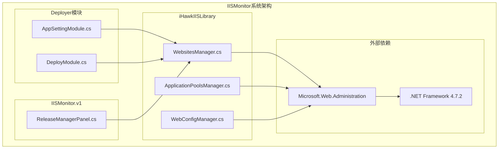
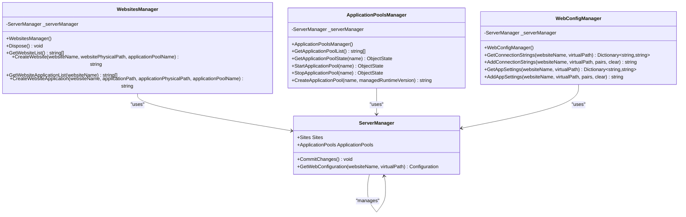
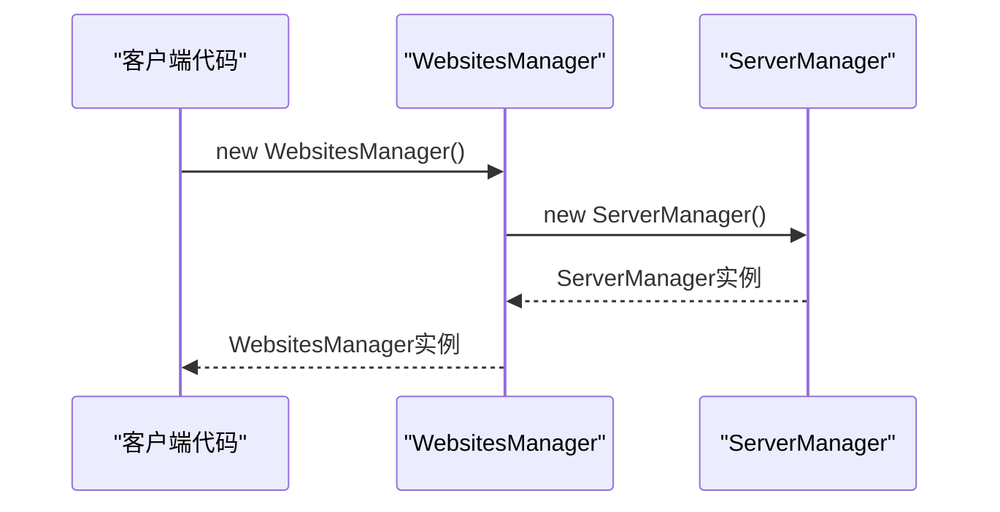
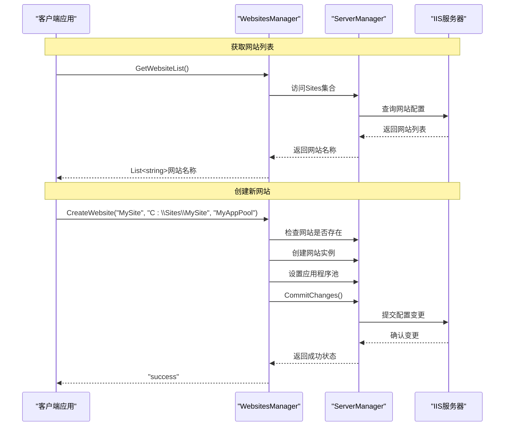
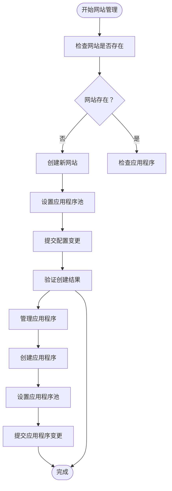
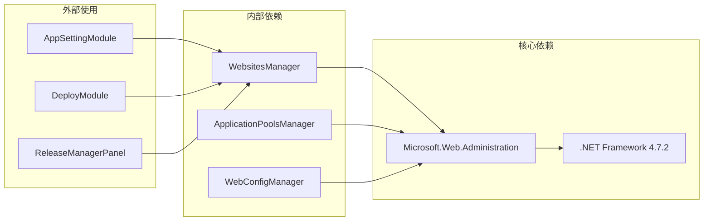

# 网站管理API

<cite>
**本文档引用的文件**
- [WebsitesManager.cs](file://iHawkIISLibrary/WebsitesManager.cs)
- [ApplicationPoolsManager.cs](file://iHawkIISLibrary/ApplicationPoolsManager.cs)
- [WebConfigManager.cs](file://iHawkIISLibrary/WebConfigManager.cs)
- [AppSettingModule.cs](file://Deployer/Modules/AppSettingModule.cs)
- [ReleaseManagerPanel.cs](file://IISMonitor.v1/ReleaseManagement/ReleaseManagerPanel.cs)
- [DeployModule.cs](file://Deployer/Modules/DeployModule.cs)
- [iHawkIISLibrary.csproj](file://iHawkIISLibrary/iHawkIISLibrary.csproj)
- [README.md](file://README.md)
</cite>

## 目录
1. [简介](#简介)
2. [项目结构](#项目结构)
3. [核心组件](#核心组件)
4. [架构概览](#架构概览)
5. [详细组件分析](#详细组件分析)
6. [依赖关系分析](#依赖关系分析)
7. [性能考虑](#性能考虑)
8. [故障排除指南](#故障排除指南)
9. [结论](#结论)

## 简介

WebsitesManager类是iHawkIISLibrary库中的核心组件，专门负责IIS网站的管理操作。该类提供了完整的网站生命周期管理功能，包括网站列表获取、网站状态查询、网站启动停止、网站创建和删除等核心功能。

本项目是一个用于监测和操作IIS的桌面软件，包含IIS操作类库和IISMonitor桌面软件两部分。WebsitesManager类基于Microsoft.Web.Administration命名空间实现，直接与IIS服务器进行交互。

## 项目结构

项目采用分层架构设计，主要包含以下模块：

**图表来源**
- [iHawkIISLibrary.csproj](file://iHawkIISLibrary/iHawkIISLibrary.csproj#L1-L63)
- [WebsitesManager.cs](file://iHawkIISLibrary/WebsitesManager.cs#L1-L94)

**章节来源**
- [README.md](file://README.md#L1-L10)
- [iHawkIISLibrary.csproj](file://iHawkIISLibrary/iHawkIISLibrary.csproj#L1-L63)

## 核心组件

WebsitesManager类是IIS网站管理的核心组件，实现了以下关键功能：

### 主要职责
- **网站列表管理**：获取所有IIS网站的名称列表
- **网站创建**：创建新的IIS网站实例
- **应用程序管理**：管理网站的应用程序集合
- **资源管理**：正确管理ServerManager资源的生命周期

### 设计特点
- 实现IDisposable接口，确保资源正确释放
- 使用try-catch异常处理机制
- 返回统一格式的字符串消息（"success"或"fail: 错误信息"）
- 基于LINQ查询优化数据访问

**章节来源**
- [WebsitesManager.cs](file://iHawkIISLibrary/WebsitesManager.cs#L8-L27)

## 架构概览

WebsitesManager类在整体系统架构中扮演着关键角色，作为IIS网站管理的门面模式实现：

**图表来源**
- [WebsitesManager.cs](file://iHawkIISLibrary/WebsitesManager.cs#L11-L91)
- [ApplicationPoolsManager.cs](file://iHawkIISLibrary/ApplicationPoolsManager.cs#L11-L142)
- [WebConfigManager.cs](file://iHawkIISLibrary/WebConfigManager.cs#L10-L156)

## 详细组件分析

### WebsitesManager类详解

#### 类结构和构造函数

WebsitesManager类采用简单的构造函数模式，自动初始化ServerManager实例：

**图表来源**
- [WebsitesManager.cs](file://iHawkIISLibrary/WebsitesManager.cs#L14-L17)

#### 网站列表获取方法

**方法签名**: `public List<string> GetWebsiteList()`

**功能描述**: 获取IIS服务器上所有网站的名称列表

**参数**: 无

**返回值**: 
- 成功：包含所有网站名称的List<string>
- 失败：包含错误信息的List<string>，格式为"fail: 错误消息"

**前置条件**:
- IIS服务必须正在运行
- 当前用户具有读取IIS配置的权限

**后置状态**: 不修改任何现有配置

**异常处理**: 
- 捕获所有异常并返回包含错误信息的列表
- 不抛出异常给调用者

**章节来源**
- [WebsitesManager.cs](file://iHawkIISLibrary/WebsitesManager.cs#L30-L40)

#### 网站创建方法

**方法签名**: `public string CreateWebsite(string websiteName, string websitePhysicalPath, string applicationPoolName)`

**功能描述**: 在IIS服务器上创建新的网站实例

**参数定义**:
- `websiteName`: 新网站的名称，必须唯一且不为空
- `websitePhysicalPath`: 网站物理路径，必须存在且可访问
- `applicationPoolName`: 应用程序池名称，必须已存在

**返回值**:
- 成功："success"
- 失败："fail: 错误消息"

**前置条件**:
- 网站名称必须唯一（不能与现有网站冲突）
- 物理路径必须存在且有效
- 应用程序池必须已存在

**后置状态**:
- 新网站被添加到IIS配置中
- 所有应用程序默认池设置更新
- 配置变更已提交到IIS

**异常处理**:
- 检查网站名称重复性
- 验证物理路径有效性
- 捕获并返回所有异常信息

**章节来源**
- [WebsitesManager.cs](file://iHawkIISLibrary/WebsitesManager.cs#L42-L58)

#### 网站应用程序列表获取方法

**方法签名**: `public List<string> GetWebsiteApplicationList(string websiteName)`

**功能描述**: 获取指定网站的所有应用程序路径列表

**参数定义**:
- `websiteName`: 目标网站名称

**返回值**:
- 成功：包含所有应用程序路径的List<string>
- 失败：包含错误信息的List<string>

**前置条件**:
- 指定的网站必须存在

**后置状态**: 不修改任何现有配置

**异常处理**:
- 验证网站存在性
- 捕获并返回所有异常信息

**章节来源**
- [WebsitesManager.cs](file://iHawkIISLibrary/WebsitesManager.cs#L60-L72)

#### 网站应用程序创建方法

**方法签名**: `public string CreateWebsiteApplication(string websiteName, string applicationPath, string applicationPhysicalPath, string applicationPoolName)`

**功能描述**: 在现有网站中创建新的应用程序

**参数定义**:
- `websiteName`: 目标网站名称
- `applicationPath`: 应用程序虚拟路径（如"/app1"）
- `applicationPhysicalPath`: 应用程序物理路径
- `applicationPoolName`: 应用程序池名称

**返回值**:
- 成功："success"
- 失败："fail: 错误消息"

**前置条件**:
- 网站必须存在
- 应用程序路径必须唯一
- 物理路径必须存在且有效

**后置状态**:
- 新应用程序被添加到网站中
- 应用程序池设置更新
- 配置变更已提交

**异常处理**:
- 验证网站存在性
- 检查应用程序路径唯一性
- 捕获并返回所有异常信息

**章节来源**
- [WebsitesManager.cs](file://iHawkIISLibrary/WebsitesManager.cs#L74-L90)

### API使用示例

#### 基础网站管理示例

以下示例展示了如何使用WebsitesManager进行基本的网站管理操作：

**图表来源**
- [WebsitesManager.cs](file://iHawkIISLibrary/WebsitesManager.cs#L30-L58)
- [AppSettingModule.cs](file://Deployer/Modules/AppSettingModule.cs#L44-L54)

#### 完整的网站生命周期管理示例

**图表来源**
- [WebsitesManager.cs](file://iHawkIISLibrary/WebsitesManager.cs#L42-L90)
- [DeployModule.cs](file://Deployer/Modules/DeployModule.cs#L127-L152)

**章节来源**
- [AppSettingModule.cs](file://Deployer/Modules/AppSettingModule.cs#L44-L82)
- [ReleaseManagerPanel.cs](file://IISMonitor.v1/ReleaseManagement/ReleaseManagerPanel.cs#L58-L109)
- [DeployModule.cs](file://Deployer/Modules/DeployModule.cs#L127-L152)

## 依赖关系分析

WebsitesManager类与其他组件之间的依赖关系如下：

**图表来源**
- [iHawkIISLibrary.csproj](file://iHawkIISLibrary/iHawkIISLibrary.csproj#L34-L37)
- [WebsitesManager.cs](file://iHawkIISLibrary/WebsitesManager.cs#L1-L4)

### 外部依赖分析

**Microsoft.Web.Administration**
- 版本：7.0.0.0
- 用途：IIS服务器管理API
- 必需权限：IIS管理权限

**.NET Framework 4.7.2**
- 目标框架版本
- 支持Windows Server 2012及以上版本

**章节来源**
- [iHawkIISLibrary.csproj](file://iHawkIISLibrary/iHawkIISLibrary.csproj#L34-L44)

## 性能考虑

### 资源管理
- WebsitesManager实现了IDisposable接口，确保ServerManager资源正确释放
- 建议使用using语句确保资源及时释放

### 查询优化
- 使用LINQ查询优化网站列表获取
- 避免不必要的配置读取操作

### 异步操作建议
- 对于大量网站的操作，建议考虑异步实现
- 避免阻塞UI线程

## 故障排除指南

### 常见错误及解决方案

#### 权限相关错误
**症状**: 创建网站或应用程序时返回"fail: 拒绝访问"
**原因**: 当前用户没有IIS管理权限
**解决方案**: 
- 以管理员身份运行应用程序
- 确保用户账户属于IIS_WPG组
- 检查IIS服务的启动账户权限

#### 网站名称冲突
**症状**: 返回"fail: 网站名称已存在"
**原因**: 指定的网站名称已被使用
**解决方案**:
- 使用唯一的网站名称
- 检查现有网站列表确认名称可用性

#### 物理路径无效
**症状**: 返回"fail: 物理路径不存在"
**原因**: 指定的物理路径不存在或不可访问
**解决方案**:
- 验证物理路径的有效性
- 确保路径存在且具有适当的访问权限

#### 应用程序池不存在
**症状**: 返回"fail: 应用程序池不存在"
**原因**: 指定的应用程序池尚未创建
**解决方案**:
- 先创建应用程序池
- 使用ApplicationPoolsManager验证池的存在性

### 最佳实践

#### 错误处理策略
-  st始终检查返回值状态
- 实现重试机制处理临时性错误
- 记录详细的错误日志便于诊断

#### 性能优化建议
- 批量操作时合并配置变更
- 避免频繁的IIS配置读取
- 使用连接池管理数据库连接

#### 安全考虑
- 验证所有输入参数
- 实施适当的权限检查
- 使用最小权限原则

**章节来源**
- [WebsitesManager.cs](file://iHawkIISLibrary/WebsitesManager.cs#L36-L57)
- [ApplicationPoolsManager.cs](file://iHawkIISLibrary/ApplicationPoolsManager.cs#L109-L120)

## 结论

WebsitesManager类提供了完整而简洁的IIS网站管理API，具有以下特点：

### 设计优势
- **简单易用**: 清晰的方法签名和统一的返回值格式
- **健壮性强**: 完善的异常处理和错误报告机制
- **资源友好**: 正确的资源管理和生命周期控制
- **扩展性好**: 与其他管理器类协同工作

### 功能完整性
- 覆盖了IIS网站管理的核心需求
- 提供了完整的网站生命周期管理能力
- 与IIS服务器的交互方式直观可靠

### 使用建议
- 始终使用using语句管理资源
- 实施适当的错误处理和重试机制
- 遵循最小权限原则进行安全操作
- 在生产环境中实施充分的日志记录

该API为IIS网站管理提供了稳定可靠的基础设施，支持从简单的网站监控到复杂的自动化部署场景。