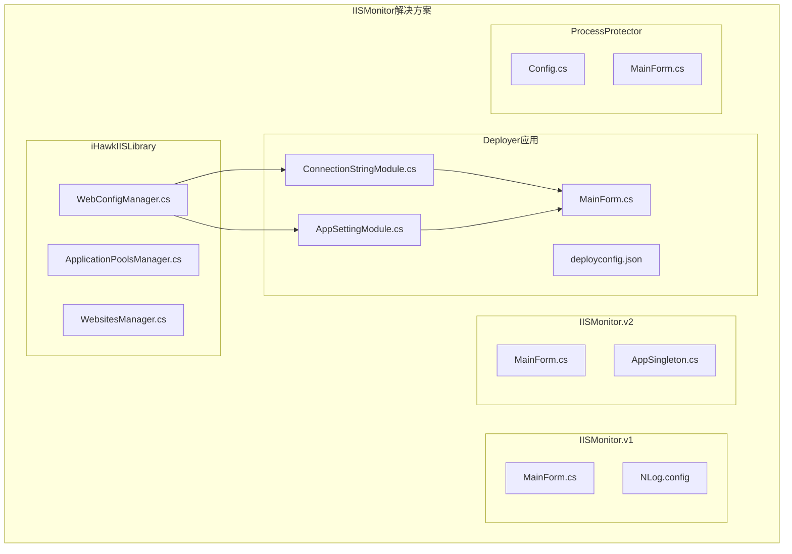
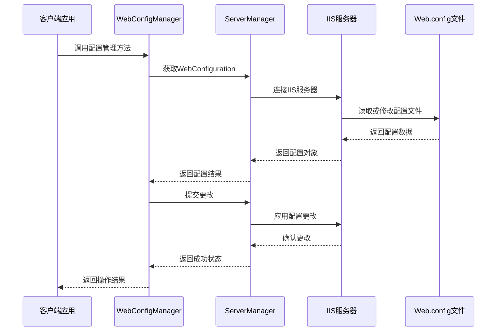
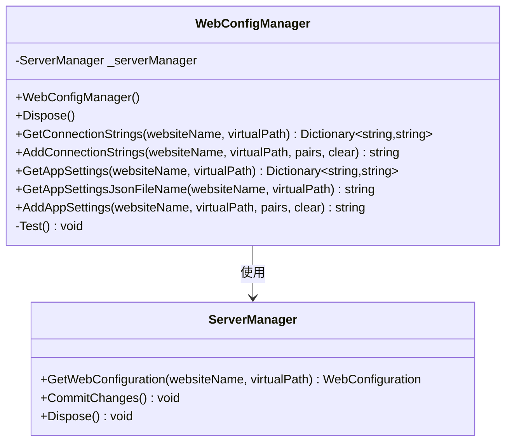
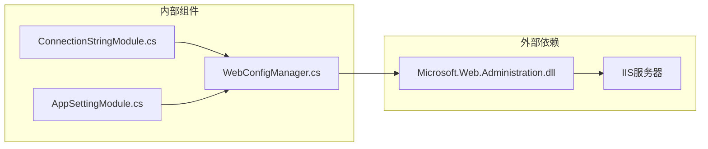

# 配置文件管理API

<cite>
**本文档引用的文件**
- [WebConfigManager.cs](file://iHawkIISLibrary/WebConfigManager.cs)
- [iHawkIISLibrary.csproj](file://iHawkIISLibrary/iHawkIISLibrary.csproj)
- [ConnectionStringModule.cs](file://Deployer/Modules/ConnectionStringModule.cs)
- [AppSettingModule.cs](file://Deployer/Modules/AppSettingModule.cs)
- [MainForm.cs](file://Deployer/MainForm.cs)
- [deployconfig.json](file://Deployer/deployconfig.json)
- [packages.config](file://iHawkIISLibrary/packages.config)
</cite>

## 目录
1. [简介](#简介)
2. [项目结构](#项目结构)
3. [核心组件](#核心组件)
4. [架构概览](#架构概览)
5. [详细组件分析](#详细组件分析)
6. [依赖关系分析](#依赖关系分析)
7. [性能考虑](#性能考虑)
8. [故障排除指南](#故障排除指南)
9. [结论](#结论)
10. [附录](#附录)

## 简介

WebConfigManager类是iHawkIISLibrary库中的核心组件，专门用于管理IIS Web.config文件的动态配置。该类提供了完整的Web.config文件读取、修改、验证和回滚功能，支持连接字符串和应用程序设置的管理。

本API基于Microsoft.Web.Administration命名空间，通过ServerManager对象与IIS服务器进行交互，实现了对Web.config文件的实时配置管理。该组件特别适用于需要动态调整IIS应用程序配置的场景，如批量部署、配置管理工具等。

## 项目结构

项目采用分层架构设计，主要包含以下关键组件：



**图表来源**
- [WebConfigManager.cs](file://iHawkIISLibrary/WebConfigManager.cs#L1-L157)
- [ConnectionStringModule.cs](file://Deployer/Modules/ConnectionStringModule.cs#L1-L182)
- [AppSettingModule.cs](file://Deployer/Modules/AppSettingModule.cs#L1-L200)

**章节来源**
- [WebConfigManager.cs](file://iHawkIISLibrary/WebConfigManager.cs#L1-L157)
- [iHawkIISLibrary.csproj](file://iHawkIISLibrary/iHawkIISLibrary.csproj#L1-L63)

## 核心组件

WebConfigManager类是整个配置管理系统的中心组件，提供了以下核心功能：

### 主要特性
- **动态配置读取**：支持从IIS网站读取当前配置状态
- **配置修改**：提供安全的配置更新机制
- **批量操作**：支持多个配置项的批量添加和更新
- **错误处理**：完善的异常处理和错误报告机制
- **资源管理**：实现IDisposable接口确保资源正确释放

### 关键属性
- `_serverManager`: Microsoft.Web.Administration.ServerManager实例，负责与IIS服务器通信

### 构造函数
- `WebConfigManager()`: 初始化ServerManager实例
- `Dispose()`: 清理ServerManager资源

**章节来源**
- [WebConfigManager.cs](file://iHawkIISLibrary/WebConfigManager.cs#L10-L30)

## 架构概览

WebConfigManager的架构基于Microsoft.Web.Administration API，通过ServerManager对象与IIS服务器进行交互：



**图表来源**
- [WebConfigManager.cs](file://iHawkIISLibrary/WebConfigManager.cs#L34-L45)
- [WebConfigManager.cs](file://iHawkIISLibrary/WebConfigManager.cs#L72-L84)

## 详细组件分析

### WebConfigManager类结构



**图表来源**
- [WebConfigManager.cs](file://iHawkIISLibrary/WebConfigManager.cs#L10-L30)

#### GetConnectionStrings方法

**方法签名**: `Dictionary<string, string> GetConnectionStrings(string websiteName, string virtualPath)`

**功能描述**: 从指定的IIS网站和虚拟路径读取所有连接字符串配置

**参数说明**:
- `websiteName`: IIS网站名称（如"Default Web Site"）
- `virtualPath`: 虚拟路径（如"/"或具体的应用路径）

**返回值**: 
- 成功时返回包含连接字符串名称和值的字典
- 失败时返回null

**异常处理**: 
- 捕获所有异常并记录调试信息
- 返回null表示操作失败

**使用示例路径**: 
- [ConnectionStringModule.cs](file://Deployer/Modules/ConnectionStringModule.cs#L78-L102)

**章节来源**
- [WebConfigManager.cs](file://iHawkIISLibrary/WebConfigManager.cs#L47-L66)

#### AddConnectionStrings方法

**方法签名**: `string AddConnectionStrings(string websiteName, string virtualPath, Dictionary<string, string> nameConnectionStringPair, bool clear)`

**功能描述**: 向指定的IIS网站添加连接字符串配置

**参数说明**:
- `websiteName`: IIS网站名称
- `virtualPath`: 虚拟路径
- `nameConnectionStringPair`: 连接字符串名称到值的映射字典
- `clear`: 是否先清除现有连接字符串

**返回值**:
- 成功时返回"success"
- 失败时返回异常消息字符串

**异常处理**:
- 捕获所有异常并返回异常消息
- 调用_commitChanges_确保更改持久化

**使用示例路径**:
- [ConnectionStringModule.cs](file://Deployer/Modules/ConnectionStringModule.cs#L118-L128)

**章节来源**
- [WebConfigManager.cs](file://iHawkIISLibrary/WebConfigManager.cs#L68-L92)

#### GetAppSettings方法

**方法签名**: `Dictionary<string, string> GetAppSettings(string websiteName, string virtualPath)`

**功能描述**: 从指定的IIS网站读取应用程序设置配置

**参数说明**:
- `websiteName`: IIS网站名称
- `virtualPath`: 虚拟路径

**返回值**:
- 成功时返回包含设置键和值的字典
- 失败时返回null

**异常处理**:
- 捕获所有异常并记录调试信息
- 返回null表示操作失败

**使用示例路径**:
- [AppSettingModule.cs](file://Deployer/Modules/AppSettingModule.cs#L116-L151)

**章节来源**
- [WebConfigManager.cs](file://iHawkIISLibrary/WebConfigManager.cs#L94-L113)

#### GetAppSettingsJsonFileName方法

**方法签名**: `string GetAppSettingsJsonFileName(string websiteName, string virtualPath)`

**功能描述**: 获取应用程序设置JSON文件的完整物理路径

**参数说明**:
- `websiteName`: IIS网站名称
- `virtualPath`: 虚拟路径

**返回值**:
- 成功时返回JSON文件的完整路径
- 失败时返回"fail: "前缀的错误消息

**异常处理**:
- 捕获所有异常并返回错误消息
- 自动处理路径分隔符

**使用示例路径**:
- [AppSettingModule.cs](file://Deployer/Modules/AppSettingModule.cs#L128-L140)

**章节来源**
- [WebConfigManager.cs](file://iHawkIISLibrary/WebConfigManager.cs#L115-L126)

#### AddAppSettings方法

**方法签名**: `string AddAppSettings(string websiteName, string virtualPath, Dictionary<string, string> keyValuePair, bool clear)`

**功能描述**: 向指定的IIS网站添加应用程序设置

**参数说明**:
- `websiteName`: IIS网站名称
- `virtualPath`: 虚拟路径
- `keyValuePair`: 设置键到值的映射字典
- `clear`: 是否先清除现有设置

**返回值**:
- 成功时返回"success"
- 失败时返回异常消息

**异常处理**:
- 捕获所有异常并返回异常消息
- 调用_commitChanges_确保更改持久化

**使用示例路径**:
- [AppSettingModule.cs](file://Deployer/Modules/AppSettingModule.cs#L78-L81)

**章节来源**
- [WebConfigManager.cs](file://iHawkIISLibrary/WebConfigManager.cs#L128-L152)

### 配置文件结构说明

Web.config文件支持以下主要配置节：

#### ConnectionStrings配置节
```xml
<connectionStrings>
  <add name="数据库连接名" connectionString="连接字符串" />
</connectionStrings>
```

#### AppSettings配置节
```xml
<appSettings>
  <add key="设置键" value="设置值" />
</appSettings>
```

#### JSON配置文件格式
对于.NET Core/.NET 5+应用程序，支持appsettings.json格式：
```json
{
  "ConnectionStrings": {
    "默认连接": "连接字符串"
  },
  "Logging": {
    "LogLevel": {
      "Default": "Information"
    }
  }
}
```

**章节来源**
- [WebConfigManager.cs](file://iHawkIISLibrary/WebConfigManager.cs#L47-L152)

## 依赖关系分析

WebConfigManager类依赖于Microsoft.Web.Administration命名空间，这是IIS管理的核心组件：



**图表来源**
- [iHawkIISLibrary.csproj](file://iHawkIISLibrary/iHawkIISLibrary.csproj#L34-L36)
- [WebConfigManager.cs](file://iHawkIISLibrary/WebConfigManager.cs#L1-L3)

### 外部依赖详情

**Microsoft.Web.Administration**
- 版本: 8.5.9600.17042
- 作用: 提供IIS服务器管理功能
- 包含: ServerManager、WebConfiguration、Application等核心类

**系统依赖**
- .NET Framework 4.7.2
- IIS 7.0及以上版本

**章节来源**
- [iHawkIISLibrary.csproj](file://iHawkIISLibrary/iHawkIISLibrary.csproj#L34-L44)
- [packages.config](file://iHawkIISLibrary/packages.config#L1-L4)

## 性能考虑

### 内存管理
- ServerManager实例在构造函数中创建，在Dispose方法中释放
- 建议使用using语句确保资源正确释放

### 批量操作优化
- 对于大量配置项，建议使用clear参数控制是否先清空现有配置
- 批量添加时，单次调用_commitChanges_比多次调用更高效

### 错误处理策略
- 所有方法都包含try-catch块，避免应用程序崩溃
- 异常信息通过Debug.WriteLine输出，便于调试

## 故障排除指南

### 常见问题及解决方案

#### 权限问题
**症状**: 访问IIS服务器被拒绝
**解决方案**: 
- 以管理员身份运行应用程序
- 确保IIS Management Service正在运行

#### 网站不存在
**症状**: GetConnectionStrings返回null
**解决方案**:
- 验证websiteName参数是否正确
- 使用WebsitesManager获取有效的网站列表

#### 虚拟路径无效
**症状**: 配置操作失败
**解决方案**:
- 确保virtualPath参数格式正确（如"/"或具体应用路径）
- 使用WebsitesManager.getWebsiteApplicationList获取有效路径

#### 配置提交失败
**症状**: CommitChanges抛出异常
**解决方案**:
- 检查IIS权限设置
- 确保Web.config文件未被其他进程锁定

**章节来源**
- [WebConfigManager.cs](file://iHawkIISLibrary/WebConfigManager.cs#L49-L65)
- [WebConfigManager.cs](file://iHawkIISLibrary/WebConfigManager.cs#L108-L112)

## 结论

WebConfigManager类提供了完整的IIS Web.config文件管理解决方案，具有以下优势：

1. **功能完整性**: 支持连接字符串和应用程序设置的读取、添加、清空等操作
2. **错误处理**: 完善的异常捕获和错误报告机制
3. **易于使用**: 简洁的API设计，便于集成到各种应用场景
4. **性能优化**: 基于Microsoft.Web.Administration的高效实现

该组件特别适用于需要动态管理IIS配置的场景，如批量部署工具、配置管理界面等。通过合理的错误处理和资源管理，确保了应用程序的稳定性和可靠性。

## 附录

### 实际使用示例

#### 连接字符串管理示例
```csharp
// 读取连接字符串
using (var manager = new WebConfigManager())
{
    var connections = manager.GetConnectionStrings("Default Web Site", "/");
    foreach (var kvp in connections)
    {
        Console.WriteLine($"{kvp.Key}: {kvp.Value}");
    }
}

// 添加连接字符串
var newConnections = new Dictionary<string, string>
{
    {"NewConnection", "Server=localhost;Database=Test;Trusted_Connection=yes;"}
};
using (var manager = new WebConfigManager())
{
    var result = manager.AddConnectionStrings("Default Web Site", "/", newConnections, true);
    Console.WriteLine(result); // 输出"success"或错误消息
}
```

#### 应用程序设置管理示例
```csharp
// 读取应用程序设置
using (var manager = new WebConfigManager())
{
    var settings = manager.GetAppSettings("Default Web Site", "/");
    foreach (var kvp in settings)
    {
        Console.WriteLine($"{kvp.Key}: {kvp.Value}");
    }
}

// 添加应用程序设置
var newSettings = new Dictionary<string, string>
{
    {"Environment", "Production"},
    {"LogLevel", "Information"}
};
using (var manager = new WebConfigManager())
{
    var result = manager.AddAppSettings("Default Web Site", "/", newSettings, true);
    Console.WriteLine(result); // 输出"success"或错误消息
}
```

### 配置备份和恢复最佳实践

#### 备份策略
1. **定期备份**: 在重要配置变更前自动备份原始配置
2. **版本控制**: 将备份文件纳入版本控制系统
3. **增量备份**: 只备份变更的部分，减少存储空间

#### 恢复策略
1. **快速回滚**: 提供一键恢复到上一个已知良好状态的功能
2. **部分恢复**: 支持只恢复特定配置节
3. **验证机制**: 恢复后自动验证配置的有效性

#### 配置变更影响说明
- **立即生效**: 大多数配置变更会立即生效
- **应用池回收**: 某些配置可能需要触发应用池回收
- **服务重启**: 部分配置变更可能需要重启IIS服务

**章节来源**
- [ConnectionStringModule.cs](file://Deployer/Modules/ConnectionStringModule.cs#L104-L128)
- [AppSettingModule.cs](file://Deployer/Modules/AppSettingModule.cs#L39-L82)