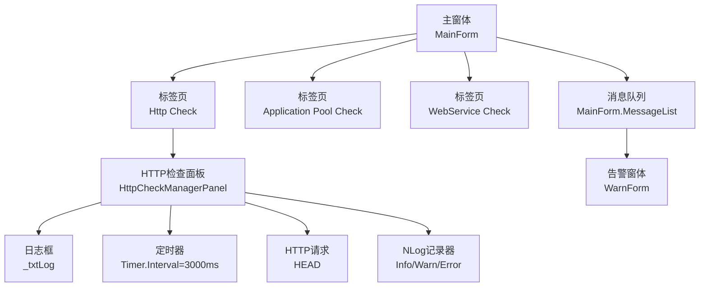
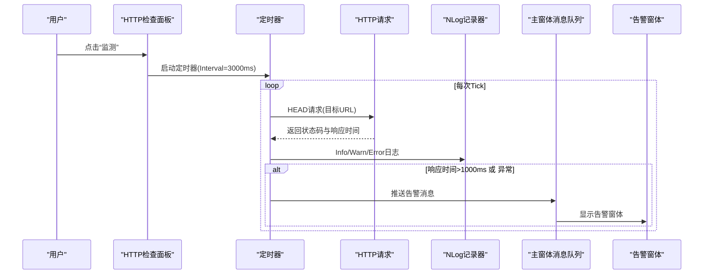
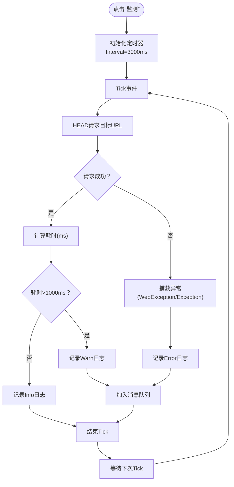
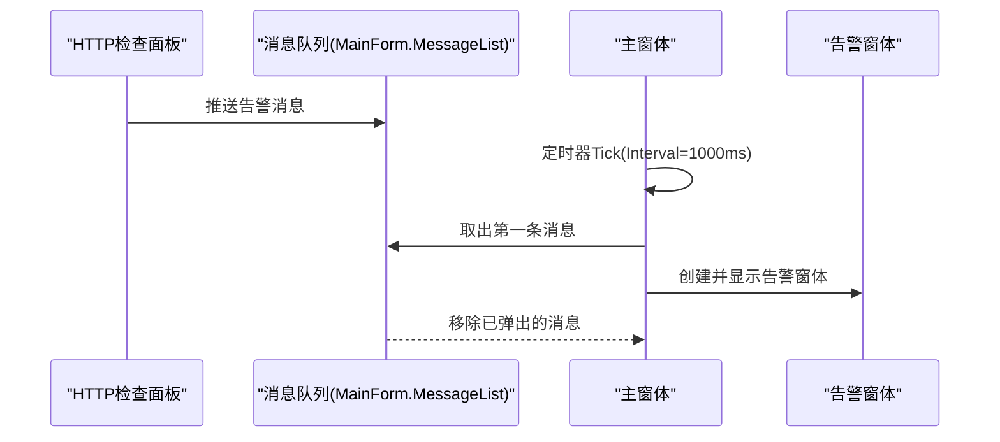
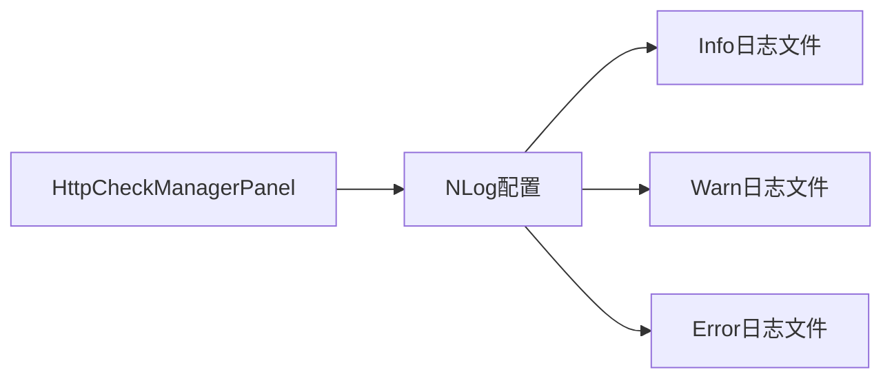
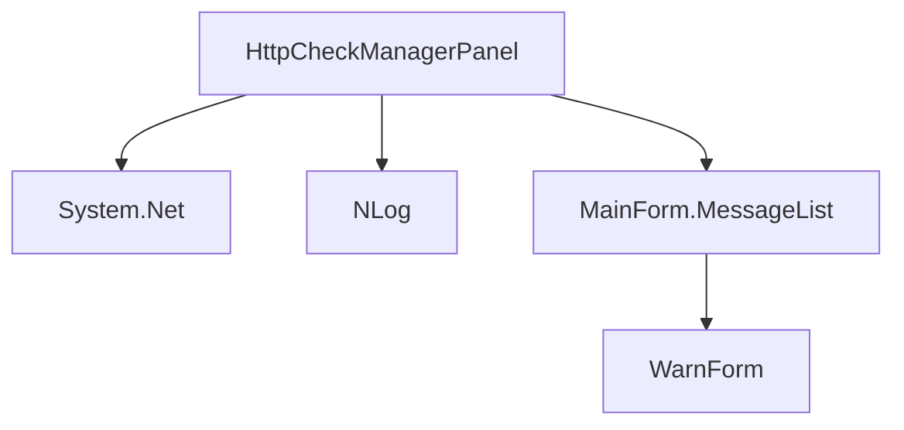

# HTTP检查面板

<cite>
**本文引用的文件列表**
- [HttpCheckManagerPanel.cs](file://IISMonitor.v1/HttpCheckManagement/HttpCheckManagerPanel.cs)
- [HttpCheckManagerPanel.Designer.cs](file://IISMonitor.v1/HttpCheckManagement/HttpCheckManagerPanel.Designer.cs)
- [MainForm.cs](file://IISMonitor.v1/MainForm.cs)
- [WarnForm.cs](file://IISMonitor.v1/WarnForm.cs)
- [WarnForm.Designer.cs](file://IISMonitor.v1/WarnForm.Designer.cs)
- [NLog.config](file://IISMonitor.v1/NLog.config)
- [AppPoolCheckManagerPanel.cs](file://IISMonitor.v1/AppPoolCheckManagement/AppPoolCheckManagerPanel.cs)
- [WebServiceCheckManagerPanel.cs](file://IISMonitor.v1/WebServiceCheckManagement/WebServiceCheckManagerPanel.cs)
- [README.md](file://README.md)
</cite>

## 目录
1. [简介](#简介)
2. [项目结构](#项目结构)
3. [核心组件](#核心组件)
4. [架构总览](#架构总览)
5. [详细组件分析](#详细组件分析)
6. [依赖关系分析](#依赖关系分析)
7. [性能考量](#性能考量)
8. [故障排查指南](#故障排查指南)
9. [结论](#结论)
10. [附录](#附录)

## 简介
本文件面向“HTTP检查面板”的功能与使用，围绕以下目标展开：
- 深入介绍HTTP站点可用性检查机制（URL可达性测试、响应时间监控、状态码验证）
- 说明HTTP检查配置选项（检查间隔、超时参数、重试策略）
- 解释检查结果的展示方式（成功/失败状态指示、详细日志记录、历史趋势分析）
- 提供HTTP站点故障排查指南与性能优化建议
- 包含批量HTTP检查能力、自定义检查规则与告警配置方法

该面板位于IISMonitor v1版本中，作为主界面的一个标签页，负责对指定URL进行周期性HEAD请求检查，并通过日志、文件日志与弹窗告警的方式呈现结果。

**章节来源**
- [README.md](file://README.md#L1-L10)

## 项目结构
IISMonitor v1采用WinForms桌面应用结构，主要由以下模块构成：
- 主窗体：承载多个标签页，其中“Http Check”即为HTTP检查面板所在
- HTTP检查面板：实现URL输入、定时检查、日志输出与告警集成
- 应用池检查面板：提供IIS应用池状态监控与自动恢复示例
- Web服务检查面板：基于性能计数器的监控示例
- 日志系统：基于NLog的文件日志与内部日志记录

**图表来源**
- [MainForm.cs](file://IISMonitor.v1/MainForm.cs#L48-L77)
- [HttpCheckManagerPanel.cs](file://IISMonitor.v1/HttpCheckManagement/HttpCheckManagerPanel.cs#L57-L127)
- [NLog.config](file://IISMonitor.v1/NLog.config#L47-L49)

**章节来源**
- [MainForm.cs](file://IISMonitor.v1/MainForm.cs#L48-L77)
- [HttpCheckManagerPanel.cs](file://IISMonitor.v1/HttpCheckManagement/HttpCheckManagerPanel.cs#L57-L127)

## 核心组件
- HTTP检查面板（HttpCheckManagerPanel）：负责UI初始化、URL输入、定时检查、日志输出与告警触发
- 主窗体（MainForm）：承载标签页、维护全局消息队列、驱动告警弹窗
- 告警窗体（WarnForm）：接收消息并以弹窗形式提示
- 日志系统（NLog）：按Info/Warn/Error级别写入独立日志文件

关键职责与行为：
- URL可达性测试：使用HEAD请求探测目标URL是否可访问
- 响应时间监控：计算请求耗时并以毫秒显示
- 状态码验证：记录HTTP状态码，便于后续分析
- 超时与异常处理：捕获WebException与通用异常，统一记录错误
- 告警触发：当响应时间超过阈值或发生异常时，将消息加入全局队列并弹出告警窗体

**章节来源**
- [HttpCheckManagerPanel.cs](file://IISMonitor.v1/HttpCheckManagement/HttpCheckManagerPanel.cs#L85-L127)
- [MainForm.cs](file://IISMonitor.v1/MainForm.cs#L67-L77)
- [WarnForm.cs](file://IISMonitor.v1/WarnForm.cs#L13-L61)
- [NLog.config](file://IISMonitor.v1/NLog.config#L47-L49)

## 架构总览
HTTP检查流程从用户点击“监测”按钮开始，进入定时检查循环。每次Tick执行一次HEAD请求，计算耗时并记录状态码；根据耗时阈值决定Info/Warn日志与消息队列推送；主窗体定时轮询消息队列并弹出告警窗体。

**图表来源**
- [HttpCheckManagerPanel.cs](file://IISMonitor.v1/HttpCheckManagement/HttpCheckManagerPanel.cs#L85-L127)
- [MainForm.cs](file://IISMonitor.v1/MainForm.cs#L67-L77)
- [WarnForm.cs](file://IISMonitor.v1/WarnForm.cs#L13-L61)
- [NLog.config](file://IISMonitor.v1/NLog.config#L47-L49)

## 详细组件分析

### HTTP检查面板（HttpCheckManagerPanel）
- 初始化：双缓冲渲染、控件布局（按钮、文本框、日志框）
- 检查逻辑：
  - 定时器默认间隔3000ms
  - 每次Tick发起HEAD请求，计算耗时
  - 记录状态码与耗时到日志框
  - 超过1000ms记为Warn并加入消息队列，否则记为Info
  - 捕获WebException与通用异常，记录Error并加入消息队列
- 日志管理：日志框最多保留50行，超出则清空
- UI交互：启动后禁用“监测”按钮与URL输入框

**图表来源**
- [HttpCheckManagerPanel.cs](file://IISMonitor.v1/HttpCheckManagement/HttpCheckManagerPanel.cs#L85-L127)

**章节来源**
- [HttpCheckManagerPanel.cs](file://IISMonitor.v1/HttpCheckManagement/HttpCheckManagerPanel.cs#L57-L127)
- [HttpCheckManagerPanel.Designer.cs](file://IISMonitor.v1/HttpCheckManagement/HttpCheckManagerPanel.Designer.cs#L23-L33)

### 主窗体与告警集成
- 主窗体持有全局消息队列，定时轮询并弹出告警窗体
- 告警窗体显示来自消息队列的信息，位置固定在屏幕右下角

**图表来源**
- [MainForm.cs](file://IISMonitor.v1/MainForm.cs#L67-L77)
- [WarnForm.cs](file://IISMonitor.v1/WarnForm.cs#L13-L61)

**章节来源**
- [MainForm.cs](file://IISMonitor.v1/MainForm.cs#L33-L77)
- [WarnForm.cs](file://IISMonitor.v1/WarnForm.cs#L13-L61)
- [WarnForm.Designer.cs](file://IISMonitor.v1/WarnForm.Designer.cs#L23-L33)

### 日志系统（NLog）
- 针对HTTP检查的Info/Warn/Error分别写入独立日志文件
- 支持按日期分文件，便于历史趋势分析
- 可扩展：可在配置中增加更多目标与规则

**图表来源**
- [NLog.config](file://IISMonitor.v1/NLog.config#L31-L33)
- [NLog.config](file://IISMonitor.v1/NLog.config#L47-L49)

**章节来源**
- [NLog.config](file://IISMonitor.v1/NLog.config#L1-L56)

### 其他相关组件（对比参考）
- 应用池检查面板：演示了定时器与日志记录的另一种模式，可作为扩展HTTP检查的参考
- Web服务检查面板：基于性能计数器的监控示例，体现定时采集与阈值告警的通用思路

**章节来源**
- [AppPoolCheckManagerPanel.cs](file://IISMonitor.v1/AppPoolCheckManagement/AppPoolCheckManagerPanel.cs#L87-L104)
- [WebServiceCheckManagerPanel.cs](file://IISMonitor.v1/WebServiceCheckManagement/WebServiceCheckManagerPanel.cs#L110-L134)

## 依赖关系分析
- 组件耦合：
  - HttpCheckManagerPanel依赖System.Net进行HTTP请求，依赖NLog进行日志记录
  - MainForm通过静态消息队列与告警窗体解耦，降低面板与UI层耦合
- 外部依赖：
  - NLog：日志记录与文件输出
  - WinForms：UI与定时器
- 潜在问题：
  - 当前未见显式超时参数配置，可能需要在请求对象上设置超时
  - 未见重试策略配置，异常时直接记录并告警

**图表来源**
- [HttpCheckManagerPanel.cs](file://IISMonitor.v1/HttpCheckManagement/HttpCheckManagerPanel.cs#L7-L10)
- [MainForm.cs](file://IISMonitor.v1/MainForm.cs#L33-L77)
- [WarnForm.cs](file://IISMonitor.v1/WarnForm.cs#L13-L61)

**章节来源**
- [HttpCheckManagerPanel.cs](file://IISMonitor.v1/HttpCheckManagement/HttpCheckManagerPanel.cs#L7-L10)
- [MainForm.cs](file://IISMonitor.v1/MainForm.cs#L33-L77)

## 性能考量
- 检查频率：当前默认3000ms一次，可根据网络状况与目标服务器压力调优
- 资源占用：HEAD请求轻量，但频繁请求仍会带来网络与CPU开销
- 日志清理：日志框最多保留50行，避免内存膨胀
- 文件IO：NLog按日期分文件，建议定期归档旧日志
- 并发与线程：当前实现为单线程定时器回调，若扩展为多URL或多规则，需考虑线程安全与并发控制

[本节为通用性能建议，不直接分析具体文件]

## 故障排查指南
- 无法连接目标URL
  - 检查URL格式与网络连通性
  - 查看日志文件中的Error记录，定位异常类型
  - 若为超时，考虑在网络层或代理层排查
- 响应时间偏高
  - 观察日志中耗时是否超过1000ms，属于Warn级别
  - 结合服务器负载与带宽情况评估
- 告警未弹出
  - 确认主窗体定时器是否启用（Interval=1000ms）
  - 检查消息队列是否被及时消费
- 日志缺失
  - 检查NLog配置的目标路径与权限
  - 确认日志级别规则是否匹配当前记录级别

**章节来源**
- [HttpCheckManagerPanel.cs](file://IISMonitor.v1/HttpCheckManagement/HttpCheckManagerPanel.cs#L110-L121)
- [MainForm.cs](file://IISMonitor.v1/MainForm.cs#L67-L77)
- [NLog.config](file://IISMonitor.v1/NLog.config#L47-L49)

## 结论
HTTP检查面板提供了简单而有效的URL可达性与响应时间监控能力，结合NLog文件日志与弹窗告警，能够满足基础的HTTP站点可用性观测需求。当前实现具备如下特点：
- 周期性HEAD请求，快速反馈URL可达性
- 响应时间阈值化告警，便于识别性能退化
- 分级日志与消息队列，支持历史记录与实时告警
- UI简洁直观，易于部署与使用

建议后续增强方向：
- 增加超时参数配置与重试策略
- 扩展为批量检查与自定义规则
- 增强历史趋势可视化与报表导出
- 支持更多HTTP方法与认证方式

[本节为总结性内容，不直接分析具体文件]

## 附录

### HTTP检查配置选项说明
- 检查间隔：面板默认3000ms，可通过修改定时器Interval进行调整
- 超时参数：当前未见显式超时设置，建议在请求对象上增加超时配置
- 重试策略：当前未见重试逻辑，异常时直接记录并告警
- 自定义检查规则：可扩展为支持GET/POST、Header注入、Body校验等
- 告警配置：通过消息队列与弹窗窗体实现，可扩展为邮件/短信通知

**章节来源**
- [HttpCheckManagerPanel.cs](file://IISMonitor.v1/HttpCheckManagement/HttpCheckManagerPanel.cs#L87-L88)
- [MainForm.cs](file://IISMonitor.v1/MainForm.cs#L67-L77)

### 批量HTTP检查与历史趋势分析
- 批量检查：可在面板中增加多URL输入与并行检查逻辑
- 历史趋势：利用NLog按日期分文件的日志，结合外部工具进行趋势分析与报表生成

**章节来源**
- [NLog.config](file://IISMonitor.v1/NLog.config#L31-L33)
- [NLog.config](file://IISMonitor.v1/NLog.config#L47-L49)