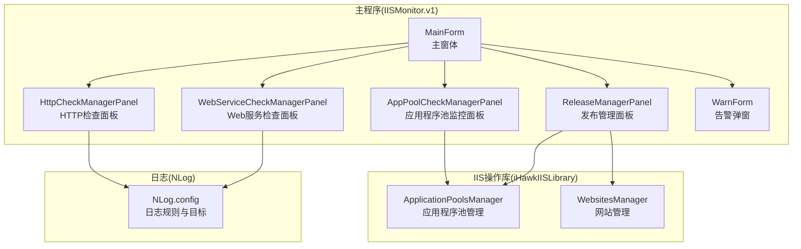
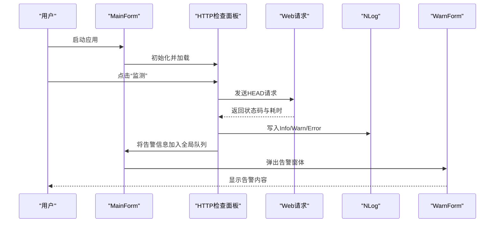
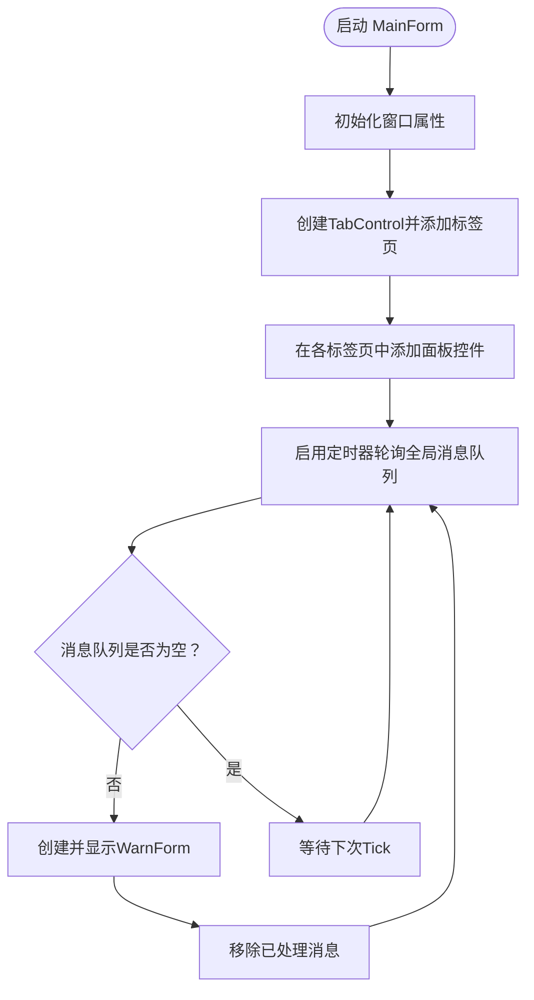
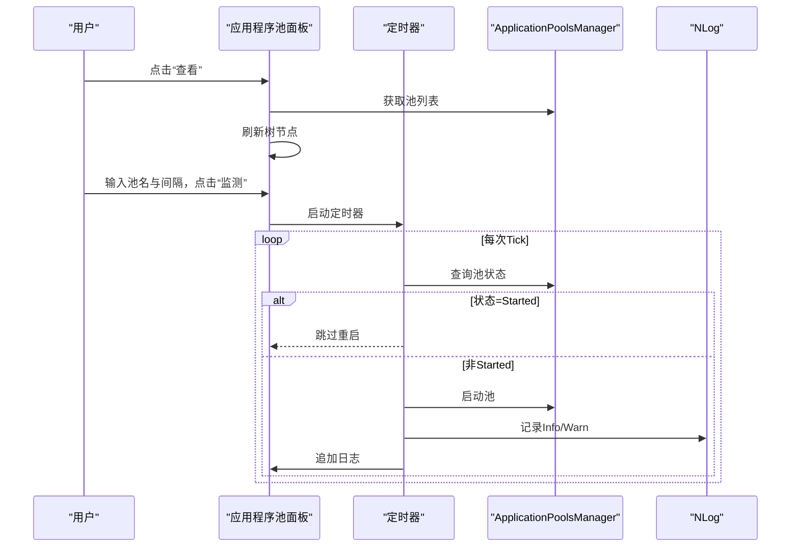
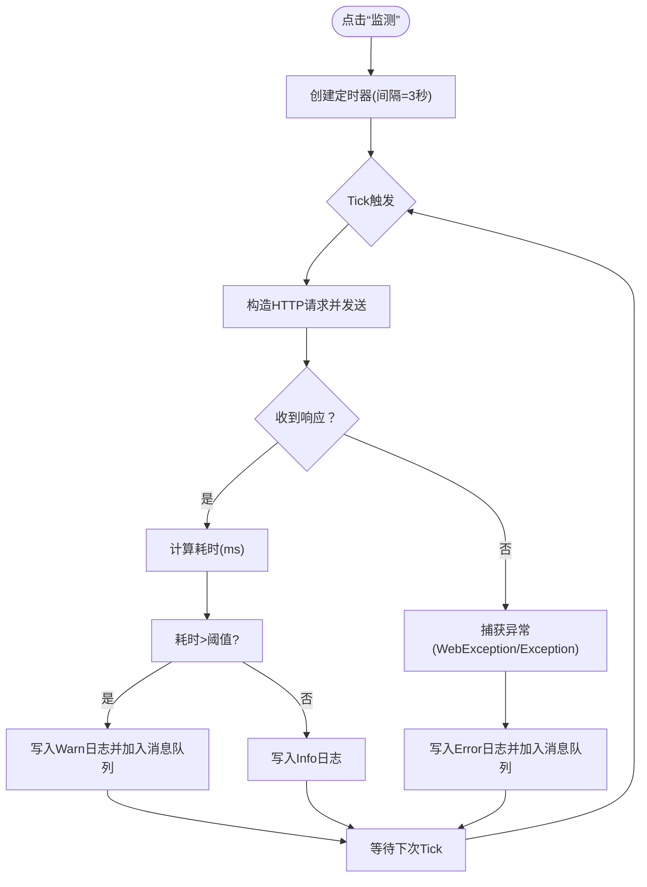
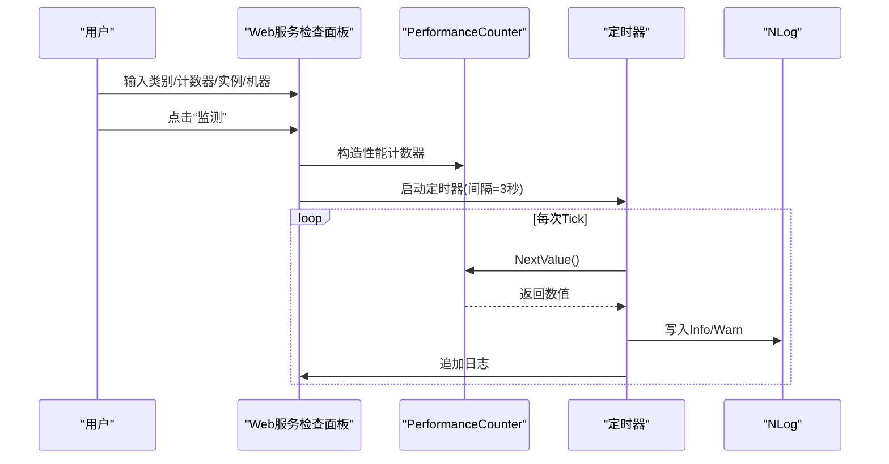
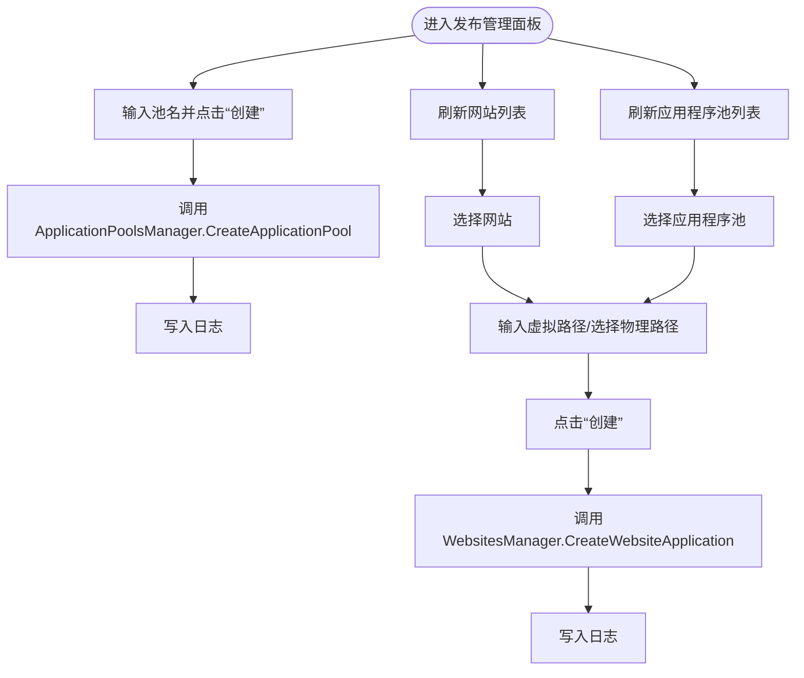
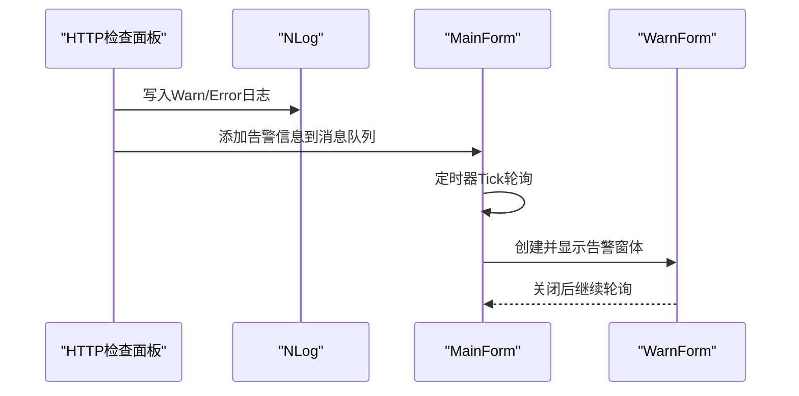
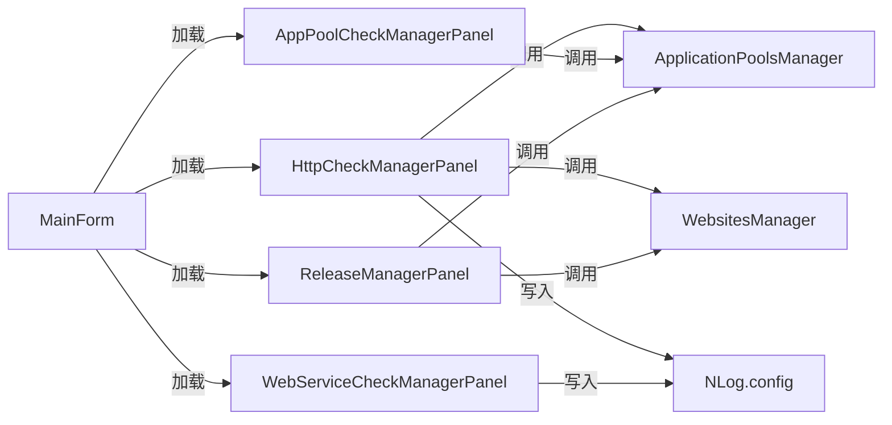

# IISMonitor.v1 功能详解

<cite>
**本文引用的文件**
- [MainForm.cs](file://IISMonitor.v1/MainForm.cs)
- [MainForm.Designer.cs](file://IISMonitor.v1/MainForm.Designer.cs)
- [AppPoolCheckManagerPanel.cs](file://IISMonitor.v1/AppPoolCheckManagement/AppPoolCheckManagerPanel.cs)
- [AppPoolCheckManagerPanel.Designer.cs](file://IISMonitor.v1/AppPoolCheckManagement/AppPoolCheckManagerPanel.Designer.cs)
- [HttpCheckManagerPanel.cs](file://IISMonitor.v1/HttpCheckManagement/HttpCheckManagerPanel.cs)
- [HttpCheckManagerPanel.Designer.cs](file://IISMonitor.v1/HttpCheckManagement/HttpCheckManagerPanel.Designer.cs)
- [WebServiceCheckManagerPanel.cs](file://IISMonitor.v1/WebServiceCheckManagement/WebServiceCheckManagerPanel.cs)
- [WebServiceCheckManagerPanel.Designer.cs](file://IISMonitor.v1/WebServiceCheckManagement/WebServiceCheckManagerPanel.Designer.cs)
- [ReleaseManagerPanel.cs](file://IISMonitor.v1/ReleaseManagement/ReleaseManagerPanel.cs)
- [ReleaseManagerPanel.Designer.cs](file://IISMonitor.v1/ReleaseManagement/ReleaseManagerPanel.Designer.cs)
- [WarnForm.cs](file://IISMonitor.v1/WarnForm.cs)
- [WarnForm.Designer.cs](file://IISMonitor.v1/WarnForm.Designer.cs)
- [NLog.config](file://IISMonitor.v1/NLog.config)
- [ApplicationPoolsManager.cs](file://iHawkIISLibrary/ApplicationPoolsManager.cs)
- [WebsitesManager.cs](file://iHawkIISLibrary/WebsitesManager.cs)
- [README.md](file://README.md)
</cite>

## 目录
1. [简介](#简介)
2. [项目结构](#项目结构)
3. [核心组件](#核心组件)
4. [架构总览](#架构总览)
5. [详细组件分析](#详细组件分析)
6. [依赖关系分析](#依赖关系分析)
7. [性能与稳定性考量](#性能与稳定性考量)
8. [故障排查指南](#故障排查指南)
9. [结论](#结论)
10. [附录](#附录)

## 简介
IISMonitor.v1 是一款基于 Windows Forms 的 IIS 监控与管理桌面工具，提供多标签页的统一界面，涵盖以下能力：
- 应用程序池监控与自动重启
- HTTP 可达性与响应时延监控
- Web 服务性能计数器监控
- 发布管理（创建应用程序池、网站与网站应用程序）

系统通过定时器周期性执行检查任务，并以日志与弹窗形式输出结果与告警。日志由 NLog 配置按模块分类写入独立文件，便于问题定位与审计。

## 项目结构
- 主程序入口位于 IISMonitor.v1，包含主窗体与各功能面板。
- 功能面板均继承自 UserControl，分别实现不同监控与管理逻辑。
- iHawkIISLibrary 提供 IIS 操作封装（应用程序池、网站、Web 配置等）。
- 日志系统通过 NLog.config 进行规则配置，按模块输出到不同日志文件。

图表来源
- [MainForm.cs](file://IISMonitor.v1/MainForm.cs#L48-L77)
- [AppPoolCheckManagerPanel.cs](file://IISMonitor.v1/AppPoolCheckManagement/AppPoolCheckManagerPanel.cs#L38-L105)
- [HttpCheckManagerPanel.cs](file://IISMonitor.v1/HttpCheckManagement/HttpCheckManagerPanel.cs#L57-L127)
- [WebServiceCheckManagerPanel.cs](file://IISMonitor.v1/WebServiceCheckManagement/WebServiceCheckManagerPanel.cs#L58-L135)
- [ReleaseManagerPanel.Designer.cs](file://IISMonitor.v1/ReleaseManagement/ReleaseManagerPanel.Designer.cs#L29-L262)
- [NLog.config](file://IISMonitor.v1/NLog.config#L18-L54)

章节来源
- [MainForm.cs](file://IISMonitor.v1/MainForm.cs#L17-L81)
- [README.md](file://README.md#L1-L10)

## 核心组件
- 主窗体 MainForm：负责初始化窗口尺寸与标题，构建 TabControl 并加载四个功能面板；内置定时器轮询全局消息队列，触发告警弹窗。
- 应用程序池监控面板 AppPoolCheckManagerPanel：展示 IIS 应用程序池树形列表，支持“监测”按钮对指定池进行周期性状态检查与自动启动。
- HTTP 检查面板 HttpCheckManagerPanel：对指定 URL 执行 HEAD 请求，记录状态码与耗时，超过阈值时产生告警日志与弹窗。
- Web 服务检查面板 WebServiceCheckManagerPanel：读取指定性能计数器（类别/计数器/实例/机器），周期性采样并告警。
- 发布管理面板 ReleaseManagerPanel：提供创建应用程序池、刷新网站列表、选择物理路径、刷新应用程序池列表、创建网站应用程序等功能。
- 告警弹窗 WarnForm：右下角吸附显示告警信息，TopMost 置顶。
- 日志系统 NLog.config：按模块输出 Info/Warn/Error 到独立日志文件。

章节来源
- [MainForm.cs](file://IISMonitor.v1/MainForm.cs#L39-L77)
- [AppPoolCheckManagerPanel.cs](file://IISMonitor.v1/AppPoolCheckManagement/AppPoolCheckManagerPanel.cs#L38-L105)
- [HttpCheckManagerPanel.cs](file://IISMonitor.v1/HttpCheckManagement/HttpCheckManagerPanel.cs#L57-L127)
- [WebServiceCheckManagerPanel.cs](file://IISMonitor.v1/WebServiceCheckManagement/WebServiceCheckManagerPanel.cs#L58-L135)
- [ReleaseManagerPanel.Designer.cs](file://IISMonitor.v1/ReleaseManagement/ReleaseManagerPanel.Designer.cs#L29-L262)
- [WarnForm.cs](file://IISMonitor.v1/WarnForm.cs#L49-L72)
- [NLog.config](file://IISMonitor.v1/NLog.config#L40-L54)

## 架构总览
系统采用“主窗体 + 多面板”的分层设计，面板内部通过定时器驱动检查逻辑，IIS 操作通过 iHawkIISLibrary 封装调用，日志通过 NLog 分模块落盘。

图表来源
- [MainForm.cs](file://IISMonitor.v1/MainForm.cs#L67-L77)
- [HttpCheckManagerPanel.cs](file://IISMonitor.v1/HttpCheckManagement/HttpCheckManagerPanel.cs#L85-L126)
- [NLog.config](file://IISMonitor.v1/NLog.config#L47-L53)
- [WarnForm.cs](file://IISMonitor.v1/WarnForm.cs#L24-L72)

## 详细组件分析

### 主窗体与导航结构
- 窗口属性：双缓冲、固定尺寸与标题。
- 导航结构：TabControl 包含四个标签页，分别加载对应面板控件。
- 告警机制：全局静态消息列表与定时器轮询，逐条弹出 WarnForm。

图表来源
- [MainForm.cs](file://IISMonitor.v1/MainForm.cs#L39-L77)
- [WarnForm.cs](file://IISMonitor.v1/WarnForm.cs#L24-L72)

章节来源
- [MainForm.cs](file://IISMonitor.v1/MainForm.cs#L39-L77)
- [MainForm.Designer.cs](file://IISMonitor.v1/MainForm.Designer.cs#L29-L34)

### 应用程序池监控面板
- 功能要点
  - 查看：点击“查看”刷新树形节点，显示池名与当前状态。
  - 监测：输入池名与轮询间隔，点击“监测”后启动定时器，若状态非 Started 则尝试启动，并将结果写入右侧只读日志。
- 关键交互
  - 使用 iHawkIISLibrary.ApplicationPoolsManager 获取池列表、状态与启动操作。
  - 定时器 Tick 中判断状态并执行启动，异常捕获后记录日志与日志队列。
- 状态显示
  - 树节点文本包含“池名: 状态”，日志文本包含时间戳与结果。

图表来源
- [AppPoolCheckManagerPanel.cs](file://IISMonitor.v1/AppPoolCheckManagement/AppPoolCheckManagerPanel.cs#L58-L104)
- [ApplicationPoolsManager.cs](file://iHawkIISLibrary/ApplicationPoolsManager.cs#L47-L88)

章节来源
- [AppPoolCheckManagerPanel.cs](file://IISMonitor.v1/AppPoolCheckManagement/AppPoolCheckManagerPanel.cs#L38-L105)
- [AppPoolCheckManagerPanel.Designer.cs](file://IISMonitor.v1/AppPoolCheckManagement/AppPoolCheckManagerPanel.Designer.cs#L29-L33)
- [ApplicationPoolsManager.cs](file://iHawkIISLibrary/ApplicationPoolsManager.cs#L47-L138)

### HTTP 检查面板
- 功能要点
  - 监测：输入 URL，点击“监测”后每 3 秒发起一次 HEAD 请求，记录状态码与耗时。
  - 告警：当耗时超过阈值时，写入 Warn 日志并加入全局消息队列，触发 WarnForm 弹窗。
  - 错误处理：捕获 WebException 与其他异常，记录 Error 日志并弹窗。
- 状态显示
  - 日志区域滚动显示最新记录，自动清理超限行数。

图表来源
- [HttpCheckManagerPanel.cs](file://IISMonitor.v1/HttpCheckManagement/HttpCheckManagerPanel.cs#L85-L126)
- [NLog.config](file://IISMonitor.v1/NLog.config#L47-L49)

章节来源
- [HttpCheckManagerPanel.cs](file://IISMonitor.v1/HttpCheckManagement/HttpCheckManagerPanel.cs#L57-L127)
- [HttpCheckManagerPanel.Designer.cs](file://IISMonitor.v1/HttpCheckManagement/HttpCheckManagerPanel.Designer.cs#L29-L33)
- [NLog.config](file://IISMonitor.v1/NLog.config#L47-L49)

### Web 服务检查面板
- 功能要点
  - 监测：输入性能计数器的类别、计数器、实例、机器，点击“监测”后每 3 秒读取一次数值。
  - 告警：当数值超过阈值时，写入 Warn 日志并加入全局消息队列，触发 WarnForm 弹窗。
  - 错误处理：异常记录 Error 日志并弹窗。
- 状态显示
  - 日志区域滚动显示最新记录，自动清理超限行数。

图表来源
- [WebServiceCheckManagerPanel.cs](file://IISMonitor.v1/WebServiceCheckManagement/WebServiceCheckManagerPanel.cs#L110-L134)
- [NLog.config](file://IISMonitor.v1/NLog.config#L51-L53)

章节来源
- [WebServiceCheckManagerPanel.cs](file://IISMonitor.v1/WebServiceCheckManagement/WebServiceCheckManagerPanel.cs#L58-L135)
- [WebServiceCheckManagerPanel.Designer.cs](file://IISMonitor.v1/WebServiceCheckManagement/WebServiceCheckManagerPanel.Designer.cs#L29-L33)
- [NLog.config](file://IISMonitor.v1/NLog.config#L51-L53)

### 发布管理面板
- 功能要点
  - 创建应用程序池：输入池名，点击“创建”，调用 ApplicationPoolsManager.CreateApplicationPool 并输出结果日志。
  - 创建网站应用程序：
    - 刷新网站列表与应用程序池列表；
    - 选择网站与应用程序池；
    - 输入虚拟路径与物理路径（支持浏览选择）；
    - 点击“创建”，调用 WebsitesManager.CreateWebsiteApplication 并输出结果日志。
- 界面布局
  - 上半区：应用程序池相关控件（名称输入、创建按钮、刷新按钮、日志区）。
  - 下半区：网站与应用程序相关控件（网站列表、应用程序池列表、虚拟路径、物理路径、浏览按钮、创建按钮、日志区）。
- 数据流
  - 用户输入校验后，调用 iHawkIISLibrary 对应管理器完成创建，错误与成功信息写入日志。

图表来源
- [ReleaseManagerPanel.cs](file://IISMonitor.v1/ReleaseManagement/ReleaseManagerPanel.cs#L39-L110)
- [ReleaseManagerPanel.Designer.cs](file://IISMonitor.v1/ReleaseManagement/ReleaseManagerPanel.Designer.cs#L53-L232)
- [ApplicationPoolsManager.cs](file://iHawkIISLibrary/ApplicationPoolsManager.cs#L105-L121)
- [WebsitesManager.cs](file://iHawkIISLibrary/WebsitesManager.cs#L74-L90)

章节来源
- [ReleaseManagerPanel.cs](file://IISMonitor.v1/ReleaseManagement/ReleaseManagerPanel.cs#L28-L114)
- [ReleaseManagerPanel.Designer.cs](file://IISMonitor.v1/ReleaseManagement/ReleaseManagerPanel.Designer.cs#L29-L262)

### 告警系统与通知机制
- 触发条件
  - HTTP 面板：请求耗时超过阈值。
  - Web 服务面板：计数器数值超过阈值。
- 传播链路
  - 面板内部写入 NLog（Info/Warn/Error）。
  - 面板将告警信息加入 MainForm.MessageList。
  - MainForm 定时器逐条取出并创建 WarnForm 显示。
- 显示位置
  - WarnForm 固定停靠在屏幕右下角，TopMost 置顶，适合快速提醒。

图表来源
- [HttpCheckManagerPanel.cs](file://IISMonitor.v1/HttpCheckManagement/HttpCheckManagerPanel.cs#L99-L121)
- [WebServiceCheckManagerPanel.cs](file://IISMonitor.v1/WebServiceCheckManagement/WebServiceCheckManagerPanel.cs#L118-L126)
- [MainForm.cs](file://IISMonitor.v1/MainForm.cs#L67-L77)
- [WarnForm.cs](file://IISMonitor.v1/WarnForm.cs#L24-L72)

章节来源
- [WarnForm.cs](file://IISMonitor.v1/WarnForm.cs#L49-L72)
- [MainForm.cs](file://IISMonitor.v1/MainForm.cs#L67-L77)

## 依赖关系分析
- 组件耦合
  - MainForm 仅负责容器与告警派发，不直接参与业务逻辑，耦合度低。
  - 各面板通过 iHawkIISLibrary 间接访问 IIS，职责清晰。
- 外部依赖
  - NLog：日志输出目标与级别控制。
  - Microsoft.Web.Administration：IIS 管理 API。
- 潜在风险
  - 全局消息队列与弹窗可能在高并发告警时造成堆积，建议增加去重与节流策略。

图表来源
- [MainForm.cs](file://IISMonitor.v1/MainForm.cs#L62-L65)
- [HttpCheckManagerPanel.cs](file://IISMonitor.v1/HttpCheckManagement/HttpCheckManagerPanel.cs#L85-L126)
- [WebServiceCheckManagerPanel.cs](file://IISMonitor.v1/WebServiceCheckManagement/WebServiceCheckManagerPanel.cs#L110-L134)
- [ReleaseManagerPanel.cs](file://IISMonitor.v1/ReleaseManagement/ReleaseManagerPanel.cs#L39-L110)
- [NLog.config](file://IISMonitor.v1/NLog.config#L40-L54)

章节来源
- [MainForm.cs](file://IISMonitor.v1/MainForm.cs#L62-L65)
- [ApplicationPoolsManager.cs](file://iHawkIISLibrary/ApplicationPoolsManager.cs#L47-L121)
- [WebsitesManager.cs](file://iHawkIISLibrary/WebsitesManager.cs#L30-L90)
- [NLog.config](file://IISMonitor.v1/NLog.config#L40-L54)

## 性能与稳定性考量
- 定时器频率
  - HTTP 与 Web 服务面板默认 3 秒轮询，建议根据监控目标与服务器负载调整。
- 日志写入
  - NLog 按模块分离文件，避免日志过大；建议结合文件大小/保留策略进行维护。
- UI 响应
  - 面板内日志区域限制行数可防止内存膨胀；建议在长时运行场景下定期清空或滚动优化。
- 告警风暴
  - 当出现大量告警时，建议在 MainForm 层增加去重与节流，避免弹窗过多影响用户体验。

## 故障排查指南
- HTTP 检查无法获取响应
  - 检查 URL 是否可达，确认网络与防火墙策略。
  - 查看 NLog 中对应模块的 Error 文件，定位异常类型。
- Web 服务计数器读取失败
  - 确认类别/计数器/实例/机器参数正确，必要时在本地性能监视器验证。
  - 查看 NLog 中 Warn/Error 文件。
- 应用程序池无法启动
  - 检查池状态与权限，查看 ApplicationPoolsManager 返回信息与日志。
- 发布管理创建失败
  - 校验网站是否存在、虚拟路径是否重复、物理路径是否存在且可访问。
  - 查看 WebsitesManager 返回信息与日志。

章节来源
- [HttpCheckManagerPanel.cs](file://IISMonitor.v1/HttpCheckManagement/HttpCheckManagerPanel.cs#L110-L121)
- [WebServiceCheckManagerPanel.cs](file://IISMonitor.v1/WebServiceCheckManagement/WebServiceCheckManagerPanel.cs#L118-L126)
- [ApplicationPoolsManager.cs](file://iHawkIISLibrary/ApplicationPoolsManager.cs#L105-L138)
- [WebsitesManager.cs](file://iHawkIISLibrary/WebsitesManager.cs#L74-L90)

## 结论
IISMonitor.v1 提供了从基础监控到发布管理的完整能力，界面简洁、职责清晰。通过模块化日志与弹窗告警，能够有效支撑日常运维工作。建议在生产环境中结合实际负载调整轮询频率，并完善告警去重与节流策略，以提升稳定性与可用性。

## 附录

### 用户交互与最佳实践
- 基础监控
  - HTTP 检查：合理设置 URL 与轮询间隔，关注耗时波动趋势。
  - Web 服务检查：选择关键计数器（如“当前连接数”），设定合理阈值。
- 高级管理
  - 发布管理：先创建应用程序池，再创建网站应用程序；确保物理路径存在且权限正确。
- 界面定制
  - 可根据需要调整日志区域大小与字体，便于阅读。
- 快捷键
  - 当前版本未实现快捷键，可在后续版本中增加常用操作的快捷键绑定。
- 批量操作
  - 当前版本未实现批量操作，可在发布管理中扩展批量创建网站应用程序的能力。

### 日志配置参考
- 日志目标
  - HTTP 检查：Info/Warn/Error 分别写入独立文件。
  - Web 服务检查：Info/Warn/Error 分别写入独立文件。
- 建议
  - 结合文件大小与保留策略，定期归档历史日志。

章节来源
- [NLog.config](file://IISMonitor.v1/NLog.config#L31-L37)
- [NLog.config](file://IISMonitor.v1/NLog.config#L51-L53)