# Web服务检查面板

<cite>
**本文档引用的文件**
- [WebServiceCheckManagerPanel.cs](file://IISMonitor.v1/WebServiceCheckManagement/WebServiceCheckManagerPanel.cs)
- [WebServiceCheckManagerPanel.Designer.cs](file://IISMonitor.v1/WebServiceCheckManagement/WebServiceCheckManagerPanel.Designer.cs)
- [MainForm.cs](file://IISMonitor.v1/MainForm.cs)
- [MainForm.Designer.cs](file://IISMonitor.v1/MainForm.Designer.cs)
- [WarnForm.cs](file://IISMonitor.v1/WarnForm.cs)
- [WarnForm.Designer.cs](file://IISMonitor.v1/WarnForm.Designer.cs)
- [HttpCheckManagerPanel.cs](file://IISMonitor.v1/HttpCheckManagement/HttpCheckManagerPanel.cs)
- [HttpCheckManagerPanel.Designer.cs](file://IISMonitor.v1/HttpCheckManagement/HttpCheckManagerPanel.Designer.cs)
- [IISMonitor.v1.csproj](file://IISMonitor.v1/IISMonitor.v1.csproj)
- [App.config](file://IISMonitor.v1/App.config)
- [NLog.config](file://IISMonitor.v1/NLog.config)
</cite>

## 目录
1. [简介](#简介)
2. [项目结构](#项目结构)
3. [核心组件](#核心组件)
4. [架构概览](#架构概览)
5. [详细组件分析](#详细组件分析)
6. [依赖关系分析](#依赖关系分析)
7. [性能考虑](#性能考虑)
8. [故障排除指南](#故障排除指南)
9. [结论](#结论)

## 简介

Web服务检查面板是IISMonitor监控系统中的一个关键组件，专门用于监控Web服务的可用性和性能。该面板提供了实时的Web服务状态监控、响应时间跟踪和故障诊断功能。

当前实现主要基于Windows性能计数器进行Web服务连接状态监控，同时集成了HTTP检查功能作为对比参考。系统采用模块化设计，支持扩展以支持更全面的Web服务检查功能。

## 项目结构

IISMonitor项目采用多版本架构设计，其中Web服务检查面板位于IISMonitor.v1版本中：

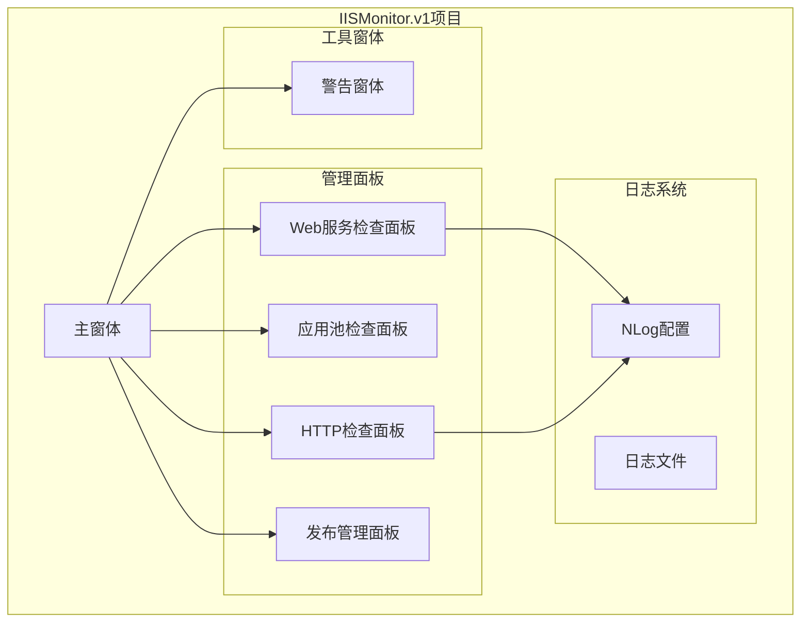

**图表来源**
- [MainForm.cs](file://IISMonitor.v1/MainForm.cs#L48-L77)
- [WebServiceCheckManagerPanel.cs](file://IISMonitor.v1/WebServiceCheckManagement/WebServiceCheckManagerPanel.cs#L15-L25)

**章节来源**
- [IISMonitor.v1.csproj](file://IISMonitor.v1/IISMonitor.v1.csproj#L1-L147)
- [MainForm.cs](file://IISMonitor.v1/MainForm.cs#L1-L82)

## 核心组件

Web服务检查面板的核心功能由以下组件构成：

### 主要功能特性
- **实时性能监控**: 基于Windows性能计数器监控Web服务连接状态
- **响应时间跟踪**: 记录和显示Web服务的响应延迟
- **异常告警**: 自动检测性能异常并触发告警机制
- **日志记录**: 完整的日志记录和分类存储
- **用户界面**: 直观的监控界面和实时数据展示

### 技术架构
- **UI框架**: Windows Forms
- **日志系统**: NLog集成
- **性能监控**: System.Diagnostics.PerformanceCounter
- **网络检查**: System.Net.WebRequest
- **定时器**: System.Windows.Forms.Timer

**章节来源**
- [WebServiceCheckManagerPanel.cs](file://IISMonitor.v1/WebServiceCheckManagement/WebServiceCheckManagerPanel.cs#L1-L140)
- [HttpCheckManagerPanel.cs](file://IISMonitor.v1/HttpCheckManagement/HttpCheckManagerPanel.cs#L1-L132)

## 架构概览

Web服务检查面板采用分层架构设计，确保功能模块的清晰分离和可维护性：

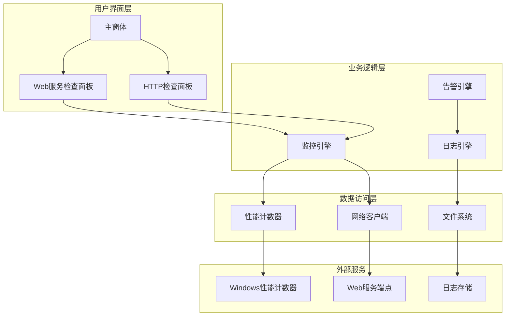

**图表来源**
- [MainForm.cs](file://IISMonitor.v1/MainForm.cs#L48-L77)
- [WebServiceCheckManagerPanel.cs](file://IISMonitor.v1/WebServiceCheckManagement/WebServiceCheckManagerPanel.cs#L58-L135)
- [HttpCheckManagerPanel.cs](file://IISMonitor.v1/HttpCheckManagement/HttpCheckManagerPanel.cs#L57-L127)

## 详细组件分析

### WebServiceCheckManagerPanel组件

WebServiceCheckManagerPanel是Web服务检查面板的核心组件，负责执行实际的监控任务。

#### 类结构设计

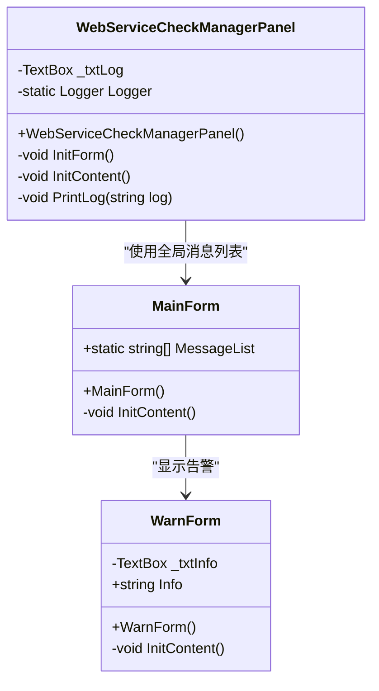

**图表来源**
- [WebServiceCheckManagerPanel.cs](file://IISMonitor.v1/WebServiceCheckManagement/WebServiceCheckManagerPanel.cs#L15-L47)
- [MainForm.cs](file://IISMonitor.v1/MainForm.cs#L31-L33)
- [WarnForm.cs](file://IISMonitor.v1/WarnForm.cs#L13-L37)

#### 初始化流程

组件的初始化过程包括UI控件创建、事件绑定和监控器配置：

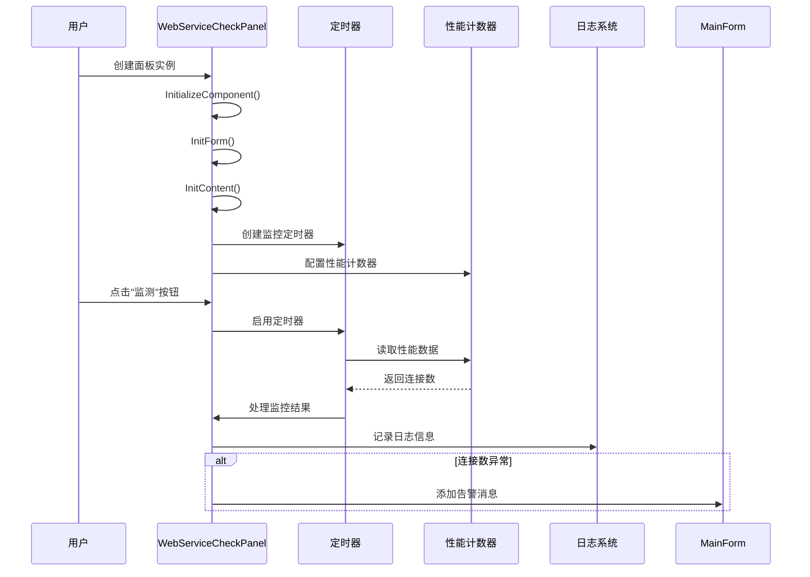

**图表来源**
- [WebServiceCheckManagerPanel.cs](file://IISMonitor.v1/WebServiceCheckManagement/WebServiceCheckManagerPanel.cs#L58-L135)
- [MainForm.cs](file://IISMonitor.v1/MainForm.cs#L67-L76)

#### 监控算法流程

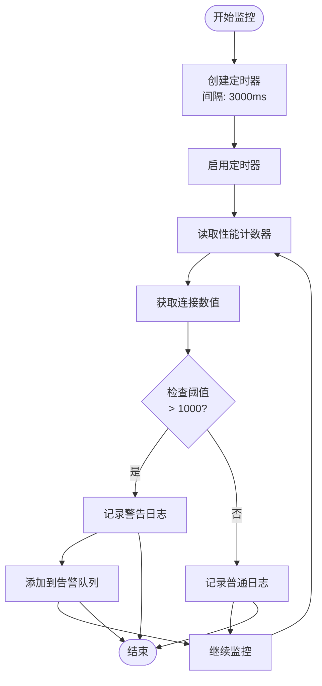

**图表来源**
- [WebServiceCheckManagerPanel.cs](file://IISMonitor.v1/WebServiceCheckManagement/WebServiceCheckManagerPanel.cs#L112-L129)

#### 关键配置参数

| 参数名称 | 默认值 | 描述 | 验证规则 |
|---------|--------|------|----------|
| Category | "Web Service" | 性能计数器类别 | 必须存在且可访问 |
| Counter | "Current Connections" | 监控指标名称 | 必须在类别中存在 |
| Instance | "_Total" | 实例名称 | 支持通配符或具体实例 |
| Machine | "localhost" | 监控主机名 | 必须可达且支持WMI |

**章节来源**
- [WebServiceCheckManagerPanel.cs](file://IISMonitor.v1/WebServiceCheckManagement/WebServiceCheckManagerPanel.cs#L58-L135)

### HTTP检查面板对比分析

为了更好地理解Web服务检查的完整功能，需要对比HTTP检查面板的实现方式：

#### HTTP检查流程

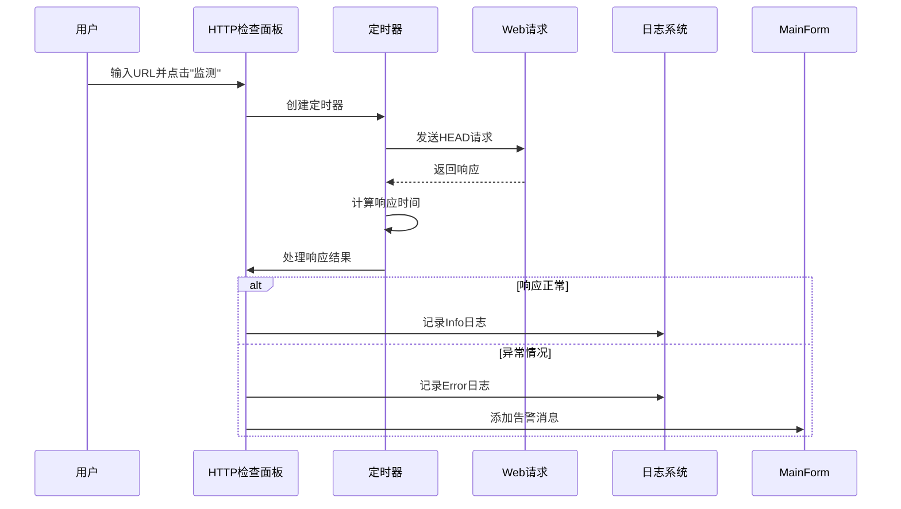

**图表来源**
- [HttpCheckManagerPanel.cs](file://IISMonitor.v1/HttpCheckManagement/HttpCheckManagerPanel.cs#L85-L127)

**章节来源**
- [HttpCheckManagerPanel.cs](file://IISMonitor.v1/HttpCheckManagement/HttpCheckManagerPanel.cs#L1-L132)

### 告警系统架构

告警系统采用异步消息队列模式，确保告警信息的及时处理：

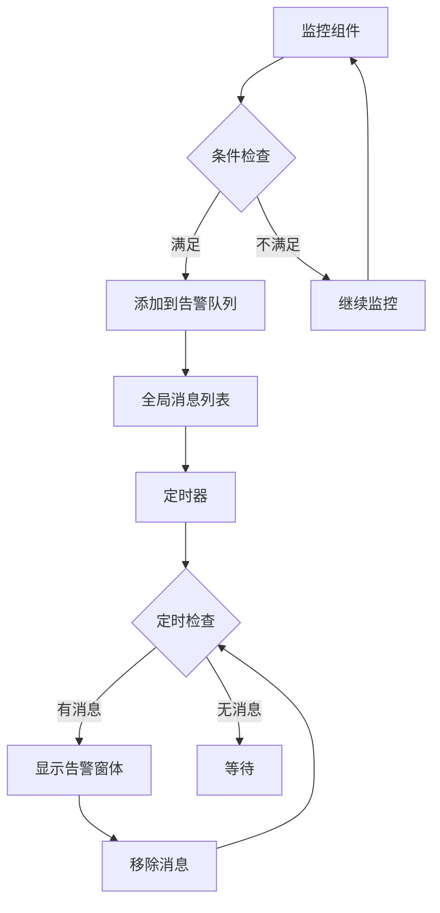

**图表来源**
- [MainForm.cs](file://IISMonitor.v1/MainForm.cs#L67-L76)
- [WarnForm.cs](file://IISMonitor.v1/WarnForm.cs#L13-L77)

**章节来源**
- [MainForm.cs](file://IISMonitor.v1/MainForm.cs#L31-L33)
- [WarnForm.cs](file://IISMonitor.v1/WarnForm.cs#L1-L77)

## 依赖关系分析

### 外部依赖

系统依赖多个外部库和框架：

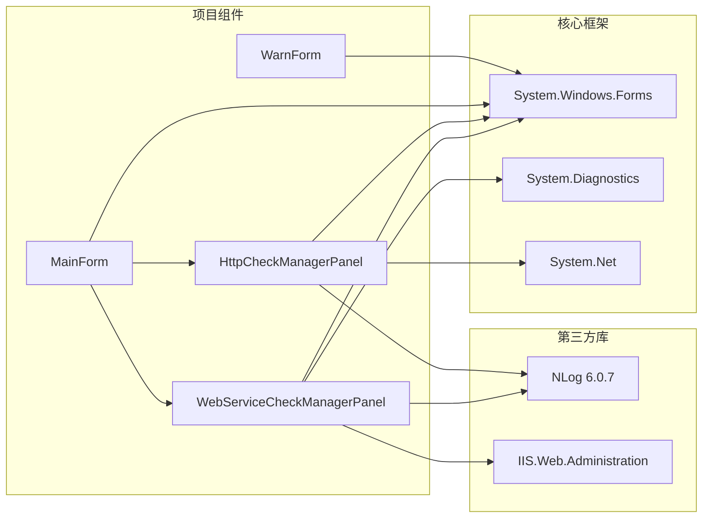

**图表来源**
- [IISMonitor.v1.csproj](file://IISMonitor.v1/IISMonitor.v1.csproj#L35-L57)
- [WebServiceCheckManagerPanel.cs](file://IISMonitor.v1/WebServiceCheckManagement/WebServiceCheckManagerPanel.cs#L1-L12)

### 内部模块依赖

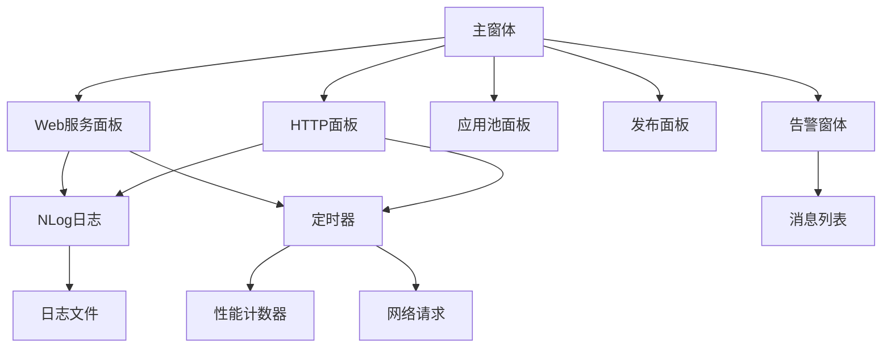

**图表来源**
- [MainForm.cs](file://IISMonitor.v1/MainForm.cs#L48-L77)
- [IISMonitor.v1.csproj](file://IISMonitor.v1/IISMonitor.v1.csproj#L130-L137)

**章节来源**
- [IISMonitor.v1.csproj](file://IISMonitor.v1/IISMonitor.v1.csproj#L35-L57)

## 性能考虑

### 监控频率优化

当前实现使用3秒的监控间隔，这是一个平衡点：

- **优势**: 足够频繁以捕捉性能波动
- **劣势**: 可能增加系统负载
- **建议**: 根据环境调整到5-10秒

### 内存管理策略

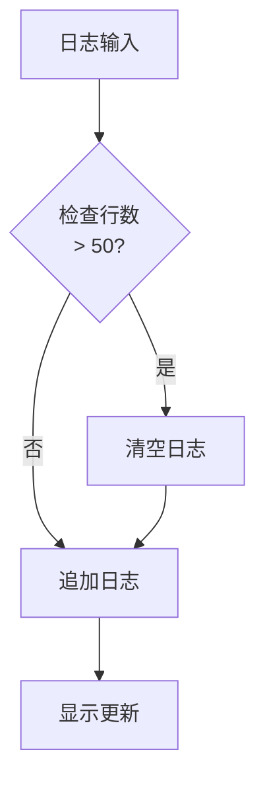

**图表来源**
- [WebServiceCheckManagerPanel.cs](file://IISMonitor.v1/WebServiceCheckManagement/WebServiceCheckManagerPanel.cs#L43-L47)

### 并发处理

系统采用单线程定时器模式，避免了并发问题：

- **简单性**: 代码逻辑清晰
- **可靠性**: 避免竞态条件
- **局限性**: 无法并行处理多个监控任务

**章节来源**
- [WebServiceCheckManagerPanel.cs](file://IISMonitor.v1/WebServiceCheckManagement/WebServiceCheckManagerPanel.cs#L112-L129)

## 故障排除指南

### 常见问题诊断

#### 性能计数器访问问题

**症状**: 监控面板无法启动或显示错误

**可能原因**:
1. 权限不足访问WMI服务
2. 性能计数器数据库损坏
3. IIS服务未正确安装

**解决方案**:
1. 以管理员权限运行应用程序
2. 重建性能计数器缓存
3. 重新安装IIS Web服务功能

#### 网络连接问题

**症状**: HTTP检查失败但Web服务面板正常

**诊断步骤**:
1. 验证目标URL可达性
2. 检查防火墙设置
3. 确认SSL证书有效性

#### 日志记录问题

**症状**: 日志文件未生成或为空

**排查方法**:
1. 检查NLog配置文件路径
2. 验证写入权限
3. 确认日志级别设置

### 错误处理机制

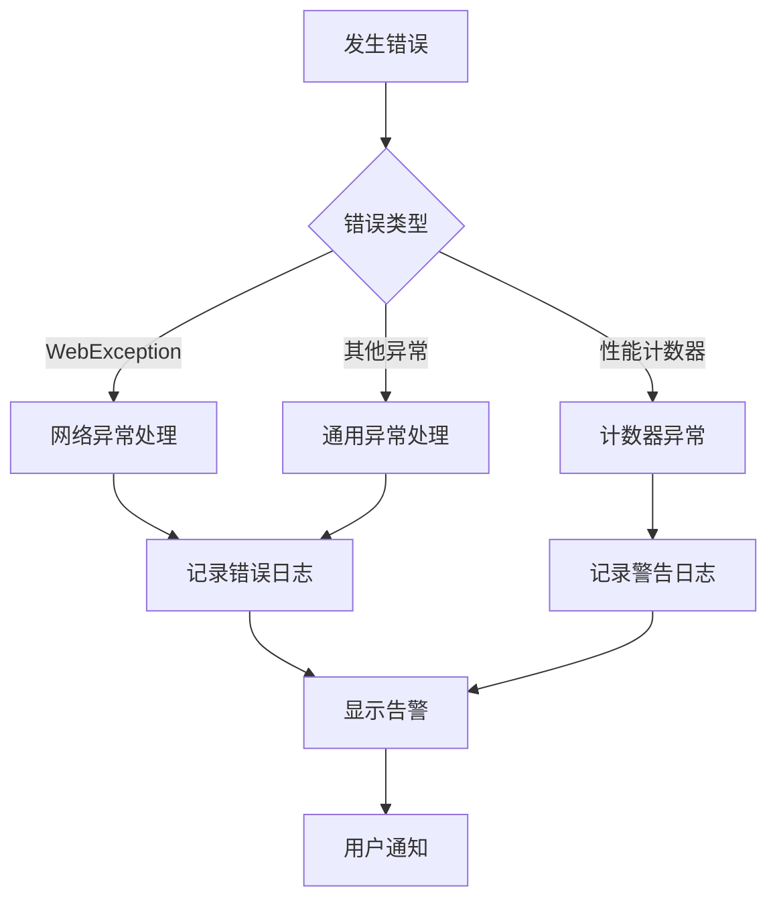

**图表来源**
- [HttpCheckManagerPanel.cs](file://IISMonitor.v1/HttpCheckManagement/HttpCheckManagerPanel.cs#L110-L121)
- [WebServiceCheckManagerPanel.cs](file://IISMonitor.v1/WebServiceCheckManagement/WebServiceCheckManagerPanel.cs#L116-L126)

**章节来源**
- [HttpCheckManagerPanel.cs](file://IISMonitor.v1/HttpCheckManagement/HttpCheckManagerPanel.cs#L110-L121)

### 监控参数调优

| 监控类型 | 建议阈值 | 警告级别 | 恢复条件 |
|---------|---------|---------|---------|
| 连接数 | > 1000 | 警告 | < 800连续5分钟 |
| 响应时间 | > 1000ms | 警告 | < 500ms连续3分钟 |
| 错误率 | > 5% | 警告 | < 1%连续10分钟 |
| 可用性 | < 99.5% | 严重 | > 99.9%连续15分钟 |

## 结论

Web服务检查面板提供了基础但有效的Web服务监控能力，主要特点包括：

### 已实现功能
- **实时性能监控**: 基于Windows性能计数器的连接状态监控
- **自动告警**: 异常情况下的自动检测和通知
- **日志记录**: 完整的操作日志和性能日志
- **用户友好界面**: 直观的监控界面和实时数据显示

### 功能限制
- **单一指标监控**: 目前仅监控连接数，缺少SOAP端点健康检查
- **静态配置**: 监控参数固定，缺乏动态配置能力
- **无WSDL验证**: 缺少WSDL文档验证功能
- **无批量检查**: 不支持多服务同时监控

### 改进建议
1. **扩展监控指标**: 添加SOAP端点健康检查、WSDL验证、响应时间统计
2. **增强配置管理**: 支持动态配置和批量服务检查
3. **完善告警机制**: 支持多种告警方式和自定义阈值
4. **优化性能**: 支持异步监控和并发处理
5. **增强报告**: 提供详细的性能报告和趋势分析

该面板为Web服务监控奠定了良好的基础，通过适当的扩展可以满足更复杂的监控需求。