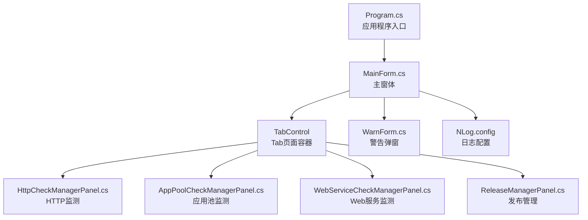
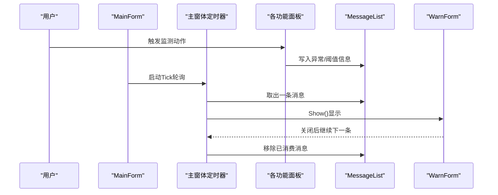
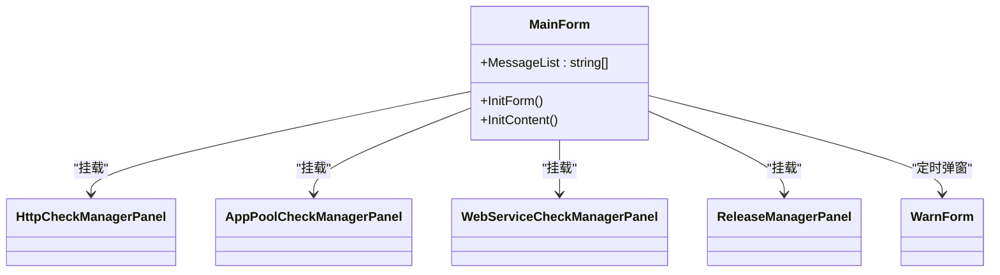
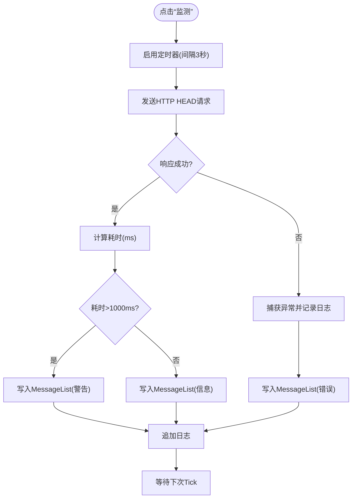
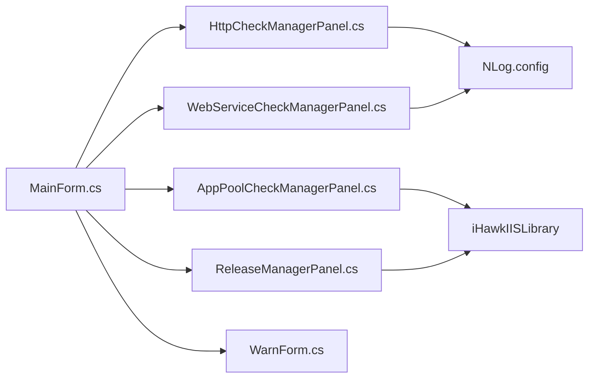

# 主界面概览

<cite>
**本文引用的文件列表**
- [MainForm.cs](file://IISMonitor.v1/MainForm.cs)
- [MainForm.Designer.cs](file://IISMonitor.v1/MainForm.Designer.cs)
- [Program.cs](file://IISMonitor.v1/Program.cs)
- [WarnForm.cs](file://IISMonitor.v1/WarnForm.cs)
- [WarnForm.Designer.cs](file://IISMonitor.v1/WarnForm.Designer.cs)
- [HttpCheckManagerPanel.cs](file://IISMonitor.v1/HttpCheckManagement/HttpCheckManagerPanel.cs)
- [AppPoolCheckManagerPanel.cs](file://IISMonitor.v1/AppPoolCheckManagement/AppPoolCheckManagerPanel.cs)
- [WebServiceCheckManagerPanel.cs](file://IISMonitor.v1/WebServiceCheckManagement/WebServiceCheckManagerPanel.cs)
- [ReleaseManagerPanel.cs](file://IISMonitor.v1/ReleaseManagement/ReleaseManagerPanel.cs)
- [IISMonitor.v1.csproj](file://IISMonitor.v1/IISMonitor.v1.csproj)
- [NLog.config](file://IISMonitor.v1/NLog.config)
- [README.md](file://README.md)
</cite>

## 目录
1. [简介](#简介)
2. [项目结构](#项目结构)
3. [核心组件](#核心组件)
4. [架构总览](#架构总览)
5. [详细组件分析](#详细组件分析)
6. [依赖关系分析](#依赖关系分析)
7. [性能考虑](#性能考虑)
8. [故障排查指南](#故障排查指南)
9. [结论](#结论)
10. [附录](#附录)

## 简介
本文件面向IISMonitor.v1主界面，提供从整体布局到消息队列机制的完整功能说明。重点覆盖：
- 主界面Tab页面组织与导航方式
- 界面初始化流程（窗口属性、双缓冲、性能优化）
- 消息队列系统与异步消息处理（MessageList与定时器驱动）
- 界面定制与用户体验优化建议
- 响应式设计与多分辨率适配策略

## 项目结构
IISMonitor.v1采用WinForms单窗体架构，主窗体承载四个功能Tab页，每个Tab页由独立UserControl面板实现具体业务逻辑。程序入口在Program中启动主窗体。

图表来源
- [Program.cs](file://IISMonitor.v1/Program.cs#L14-L20)
- [MainForm.cs](file://IISMonitor.v1/MainForm.cs#L48-L77)
- [HttpCheckManagerPanel.cs](file://IISMonitor.v1/HttpCheckManagement/HttpCheckManagerPanel.cs#L57-L127)
- [AppPoolCheckManagerPanel.cs](file://IISMonitor.v1/AppPoolCheckManagement/AppPoolCheckManagerPanel.cs#L43-L105)
- [WebServiceCheckManagerPanel.cs](file://IISMonitor.v1/WebServiceCheckManagement/WebServiceCheckManagerPanel.cs#L58-L135)
- [ReleaseManagerPanel.cs](file://IISMonitor.v1/ReleaseManagement/ReleaseManagerPanel.cs#L35-L112)
- [NLog.config](file://IISMonitor.v1/NLog.config#L31-L54)

章节来源
- [Program.cs](file://IISMonitor.v1/Program.cs#L14-L20)
- [IISMonitor.v1.csproj](file://IISMonitor.v1/IISMonitor.v1.csproj#L60-L97)

## 核心组件
- 主窗体MainForm：负责窗口初始化、Tab页面构建、消息队列轮询与警告弹窗展示。
- 四个功能面板：
  - HttpCheckManagerPanel：HTTP站点连通性与响应时间监测。
  - AppPoolCheckManagerPanel：IIS应用池状态监测与自动重启。
  - WebServiceCheckManagerPanel：Windows性能计数器监测（如连接数）。
  - ReleaseManagerPanel：IIS应用池与网站应用的创建与管理。
- 警告窗体WarnForm：以固定工具窗口样式显示异步消息，右下角吸附定位。
- 日志系统：基于NLog按模块输出不同级别日志文件。

章节来源
- [MainForm.cs](file://IISMonitor.v1/MainForm.cs#L17-L81)
- [WarnForm.cs](file://IISMonitor.v1/WarnForm.cs#L13-L77)
- [NLog.config](file://IISMonitor.v1/NLog.config#L31-L54)

## 架构总览
主界面采用“主窗体承载+Tab分页+子面板”的分层设计。主窗体集中管理窗口外观与消息队列，各面板专注各自业务逻辑与UI交互。消息通过静态列表在后台线程写入，在主线程定时器中消费并弹出警告窗体。

图表来源
- [MainForm.cs](file://IISMonitor.v1/MainForm.cs#L39-L77)
- [HttpCheckManagerPanel.cs](file://IISMonitor.v1/HttpCheckManagement/HttpCheckManagerPanel.cs#L90-L121)
- [WebServiceCheckManagerPanel.cs](file://IISMonitor.v1/WebServiceCheckManagement/WebServiceCheckManagerPanel.cs#L112-L127)
- [WarnForm.cs](file://IISMonitor.v1/WarnForm.cs#L17-L25)

## 详细组件分析

### 主窗体 MainForm
- 窗口初始化
  - 开启双缓冲以减少绘制闪烁。
  - 设置默认尺寸与标题。
- Tab页面组织
  - 动态创建TabControl并添加四个Tab页，分别挂载对应面板。
  - 所有面板均设置Dock填充，边距清零，确保自适应布局。
- 消息队列与异步处理
  - 静态消息列表作为跨线程共享队列。
  - 单次启用的定时器每秒轮询一次，逐条取出并弹出警告窗体。
  - 弹窗关闭后继续消费，直至队列清空。

图表来源
- [MainForm.cs](file://IISMonitor.v1/MainForm.cs#L39-L77)
- [HttpCheckManagerPanel.cs](file://IISMonitor.v1/HttpCheckManagement/HttpCheckManagerPanel.cs#L57-L65)
- [AppPoolCheckManagerPanel.cs](file://IISMonitor.v1/AppPoolCheckManagement/AppPoolCheckManagerPanel.cs#L57-L65)
- [WebServiceCheckManagerPanel.cs](file://IISMonitor.v1/WebServiceCheckManagement/WebServiceCheckManagerPanel.cs#L99-L107)
- [ReleaseManagerPanel.cs](file://IISMonitor.v1/ReleaseManagement/ReleaseManagerPanel.cs#L35-L112)

章节来源
- [MainForm.cs](file://IISMonitor.v1/MainForm.cs#L39-L77)

### HTTP监测面板 HttpCheckManagerPanel
- UI元素
  - 监测按钮、URL输入框、日志文本框。
- 业务逻辑
  - 点击监测后启动定时器，周期性向指定URL发起HEAD请求。
  - 记录状态码与耗时，超过阈值时写入MessageList触发警告。
  - 日志上限控制，超过行数自动清空，避免内存膨胀。
- 性能与稳定性
  - 使用双缓冲提升绘制性能。
  - 异常捕获并记录，同时写入消息队列。

图表来源
- [HttpCheckManagerPanel.cs](file://IISMonitor.v1/HttpCheckManagement/HttpCheckManagerPanel.cs#L85-L126)

章节来源
- [HttpCheckManagerPanel.cs](file://IISMonitor.v1/HttpCheckManagement/HttpCheckManagerPanel.cs#L57-L127)

### 应用池监测面板 AppPoolCheckManagerPanel
- UI元素
  - 查看按钮、树形控件、监测按钮、应用池名输入框、周期输入框、日志文本框。
- 业务逻辑
  - 点击“查看”刷新树节点，显示应用池名称与状态。
  - 点击“监测”根据输入周期定时检查应用池状态，若停止则尝试启动。
  - 日志记录每次尝试结果或异常。
- 依赖
  - 依赖iHawkIISLibrary提供的ApplicationPoolsManager进行IIS操作。

章节来源
- [AppPoolCheckManagerPanel.cs](file://IISMonitor.v1/AppPoolCheckManagement/AppPoolCheckManagerPanel.cs#L43-L105)

### Web服务监测面板 WebServiceCheckManagerPanel
- UI元素
  - 监测按钮、类别/计数器/实例/机器名输入框、日志文本框。
- 业务逻辑
  - 点击“监测”使用PerformanceCounter读取指定计数器值。
  - 超过阈值时写入MessageList触发警告，否则记录信息。
  - 日志上限控制，超过行数自动清空。
- 依赖
  - 使用系统性能计数器API。

章节来源
- [WebServiceCheckManagerPanel.cs](file://IISMonitor.v1/WebServiceCheckManagement/WebServiceCheckManagerPanel.cs#L58-L135)

### 发布管理面板 ReleaseManagerPanel
- UI元素
  - 应用池创建区：输入池名、创建按钮、日志输出。
  - 网站应用创建区：刷新网站列表、浏览物理路径、刷新应用池列表、创建应用按钮、日志输出。
- 业务逻辑
  - 创建应用池：校验输入后调用iHawkIISLibrary创建。
  - 创建网站应用：校验输入完整性与路径存在性后调用WebsitesManager创建。
  - 统一输出操作结果到日志。
- 依赖
  - iHawkIISLibrary的ApplicationPoolsManager与WebsitesManager。

章节来源
- [ReleaseManagerPanel.cs](file://IISMonitor.v1/ReleaseManagement/ReleaseManagerPanel.cs#L35-L112)

### 警告窗体 WarnForm
- 窗口特性
  - 固定工具窗口样式、置顶显示、双缓冲。
  - 启动时定位至屏幕右下角（吸附效果）。
- 内容
  - 只读多行文本框，自动换行，随窗口大小变化自适应。
- 交互
  - 通过Info属性设置显示内容，关闭后交由主窗体定时器继续消费队列。

章节来源
- [WarnForm.cs](file://IISMonitor.v1/WarnForm.cs#L17-L77)
- [WarnForm.Designer.cs](file://IISMonitor.v1/WarnForm.Designer.cs#L29-L34)

## 依赖关系分析
- 外部依赖
  - Microsoft.Web.Administration：IIS管理能力。
  - NLog：结构化日志输出。
  - System.Diagnostics：性能计数器。
- 内部依赖
  - iHawkIISLibrary：IIS应用池与网站管理。
  - iHawkAppControl：树形控件（AdSelectTreeView）。
- 项目引用关系

图表来源
- [IISMonitor.v1.csproj](file://IISMonitor.v1/IISMonitor.v1.csproj#L130-L137)
- [NLog.config](file://IISMonitor.v1/NLog.config#L31-L54)

章节来源
- [IISMonitor.v1.csproj](file://IISMonitor.v1/IISMonitor.v1.csproj#L36-L58)
- [IISMonitor.v1.csproj](file://IISMonitor.v1/IISMonitor.v1.csproj#L130-L137)

## 性能考虑
- 双缓冲渲染
  - 主窗体、各面板与警告窗体均启用DoubleBuffered，降低重绘抖动与撕裂。
- 控件自适应布局
  - 所有面板均使用Anchor与Dock，配合Fill与边距清零，保证在不同分辨率下保持一致体验。
- 日志与消息队列
  - 面板日志限制行数，避免无限增长导致内存压力。
  - MessageList采用简单List，主窗体定时器串行消费，避免并发访问风险。
- 定时器策略
  - 主窗体定时器每秒轮询一次，频率适中，兼顾实时性与CPU占用。
  - 各业务面板内部定时器按业务需求设定（如3秒），避免过于频繁的网络/系统调用。
- I/O与外部库
  - NLog异步写入（由配置决定），避免阻塞UI线程。
  - IIS操作通过外部库封装，注意异常处理与资源释放。

章节来源
- [MainForm.cs](file://IISMonitor.v1/MainForm.cs#L41-L46)
- [HttpCheckManagerPanel.cs](file://IISMonitor.v1/HttpCheckManagement/HttpCheckManagerPanel.cs#L54-L55)
- [AppPoolCheckManagerPanel.cs](file://IISMonitor.v1/AppPoolCheckManagement/AppPoolCheckManagerPanel.cs#L39-L41)
- [WebServiceCheckManagerPanel.cs](file://IISMonitor.v1/WebServiceCheckManagement/WebServiceCheckManagerPanel.cs#L54-L56)
- [WarnForm.cs](file://IISMonitor.v1/WarnForm.cs#L51-L57)
- [NLog.config](file://IISMonitor.v1/NLog.config#L31-L54)

## 故障排查指南
- 现象：消息不弹窗
  - 检查主窗体定时器是否启用（Enabled=true）。
  - 确认MessageList中是否存在数据且被正确消费。
  - 排查面板是否正确写入MessageList（异常分支与阈值分支）。
- 现象：日志过多导致卡顿
  - 面板日志上限控制生效，超过行数会清空；可适当增加上限或定期清理。
- 现象：IIS操作失败
  - 检查应用池/网站名称输入是否正确。
  - 确认运行权限与IIS服务状态。
- 现象：性能计数器读取异常
  - 检查类别/计数器/实例/机器名组合是否有效。
  - 确认目标机器上相应计数器可用。
- 现象：窗口布局错乱
  - 确保所有控件使用Anchor/Dock，边距清零，避免硬编码位置/尺寸。

章节来源
- [MainForm.cs](file://IISMonitor.v1/MainForm.cs#L67-L77)
- [HttpCheckManagerPanel.cs](file://IISMonitor.v1/HttpCheckManagement/HttpCheckManagerPanel.cs#L110-L121)
- [WebServiceCheckManagerPanel.cs](file://IISMonitor.v1/WebServiceCheckManagement/WebServiceCheckManagerPanel.cs#L112-L127)
- [AppPoolCheckManagerPanel.cs](file://IISMonitor.v1/AppPoolCheckManagement/AppPoolCheckManagerPanel.cs#L88-L104)
- [ReleaseManagerPanel.cs](file://IISMonitor.v1/ReleaseManagement/ReleaseManagerPanel.cs#L39-L110)

## 结论
IISMonitor.v1主界面通过清晰的Tab分层与自适应布局，结合双缓冲与定时器驱动的消息队列机制，实现了稳定高效的IIS监测与管理体验。建议后续可在以下方面持续优化：
- 将MessageList替换为线程安全集合，并引入优先级队列以提升吞吐。
- 对面板内部定时器进行统一管理，避免重复创建造成资源浪费。
- 增加主题切换与字体缩放支持，进一步增强可访问性。
- 在NLog配置中启用异步写入与滚动文件策略，降低磁盘IO压力。

## 附录
- 项目背景与组成见README。
- 项目文件与依赖清单见IISMonitor.v1.csproj。
- 日志规则与输出文件见NLog.config。

章节来源
- [README.md](file://README.md#L1-L10)
- [IISMonitor.v1.csproj](file://IISMonitor.v1/IISMonitor.v1.csproj#L1-L147)
- [NLog.config](file://IISMonitor.v1/NLog.config#L1-L56)