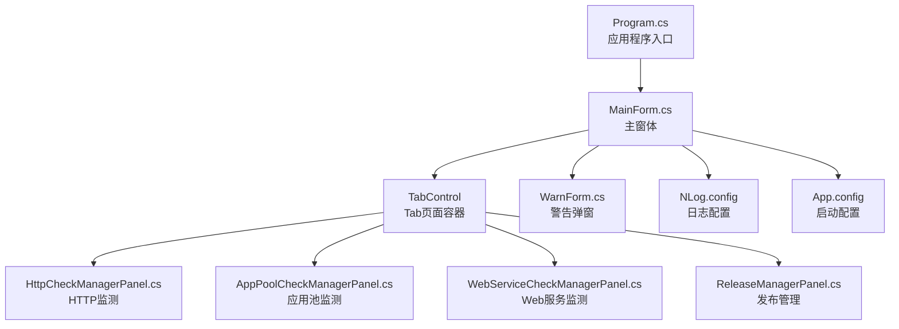
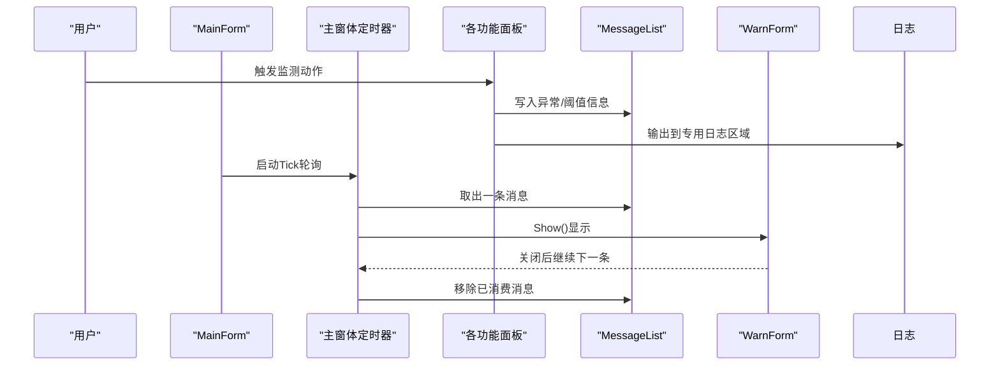
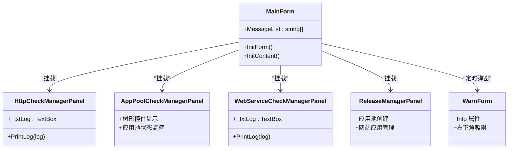
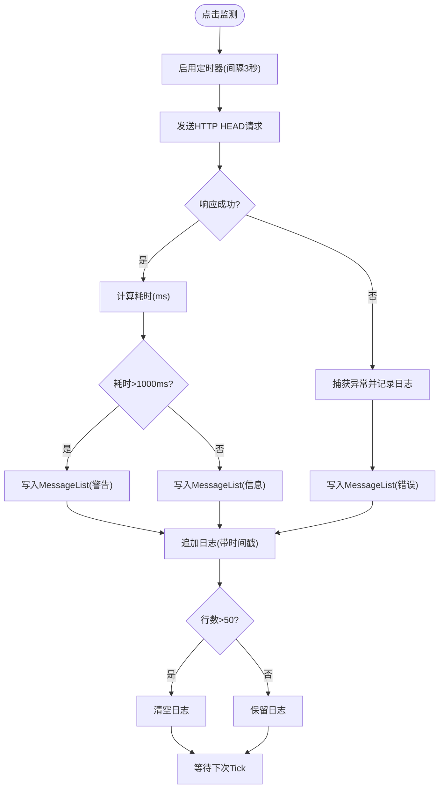
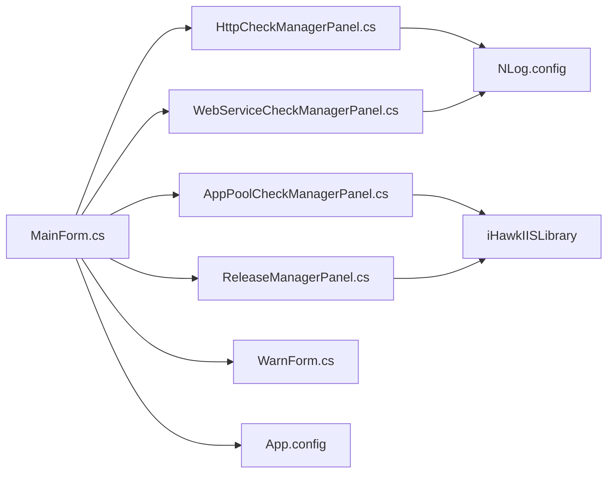

# 主界面概览

<cite>
**本文引用的文件列表**
- [MainForm.cs](file://IISMonitor.v1/MainForm.cs)
- [MainForm.Designer.cs](file://IISMonitor.v1/MainForm.Designer.cs)
- [Program.cs](file://IISMonitor.v1/Program.cs)
- [WarnForm.cs](file://IISMonitor.v1/WarnForm.cs)
- [WarnForm.Designer.cs](file://IISMonitor.v1/WarnForm.Designer.cs)
- [HttpCheckManagerPanel.cs](file://IISMonitor.v1/HttpCheckManagement/HttpCheckManagerPanel.cs)
- [AppPoolCheckManagerPanel.cs](file://IISMonitor.v1/AppPoolCheckManagement/AppPoolCheckManagerPanel.cs)
- [WebServiceCheckManagerPanel.cs](file://IISMonitor.v1/WebServiceCheckManagement/WebServiceCheckManagerPanel.cs)
- [ReleaseManagerPanel.cs](file://IISMonitor.v1/ReleaseManagement/ReleaseManagerPanel.cs)
- [IISMonitor.v1.csproj](file://IISMonitor.v1/IISMonitor.v1.csproj)
- [NLog.config](file://IISMonitor.v1/NLog.config)
- [App.config](file://IISMonitor.v1/App.config)
- [README.md](file://README.md)
</cite>

## 更新摘要
**所做更改**
- 新增日志显示区域功能说明，涵盖各面板的日志文本框实现
- 添加启动配置文件支持说明，包括App.config中的运行时配置
- 增强用户界面布局细节，详细说明锚点定位和自适应布局
- 完善用户体验优化建议，包括双缓冲技术和视觉样式改进
- 更新消息队列系统工作原理，强调异步消息处理流程

## 目录
1. [简介](#简介)
2. [项目结构](#项目结构)
3. [核心组件](#核心组件)
4. [架构总览](#架构总览)
5. [详细组件分析](#详细组件分析)
6. [依赖关系分析](#依赖关系分析)
7. [性能考虑](#性能考虑)
8. [故障排查指南](#故障排查指南)
9. [结论](#结论)
10. [附录](#附录)

## 简介
本文件面向IISMonitor.v1主界面，提供从整体布局到消息队列机制的完整功能说明。重点覆盖：
- 主界面Tab页面组织与导航方式
- 界面初始化流程（窗口属性、双缓冲、性能优化）
- 消息队列系统与异步消息处理（MessageList与定时器驱动）
- 日志显示区域与启动配置文件支持
- 界面定制与用户体验优化建议
- 响应式设计与多分辨率适配策略

## 项目结构
IISMonitor.v1采用WinForms单窗体架构，主窗体承载四个功能Tab页，每个Tab页由独立UserControl面板实现具体业务逻辑。程序入口在Program中启动主窗体，支持.NET Framework 4.7.2运行时环境。

**图表来源**
- [Program.cs](file://IISMonitor.v1/Program.cs#L14-L20)
- [MainForm.cs](file://IISMonitor.v1/MainForm.cs#L48-L77)
- [HttpCheckManagerPanel.cs](file://IISMonitor.v1/HttpCheckManagement/HttpCheckManagerPanel.cs#L57-L127)
- [AppPoolCheckManagerPanel.cs](file://IISMonitor.v1/AppPoolCheckManagement/AppPoolCheckManagerPanel.cs#L43-L105)
- [WebServiceCheckManagerPanel.cs](file://IISMonitor.v1/WebServiceCheckManagement/WebServiceCheckManagerPanel.cs#L58-L135)
- [ReleaseManagerPanel.cs](file://IISMonitor.v1/ReleaseManagement/ReleaseManagerPanel.cs#L35-L112)
- [NLog.config](file://IISMonitor.v1/NLog.config#L31-L54)
- [App.config](file://IISMonitor.v1/App.config#L3-L5)

**章节来源**
- [Program.cs](file://IISMonitor.v1/Program.cs#L14-L20)
- [IISMonitor.v1.csproj](file://IISMonitor.v1/IISMonitor.v1.csproj#L60-L97)
- [App.config](file://IISMonitor.v1/App.config#L3-L5)

## 核心组件
- 主窗体MainForm：负责窗口初始化、Tab页面构建、消息队列轮询与警告弹窗展示
- 四个功能面板：
  - HttpCheckManagerPanel：HTTP站点连通性与响应时间监测，配备专用日志显示区域
  - AppPoolCheckManagerPanel：IIS应用池状态监测与自动重启，包含树形结构显示
  - WebServiceCheckManagerPanel：Windows性能计数器监测（如连接数），集成实时日志输出
  - ReleaseManagerPanel：IIS应用池与网站应用的创建与管理，支持可视化操作界面
- 警告窗体WarnForm：以固定工具窗口样式显示异步消息，右下角吸附定位
- 日志系统：基于NLog按模块输出不同级别日志文件，支持Info、Warn、Error三级分类
- 启动配置：App.config提供.NET Framework运行时版本配置支持

**章节来源**
- [MainForm.cs](file://IISMonitor.v1/MainForm.cs#L17-L81)
- [WarnForm.cs](file://IISMonitor.v1/WarnForm.cs#L13-L77)
- [NLog.config](file://IISMonitor.v1/NLog.config#L31-L54)
- [App.config](file://IISMonitor.v1/App.config#L3-L5)

## 架构总览
主界面采用"主窗体承载+Tab分页+子面板"的分层设计。主窗体集中管理窗口外观与消息队列，各面板专注各自业务逻辑与UI交互。消息通过静态列表在后台线程写入，在主线程定时器中消费并弹出警告窗体。

**图表来源**
- [MainForm.cs](file://IISMonitor.v1/MainForm.cs#L39-L77)
- [HttpCheckManagerPanel.cs](file://IISMonitor.v1/HttpCheckManagement/HttpCheckManagerPanel.cs#L90-L121)
- [WebServiceCheckManagerPanel.cs](file://IISMonitor.v1/WebServiceCheckManagement/WebServiceCheckManagerPanel.cs#L112-L127)
- [WarnForm.cs](file://IISMonitor.v1/WarnForm.cs#L17-L25)

## 详细组件分析

### 主窗体 MainForm
- 窗口初始化
  - 开启双缓冲以减少绘制闪烁
  - 设置默认尺寸（750x500像素）与标题
- Tab页面组织
  - 动态创建TabControl并添加四个Tab页，分别挂载对应面板
  - 所有面板均设置Dock填充，DockPadding清零，确保自适应布局
- 消息队列与异步处理
  - 静态消息列表作为跨线程共享队列
  - 单次启用的定时器每秒轮询一次，逐条取出并弹出警告窗体
  - 弹窗关闭后继续消费，直至队列清空

**图表来源**
- [MainForm.cs](file://IISMonitor.v1/MainForm.cs#L39-L77)
- [HttpCheckManagerPanel.cs](file://IISMonitor.v1/HttpCheckManagement/HttpCheckManagerPanel.cs#L57-L65)
- [AppPoolCheckManagerPanel.cs](file://IISMonitor.v1/AppPoolCheckManagement/AppPoolCheckManagerPanel.cs#L57-L65)
- [WebServiceCheckManagerPanel.cs](file://IISMonitor.v1/WebServiceCheckManagement/WebServiceCheckManagerPanel.cs#L99-L107)
- [ReleaseManagerPanel.cs](file://IISMonitor.v1/ReleaseManagement/ReleaseManagerPanel.cs#L35-L112)

**章节来源**
- [MainForm.cs](file://IISMonitor.v1/MainForm.cs#L39-L77)

### HTTP监测面板 HttpCheckManagerPanel
- UI元素
  - 监测按钮、URL输入框、专用日志文本框（只读、垂直滚动）
- 业务逻辑
  - 点击监测后启动定时器（3秒间隔），周期性向指定URL发起HEAD请求
  - 记录状态码与耗时，超过阈值（1000ms）时写入MessageList触发警告
  - 日志上限控制（50行），超过自动清空，避免内存膨胀
  - 时间戳格式化输出，便于问题追踪
- 性能与稳定性
  - 使用双缓冲提升绘制性能
  - 异常捕获并记录，同时写入消息队列
  - NLog按Info/Warn/Error级别分类输出

**图表来源**
- [HttpCheckManagerPanel.cs](file://IISMonitor.v1/HttpCheckManagement/HttpCheckManagerPanel.cs#L85-L126)

**章节来源**
- [HttpCheckManagerPanel.cs](file://IISMonitor.v1/HttpCheckManagement/HttpCheckManagerPanel.cs#L57-L132)

### 应用池监测面板 AppPoolCheckManagerPanel
- UI元素
  - 查看按钮、树形控件、监测按钮、应用池名输入框、周期输入框、日志文本框
- 业务逻辑
  - 点击"查看"刷新树节点，显示应用池名称与状态（Started/Stopped等）
  - 点击"监测"根据输入周期定时检查应用池状态，若停止则尝试启动
  - 日志记录每次尝试结果或异常，支持手动输入应用池名称和检测间隔
- 依赖
  - 依赖iHawkIISLibrary提供的ApplicationPoolsManager进行IIS操作
  - 使用AdSelectTreeView实现增强的树形控件功能

**章节来源**
- [AppPoolCheckManagerPanel.cs](file://IISMonitor.v1/AppPoolCheckManagement/AppPoolCheckManagerPanel.cs#L43-L110)

### Web服务监测面板 WebServiceCheckManagerPanel
- UI元素
  - 监测按钮、类别/计数器/实例/机器名输入框、专用日志文本框
- 业务逻辑
  - 点击"监测"使用PerformanceCounter读取指定计数器值（默认Web Service Current Connections）
  - 超过阈值（1000）时写入MessageList触发警告，否则记录信息
  - 日志上限控制（50行），超过行数自动清空
  - 支持自定义性能计数器参数，包括本地和远程机器监控
- 依赖
  - 使用系统性能计数器API
  - 集成NLog日志输出，支持Info/Warn/Error级别分类

**章节来源**
- [WebServiceCheckManagerPanel.cs](file://IISMonitor.v1/WebServiceCheckManagement/WebServiceCheckManagerPanel.cs#L58-L140)

### 发布管理面板 ReleaseManagerPanel
- UI元素
  - 应用池创建区：应用池名称输入框、创建按钮、日志输出区域
  - 网站应用创建区：网站列表刷新、物理路径浏览、应用池列表刷新、创建应用按钮、日志输出
- 业务逻辑
  - 创建应用池：校验输入后调用iHawkIISLibrary创建，支持批量操作
  - 创建网站应用：校验输入完整性与路径存在性后调用WebsitesManager创建
  - 统一输出操作结果到日志，支持错误提示和状态反馈
- 依赖
  - iHawkIISLibrary的ApplicationPoolsManager与WebsitesManager
  - 支持文件夹浏览器对话框选择物理路径

**章节来源**
- [ReleaseManagerPanel.cs](file://IISMonitor.v1/ReleaseManagement/ReleaseManagerPanel.cs#L35-L117)

### 警告窗体 WarnForm
- 窗口特性
  - 固定工具窗口样式、置顶显示、双缓冲
  - 启动时定位至屏幕右下角（吸附效果），确保不遮挡主界面
- 内容
  - 只读多行文本框，自动换行，WordWrap启用，随窗口大小变化自适应
  - 支持Info属性设置显示内容，便于动态更新
- 交互
  - 通过Info属性设置显示内容，关闭后交由主窗体定时器继续消费队列
  - 自动吸附到屏幕右下角，提供最佳可见性

**章节来源**
- [WarnForm.cs](file://IISMonitor.v1/WarnForm.cs#L17-L77)
- [WarnForm.Designer.cs](file://IISMonitor.v1/WarnForm.Designer.cs#L29-L34)

### 日志显示区域
- 设计理念
  - 每个功能面板都配备专用的日志显示区域，便于用户实时监控操作状态
  - 采用只读多行文本框，支持垂直滚动，确保历史信息可追溯
- 实现特点
  - 统一的时间戳格式（yyyyMMddHHmmssfff），便于问题定位
  - 行数上限控制（50行），防止内存占用过大
  - 自动清空机制，超出限制时自动清理旧日志
- 用户体验
  - 实时反馈操作结果，包括成功、警告和错误信息
  - 支持手动复制日志内容，便于问题上报和分析

**章节来源**
- [HttpCheckManagerPanel.cs](file://IISMonitor.v1/HttpCheckManagement/HttpCheckManagerPanel.cs#L42-L46)
- [WebServiceCheckManagerPanel.cs](file://IISMonitor.v1/WebServiceCheckManagement/WebServiceCheckManagerPanel.cs#L43-L47)
- [AppPoolCheckManagerPanel.cs](file://IISMonitor.v1/AppPoolCheckManagement/AppPoolCheckManagerPanel.cs#L77-L86)

### 启动配置文件支持
- App.config配置
  - 支持.NET Framework 4.7.2运行时环境
  - 包含Newtonsoft.Json版本重定向配置，确保兼容性
  - 提供assemblyBinding配置，解决依赖冲突问题
- 运行时支持
  - 自动检测和加载正确的.NET Framework版本
  - 版本重定向机制确保应用程序稳定运行
  - 配置文件热更新支持，无需重启即可应用新配置

**章节来源**
- [App.config](file://IISMonitor.v1/App.config#L3-L13)

## 依赖关系分析
- 外部依赖
  - Microsoft.Web.Administration：IIS管理能力
  - NLog：结构化日志输出，支持多目标、多级别分类
  - System.Diagnostics：性能计数器
  - Newtonsoft.Json：JSON序列化支持（版本重定向）
- 内部依赖
  - iHawkIISLibrary：IIS应用池与网站管理
  - iHawkAppControl：增强树形控件（AdSelectTreeView）
- 项目引用关系

**图表来源**
- [IISMonitor.v1.csproj](file://IISMonitor.v1/IISMonitor.v1.csproj#L130-L137)
- [NLog.config](file://IISMonitor.v1/NLog.config#L31-L54)

**章节来源**
- [IISMonitor.v1.csproj](file://IISMonitor.v1/IISMonitor.v1.csproj#L36-L58)
- [IISMonitor.v1.csproj](file://IISMonitor.v1/IISMonitor.v1.csproj#L130-L137)

## 性能考虑
- 双缓冲渲染
  - 主窗体、各面板与警告窗体均启用DoubleBuffered，降低重绘抖动与撕裂
  - 显著改善复杂界面的绘制性能，特别是在频繁更新日志时
- 控件自适应布局
  - 所有面板均使用Anchor与Dock，配合Fill与边距清零，保证在不同分辨率下保持一致体验
  - 锚点定位系统确保控件随窗口大小变化而自适应调整
- 日志与消息队列
  - 面板日志限制行数（50行），避免无限增长导致内存压力
  - MessageList采用简单List，主窗体定时器串行消费，避免并发访问风险
  - NLog异步写入配置，避免阻塞UI线程
- 定时器策略
  - 主窗体定时器每秒轮询一次，频率适中，兼顾实时性与CPU占用
  - 各业务面板内部定时器按业务需求设定（如3秒），避免过于频繁的网络/系统调用
- I/O与外部库
  - NLog多目标配置，支持Info/Warn/Error三级分类输出
  - IIS操作通过外部库封装，注意异常处理与资源释放
  - App.config版本重定向，确保依赖库兼容性

**章节来源**
- [MainForm.cs](file://IISMonitor.v1/MainForm.cs#L41-L46)
- [HttpCheckManagerPanel.cs](file://IISMonitor.v1/HttpCheckManagement/HttpCheckManagerPanel.cs#L54-L55)
- [AppPoolCheckManagerPanel.cs](file://IISMonitor.v1/AppPoolCheckManagement/AppPoolCheckManagerPanel.cs#L39-L41)
- [WebServiceCheckManagerPanel.cs](file://IISMonitor.v1/WebServiceCheckManagement/WebServiceCheckManagerPanel.cs#L54-L56)
- [WarnForm.cs](file://IISMonitor.v1/WarnForm.cs#L51-L57)
- [NLog.config](file://IISMonitor.v1/NLog.config#L31-L54)

## 故障排查指南
- 现象：消息不弹窗
  - 检查主窗体定时器是否启用（Enabled=true）
  - 确认MessageList中是否存在数据且被正确消费
  - 排查面板是否正确写入MessageList（异常分支与阈值分支）
- 现象：日志过多导致卡顿
  - 面板日志上限控制生效（50行），超过行数会自动清空
  - 可通过调整日志显示区域的行数限制或定期清理日志
- 现象：IIS操作失败
  - 检查应用池/网站名称输入是否正确
  - 确认运行权限与IIS服务状态
  - 验证App.config中的版本重定向配置是否正确
- 现象：性能计数器读取异常
  - 检查类别/计数器/实例/机器名组合是否有效
  - 确认目标机器上相应计数器可用
  - 验证NLog配置中的日志输出路径权限
- 现象：窗口布局错乱
  - 确保所有控件使用Anchor/Dock，边距清零，避免硬编码位置/尺寸
  - 检查主窗体的DoubleBuffered设置是否正确
- 现象：启动失败或版本冲突
  - 检查App.config中的.NET Framework版本配置
  - 验证Newtonsoft.Json版本重定向设置
  - 确认所有依赖库版本兼容性

**章节来源**
- [MainForm.cs](file://IISMonitor.v1/MainForm.cs#L67-L77)
- [HttpCheckManagerPanel.cs](file://IISMonitor.v1/HttpCheckManagement/HttpCheckManagerPanel.cs#L110-L121)
- [WebServiceCheckManagerPanel.cs](file://IISMonitor.v1/WebServiceCheckManagement/WebServiceCheckManagerPanel.cs#L112-L127)
- [AppPoolCheckManagerPanel.cs](file://IISMonitor.v1/AppPoolCheckManagement/AppPoolCheckManagerPanel.cs#L88-L104)
- [ReleaseManagerPanel.cs](file://IISMonitor.v1/ReleaseManagement/ReleaseManagerPanel.cs#L39-L110)

## 结论
IISMonitor.v1主界面通过清晰的Tab分层与自适应布局，结合双缓冲与定时器驱动的消息队列机制，实现了稳定高效的IIS监测与管理体验。新增的日志显示区域和启动配置文件支持进一步提升了用户体验和系统稳定性。建议后续可在以下方面持续优化：
- 将MessageList替换为线程安全集合，并引入优先级队列以提升吞吐
- 对面板内部定时器进行统一管理，避免重复创建造成资源浪费
- 增加主题切换与字体缩放支持，进一步增强可访问性
- 在NLog配置中启用异步写入与滚动文件策略，降低磁盘IO压力
- 扩展日志显示区域的交互功能，支持日志导出和过滤
- 优化启动配置文件的动态加载机制，支持运行时配置更新

## 附录
- 项目背景与组成见README
- 项目文件与依赖清单见IISMonitor.v1.csproj
- 日志规则与输出文件见NLog.config
- 启动配置与运行时支持见App.config

**章节来源**
- [README.md](file://README.md#L1-L10)
- [IISMonitor.v1.csproj](file://IISMonitor.v1/IISMonitor.v1.csproj#L1-L147)
- [NLog.config](file://IISMonitor.v1/NLog.config#L1-L56)
- [App.config](file://IISMonitor.v1/App.config#L1-L15)