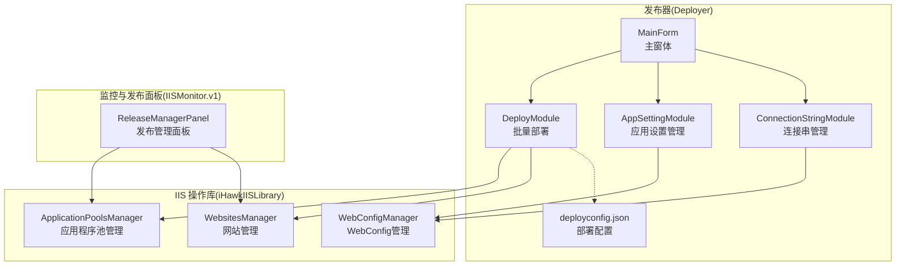
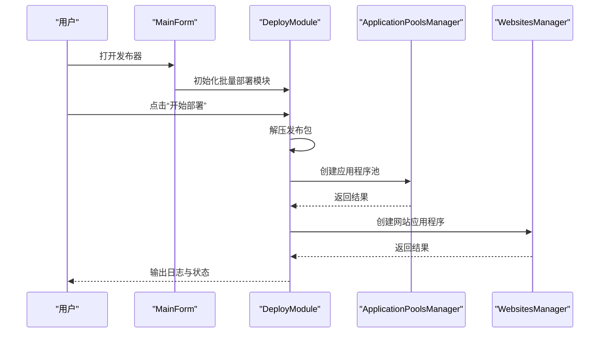
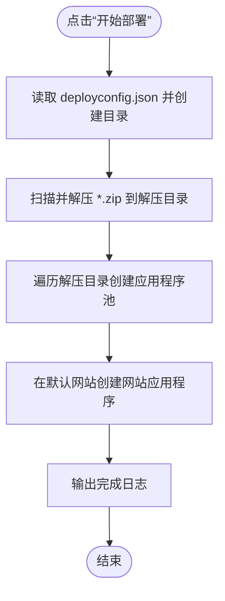
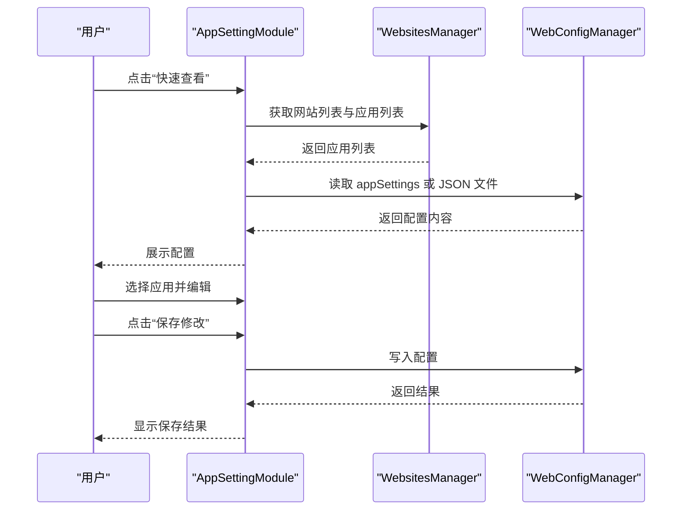
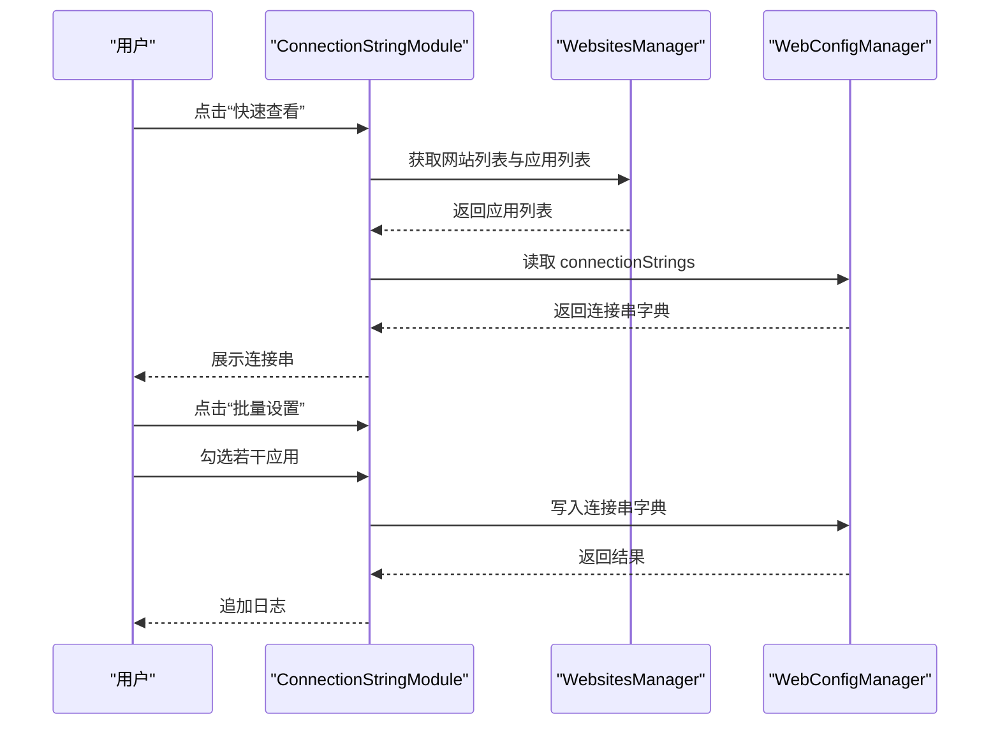
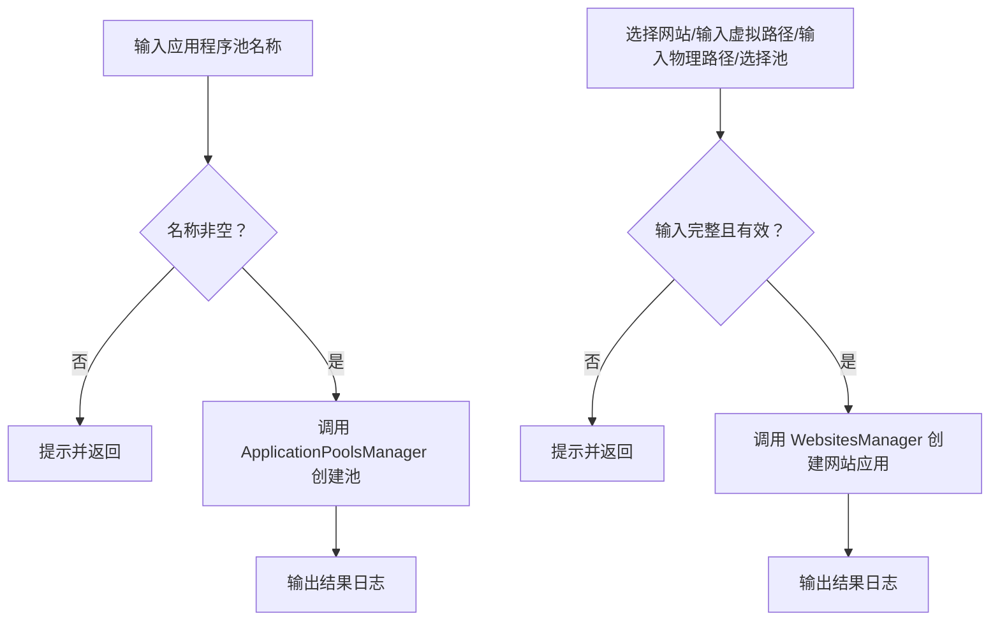
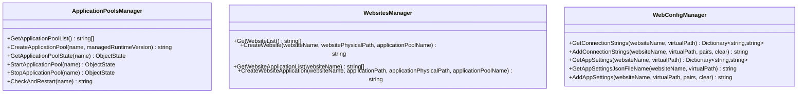
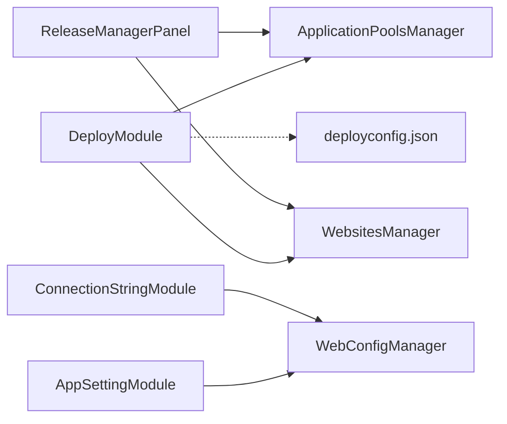

# 发布管理面板

<cite>
**本文引用的文件**
- [MainForm.cs](file://Deployer/MainForm.cs)
- [MainForm.Designer.cs](file://Deployer/MainForm.Designer.cs)
- [DeployModule.cs](file://Deployer/Modules/DeployModule.cs)
- [AppSettingModule.cs](file://Deployer/Modules/AppSettingModule.cs)
- [ConnectionStringModule.cs](file://Deployer/Modules/ConnectionStringModule.cs)
- [DeployConfigItem.cs](file://Deployer/DeployConfigItem.cs)
- [deployconfig.json](file://Deployer/deployconfig.json)
- [ReleaseManagerPanel.cs](file://IISMonitor.v1/ReleaseManagement/ReleaseManagerPanel.cs)
- [ApplicationPoolsManager.cs](file://iHawkIISLibrary/ApplicationPoolsManager.cs)
- [WebsitesManager.cs](file://iHawkIISLibrary/WebsitesManager.cs)
- [WebConfigManager.cs](file://iHawkIISLibrary/WebConfigManager.cs)
- [README.md](file://README.md)
</cite>

## 目录
1. [简介](#简介)
2. [项目结构](#项目结构)
3. [核心组件](#核心组件)
4. [架构总览](#架构总览)
5. [详细组件分析](#详细组件分析)
6. [依赖关系分析](#依赖关系分析)
7. [性能考虑](#性能考虑)
8. [故障排查指南](#故障排查指南)
9. [结论](#结论)
10. [附录](#附录)

## 简介
本文件面向“发布管理面板”的功能与实现，系统化阐述发布包上传、部署配置管理与部署执行监控的完整流程。文档覆盖以下主题：
- 发布配置参数：目标服务器设置、应用程序池绑定、虚拟目录配置、权限设置
- 部署流程：解压发布包、创建应用程序池、创建网站应用程序、写入配置（应用设置与连接串）
- 状态跟踪：日志输出、进度提示、错误反馈
- 最佳实践：版本控制、备份策略、灰度发布
- 扩展能力：批量发布、发布模板管理、发布历史记录查询（当前仓库未实现，建议项）

## 项目结构
仓库包含多个子项目，其中与发布管理直接相关的核心模块位于 Deployer 与 iHawkIISLibrary：
- Deployer：提供发布器主界面与三大功能模块（批量部署、应用设置管理、连接串管理）
- iHawkIISLibrary：封装 IIS 管理能力（应用程序池、网站、web.config）
- IISMonitor.v1：包含发布管理面板（ReleaseManagerPanel），提供应用池与网站应用的基础操作

图表来源
- [MainForm.cs](file://Deployer/MainForm.cs#L48-L74)
- [DeployModule.cs](file://Deployer/Modules/DeployModule.cs#L18-L74)
- [AppSettingModule.cs](file://Deployer/Modules/AppSettingModule.cs#L17-L242)
- [ConnectionStringModule.cs](file://Deployer/Modules/ConnectionStringModule.cs#L16-L178)
- [deployconfig.json](file://Deployer/deployconfig.json#L1-L8)
- [ApplicationPoolsManager.cs](file://iHawkIISLibrary/ApplicationPoolsManager.cs#L11-L142)
- [WebsitesManager.cs](file://iHawkIISLibrary/WebsitesManager.cs#L11-L93)
- [WebConfigManager.cs](file://iHawkIISLibrary/WebConfigManager.cs#L10-L156)
- [ReleaseManagerPanel.cs](file://IISMonitor.v1/ReleaseManagement/ReleaseManagerPanel.cs#L14-L116)

章节来源
- [README.md](file://README.md#L1-L10)
- [MainForm.cs](file://Deployer/MainForm.cs#L48-L74)

## 核心组件
- 批量部署模块（DeployModule）：负责读取部署配置、解压发布包、创建应用程序池、创建网站应用程序，并输出日志。
- 应用设置管理模块（AppSettingModule）：浏览与编辑应用设置，支持 JSON 文件与键值对两种输入方式。
- 连接串管理模块（ConnectionStringModule）：浏览与批量设置连接串，支持多应用勾选。
- 发布管理面板（ReleaseManagerPanel）：提供应用池创建、网站列表刷新、虚拟路径与物理路径选择、网站应用创建等基础操作。
- IIS 操作库：ApplicationPoolsManager、WebsitesManager、WebConfigManager 提供底层 IIS 管理能力。

章节来源
- [DeployModule.cs](file://Deployer/Modules/DeployModule.cs#L18-L154)
- [AppSettingModule.cs](file://Deployer/Modules/AppSettingModule.cs#L17-L242)
- [ConnectionStringModule.cs](file://Deployer/Modules/ConnectionStringModule.cs#L16-L178)
- [ReleaseManagerPanel.cs](file://IISMonitor.v1/ReleaseManagement/ReleaseManagerPanel.cs#L14-L116)
- [ApplicationPoolsManager.cs](file://iHawkIISLibrary/ApplicationPoolsManager.cs#L11-L142)
- [WebsitesManager.cs](file://iHawkIISLibrary/WebsitesManager.cs#L11-L93)
- [WebConfigManager.cs](file://iHawkIISLibrary/WebConfigManager.cs#L10-L156)

## 架构总览
发布管理面板采用分层设计：
- 表现层：MainForm 负责布局与 Tab 切换；各模块 UserControl 负责具体功能。
- 业务层：DeployModule 调用 IIS 操作库完成部署；AppSettingModule/ConnectionStringModule 调用 WebConfigManager 完成配置写入。
- 基础设施层：iHawkIISLibrary 封装 Microsoft.Web.Administration，统一 IIS 操作入口。

图表来源
- [MainForm.cs](file://Deployer/MainForm.cs#L48-L74)
- [DeployModule.cs](file://Deployer/Modules/DeployModule.cs#L55-L84)
- [ApplicationPoolsManager.cs](file://iHawkIISLibrary/ApplicationPoolsManager.cs#L105-L121)
- [WebsitesManager.cs](file://iHawkIISLibrary/WebsitesManager.cs#L74-L90)

## 详细组件分析

### 批量部署模块（DeployModule）
- 配置加载：启动时读取 deployconfig.json，解析发布包目录与解压目录，自动创建缺失目录。
- 部署流程：
  1) 解压发布包：扫描发布包目录下的 zip 文件并逐一解压到解压目录。
  2) 创建应用程序池：遍历解压目录中的每个子目录，按命名规则生成池名，根据是否存在 .NET 标识文件决定运行时版本。
  3) 创建网站应用程序：在默认网站下为每个子目录创建虚拟路径对应的应用程序，并绑定到对应的池。
- 日志输出：使用 BackgroundWorker 的进度回调输出时间戳与状态信息。

图表来源
- [DeployModule.cs](file://Deployer/Modules/DeployModule.cs#L40-L84)
- [deployconfig.json](file://Deployer/deployconfig.json#L1-L8)

章节来源
- [DeployModule.cs](file://Deployer/Modules/DeployModule.cs#L40-L154)
- [DeployConfigItem.cs](file://Deployer/DeployConfigItem.cs#L9-L35)
- [deployconfig.json](file://Deployer/deployconfig.json#L1-L8)

### 应用设置管理模块（AppSettingModule）
- 功能要点：
  - 快速查看：列出默认网站下所有应用程序的 appSettings，支持以 JSON 文件形式展示。
  - 编辑保存：支持 JSON 文本或键值对文本两种输入格式，调用 WebConfigManager 写入。
- 用户交互：左侧树形控件展示虚拟路径，右侧文本框展示与编辑内容。

图表来源
- [AppSettingModule.cs](file://Deployer/Modules/AppSettingModule.cs#L34-L192)
- [WebsitesManager.cs](file://iHawkIISLibrary/WebsitesManager.cs#L30-L93)
- [WebConfigManager.cs](file://iHawkIISLibrary/WebConfigManager.cs#L94-L152)

章节来源
- [AppSettingModule.cs](file://Deployer/Modules/AppSettingModule.cs#L34-L192)
- [WebsitesManager.cs](file://iHawkIISLibrary/WebsitesManager.cs#L30-L93)
- [WebConfigManager.cs](file://iHawkIISLibrary/WebConfigManager.cs#L94-L152)

### 连接串管理模块（ConnectionStringModule）
- 功能要点：
  - 快速查看：列出默认网站下所有应用程序的连接串。
  - 批量设置：弹出连接串字典对话框，勾选目标应用后统一写入。
- 用户交互：左侧树形控件支持复选，右侧文本框展示与追加日志。

图表来源
- [ConnectionStringModule.cs](file://Deployer/Modules/ConnectionStringModule.cs#L33-L128)
- [WebsitesManager.cs](file://iHawkIISLibrary/WebsitesManager.cs#L30-L93)
- [WebConfigManager.cs](file://iHawkIISLibrary/WebConfigManager.cs#L47-L92)

章节来源
- [ConnectionStringModule.cs](file://Deployer/Modules/ConnectionStringModule.cs#L33-L128)
- [WebsitesManager.cs](file://iHawkIISLibrary/WebsitesManager.cs#L30-L93)
- [WebConfigManager.cs](file://iHawkIISLibrary/WebConfigManager.cs#L47-L92)

### 发布管理面板（ReleaseManagerPanel）
- 功能要点：
  - 应用程序池：输入池名后创建。
  - 网站应用：选择网站、输入虚拟路径与物理路径、选择应用程序池，创建网站应用程序。
  - 输入校验：对必填项进行非空检查与路径存在性检查。
- 日志输出：将操作结果追加到日志文本框。

图表来源
- [ReleaseManagerPanel.cs](file://IISMonitor.v1/ReleaseManagement/ReleaseManagerPanel.cs#L39-L109)
- [ApplicationPoolsManager.cs](file://iHawkIISLibrary/ApplicationPoolsManager.cs#L105-L121)
- [WebsitesManager.cs](file://iHawkIISLibrary/WebsitesManager.cs#L74-L90)

章节来源
- [ReleaseManagerPanel.cs](file://IISMonitor.v1/ReleaseManagement/ReleaseManagerPanel.cs#L39-L109)
- [ApplicationPoolsManager.cs](file://iHawkIISLibrary/ApplicationPoolsManager.cs#L105-L121)
- [WebsitesManager.cs](file://iHawkIISLibrary/WebsitesManager.cs#L74-L90)

### IIS 操作库（ApplicationPoolsManager / WebsitesManager / WebConfigManager）
- ApplicationPoolsManager：提供应用程序池的创建、状态查询、启停与重启能力。
- WebsitesManager：提供网站列表、创建网站、获取应用列表、创建网站应用程序等能力。
- WebConfigManager：提供读取/写入 connectionStrings 与 appSettings 的能力，支持 JSON 文件定位。

图表来源
- [ApplicationPoolsManager.cs](file://iHawkIISLibrary/ApplicationPoolsManager.cs#L47-L142)
- [WebsitesManager.cs](file://iHawkIISLibrary/WebsitesManager.cs#L30-L93)
- [WebConfigManager.cs](file://iHawkIISLibrary/WebConfigManager.cs#L47-L152)

章节来源
- [ApplicationPoolsManager.cs](file://iHawkIISLibrary/ApplicationPoolsManager.cs#L47-L142)
- [WebsitesManager.cs](file://iHawkIISLibrary/WebsitesManager.cs#L30-L93)
- [WebConfigManager.cs](file://iHawkIISLibrary/WebConfigManager.cs#L47-L152)

## 依赖关系分析
- DeployModule 依赖 iHawkIISLibrary 的 ApplicationPoolsManager 与 WebsitesManager 完成部署动作。
- AppSettingModule 与 ConnectionStringModule 依赖 WebConfigManager 完成配置读写。
- ReleaseManagerPanel 同样依赖 ApplicationPoolsManager 与 WebsitesManager 提供基础操作。
- deployconfig.json 作为外部配置文件被 DeployModule 加载，影响发布包与解压目录路径。

图表来源
- [DeployModule.cs](file://Deployer/Modules/DeployModule.cs#L18-L154)
- [AppSettingModule.cs](file://Deployer/Modules/AppSettingModule.cs#L17-L242)
- [ConnectionStringModule.cs](file://Deployer/Modules/ConnectionStringModule.cs#L16-L178)
- [ReleaseManagerPanel.cs](file://IISMonitor.v1/ReleaseManagement/ReleaseManagerPanel.cs#L14-L116)
- [deployconfig.json](file://Deployer/deployconfig.json#L1-L8)

章节来源
- [DeployModule.cs](file://Deployer/Modules/DeployModule.cs#L18-L154)
- [AppSettingModule.cs](file://Deployer/Modules/AppSettingModule.cs#L17-L242)
- [ConnectionStringModule.cs](file://Deployer/Modules/ConnectionStringModule.cs#L16-L178)
- [ReleaseManagerPanel.cs](file://IISMonitor.v1/ReleaseManagement/ReleaseManagerPanel.cs#L14-L116)
- [deployconfig.json](file://Deployer/deployconfig.json#L1-L8)

## 性能考虑
- 大量文件解压：建议在发布包中减少冗余文件，合理拆分版本，避免单次解压体积过大导致长时间阻塞。
- IIS 配置提交：多次 CommitChanges 会带来 IIS 管理器往返开销，建议合并写入操作或在批处理完成后一次性提交。
- UI 线程阻塞：当前使用 BackgroundWorker 异步执行部署任务，但日志追加仍在线程间切换，建议优化日志缓冲与 UI 刷新频率。
- 网络与磁盘 IO：发布包下载与解压路径尽量使用本地高吞吐存储，避免跨盘拷贝与网络共享路径。

## 故障排查指南
- 发布包解压失败
  - 现象：日志提示“无 zip 文件”或“解压失败”。
  - 排查：确认发布包目录存在且包含 zip 文件；检查解压目录权限；查看异常消息。
  - 参考路径：[DeployModule.cs](file://Deployer/Modules/DeployModule.cs#L88-L103)
- 应用程序池创建失败
  - 现象：返回“已存在”或异常消息。
  - 排查：确认池名唯一性；检查运行时版本参数；查看 IIS 管理权限。
  - 参考路径：[ApplicationPoolsManager.cs](file://iHawkIISLibrary/ApplicationPoolsManager.cs#L105-L121)
- 网站应用创建失败
  - 现象：返回“网站不存在”或“应用已存在”。
  - 排查：确认默认网站存在；确认虚拟路径唯一；检查物理路径存在性。
  - 参考路径：[WebsitesManager.cs](file://iHawkIISLibrary/WebsitesManager.cs#L74-L90)
- 配置读取/写入异常
  - 现象：返回 null 或异常消息。
  - 排查：确认目标应用存在；确认 web.config 结构正确；检查写入权限。
  - 参考路径：[WebConfigManager.cs](file://iHawkIISLibrary/WebConfigManager.cs#L47-L152)

章节来源
- [DeployModule.cs](file://Deployer/Modules/DeployModule.cs#L88-L103)
- [ApplicationPoolsManager.cs](file://iHawkIISLibrary/ApplicationPoolsManager.cs#L105-L121)
- [WebsitesManager.cs](file://iHawkIISLibrary/WebsitesManager.cs#L74-L90)
- [WebConfigManager.cs](file://iHawkIISLibrary/WebConfigManager.cs#L47-L152)

## 结论
发布管理面板通过模块化设计实现了从发布包上传、部署配置管理到部署执行监控的闭环。DeployModule 提供了自动化批量部署能力，AppSettingModule 与 ConnectionStringModule 支持灵活的配置管理，ReleaseManagerPanel 提供基础的 IIS 操作入口。结合 iHawkIISLibrary 的统一 IIS 管理接口，整体具备良好的扩展性与可维护性。后续可在现有基础上引入发布模板、历史记录与回滚策略，进一步提升发布治理水平。

## 附录

### 发布配置参数说明
- 发布包存放目录（ReleasePackDir）：发布包所在目录，启动时自动创建。
- 发布包解压目录（ReleaseUnpackDir）：解压后的应用目录，启动时自动创建。
- 应用程序池名称前缀（AppPoolNamePrefix）、后缀（AppPoolNameSuffix）：池名拼接规则。
- .NET 标识文件名（NetTagFileName）：用于判断是否为无托管代码应用（如存在标识文件则不设置运行时版本）。

章节来源
- [DeployConfigItem.cs](file://Deployer/DeployConfigItem.cs#L9-L35)
- [deployconfig.json](file://Deployer/deployconfig.json#L1-L8)

### 发布流程最佳实践
- 版本控制：每次发布生成独立版本号与发布包，保留发布元数据（版本、时间、作者、变更摘要）。
- 备份策略：发布前备份现有 web.config 与关键配置文件；保留上一版本目录以便快速回滚。
- 灰度发布：先在小部分服务器或子路径进行发布验证，逐步扩大范围。
- 权限最小化：仅授予发布工具所需的 IIS 管理权限，避免过度授权。
- 监控与告警：在部署前后监控应用程序池状态与站点可用性，异常时及时告警。

### 批量发布、模板与历史（建议扩展）
- 批量发布：支持多目标服务器并行部署，统一日志与状态汇总。
- 发布模板：预设目标服务器、应用池、虚拟路径、配置参数集合，一键套用。
- 发布历史：记录每次发布的时间、版本、目标、状态与回滚链接，支持查询与对比。