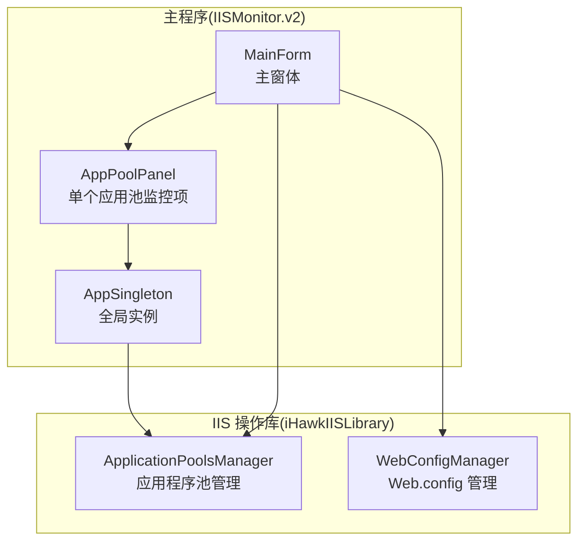
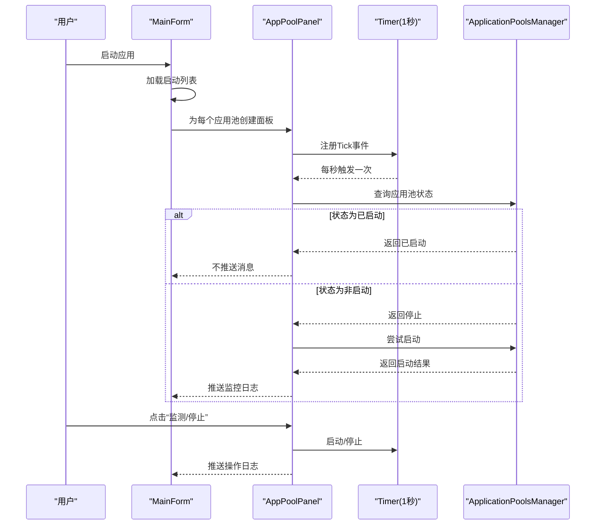
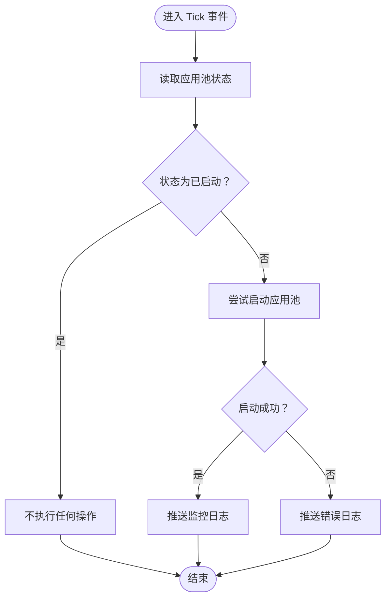
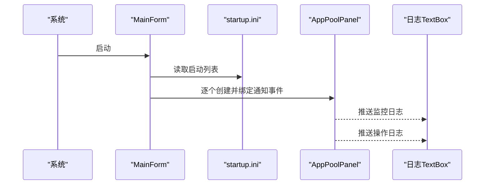
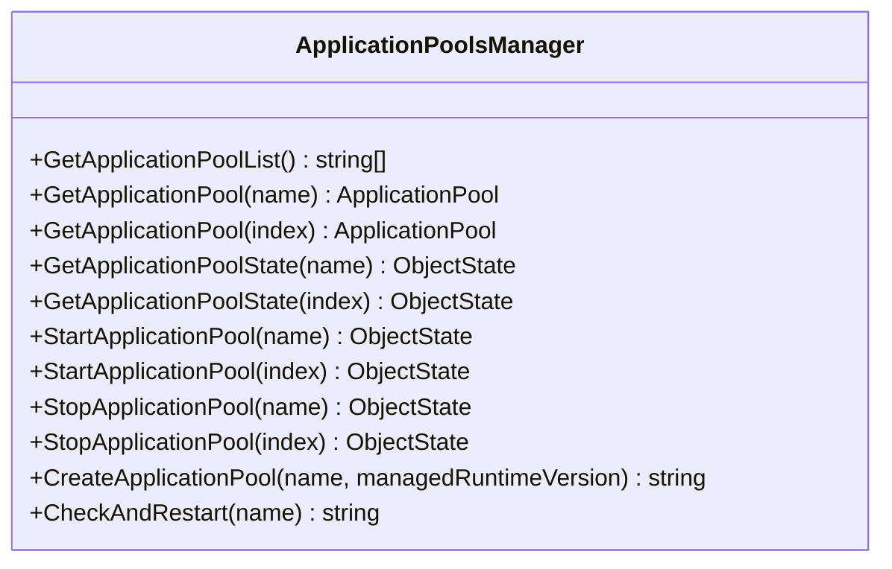
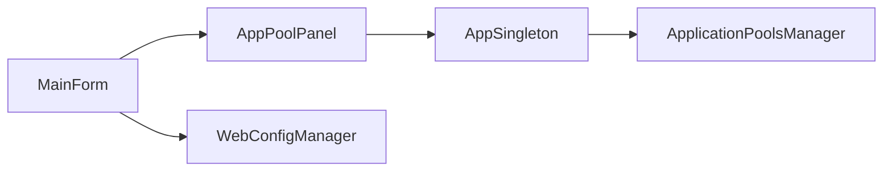

# 应用程序池监控面板

<cite>
**本文引用的文件**
- [IISMonitor.v2/AppPoolPanel.cs](file://IISMonitor.v2/AppPoolPanel.cs)
- [IISMonitor.v2/MainForm.cs](file://IISMonitor.v2/MainForm.cs)
- [IISMonitor.v2/AppSingleton.cs](file://IISMonitor.v2/AppSingleton.cs)
- [iHawkIISLibrary/ApplicationPoolsManager.cs](file://iHawkIISLibrary/ApplicationPoolsManager.cs)
- [IISMonitor.v2/startup.ini](file://IISMonitor.v2/startup.ini)
- [IISMonitor.v2/AppPoolPanel.Designer.cs](file://IISMonitor.v2/AppPoolPanel.Designer.cs)
- [IISMonitor.v2/MainForm.Designer.cs](file://IISMonitor.v2/MainForm.Designer.cs)
- [iHawkIISLibrary/WebConfigManager.cs](file://iHawkIISLibrary/WebConfigManager.cs)
</cite>

## 目录
1. [简介](#简介)
2. [项目结构](#项目结构)
3. [核心组件](#核心组件)
4. [架构总览](#架构总览)
5. [详细组件分析](#详细组件分析)
6. [依赖关系分析](#依赖关系分析)
7. [性能考虑](#性能考虑)
8. [故障排查指南](#故障排查指南)
9. [结论](#结论)
10. [附录](#附录)

## 简介
本文件面向“应用程序池监控面板”的功能与实现，围绕以下目标展开：  
- 应用程序池状态监控机制：状态检测算法、实时更新频率、状态变化通知  
- 生命周期管理：启动、停止、重启的实现细节  
- 配置参数监控范围：CPU、内存、请求计数等关键指标的现状与扩展建议  
- 故障诊断与自动恢复策略  
- 批量操作、配置导入导出与性能优化建议  

当前仓库中，应用程序池监控主要通过定时轮询实现，具备基础的自动重启能力；对于更细粒度的性能指标（如 CPU、内存、请求计数）尚未直接集成。本文在不展示具体代码的前提下，基于现有实现进行系统化梳理与改进建议。

## 项目结构
- IISMonitor.v2：主程序模块，包含监控面板与主窗体  
- iHawkIISLibrary：IIS 操作类库，封装应用程序池、网站、Web.config 等管理接口  
- ProcessProtector：进程保护模块（与本主题关联较小，作为参考存在）  
- Deployer：部署模块（与本主题关联较小，作为参考存在）

图表来源
- [IISMonitor.v2/MainForm.cs](file://IISMonitor.v2/MainForm.cs#L34-L81)
- [IISMonitor.v2/AppPoolPanel.cs](file://IISMonitor.v2/AppPoolPanel.cs#L28-L54)
- [IISMonitor.v2/AppSingleton.cs](file://IISMonitor.v2/AppSingleton.cs#L9-L12)
- [iHawkIISLibrary/ApplicationPoolsManager.cs](file://iHawkIISLibrary/ApplicationPoolsManager.cs#L11-L23)
- [iHawkIISLibrary/WebConfigManager.cs](file://iHawkIISLibrary/WebConfigManager.cs#L10-L22)

章节来源
- [IISMonitor.v2/MainForm.cs](file://IISMonitor.v2/MainForm.cs#L34-L81)
- [IISMonitor.v2/AppPoolPanel.cs](file://IISMonitor.v2/AppPoolPanel.cs#L28-L54)
- [IISMonitor.v2/AppSingleton.cs](file://IISMonitor.v2/AppSingleton.cs#L9-L12)
- [iHawkIISLibrary/ApplicationPoolsManager.cs](file://iHawkIISLibrary/ApplicationPoolsManager.cs#L11-L23)
- [iHawkIISLibrary/WebConfigManager.cs](file://iHawkIISLibrary/WebConfigManager.cs#L10-L22)

## 核心组件
- 单应用池监控项（AppPoolPanel）：每个应用池一行，包含名称显示与“监测/停止”按钮，内置每秒触发的定时器，周期性调用检查并自动重启逻辑，同时通过事件向主窗体推送操作日志与监控日志  
- 主窗体（MainForm）：加载启动列表，动态生成多个 AppPoolPanel，聚合两类日志（操作日志、监控日志），并负责窗体布局与初始化  
- 全局实例（AppSingleton）：集中持有 IIS 操作类库的实例，避免重复创建与资源泄漏  
- 应用程序池管理器（ApplicationPoolsManager）：封装 IIS 应用池的查询、启停、创建与“检测并重启”等操作  
- Web.config 管理器（WebConfigManager）：提供连接串与应用设置的读取与写入能力，可作为配置导入导出的基础

章节来源
- [IISMonitor.v2/AppPoolPanel.cs](file://IISMonitor.v2/AppPoolPanel.cs#L19-L54)
- [IISMonitor.v2/MainForm.cs](file://IISMonitor.v2/MainForm.cs#L34-L81)
- [IISMonitor.v2/AppSingleton.cs](file://IISMonitor.v2/AppSingleton.cs#L9-L12)
- [iHawkIISLibrary/ApplicationPoolsManager.cs](file://iHawkIISLibrary/ApplicationPoolsManager.cs#L47-L98)
- [iHawkIISLibrary/WebConfigManager.cs](file://iHawkIISLibrary/WebConfigManager.cs#L47-L92)

## 架构总览
监控流程自上而下分为三层：界面层（主窗体与面板）、业务层（AppPoolPanel 与 AppSingleton）、数据访问层（ApplicationPoolsManager）。界面层负责用户交互与日志展示；业务层负责定时检测与状态变更通知；数据访问层负责与 IIS 交互。

图表来源
- [IISMonitor.v2/MainForm.cs](file://IISMonitor.v2/MainForm.cs#L34-L81)
- [IISMonitor.v2/AppPoolPanel.cs](file://IISMonitor.v2/AppPoolPanel.cs#L28-L54)
- [iHawkIISLibrary/ApplicationPoolsManager.cs](file://iHawkIISLibrary/ApplicationPoolsManager.cs#L70-L98)

## 详细组件分析

### AppPoolPanel：单应用池监控项
- 实时更新频率：内部定时器间隔固定为 1 秒，每秒执行一次状态检查与必要时的自动重启  
- 状态检测算法：读取指定应用池状态，若非“已启动”，则尝试启动并返回结果字符串；异常时返回错误信息  
- 状态变化通知：通过事件向父级（主窗体）推送两类信息（监控日志与操作日志），便于统一展示  
- 生命周期控制：支持“监测/停止”切换，切换时改变按钮外观与定时器启用状态，并推送对应操作日志  
- UI 初始化：动态创建文本框与按钮，按钮锚定右侧，文本框占满剩余空间，高度固定，保证紧凑显示

图表来源
- [IISMonitor.v2/AppPoolPanel.cs](file://IISMonitor.v2/AppPoolPanel.cs#L32-L36)
- [iHawkIISLibrary/ApplicationPoolsManager.cs](file://iHawkIISLibrary/ApplicationPoolsManager.cs#L127-L138)

章节来源
- [IISMonitor.v2/AppPoolPanel.cs](file://IISMonitor.v2/AppPoolPanel.cs#L19-L54)
- [IISMonitor.v2/AppPoolPanel.Designer.cs](file://IISMonitor.v2/AppPoolPanel.Designer.cs#L30-L34)

### MainForm：主窗体与日志聚合
- 启动列表加载：从配置文件加载需要开机即监测的应用池列表，用于初始化面板时自动启动  
- 动态面板生成：遍历应用池列表，为每个池创建 AppPoolPanel，绑定通知事件到日志区域  
- 日志展示：分上下两块区域分别展示“操作日志”和“监控日志”，均支持自动滚动与时间戳标注  
- 布局设计：左侧固定宽度面板放置应用池面板，右侧分割容器承载日志区域，适配窗口大小变化

图表来源
- [IISMonitor.v2/MainForm.cs](file://IISMonitor.v2/MainForm.cs#L34-L81)
- [IISMonitor.v2/startup.ini](file://IISMonitor.v2/startup.ini#L1-L1)

章节来源
- [IISMonitor.v2/MainForm.cs](file://IISMonitor.v2/MainForm.cs#L34-L81)
- [IISMonitor.v2/MainForm.Designer.cs](file://IISMonitor.v2/MainForm.Designer.cs#L30-L36)

### ApplicationPoolsManager：IIS 应用池操作
- 列表与查询：提供获取应用池名称列表、按名称或索引获取应用池对象、按名称或索引获取状态  
- 生命周期：提供启动、停止应用池的能力，支持按名称或索引操作  
- 自动重启：提供“检测并重启”方法，若状态非启动则尝试启动并返回结果字符串，异常时返回错误信息  
- 创建应用池：提供创建应用池的便捷方法，设置运行时版本、管道模式等默认值，并提交更改

图表来源
- [iHawkIISLibrary/ApplicationPoolsManager.cs](file://iHawkIISLibrary/ApplicationPoolsManager.cs#L47-L138)

章节来源
- [iHawkIISLibrary/ApplicationPoolsManager.cs](file://iHawkIISLibrary/ApplicationPoolsManager.cs#L47-L138)

### AppSingleton：全局实例
- 作用：集中持有 ApplicationPoolsManager 的单例实例，避免多处重复创建 ServerManager 导致的资源浪费与权限问题  
- 使用：各业务组件通过 AppSingleton.Apm 调用 IIS 操作

章节来源
- [IISMonitor.v2/AppSingleton.cs](file://IISMonitor.v2/AppSingleton.cs#L9-L12)

### WebConfigManager：配置读取与写入（为导入导出做准备）
- 连接串与应用设置：提供读取与写入连接串、应用设置的能力，支持清空后追加  
- JSON 文件路径：可定位站点下的 appsettings.json 物理路径，便于后续导入导出场景  
- 用途：为后续“配置导入导出”功能提供基础能力

章节来源
- [iHawkIISLibrary/WebConfigManager.cs](file://iHawkIISLibrary/WebConfigManager.cs#L47-L152)

## 依赖关系分析
- 组件耦合：AppPoolPanel 依赖 AppSingleton 提供的 ApplicationPoolsManager；MainForm 负责创建面板与聚合日志；ApplicationPoolsManager 依赖 Microsoft.Web.Administration 访问 IIS  
- 外部依赖：IIS Web 管理器（ServerManager）与 IIS 管理权限  
- 可能的改进点：当前未发现循环依赖；但存在“全局单例 + 多线程定时器”的潜在竞争风险，建议在业务层增加互斥或异常隔离

图表来源
- [IISMonitor.v2/MainForm.cs](file://IISMonitor.v2/MainForm.cs#L34-L81)
- [IISMonitor.v2/AppPoolPanel.cs](file://IISMonitor.v2/AppPoolPanel.cs#L28-L54)
- [IISMonitor.v2/AppSingleton.cs](file://IISMonitor.v2/AppSingleton.cs#L9-L12)
- [iHawkIISLibrary/ApplicationPoolsManager.cs](file://iHawkIISLibrary/ApplicationPoolsManager.cs#L11-L23)
- [iHawkIISLibrary/WebConfigManager.cs](file://iHawkIISLibrary/WebConfigManager.cs#L10-L22)

## 性能考虑
- 定时器频率：当前为 1 秒，对大多数场景足够；若应用池数量较多，建议根据实际需求调整频率，避免频繁 IIS 查询造成压力  
- 异常处理：检查与重启过程已捕获异常并返回错误信息；建议在主窗体侧增加重试上限与退避策略，防止抖动  
- UI 更新：日志区域为多行文本框，持续写入可能影响性能；建议采用缓冲队列或分页展示，降低 UI 抖动  
- 资源释放：ApplicationPoolsManager 已实现 IDisposable，确保在窗体关闭时释放 ServerManager；建议在主窗体关闭事件中显式释放资源  
- 并发安全：多面板共享同一全局管理器实例，注意避免并发启停冲突；可在业务层增加锁或状态机

## 故障排查指南
- 无法读取应用池列表或状态
  - 检查是否以管理员权限运行；IIS 管理权限不足会导致访问失败  
  - 查看监控日志中的错误信息，确认异常类型（如权限、网络、服务不可用）  
- 自动重启失败
  - 查看监控日志中的失败提示，确认应用池名称是否存在、配置是否正确  
  - 在主窗体中手动尝试启动，验证 IIS 服务状态与应用池配置  
- 日志未显示
  - 确认“监测/停止”按钮状态与定时器是否启用  
  - 检查 startup.ini 是否正确加载，确认启动列表内容  
- UI 卡顿
  - 减少日志刷新频率或限制日志条目数量  
  - 避免在日志区域进行大量文本拼接操作

章节来源
- [IISMonitor.v2/AppPoolPanel.cs](file://IISMonitor.v2/AppPoolPanel.cs#L32-L36)
- [IISMonitor.v2/MainForm.cs](file://IISMonitor.v2/MainForm.cs#L67-L80)
- [iHawkIISLibrary/ApplicationPoolsManager.cs](file://iHawkIISLibrary/ApplicationPoolsManager.cs#L127-L138)

## 结论
当前应用程序池监控面板实现了“每秒检测 + 自动重启”的核心能力，界面简洁、易于使用。为进一步提升可观测性与可用性，建议引入更丰富的性能指标采集（CPU、内存、请求计数）、增强日志与告警能力、完善批量操作与配置导入导出功能，并在高并发场景下加强稳定性与性能优化。

## 附录

### 配置参数与导入导出建议
- 当前支持的配置读取：连接串、应用设置、appsettings.json 路径  
- 建议的导入导出流程：
  - 导出：读取目标站点的连接串与应用设置，序列化为 JSON 或键值对清单  
  - 导入：清空或合并写入目标站点的连接串与应用设置，提交更改  
  - 注意：导入前备份原配置，导入后验证关键键值是否存在

章节来源
- [iHawkIISLibrary/WebConfigManager.cs](file://iHawkIISLibrary/WebConfigManager.cs#L47-L152)

### 批量操作建议
- 批量启动/停止：在主窗体中提供“全选/反选”与“批量操作”按钮，遍历面板集合依次调用管理器的启停方法  
- 批量导入：在导入对话框中选择配置文件，解析后一次性写入多个站点或应用池  
- 批量导出：遍历应用池列表，逐个导出其配置，汇总为统一文件

### 关键指标监控范围建议
- 当前实现仅覆盖“应用池状态”  
- 建议扩展：
  - CPU 使用率：通过性能计数器或 WMI 获取进程 CPU  
  - 内存占用：获取工作集或私有字节等指标  
  - 请求计数：通过 IIS 请求跟踪或性能计数器获取  
  - 错误率：结合日志与状态变化统计异常比例  
- 建议：将指标采集抽象为独立服务，定期写入本地缓存或数据库，支持历史趋势分析