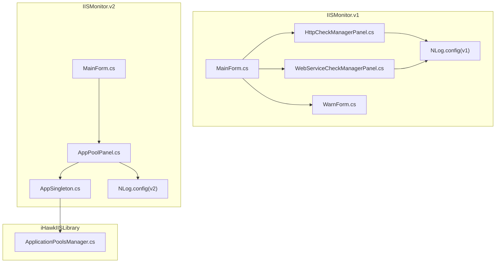
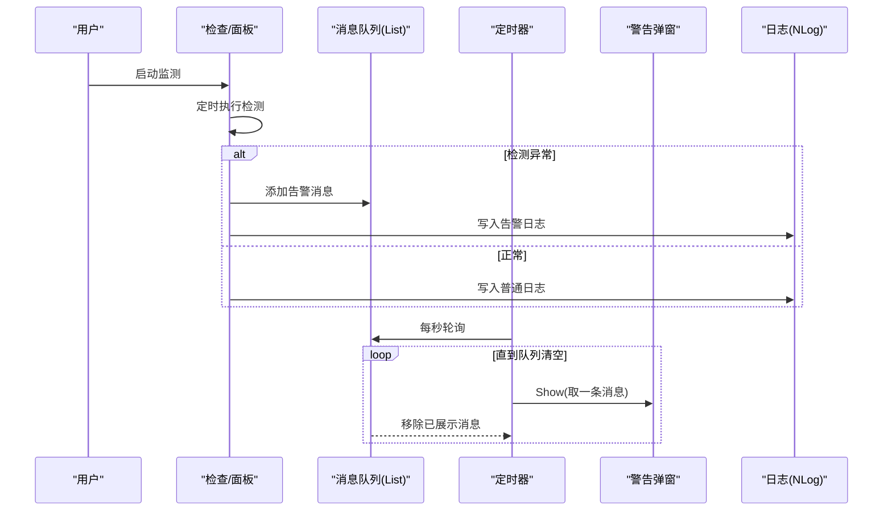
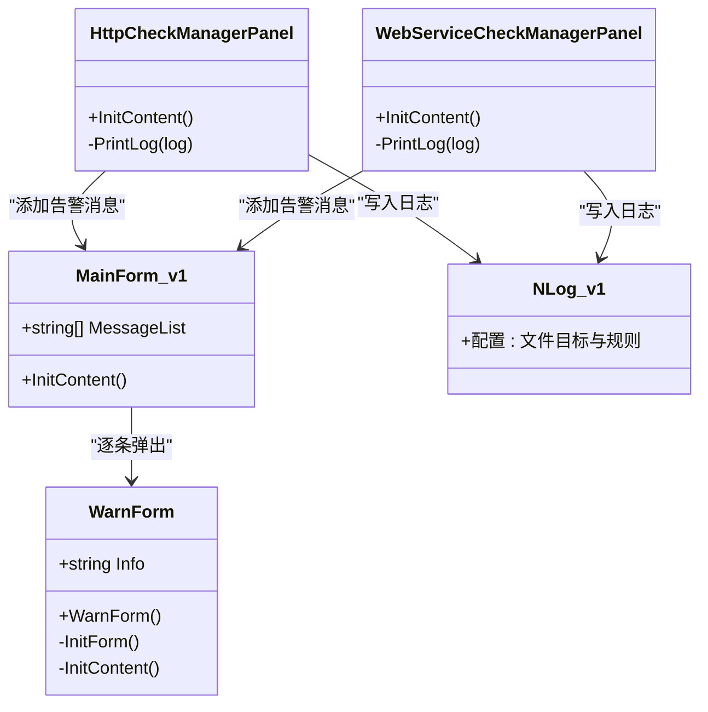
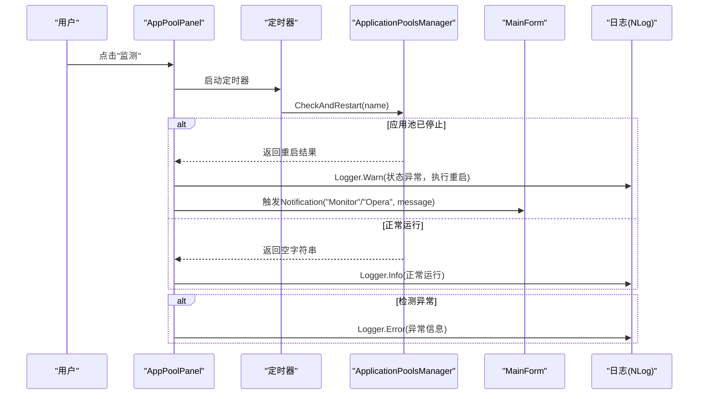
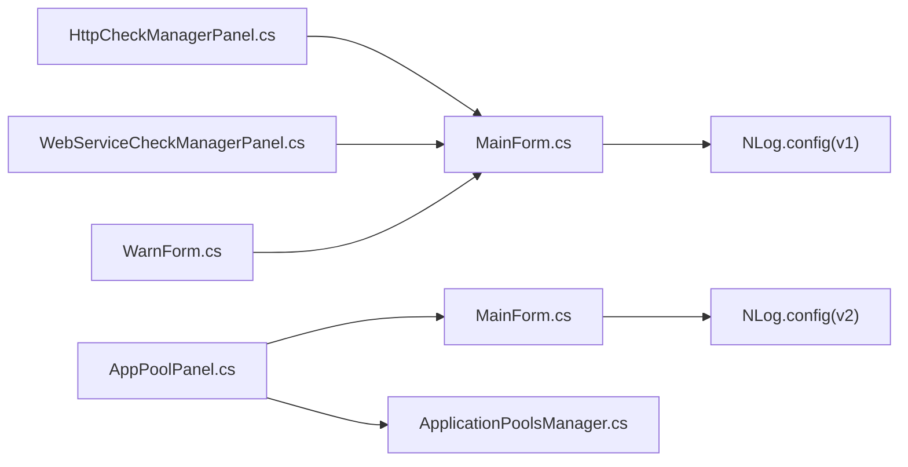

# 警告通知系统

<cite>
**本文引用的文件**
- [IISMonitor.v1/WarnForm.cs](file://IISMonitor.v1/WarnForm.cs)
- [IISMonitor.v1/MainForm.cs](file://IISMonitor.v1/MainForm.cs)
- [IISMonitor.v1/HttpCheckManagement/HttpCheckManagerPanel.cs](file://IISMonitor.v1/HttpCheckManagement/HttpCheckManagerPanel.cs)
- [IISMonitor.v1/WebServiceCheckManagement/WebServiceCheckManagerPanel.cs](file://IISMonitor.v1/WebServiceCheckManagement/WebServiceCheckManagerPanel.cs)
- [IISMonitor.v1/NLog.config](file://IISMonitor.v1/NLog.config)
- [IISMonitor.v2/AppPoolPanel.cs](file://IISMonitor.v2/AppPoolPanel.cs)
- [IISMonitor.v2/MainForm.cs](file://IISMonitor.v2/MainForm.cs)
- [IISMonitor.v2/AppSingleton.cs](file://IISMonitor.v2/AppSingleton.cs)
- [IISMonitor.v2/NLog.config](file://IISMonitor.v2/NLog.config)
- [iHawkIISLibrary/ApplicationPoolsManager.cs](file://iHawkIISLibrary/ApplicationPoolsManager.cs)
- [README.md](file://README.md)
</cite>

## 更新摘要
**变更内容**
- 更新了异常处理机制的详细说明
- 新增了操作日志记录的完整流程
- 增强了监控通知功能的技术细节
- 完善了日志配置和分类标准

## 目录
1. [简介](#简介)
2. [项目结构](#项目结构)
3. [核心组件](#核心组件)
4. [架构总览](#架构总览)
5. [详细组件分析](#详细组件分析)
6. [依赖关系分析](#依赖关系分析)
7. [性能考虑](#性能考虑)
8. [故障排查指南](#故障排查指南)
9. [结论](#结论)
10. [附录](#附录)

## 简介
本文件为警告通知系统的全面功能文档，覆盖以下方面：
- 警告消息生成机制：异常检测算法、触发条件设置与消息分类标准
- 异步消息处理流程：消息队列管理、定时器调度与 UI 线程同步机制
- 警告消息展示方式：弹窗样式、持续时间与关闭机制
- 配置选项：告警级别设置、通知渠道配置与静音时间段管理
- 扩展能力：自定义告警规则、批量处理与历史告警查询方法

系统由两个版本构成：
- v1 版本：基于列表队列与定时器轮询展示警告弹窗，并使用 NLog 输出日志
- v2 版本：通过事件驱动的"通知"机制向主界面输出监控与运维日志，同时使用 NLog 记录

## 项目结构
整体采用模块化组织，按功能域划分管理面板与库组件：
- IISMonitor.v1：包含警告弹窗、主界面与多个检查管理面板（HTTP 检查、Web 服务检查等）
- IISMonitor.v2：包含应用池面板、主界面、单例封装与日志配置
- iHawkIISLibrary：IIS 应用池管理库，提供状态查询与自动重启能力

**图表来源**
- [IISMonitor.v1/MainForm.cs](file://IISMonitor.v1/MainForm.cs#L67-L77)
- [IISMonitor.v1/WarnForm.cs](file://IISMonitor.v1/WarnForm.cs#L17-L25)
- [IISMonitor.v1/HttpCheckManagement/HttpCheckManagerPanel.cs](file://IISMonitor.v1/HttpCheckManagement/HttpCheckManagerPanel.cs#L87-L126)
- [IISMonitor.v1/WebServiceCheckManagement/WebServiceCheckManagerPanel.cs](file://IISMonitor.v1/WebServiceCheckManagement/WebServiceCheckManagerPanel.cs#L110-L134)
- [IISMonitor.v2/MainForm.cs](file://IISMonitor.v2/MainForm.cs#L84-L127)
- [IISMonitor.v2/AppPoolPanel.cs](file://IISMonitor.v2/AppPoolPanel.cs#L32-L54)
- [IISMonitor.v2/AppSingleton.cs](file://IISMonitor.v2/AppSingleton.cs#L9-L12)
- [iHawkIISLibrary/ApplicationPoolsManager.cs](file://iHawkIISLibrary/ApplicationPoolsManager.cs#L127-L138)

**章节来源**
- [README.md](file://README.md#L1-L10)

## 核心组件
- v1 主界面与警告弹窗
  - 主界面维护一个全局消息列表，使用定时器每秒轮询并逐条弹出警告
  - 警告弹窗为固定工具窗口，右下角吸附显示，内容为只读多行文本框
- v2 应用池面板与事件通知
  - 应用池面板内置定时器，周期性调用库函数检测并尝试重启停止的应用池
  - 通过事件将"监控日志"和"运维日志"上报到主界面文本框
- 日志记录
  - v1 使用针对不同检查模块的日志目标与规则
  - v2 使用通用日志目标与规则

**章节来源**
- [IISMonitor.v1/MainForm.cs](file://IISMonitor.v1/MainForm.cs#L33-L77)
- [IISMonitor.v1/WarnForm.cs](file://IISMonitor.v1/WarnForm.cs#L17-L72)
- [IISMonitor.v2/AppPoolPanel.cs](file://IISMonitor.v2/AppPoolPanel.cs#L19-L54)
- [IISMonitor.v1/NLog.config](file://IISMonitor.v1/NLog.config#L31-L54)
- [IISMonitor.v2/NLog.config](file://IISMonitor.v2/NLog.config#L31-L46)

## 架构总览
v1 与 v2 在"生成—传递—展示—记录"的路径上保持一致，差异在于生成来源与传递方式。

**图表来源**
- [IISMonitor.v1/HttpCheckManagement/HttpCheckManagerPanel.cs](file://IISMonitor.v1/HttpCheckManagement/HttpCheckManagerPanel.cs#L87-L126)
- [IISMonitor.v1/WebServiceCheckManagement/WebServiceCheckManagerPanel.cs](file://IISMonitor.v1/WebServiceCheckManagement/WebServiceCheckManagerPanel.cs#L110-L134)
- [IISMonitor.v1/MainForm.cs](file://IISMonitor.v1/MainForm.cs#L67-L77)
- [IISMonitor.v1/NLog.config](file://IISMonitor.v1/NLog.config#L47-L54)

## 详细组件分析

### 组件A：v1 警告弹窗与消息队列
- 弹窗特性
  - 固定工具窗口样式、置顶显示、右下角吸附屏幕边缘
  - 只读多行文本框承载告警内容
- 队列与定时器
  - 全局静态列表作为消息队列
  - 主界面定时器每秒轮询，逐条取出并弹出新弹窗，随后移除该条目
- 触发条件与分类
  - HTTP 检查：响应耗时超过阈值或异常时写入告警队列
  - Web 服务检查：性能计数器数值超过阈值时写入告警队列
  - 日志分类：Info/Warn/Error 三档，分别写入对应日志文件

**图表来源**
- [IISMonitor.v1/MainForm.cs](file://IISMonitor.v1/MainForm.cs#L33-L77)
- [IISMonitor.v1/WarnForm.cs](file://IISMonitor.v1/WarnForm.cs#L17-L72)
- [IISMonitor.v1/HttpCheckManagement/HttpCheckManagerPanel.cs](file://IISMonitor.v1/HttpCheckManagement/HttpCheckManagerPanel.cs#L87-L126)
- [IISMonitor.v1/WebServiceCheckManagement/WebServiceCheckManagerPanel.cs](file://IISMonitor.v1/WebServiceCheckManagement/WebServiceCheckManagerPanel.cs#L110-L134)
- [IISMonitor.v1/NLog.config](file://IISMonitor.v1/NLog.config#L31-L54)

**章节来源**
- [IISMonitor.v1/WarnForm.cs](file://IISMonitor.v1/WarnForm.cs#L17-L72)
- [IISMonitor.v1/MainForm.cs](file://IISMonitor.v1/MainForm.cs#L67-L77)
- [IISMonitor.v1/HttpCheckManagement/HttpCheckManagerPanel.cs](file://IISMonitor.v1/HttpCheckManagement/HttpCheckManagerPanel.cs#L99-L121)
- [IISMonitor.v1/WebServiceCheckManagement/WebServiceCheckManagerPanel.cs](file://IISMonitor.v1/WebServiceCheckManagement/WebServiceCheckManagerPanel.cs#L118-L122)
- [IISMonitor.v1/NLog.config](file://IISMonitor.v1/NLog.config#L47-L54)

### 组件B：v2 应用池面板与事件通知
- 定时检测与自动重启
  - 面板定时器周期调用库函数检测应用池状态，若停止则尝试启动
  - 成功或失败均返回描述性字符串
- 事件通知
  - 将"监控日志"和"运维日志"通过统一事件上报至主界面文本框
  - 主界面根据事件类型区分写入不同日志区域
- 单例封装
  - 通过单例持有 IIS 管理器实例，避免重复创建资源
- **异常处理改进**
  - 增加了 try-catch 块来捕获和记录异常
  - 使用 Logger.Error 记录详细的异常信息

**图表来源**
- [IISMonitor.v2/AppPoolPanel.cs](file://IISMonitor.v2/AppPoolPanel.cs#L32-L54)
- [iHawkIISLibrary/ApplicationPoolsManager.cs](file://iHawkIISLibrary/ApplicationPoolsManager.cs#L127-L138)
- [IISMonitor.v2/MainForm.cs](file://IISMonitor.v2/MainForm.cs#L48-L59)
- [IISMonitor.v2/NLog.config](file://IISMonitor.v2/NLog.config#L43-L46)

**章节来源**
- [IISMonitor.v2/AppPoolPanel.cs](file://IISMonitor.v2/AppPoolPanel.cs#L28-L54)
- [IISMonitor.v2/MainForm.cs](file://IISMonitor.v2/MainForm.cs#L34-L63)
- [IISMonitor.v2/AppSingleton.cs](file://IISMonitor.v2/AppSingleton.cs#L9-L12)
- [iHawkIISLibrary/ApplicationPoolsManager.cs](file://iHawkIISLibrary/ApplicationPoolsManager.cs#L127-L138)
- [IISMonitor.v2/NLog.config](file://IISMonitor.v2/NLog.config#L43-L46)

### 组件C：日志与消息分类
- v1 日志
  - 针对 HTTP 检查与 Web 服务检查分别配置 Info/Warn/Error 目标
  - 日志文件按日期分片命名，便于归档与检索
- v2 日志
  - 通用 Info/Warn/Error 目标，集中记录所有模块日志
  - 支持异常信息的详细记录，包括异常堆栈跟踪

**章节来源**
- [IISMonitor.v1/NLog.config](file://IISMonitor.v1/NLog.config#L31-L54)
- [IISMonitor.v2/NLog.config](file://IISMonitor.v2/NLog.config#L31-L46)

## 依赖关系分析
- v1
  - 主界面依赖警告弹窗；各检查面板依赖主界面的消息队列
  - 日志依赖 NLog 配置
- v2
  - 应用池面板依赖 IIS 管理库；主界面依赖面板事件
  - 日志依赖 NLog 配置

**图表来源**
- [IISMonitor.v1/MainForm.cs](file://IISMonitor.v1/MainForm.cs#L62-L65)
- [IISMonitor.v1/WarnForm.cs](file://IISMonitor.v1/WarnForm.cs#L17-L25)
- [IISMonitor.v2/MainForm.cs](file://IISMonitor.v2/MainForm.cs#L84-L127)
- [IISMonitor.v2/AppPoolPanel.cs](file://IISMonitor.v2/AppPoolPanel.cs#L32-L54)
- [iHawkIISLibrary/ApplicationPoolsManager.cs](file://iHawkIISLibrary/ApplicationPoolsManager.cs#L127-L138)

**章节来源**
- [IISMonitor.v1/MainForm.cs](file://IISMonitor.v1/MainForm.cs#L62-L65)
- [IISMonitor.v2/MainForm.cs](file://IISMonitor.v2/MainForm.cs#L84-L127)

## 性能考虑
- v1
  - 定时器间隔为 1 秒，逐条弹窗，适合低频告警场景
  - 建议在高并发告警时增加去重与限流策略，避免弹窗堆积
- v2
  - 面板定时器默认 1 秒，可按需调整以平衡灵敏度与开销
  - 事件上报为主，日志写入为辅，减少 UI 线程阻塞
  - **异常处理优化**：通过 try-catch 防止异常传播影响系统稳定性

## 故障排查指南
- 警告未弹出
  - 检查主界面定时器是否启用与间隔设置
  - 确认消息队列中是否存在待处理项
- 日志缺失
  - 检查 NLog 配置的目标路径与权限
  - 确认日志级别规则是否匹配当前模块
- 应用池无法重启
  - 检查 IIS 管理权限与服务状态
  - 查看返回的错误信息并定位具体异常
- **异常处理问题**
  - 检查 AppPoolPanel 中的 try-catch 块是否正确捕获异常
  - 查看 NLog 中的异常日志记录是否正常

**章节来源**
- [IISMonitor.v1/MainForm.cs](file://IISMonitor.v1/MainForm.cs#L67-L77)
- [IISMonitor.v1/NLog.config](file://IISMonitor.v1/NLog.config#L31-L54)
- [IISMonitor.v2/NLog.config](file://IISMonitor.v2/NLog.config#L31-L46)
- [iHawkIISLibrary/ApplicationPoolsManager.cs](file://iHawkIISLibrary/ApplicationPoolsManager.cs#L134-L138)

## 结论
- v1 提供了直观的队列+弹窗模式，适合快速告警呈现
- v2 采用事件驱动与库封装，更利于扩展与维护
- **改进后的 v2 版本**：增强了异常处理能力，提供了更详细的操作日志记录，支持监控通知功能
- 建议在生产环境中结合两种模式：v1 用于即时告警，v2 用于后台监控与日志归档

## 附录

### 配置选项与使用建议
- 告警级别设置
  - v1：通过阈值判断（HTTP 耗时、Web 服务计数器）决定写入 Info/Warn
  - v2：通过业务逻辑返回值决定日志级别
- 通知渠道配置
  - v1：弹窗 + 文件日志
  - v2：事件 + 文件日志
- 静音时间段管理
  - 当前版本未实现静音时间段功能，可在主界面定时器或面板定时器中增加时段判断逻辑

**章节来源**
- [IISMonitor.v1/HttpCheckManagement/HttpCheckManagerPanel.cs](file://IISMonitor.v1/HttpCheckManagement/HttpCheckManagerPanel.cs#L99-L107)
- [IISMonitor.v1/WebServiceCheckManagement/WebServiceCheckManagerPanel.cs](file://IISMonitor.v1/WebServiceCheckManagement/WebServiceCheckManagerPanel.cs#L118-L126)
- [IISMonitor.v2/AppPoolPanel.cs](file://IISMonitor.v2/AppPoolPanel.cs#L32-L36)

### 自定义告警规则与批量处理
- 自定义规则
  - 在检查面板中修改阈值与异常分支逻辑
  - 在日志配置中调整规则与目标
- 批量处理
  - v2 中可通过循环遍历应用池列表进行批量监测与重启
  - 建议增加并发控制与错误汇总
- **增强的异常处理**
  - 所有关键操作都增加了异常捕获和记录
  - 提供了更详细的错误信息和上下文

**章节来源**
- [IISMonitor.v2/AppPoolPanel.cs](file://IISMonitor.v2/AppPoolPanel.cs#L32-L62)
- [IISMonitor.v2/MainForm.cs](file://IISMonitor.v2/MainForm.cs#L34-L63)

### 历史告警查询方法
- v1：查看对应模块的日志文件（按日期分片）
- v2：查看通用日志文件（按日期分片）
- **改进的日志记录**
  - v2 版本支持异常堆栈跟踪的详细记录
  - 提供了监控日志和运维日志的分离记录

**章节来源**
- [IISMonitor.v1/NLog.config](file://IISMonitor.v1/NLog.config#L31-L37)
- [IISMonitor.v2/NLog.config](file://IISMonitor.v2/NLog.config#L31-L33)

### 异常处理与监控通知增强功能

#### 异常处理机制
- **v2 版本的异常处理改进**
  - AppPoolPanel 中的 Timer_Tick 方法增加了完整的 try-catch 块
  - 使用 Logger.Error 记录详细的异常信息，包括异常类型和消息
  - 防止异常传播影响整个应用程序的稳定性

#### 操作日志记录
- **v2 版本的日志增强**
  - 使用 NLog 的高级格式化功能，支持异常堆栈跟踪
  - 提供 Info、Warn、Error 三个级别的日志记录
  - 支持日志文件的自动归档和大小限制

#### 监控通知功能
- **事件驱动的通知机制**
  - AppPoolPanel 通过 Notification 事件向主界面发送通知
  - 支持"Monitor"（监控）和"Opera"（运维）两种通知类型
  - 主界面根据通知类型将信息分别显示在不同的日志区域

**章节来源**
- [IISMonitor.v2/AppPoolPanel.cs](file://IISMonitor.v2/AppPoolPanel.cs#L43-L58)
- [IISMonitor.v2/NLog.config](file://IISMonitor.v2/NLog.config#L8-L9)
- [IISMonitor.v2/MainForm.cs](file://IISMonitor.v2/MainForm.cs#L52-L63)