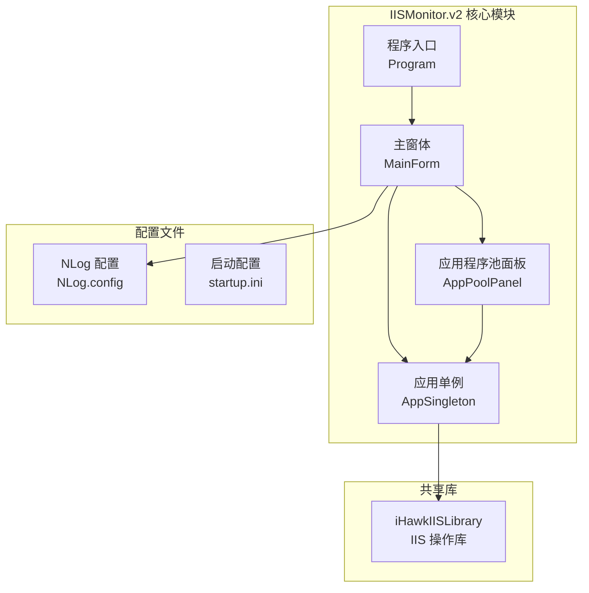
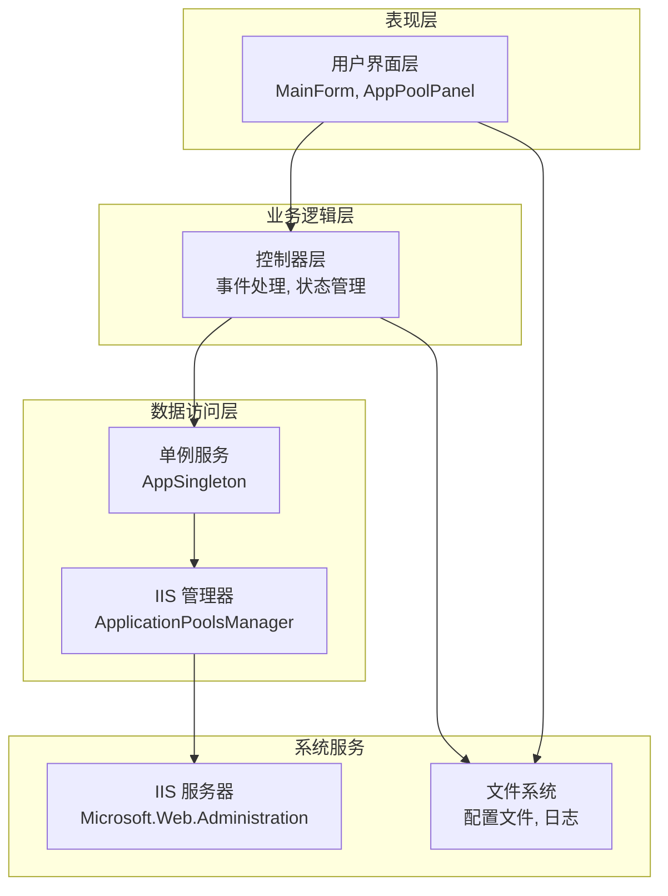
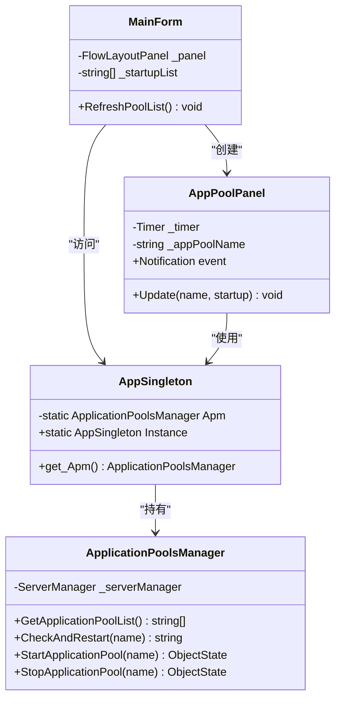
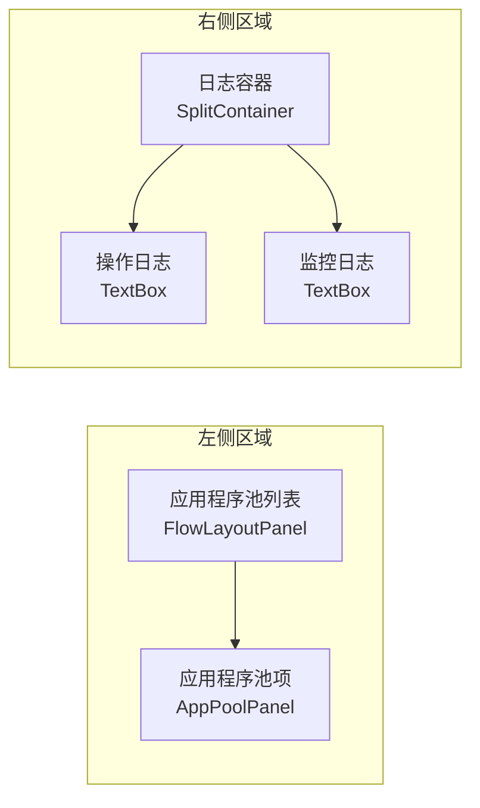
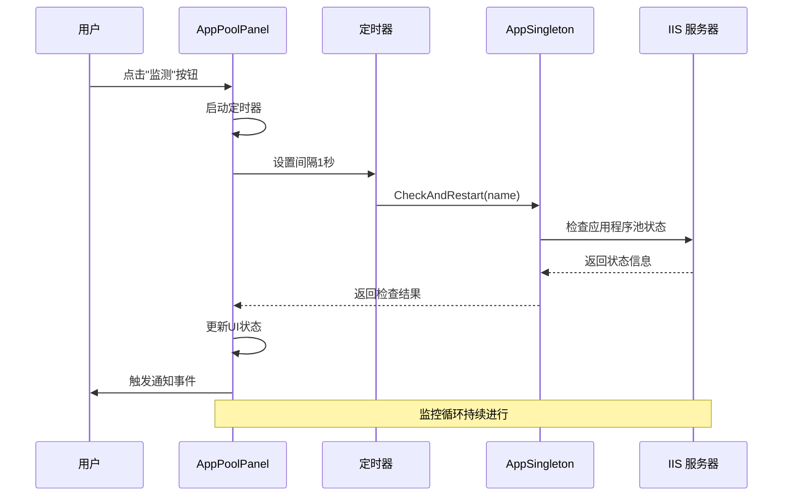
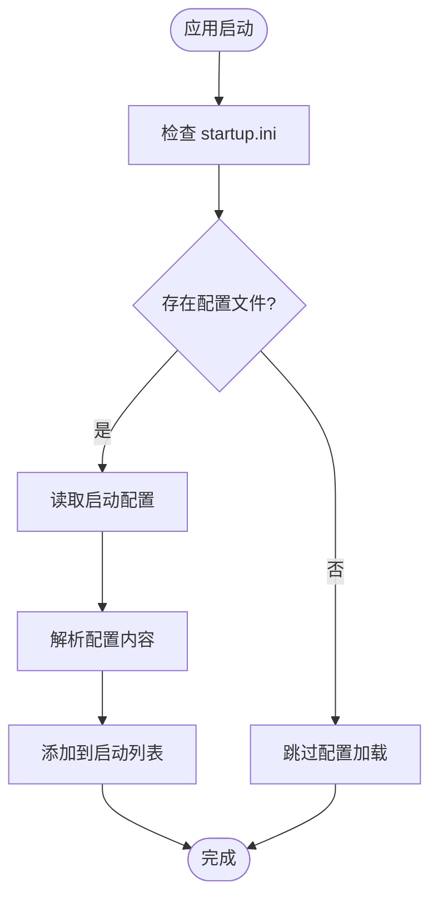
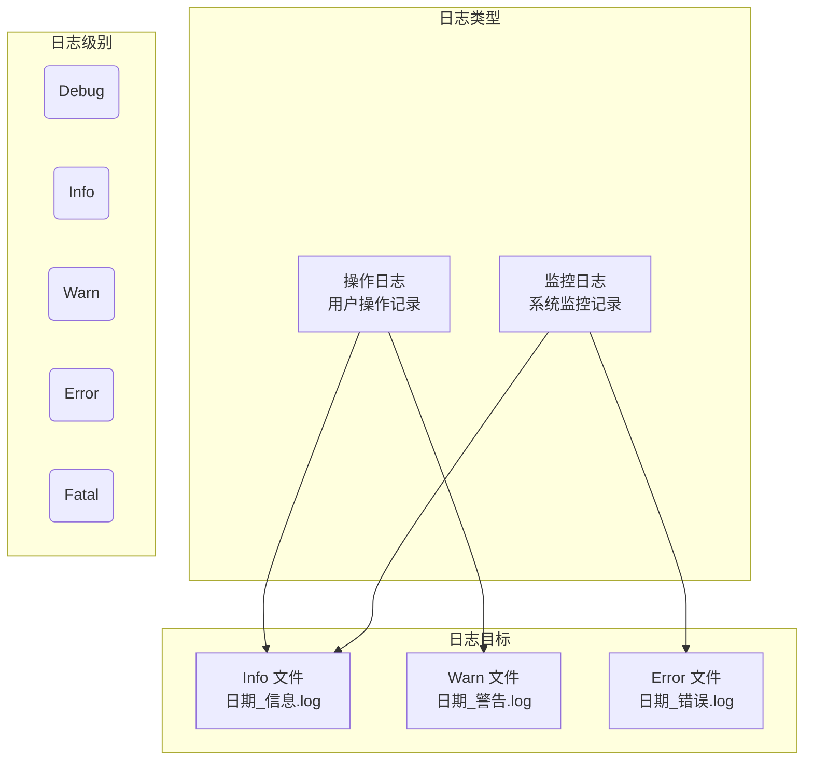
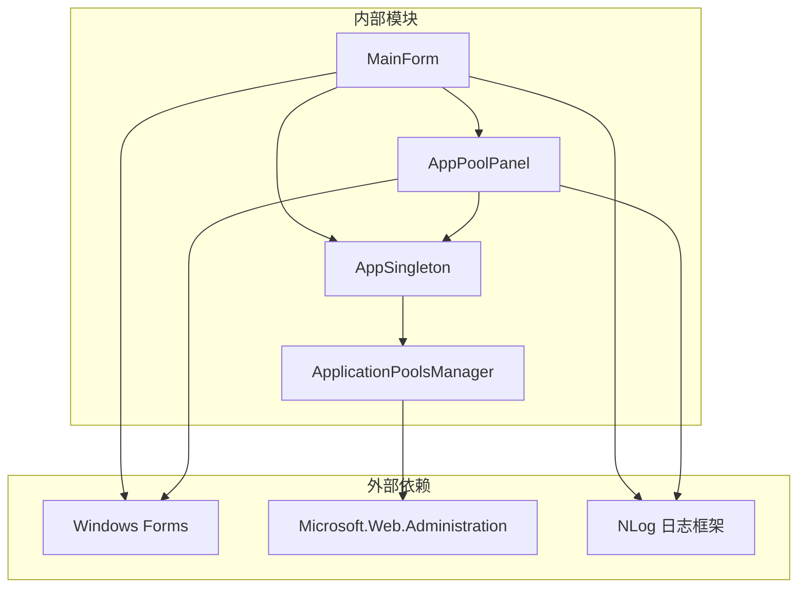

# IISMonitor.v2 功能详解

<cite>
**本文档引用的文件**
- [MainForm.cs](file://IISMonitor.v2/MainForm.cs)
- [AppPoolPanel.cs](file://IISMonitor.v2/AppPoolPanel.cs)
- [AppSingleton.cs](file://IISMonitor.v2/AppSingleton.cs)
- [ApplicationPoolsManager.cs](file://iHawkIISLibrary/ApplicationPoolsManager.cs)
- [Program.cs](file://IISMonitor.v2/Program.cs)
- [NLog.config](file://IISMonitor.v2/NLog.config)
- [startup.ini](file://IISMonitor.v2/startup.ini)
- [IISMonitor.v2.csproj](file://IISMonitor.v2/IISMonitor.v2.csproj)
- [MainForm.Designer.cs](file://IISMonitor.v2/MainForm.Designer.cs)
- [AppPoolPanel.Designer.cs](file://IISMonitor.v2/AppPoolPanel.Designer.cs)
- [MainForm.cs](file://IISMonitor.v1/MainForm.cs)
- [AppPoolCheckManagerPanel.cs](file://IISMonitor.v1/AppPoolCheckManagement/AppPoolCheckManagerPanel.cs)
</cite>

## 目录
1. [简介](#简介)
2. [项目结构](#项目结构)
3. [核心组件](#核心组件)
4. [架构概览](#架构概览)
5. [详细组件分析](#详细组件分析)
6. [依赖关系分析](#依赖关系分析)
7. [性能考虑](#性能考虑)
8. [故障排除指南](#故障排除指南)
9. [版本对比与迁移指南](#版本对比与迁移指南)
10. [结论](#结论)

## 简介

IISMonitor.v2 是一个专为监控和管理 IIS 应用程序池而设计的桌面应用程序。该版本在保持核心功能的同时，采用了更加简洁直观的用户界面设计理念，并通过单例模式优化了进程管理效率。

本版本的核心特色包括：
- **简化界面设计**：采用极简主义设计，专注于核心功能
- **单例模式应用**：通过全局单例管理 IIS 操作
- **实时监控系统**：基于定时器的自动检测机制
- **双通道日志记录**：分离操作日志和监控日志
- **智能启动配置**：支持应用程序池的自动启动管理

## 项目结构

IISMonitor.v2 项目采用模块化架构设计，主要包含以下核心模块：

**图表来源**
- [IISMonitor.v2.csproj](file://IISMonitor.v2/IISMonitor.v2.csproj#L56-L106)

**章节来源**
- [IISMonitor.v2.csproj](file://IISMonitor.v2/IISMonitor.v2.csproj#L1-L109)

## 核心组件

### 主窗体 (MainForm)

主窗体是整个应用程序的控制中心，负责协调各个组件的工作。其核心功能包括：

- **界面初始化**：设置窗口属性、图标和标题
- **面板管理**：动态创建和管理应用程序池面板
- **日志显示**：分离显示操作日志和监控日志
- **配置加载**：读取启动配置文件

### 应用程序池面板 (AppPoolPanel)

每个应用程序池面板代表一个独立的监控单元，具备以下特性：

- **独立监控**：每个面板拥有自己的定时器
- **状态指示**：通过按钮颜色变化显示监控状态
- **事件通知**：向主窗体报告监控结果
- **用户交互**：提供启动/停止监控的控制按钮

### 应用单例 (AppSingleton)

单例模式的核心实现，确保整个应用程序只存在一个 IIS 操作实例：

- **全局访问**：提供静态访问点
- **资源共享**：避免重复创建 ServerManager 实例
- **生命周期管理**：统一管理 IIS 连接

**章节来源**
- [MainForm.cs](file://IISMonitor.v2/MainForm.cs#L12-L131)
- [AppPoolPanel.cs](file://IISMonitor.v2/AppPoolPanel.cs#L7-L105)
- [AppSingleton.cs](file://IISMonitor.v2/AppSingleton.cs#L9-L13)

## 架构概览

IISMonitor.v2 采用了分层架构设计，实现了清晰的关注点分离：

**图表来源**
- [MainForm.cs](file://IISMonitor.v2/MainForm.cs#L35-L81)
- [AppPoolPanel.cs](file://IISMonitor.v2/AppPoolPanel.cs#L28-L74)
- [ApplicationPoolsManager.cs](file://iHawkIISLibrary/ApplicationPoolsManager.cs#L11-L25)

## 详细组件分析

### 单例模式实现

单例模式在 IISMonitor.v2 中的应用体现了良好的设计原则：

**图表来源**
- [AppSingleton.cs](file://IISMonitor.v2/AppSingleton.cs#L9-L13)
- [ApplicationPoolsManager.cs](file://iHawkIISLibrary/ApplicationPoolsManager.cs#L11-L25)
- [MainForm.cs](file://IISMonitor.v2/MainForm.cs#L35-L63)
- [AppPoolPanel.cs](file://IISMonitor.v2/AppPoolPanel.cs#L28-L55)

#### 单例模式的优势

1. **资源优化**：避免重复创建 IIS 连接，节省系统资源
2. **一致性保证**：确保所有组件使用相同的 IIS 管理实例
3. **简化接口**：提供统一的访问点，降低使用复杂度
4. **线程安全**：静态单例天然避免了多实例竞争问题

#### 实现细节

- **延迟初始化**：在首次访问时才创建 ApplicationPoolsManager 实例
- **静态访问**：通过 AppSingleton.Apm 直接访问
- **生命周期管理**：ApplicationPoolsManager 实现 IDisposable 接口

### 主界面布局与功能组织

主界面采用了左右分区的设计理念：

**图表来源**
- [MainForm.cs](file://IISMonitor.v2/MainForm.cs#L84-L127)

#### 布局特点

1. **左侧列表区**：显示所有可用的应用程序池
2. **右侧日志区**：分离的操作日志和监控日志
3. **动态添加**：运行时根据 IIS 配置动态生成面板
4. **响应式设计**：支持窗口大小调整

#### 功能组织

- **应用程序池面板**：每个面板独立管理一个应用程序池
- **监控状态**：通过按钮颜色直观显示监控状态
- **事件驱动**：基于事件通知实现松耦合通信

### 应用程序池面板实现

每个应用程序池面板都是一个完整的监控单元：

**图表来源**
- [AppPoolPanel.cs](file://IISMonitor.v2/AppPoolPanel.cs#L32-L38)
- [ApplicationPoolsManager.cs](file://iHawkIISLibrary/ApplicationPoolsManager.cs#L127-L138)

#### 状态管理机制

1. **定时监控**：每秒检查一次应用程序池状态
2. **自动重启**：发现停止状态时自动尝试重启
3. **状态反馈**：通过颜色变化直观显示当前状态
4. **事件通知**：向主窗体报告监控结果

### 配置文件管理

系统支持多种配置文件来满足不同的使用需求：

**图表来源**
- [MainForm.cs](file://IISMonitor.v2/MainForm.cs#L67-L77)

#### 配置文件格式

- **文件名**：startup.ini
- **编码**：Unicode
- **格式**：每行一个应用程序池名称
- **用途**：指定默认启动监控的应用程序池

### 日志记录系统

IISMonitor.v2 实现了双通道日志记录系统：

**图表来源**
- [NLog.config](file://IISMonitor.v2/NLog.config#L31-L46)

#### 日志配置特点

- **按级别分类**：不同级别的日志写入不同文件
- **自动轮转**：基于日期的文件命名策略
- **异步写入**：避免阻塞主应用程序
- **可配置性**：支持通过配置文件调整日志行为

**章节来源**
- [MainForm.cs](file://IISMonitor.v2/MainForm.cs#L48-L59)
- [NLog.config](file://IISMonitor.v2/NLog.config#L1-L48)

## 依赖关系分析

IISMonitor.v2 的依赖关系体现了清晰的层次结构：

**图表来源**
- [IISMonitor.v2.csproj](file://IISMonitor.v2/IISMonitor.v2.csproj#L38-L55)
- [ApplicationPoolsManager.cs](file://iHawkIISLibrary/ApplicationPoolsManager.cs#L1-L10)

### 外部依赖

- **Microsoft.Web.Administration**：IIS 管理的核心库
- **Windows Forms**：用户界面框架
- **NLog**：日志记录框架

### 内部依赖

- **MainForm** 依赖于 **AppPoolPanel** 和 **AppSingleton**
- **AppPoolPanel** 依赖于 **AppSingleton**
- **AppSingleton** 依赖于 **ApplicationPoolsManager**

**章节来源**
- [IISMonitor.v2.csproj](file://IISMonitor.v2/IISMonitor.v2.csproj#L103-L106)

## 性能考虑

### 资源管理

1. **连接池优化**：单例模式避免了重复创建 IIS 连接
2. **内存管理**：及时释放定时器和事件处理器
3. **UI 线程优化**：避免长时间操作阻塞用户界面

### 监控效率

1. **定时器粒度**：1 秒间隔平衡了响应性和性能
2. **批量更新**：UI 更新采用异步方式
3. **错误处理**：异常不影响整体监控流程

### 扩展性设计

1. **模块化架构**：易于添加新的监控功能
2. **事件驱动**：支持插件化的通知机制
3. **配置驱动**：通过配置文件调整行为

## 故障排除指南

### 常见问题及解决方案

#### IIS 连接问题

**症状**：应用程序池列表为空或显示错误

**可能原因**：
- IIS 服务未启动
- 权限不足
- .NET Framework 版本不兼容

**解决步骤**：
1. 确认 IIS 服务正常运行
2. 以管理员权限运行应用程序
3. 检查 .NET Framework 4.7.2 是否已安装

#### 监控功能异常

**症状**：监控按钮无法点击或状态不更新

**可能原因**：
- 定时器冲突
- 事件处理异常
- UI 线程阻塞

**解决步骤**：
1. 检查应用程序日志
2. 重启应用程序
3. 清理临时文件

#### 日志记录问题

**症状**：日志文件未生成或无法写入

**可能原因**：
- 日志目录权限不足
- 磁盘空间不足
- 文件被其他程序占用

**解决步骤**：
1. 检查日志目录权限
2. 确保磁盘空间充足
3. 关闭占用日志文件的程序

**章节来源**
- [ApplicationPoolsManager.cs](file://iHawkIISLibrary/ApplicationPoolsManager.cs#L127-L138)
- [NLog.config](file://IISMonitor.v2/NLog.config#L31-L46)

## 版本对比与迁移指南

### v1 与 v2 的功能差异

| 特性 | IISMonitor.v1 | IISMonitor.v2 |
|------|---------------|---------------|
| **界面设计** | 多标签页复杂界面 | 简洁列表式界面 |
| **监控方式** | 手动触发监控 | 自动定时监控 |
| **配置管理** | 内置配置界面 | 外部配置文件 |
| **日志系统** | 弹窗提示 | 分离日志文件 |
| **扩展性** | 功能集成 | 模块化设计 |

### 使用场景对比

#### IISMonitor.v1 适用场景

- 需要多种监控类型的综合管理
- 需要复杂的配置界面
- 需要实时的弹窗提醒
- 需要与其他管理功能集成

#### IISMonitor.v2 适用场景

- 专注于应用程序池监控
- 需要简洁直观的用户界面
- 需要长期稳定的后台监控
- 需要详细的日志记录

### 迁移建议

#### 从 v1 迁移到 v2

1. **评估监控需求**
   - 确定是否只需要应用程序池监控
   - 评估是否需要 v1 的其他功能

2. **准备迁移环境**
   - 备份 v1 的配置和数据
   - 准备启动配置文件 (startup.ini)

3. **执行迁移步骤**
   - 安装 v2 应用程序
   - 配置应用程序池监控列表
   - 测试监控功能

4. **验证迁移结果**
   - 确认所有应用程序池都被正确监控
   - 验证日志记录功能
   - 测试自动重启功能

#### 数据迁移注意事项

- **配置文件**：v2 使用 startup.ini 替代内置配置
- **日志格式**：v2 采用文件日志替代弹窗提示
- **监控范围**：v2 专注于应用程序池监控

### 决策依据

#### 选择 IISMonitor.v2 的理由

1. **简化使用**：更直观的用户界面
2. **稳定可靠**：经过优化的监控机制
3. **易于维护**：清晰的代码结构和配置
4. **性能优异**：高效的资源利用

#### 选择 IISMonitor.v1 的理由

1. **功能丰富**：支持多种监控类型
2. **界面灵活**：可定制的界面布局
3. **实时提醒**：弹窗式的即时通知
4. **集成性强**：与其他管理功能整合

**章节来源**
- [MainForm.cs](file://IISMonitor.v1/MainForm.cs#L48-L77)
- [AppPoolCheckManagerPanel.cs](file://IISMonitor.v1/AppPoolCheckManagement/AppPoolCheckManagerPanel.cs#L43-L105)

## 结论

IISMonitor.v2 通过精心设计的简化界面和高效的单例模式，在保持核心功能的同时显著提升了用户体验和系统性能。其模块化架构为未来的功能扩展奠定了良好基础。

### 主要优势

1. **设计理念先进**：简洁至上，专注核心功能
2. **技术实现优秀**：单例模式确保资源高效利用
3. **用户体验优良**：直观的界面设计和清晰的状态反馈
4. **维护成本低**：清晰的代码结构和完善的日志系统

### 发展前景

IISMonitor.v2 为后续版本的功能扩展提供了良好的技术基础，包括：
- 支持更多类型的监控对象
- 增强告警通知机制
- 提供更丰富的报表功能
- 支持远程监控管理

对于需要稳定可靠的 IIS 应用程序池监控解决方案的用户，IISMonitor.v2 是理想的选择。而对于需要综合管理功能的高级用户，IISMonitor.v1 仍然是一个优秀的替代方案。