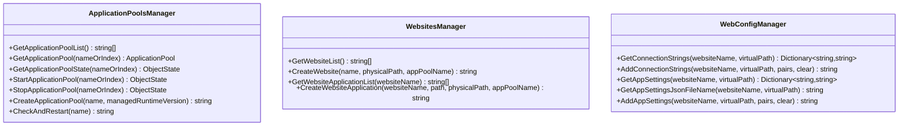

# 开发者指南

<cite>
**本文引用的文件**   
- [IISMonitor.sln](file://IISMonitor.sln)
- [README.md](file://README.md)
- [iHawkIISLibrary.csproj](file://iHawkIISLibrary\iHawkIISLibrary.csproj)
- [ApplicationPoolsManager.cs](file://iHawkIISLibrary\ApplicationPoolsManager.cs)
- [WebsitesManager.cs](file://iHawkIISLibrary\WebsitesManager.cs)
- [WebConfigManager.cs](file://iHawkIISLibrary\WebConfigManager.cs)
- [IISMonitor.v1.csproj](file://IISMonitor.v1\IISMonitor.v1.csproj)
- [MainForm.cs（v1）](file://IISMonitor.v1\MainForm.cs)
- [IISMonitor.v2.csproj](file://IISMonitor.v2\IISMonitor.v2.csproj)
- [MainForm.cs（v2）](file://IISMonitor.v2\MainForm.cs)
- [AppSingleton.cs](file://IISMonitor.v2\AppSingleton.cs)
- [ProcessProtector.csproj](file://ProcessProtector\ProcessProtector.csproj)
- [MainForm.cs（进程守护器）](file://ProcessProtector\MainForm.cs)
- [ProcessPanel.cs](file://ProcessProtector\ProcessPanel.cs)
- [Deployer.csproj](file://Deployer\Deployer.csproj)
- [MainForm.cs（部署器）](file://Deployer\MainForm.cs)
- [deployconfig.json](file://Deployer\deployconfig.json)
- [DeployModule.cs](file://Deployer\Modules\DeployModule.cs)
- [AppSettingModule.cs](file://Deployer\Modules\AppSettingModule.cs)
- [ConnectionStringModule.cs](file://Deployer\Modules\ConnectionStringModule.cs)
</cite>

## 目录
1. [简介](#简介)
2. [项目结构](#项目结构)
3. [核心组件](#核心组件)
4. [架构总览](#架构总览)
5. [详细组件分析](#详细组件分析)
6. [依赖关系分析](#依赖关系分析)
7. [性能与可维护性建议](#性能与可维护性建议)
8. [调试与测试策略](#调试与测试策略)
9. [构建与发布流程](#构建与发布流程)
10. [编码规范与注释标准](#编码规范与注释标准)
11. [模块化设计与扩展点](#模块化设计与扩展点)
12. [新功能开发指导与最佳实践](#新功能开发指导与最佳实践)
13. [代码审查要点与质量保证](#代码审查要点与质量保证)
14. [贡献者参与指南](#贡献者参与指南)
15. [故障排查指南](#故障排查指南)
16. [结论](#结论)

## 简介
本指南面向IISMonitor项目的开发者，系统阐述项目结构、模块职责、依赖关系、编码规范、调试与测试策略、构建流程、扩展点与最佳实践，并提供代码审查与质量保证流程，帮助贡献者高效参与开发。

## 项目结构
项目采用多项目解决方案组织，包含IIS操作库与多个桌面应用子项目：
- iHawkIISLibrary：IIS操作类库，封装应用程序池、网站与web.config管理能力
- IISMonitor.v1：基于多标签页的监控界面（HTTP检查、应用池检查、WebService检查、发布管理）
- IISMonitor.v2：以“面板+日志”的轻量化监控界面，支持应用池列表展示与日志分层
- Deployer：部署工具，支持解压包、创建应用池、创建应用、写入配置等
- ProcessProtector：进程守护器，支持多种守护策略（立即重启、延迟重启、执行脚本后重启）

图表来源
- [IISMonitor.sln](file://IISMonitor.sln#L1-L62)
- [iHawkIISLibrary.csproj](file://iHawkIISLibrary\iHawkIISLibrary.csproj#L1-L63)
- [IISMonitor.v1.csproj](file://IISMonitor.v1\IISMonitor.v1.csproj#L1-L147)
- [IISMonitor.v2.csproj](file://IISMonitor.v2\IISMonitor.v2.csproj#L1-L109)
- [Deployer.csproj](file://Deployer\Deployer.csproj#L1-L148)
- [ProcessProtector.csproj](file://ProcessProtector\ProcessProtector.csproj#L1-L109)

章节来源
- [IISMonitor.sln](file://IISMonitor.sln#L1-L62)
- [README.md](file://README.md#L1-L10)

## 核心组件
- iHawkIISLibrary
  - ApplicationPoolsManager：封装IIS应用程序池的查询、启停、创建、状态检测
  - WebsitesManager：封装网站与应用的查询、创建
  - WebConfigManager：封装web.config中connectionStrings与appSettings的读取与写入，以及appsettings.json路径解析
- IISMonitor.v1
  - 多标签页界面，分别承载HTTP检查、应用池检查、WebService检查、发布管理
- IISMonitor.v2
  - 流式面板展示应用池，支持日志分层显示（监控日志/操作日志），通过单例访问IIS库
- Deployer
  - 部署流程：解压包 -> 创建应用池 -> 创建应用 -> 写入配置（预留）
  - 提供“应用设置”“连接串”管理模块
- ProcessProtector
  - 进程守护面板，支持三种策略：立即重启、延迟重启、执行脚本后重启

章节来源
- [ApplicationPoolsManager.cs](file://iHawkIISLibrary\ApplicationPoolsManager.cs#L1-L143)
- [WebsitesManager.cs](file://iHawkIISLibrary\WebsitesManager.cs#L1-L94)
- [WebConfigManager.cs](file://iHawkIISLibrary\WebConfigManager.cs#L1-L157)
- [MainForm.cs（v1）](file://IISMonitor.v1\MainForm.cs#L1-L82)
- [MainForm.cs（v2）](file://IISMonitor.v2\MainForm.cs#L1-L131)
- [AppSingleton.cs](file://IISMonitor.v2\AppSingleton.cs#L1-L14)
- [MainForm.cs（部署器）](file://Deployer\MainForm.cs#L1-L78)
- [DeployModule.cs](file://Deployer\Modules\DeployModule.cs#L1-L204)
- [AppSettingModule.cs](file://Deployer\Modules\AppSettingModule.cs#L1-L246)
- [ConnectionStringModule.cs](file://Deployer\Modules\ConnectionStringModule.cs#L1-L182)
- [MainForm.cs（进程守护器）](file://ProcessProtector\MainForm.cs#L1-L187)
- [ProcessPanel.cs](file://ProcessProtector\ProcessPanel.cs#L1-L231)

## 架构总览
整体采用“库-应用”分层：
- iHawkIISLibrary为所有上层应用提供统一的IIS操作接口
- v1/v2作为UI层，负责界面交互与业务编排
- Deployer与ProcessProtector作为独立工具，复用IIS库能力

图表来源
- [IISMonitor.v1.csproj](file://IISMonitor.v1\IISMonitor.v1.csproj#L129-L137)
- [IISMonitor.v2.csproj](file://IISMonitor.v2\IISMonitor.v2.csproj#L102-L106)
- [Deployer.csproj](file://Deployer\Deployer.csproj#L134-L145)
- [iHawkIISLibrary.csproj](file://iHawkIISLibrary\iHawkIISLibrary.csproj#L1-L63)

## 详细组件分析

### IIS操作库（iHawkIISLibrary）
- ApplicationPoolsManager
  - 负责应用程序池的枚举、启停、创建、状态检测与异常处理
  - 使用ServerManager进行IIS配置变更，调用CommitChanges提交
- WebsitesManager
  - 支持网站与应用的枚举、创建，以及应用池绑定
- WebConfigManager
  - 支持读取/写入connectionStrings与appSettings；支持解析appsettings.json物理路径

图表来源
- [ApplicationPoolsManager.cs](file://iHawkIISLibrary\ApplicationPoolsManager.cs#L1-L143)
- [WebsitesManager.cs](file://iHawkIISLibrary\WebsitesManager.cs#L1-L94)
- [WebConfigManager.cs](file://iHawkIISLibrary\WebConfigManager.cs#L1-L157)

章节来源
- [ApplicationPoolsManager.cs](file://iHawkIISLibrary\ApplicationPoolsManager.cs#L1-L143)
- [WebsitesManager.cs](file://iHawkIISLibrary\WebsitesManager.cs#L1-L94)
- [WebConfigManager.cs](file://iHawkIISLibrary\WebConfigManager.cs#L1-L157)

### IISMonitor.v2 主窗体与单例
- MainForm负责布局与事件驱动，通过AppSingleton访问IIS库
- 刷新应用池列表，逐个生成AppPoolPanel并订阅通知事件，分别写入监控日志与操作日志

图表来源
- [MainForm.cs（v2）](file://IISMonitor.v2\MainForm.cs#L1-L131)
- [AppSingleton.cs](file://IISMonitor.v2\AppSingleton.cs#L1-L14)
- [ApplicationPoolsManager.cs](file://iHawkIISLibrary\ApplicationPoolsManager.cs#L1-L143)

章节来源
- [MainForm.cs（v2）](file://IISMonitor.v2\MainForm.cs#L1-L131)
- [AppSingleton.cs](file://IISMonitor.v2\AppSingleton.cs#L1-L14)

### Deployer 部署流程
- 从deployconfig.json加载部署配置
- 后台任务顺序执行：解压包 -> 创建应用池 -> 创建应用 -> 写入配置（预留）
- 提供“应用设置”“连接串”管理模块，支持树形选择目标虚拟路径并批量写入

图表来源
- [DeployModule.cs](file://Deployer\Modules\DeployModule.cs#L1-L204)
- [deployconfig.json](file://Deployer\deployconfig.json#L1-L8)

章节来源
- [MainForm.cs（部署器）](file://Deployer\MainForm.cs#L1-L78)
- [DeployModule.cs](file://Deployer\Modules\DeployModule.cs#L1-L204)
- [deployconfig.json](file://Deployer\deployconfig.json#L1-L8)

### 进程守护器（ProcessProtector）
- MainForm提供工具栏与标签页容器，动态添加ProcessPanel
- ProcessPanel支持三种守护策略：立即重启、延迟重启、执行脚本后重启
- 通过定时器周期检测进程存在性，触发相应策略

图表来源
- [ProcessPanel.cs](file://ProcessProtector\ProcessPanel.cs#L1-L231)

章节来源
- [MainForm.cs（进程守护器）](file://ProcessProtector\MainForm.cs#L1-L187)
- [ProcessPanel.cs](file://ProcessProtector\ProcessPanel.cs#L1-L231)

## 依赖关系分析
- v1/v2均引用iHawkIISLibrary
- Deployer同时引用iHawkIISLibrary与iHawkApp相关项目（控制台与库）
- ProcessProtector为独立应用，不依赖IIS库

图表来源
- [IISMonitor.v1.csproj](file://IISMonitor.v1\IISMonitor.v1.csproj#L129-L137)
- [IISMonitor.v2.csproj](file://IISMonitor.v2\IISMonitor.v2.csproj#L102-L106)
- [Deployer.csproj](file://Deployer\Deployer.csproj#L134-L145)
- [ProcessProtector.csproj](file://ProcessProtector\ProcessProtector.csproj#L1-L109)

章节来源
- [IISMonitor.v1.csproj](file://IISMonitor.v1\IISMonitor.v1.csproj#L129-L137)
- [IISMonitor.v2.csproj](file://IISMonitor.v2\IISMonitor.v2.csproj#L102-L106)
- [Deployer.csproj](file://Deployer\Deployer.csproj#L134-L145)
- [ProcessProtector.csproj](file://ProcessProtector\ProcessProtector.csproj#L1-L109)

## 性能与可维护性建议
- IIS操作涉及远程配置变更，应避免频繁调用，合并批处理操作（如批量创建应用池/应用）
- 日志输出建议异步化，避免阻塞UI线程
- 对IIS配置读取/写入增加重试与幂等判断，提升健壮性
- 将配置项集中管理，减少硬编码

[本节为通用建议，无需列出章节来源]

## 调试与测试策略
- 单元测试
  - 对WebConfigManager的配置读写方法进行参数化测试，覆盖空值、非法键、JSON文件存在与否等场景
  - 对ApplicationPoolsManager的状态转换与异常分支进行断言
- 集成测试
  - 在受控环境验证Deployer的部署流程（解压、创建应用池、创建应用、写入配置）
  - 验证ProcessPanel在不同策略下的进程生命周期行为
- UI测试
  - 使用自动化框架对MainForm的关键交互（切换标签页、点击按钮、输入校验）进行回归测试
- 调试技巧
  - 使用NuGet包管理器还原依赖后再调试
  - 在IIS操作前后记录关键状态，便于定位异常

[本节为通用建议，无需列出章节来源]

## 构建与发布流程
- 使用Visual Studio打开IISMonitor.sln，选择目标平台（Any CPU）与配置（Debug/Release）
- 先构建iHawkIISLibrary，再构建各应用项目
- 发布前确保packages.config已还原，第三方依赖（如NLog、Microsoft.Web.Administration）可用
- 部署器与进程守护器可独立打包，注意资源文件与配置文件（如NLog.config、startup.ini、deployconfig.json）随包部署

章节来源
- [IISMonitor.sln](file://IISMonitor.sln#L1-L62)
- [IISMonitor.v1.csproj](file://IISMonitor.v1\IISMonitor.v1.csproj#L1-L147)
- [IISMonitor.v2.csproj](file://IISMonitor.v2\IISMonitor.v2.csproj#L1-L109)
- [Deployer.csproj](file://Deployer\Deployer.csproj#L1-L148)
- [ProcessProtector.csproj](file://ProcessProtector\ProcessProtector.csproj#L1-L109)

## 编码规范与注释标准
- 命名约定
  - 类名：PascalCase（如ApplicationPoolsManager）
  - 方法名：PascalCase（如GetApplicationPoolList）
  - 字段/属性：camelCase（如_appPoolName）
  - 常量：UPPER_SNAKE_CASE（如CONFIG_FILE_NAME）
- 注释规范
  - 类/方法需提供中文XML注释，说明用途、参数、返回值与异常
  - 关键逻辑处添加简要行内注释，解释边界条件与特殊处理
- 错误处理
  - IIS操作捕获异常并返回明确的错误信息字符串，避免抛出未处理异常
  - UI层对异常信息进行友好提示，避免泄露内部细节
- 文件与资源
  - 配置文件（如NLog.config、startup.ini、deployconfig.json）置于输出目录，随包部署
  - 图标、资源文件通过嵌入资源管理，避免路径问题

章节来源
- [ApplicationPoolsManager.cs](file://iHawkIISLibrary\ApplicationPoolsManager.cs#L1-L143)
- [WebConfigManager.cs](file://iHawkIISLibrary\WebConfigManager.cs#L1-L157)
- [DeployModule.cs](file://Deployer\Modules\DeployModule.cs#L1-L204)
- [ProcessPanel.cs](file://ProcessProtector\ProcessPanel.cs#L1-L231)

## 模块化设计与扩展点
- IIS操作库模块化
  - 将IIS操作抽象为独立库，UI层仅负责展示与调度，便于替换实现与扩展
- 部署器模块化
  - DeployModule拆分为解压、创建应用池、创建应用、写配置等步骤，便于扩展新步骤
  - AppSettingModule/ConnectionStringModule通过树形选择目标路径，支持批量写入
- 进程守护器模块化
  - ProcessPanel将策略封装为StrategyItem，便于新增策略类型
- 扩展点建议
  - IIS操作库：新增站点/绑定/证书等管理器
  - 部署器：新增“连接数据库建库/建表”步骤、支持更多配置格式（YAML/TOML）
  - 进程守护器：新增“健康检查”策略、邮件/消息通知

章节来源
- [DeployModule.cs](file://Deployer\Modules\DeployModule.cs#L1-L204)
- [AppSettingModule.cs](file://Deployer\Modules\AppSettingModule.cs#L1-L246)
- [ConnectionStringModule.cs](file://Deployer\Modules\ConnectionStringModule.cs#L1-L182)
- [ProcessPanel.cs](file://ProcessProtector\ProcessPanel.cs#L1-L231)

## 新功能开发指导与最佳实践
- 设计先行
  - 明确需求与边界，评估对IIS库的影响范围
  - 优先在iHawkIISLibrary中扩展能力，保持UI层薄逻辑
- 分步实现
  - 先实现库能力，再在UI中集成调用
  - 为关键流程编写单元测试与集成测试
- 可观测性
  - 为每个操作记录日志，包含输入参数、执行结果与耗时
  - UI层提供进度反馈与错误提示
- 安全与权限
  - IIS操作需要管理员权限，应在启动时检测并提示
  - 部署器写入配置时避免覆盖生产敏感数据

[本节为通用指导，无需列出章节来源]

## 代码审查要点与质量保证
- 代码结构
  - 是否遵循单一职责与高内聚低耦合
  - 是否存在重复逻辑，是否可抽取为公共方法或类
- 异常与健壮性
  - 是否对IIS操作进行异常捕获与降级处理
  - 是否对输入参数进行校验与边界检查
- 可测试性
  - 是否具备良好的可测试性（依赖注入、接口隔离）
  - 是否有充分的单元测试与集成测试覆盖
- 文档与注释
  - XML注释是否完整、准确
  - 关键逻辑是否有必要注释
- 性能与资源
  - 是否避免频繁IIS操作
  - 是否及时释放ServerManager等资源

[本节为通用要求，无需列出章节来源]

## 贡献者参与指南
- 环境准备
  - 安装Visual Studio与.NET Framework 4.7.2
  - 通过NuGet还原packages.config中的依赖
- 提交流程
  - Fork仓库 -> 新建分支 -> 提交代码 -> 发起Pull Request
  - PR需附带测试用例与变更说明
- 提交规范
  - 提交信息清晰描述变更内容与动机
  - 修改尽量小而聚焦，避免无关格式化改动
- 代码评审
  - 至少一名维护者评审通过后方可合并
  - 评审关注点：正确性、可维护性、性能与安全性

[本节为通用流程，无需列出章节来源]

## 故障排查指南
- IIS操作失败
  - 检查IIS服务状态与权限（需管理员）
  - 查看IIS库返回的错误信息字符串，定位具体失败步骤
- 部署器无法写入配置
  - 确认deployconfig.json路径与字段有效
  - 检查目标网站与应用是否存在
- 进程守护器无效
  - 确认策略配置（立即/延迟/脚本）
  - 检查进程名是否正确，路径是否存在
- UI卡顿
  - 将耗时操作移至后台线程，避免阻塞主线程

章节来源
- [ApplicationPoolsManager.cs](file://iHawkIISLibrary\ApplicationPoolsManager.cs#L1-L143)
- [WebsitesManager.cs](file://iHawkIISLibrary\WebsitesManager.cs#L1-L94)
- [WebConfigManager.cs](file://iHawkIISLibrary\WebConfigManager.cs#L1-L157)
- [DeployModule.cs](file://Deployer\Modules\DeployModule.cs#L1-L204)
- [ProcessPanel.cs](file://ProcessProtector\ProcessPanel.cs#L1-L231)

## 结论
IISMonitor项目通过清晰的库-应用分层与模块化设计，提供了IIS运维与部署的完整工具集。开发者可依据本文档的规范与流程，高效地扩展功能、保障质量并参与社区贡献。