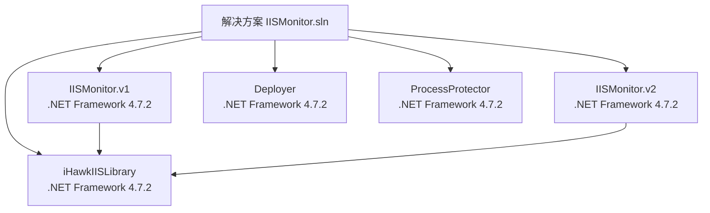
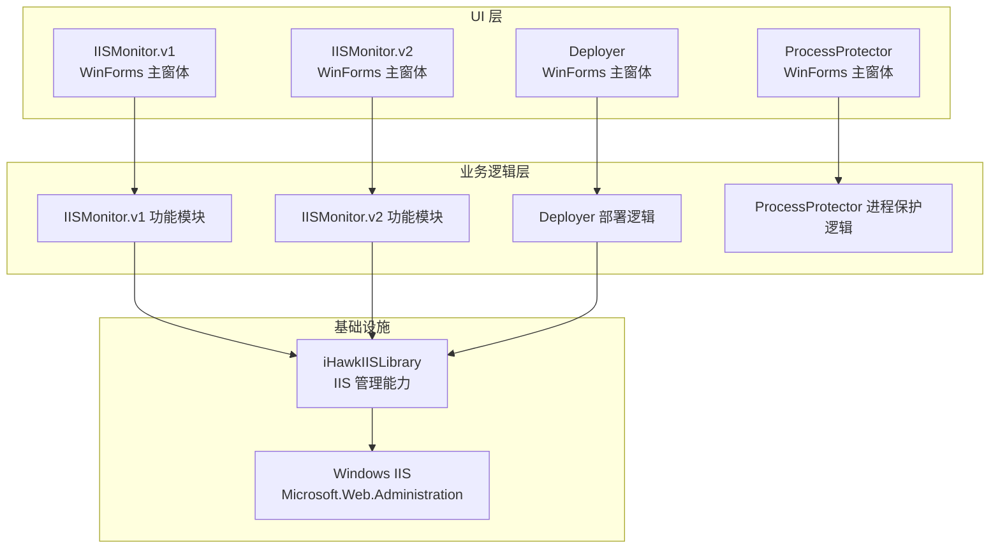
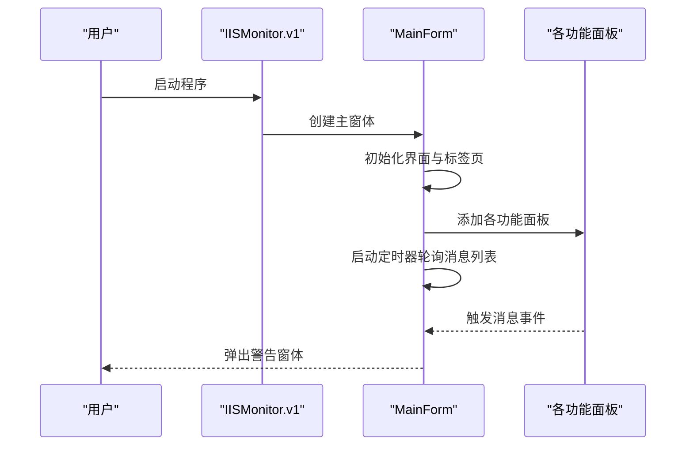
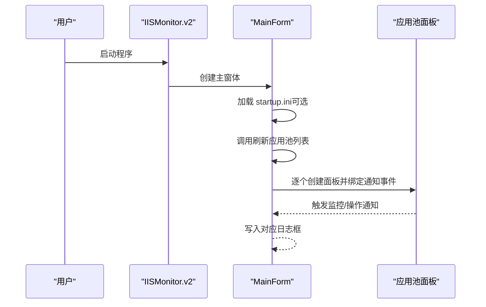
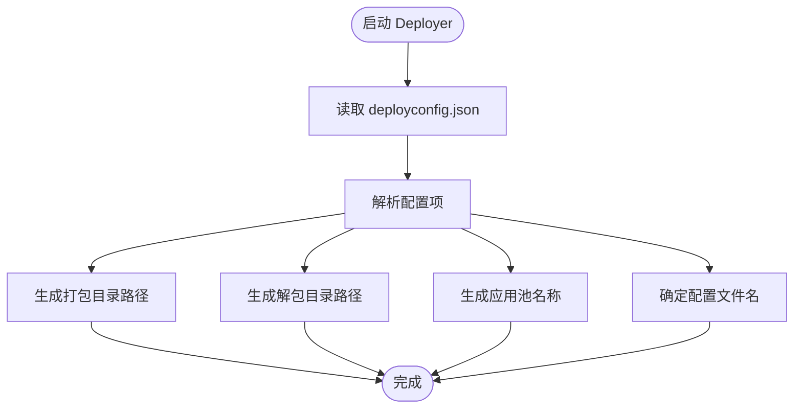
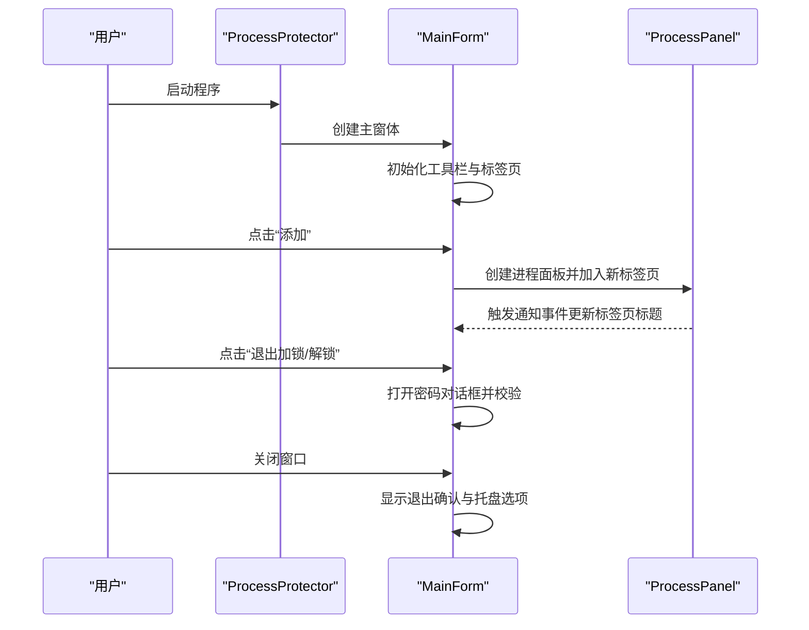
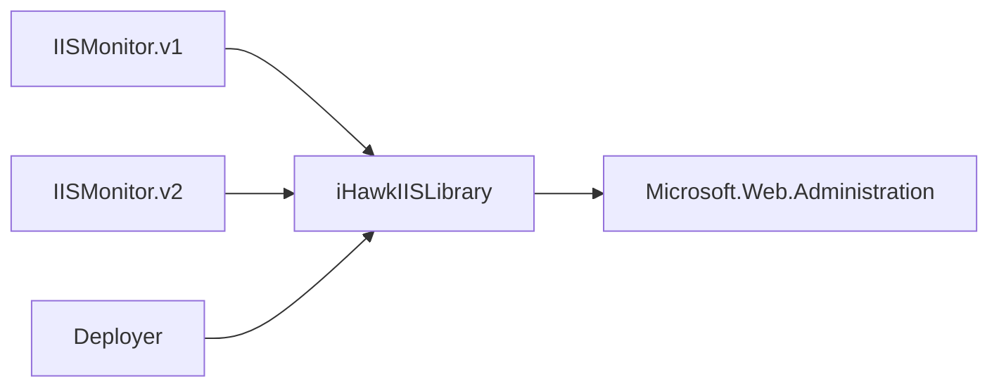

# 快速开始

<cite>
**本文引用的文件**
- [README.md](file://README.md)
- [IISMonitor.sln](file://IISMonitor.sln)
- [iHawkIISLibrary.csproj](file://iHawkIISLibrary/iHawkIISLibrary.csproj)
- [IISMonitor.v1\App.config](file://IISMonitor.v1/App.config)
- [IISMonitor.v2\App.config](file://IISMonitor.v2/App.config)
- [Deployer\App.config](file://Deployer/App.config)
- [ProcessProtector\App.config](file://ProcessProtector/App.config)
- [IISMonitor.v1\Program.cs](file://IISMonitor.v1/Program.cs)
- [IISMonitor.v2\Program.cs](file://IISMonitor.v2/Program.cs)
- [Deployer\Program.cs](file://Deployer/Program.cs)
- [ProcessProtector\Program.cs](file://ProcessProtector/Program.cs)
- [IISMonitor.v1\MainForm.cs](file://IISMonitor.v1/MainForm.cs)
- [IISMonitor.v2\MainForm.cs](file://IISMonitor.v2/MainForm.cs)
- [ProcessProtector\MainForm.cs](file://ProcessProtector/MainForm.cs)
- [Deployer\deployconfig.json](file://Deployer/deployconfig.json)
</cite>

## 目录
1. [简介](#简介)
2. [项目结构](#项目结构)
3. [核心组件](#核心组件)
4. [架构总览](#架构总览)
5. [详细组件分析](#详细组件分析)
6. [依赖关系分析](#依赖关系分析)
7. [性能与稳定性建议](#性能与稳定性建议)
8. [故障排除指南](#故障排除指南)
9. [结论](#结论)
10. [附录](#附录)

## 简介
本指南面向新手开发者，帮助你在最短时间内完成 IISMonitor 项目的环境准备、编译构建与首次运行，并理解各组件的基本用途与基本使用方法。项目包含多个桌面应用组件与一个 IIS 操作类库，支持对 IIS 的应用池、网站、部署与进程保护等场景进行监控与管理。

## 项目结构
该仓库采用多项目解决方案组织方式，包含以下主要模块：
- iHawkIISLibrary：IIS 操作类库，封装应用池、网站与配置读写等能力
- IISMonitor.v1：基于 WinForms 的 IIS 监测界面（含 HTTP 检查、应用池检查、Web 服务检查、发布管理）
- IISMonitor.v2：基于 WinForms 的 IIS 监测界面（以应用池面板为核心，支持日志分栏显示）
- Deployer：部署工具，负责打包、解包与 IIS 应用池配置
- ProcessProtector：进程守护器，提供进程保护与退出加锁功能

图表来源
- [IISMonitor.sln](file://IISMonitor.sln#L1-L62)
- [iHawkIISLibrary.csproj](file://iHawkIISLibrary/iHawkIISLibrary.csproj#L1-L63)

章节来源
- [README.md](file://README.md#L1-L10)
- [IISMonitor.sln](file://IISMonitor.sln#L1-L62)

## 核心组件
- iHawkIISLibrary：提供应用池、网站与 Web 配置管理能力，供其他组件调用
- IISMonitor.v1：提供多标签页的 IIS 监控界面，包含 HTTP 检查、应用池检查、Web 服务检查与发布管理
- IISMonitor.v2：以应用池面板为核心，支持日志分栏显示，便于运维观察
- Deployer：通过 JSON 配置控制打包目录、解包目录、应用池前缀/后缀与配置文件名
- ProcessProtector：提供进程保护与退出加锁功能，支持最小化到托盘

章节来源
- [iHawkIISLibrary.csproj](file://iHawkIISLibrary/iHawkIISLibrary.csproj#L1-L63)
- [IISMonitor.v1\MainForm.cs](file://IISMonitor.v1/MainForm.cs#L1-L82)
- [IISMonitor.v2\MainForm.cs](file://IISMonitor.v2/MainForm.cs#L1-L131)
- [Deployer\deployconfig.json](file://Deployer/deployconfig.json#L1-L8)
- [ProcessProtector\MainForm.cs](file://ProcessProtector/MainForm.cs#L1-L187)

## 架构总览
下图展示了各组件之间的关系与职责边界：

图表来源
- [IISMonitor.v1\MainForm.cs](file://IISMonitor.v1/MainForm.cs#L1-L82)
- [IISMonitor.v2\MainForm.cs](file://IISMonitor.v2/MainForm.cs#L1-L131)
- [ProcessProtector\MainForm.cs](file://ProcessProtector/MainForm.cs#L1-L187)
- [iHawkIISLibrary.csproj](file://iHawkIISLibrary/iHawkIISLibrary.csproj#L1-L63)

## 详细组件分析

### IISMonitor.v1 组件
- 入口与运行：程序入口在 Program.cs 中创建并运行 MainForm
- 界面布局：MainForm 初始化时创建多标签页，分别承载 HTTP 检查、应用池检查、Web 服务检查与发布管理面板
- 运行机制：定时器轮询消息列表并弹出警告窗体，实现非阻塞的消息提示

图表来源
- [IISMonitor.v1\Program.cs](file://IISMonitor.v1/Program.cs#L1-L23)
- [IISMonitor.v1\MainForm.cs](file://IISMonitor.v1/MainForm.cs#L1-L82)

章节来源
- [IISMonitor.v1\Program.cs](file://IISMonitor.v1/Program.cs#L1-L23)
- [IISMonitor.v1\MainForm.cs](file://IISMonitor.v1/MainForm.cs#L1-L82)

### IISMonitor.v2 组件
- 入口与运行：程序入口在 Program.cs 中创建并运行 MainForm
- 界面布局：MainForm 左侧为应用池面板集合，右侧为两个只读日志框（操作日志与监控日志）
- 启动配置：支持读取 startup.ini 文件，按行加载需要自动启动的应用池名称

图表来源
- [IISMonitor.v2\Program.cs](file://IISMonitor.v2/Program.cs#L1-L23)
- [IISMonitor.v2\MainForm.cs](file://IISMonitor.v2/MainForm.cs#L1-L131)

章节来源
- [IISMonitor.v2\Program.cs](file://IISMonitor.v2/Program.cs#L1-L23)
- [IISMonitor.v2\MainForm.cs](file://IISMonitor.v2/MainForm.cs#L1-L131)

### Deployer 组件
- 入口与运行：程序入口在 Program.cs 中创建并运行 MainForm
- 配置文件：deployconfig.json 控制打包目录、解包目录、应用池命名前后缀以及配置文件名
- 使用场景：用于自动化部署 IIS 应用，配合应用池与站点配置

图表来源
- [Deployer\Program.cs](file://Deployer/Program.cs#L1-L23)
- [Deployer\deployconfig.json](file://Deployer/deployconfig.json#L1-L8)

章节来源
- [Deployer\Program.cs](file://Deployer/Program.cs#L1-L23)
- [Deployer\deployconfig.json](file://Deployer/deployconfig.json#L1-L8)

### ProcessProtector 组件
- 入口与运行：程序入口在 Program.cs 中创建并运行 MainForm
- 界面功能：支持添加进程面板、查看进程状态、退出加锁与最小化到托盘
- 安全机制：支持设置退出密码，防止误关闭；关闭时可选择最小化到托盘或直接退出

图表来源
- [ProcessProtector\Program.cs](file://ProcessProtector/Program.cs#L1-L23)
- [ProcessProtector\MainForm.cs](file://ProcessProtector/MainForm.cs#L1-L187)

章节来源
- [ProcessProtector\Program.cs](file://ProcessProtector/Program.cs#L1-L23)
- [ProcessProtector\MainForm.cs](file://ProcessProtector/MainForm.cs#L1-L187)

## 依赖关系分析
- 运行时要求：所有组件均声明支持 .NET Framework 4.7.2
- IIS 管理依赖：iHawkIISLibrary 引用 Microsoft.Web.Administration，用于应用池与网站管理
- 部署依赖：Deployer 通过 SharpZipLib 等第三方库处理压缩/解压
- UI 依赖：各组件均为 WinForms 应用，入口统一为 Program.cs 中的 Main 方法

图表来源
- [iHawkIISLibrary.csproj](file://iHawkIISLibrary/iHawkIISLibrary.csproj#L1-L63)

章节来源
- [IISMonitor.v1\App.config](file://IISMonitor.v1/App.config#L1-L15)
- [IISMonitor.v2\App.config](file://IISMonitor.v2/App.config#L1-L6)
- [Deployer\App.config](file://Deployer/App.config#L1-L30)
- [ProcessProtector\App.config](file://ProcessProtector/App.config#L1-L6)
- [iHawkIISLibrary.csproj](file://iHawkIISLibrary/iHawkIISLibrary.csproj#L1-L63)

## 性能与稳定性建议
- 合理设置轮询间隔：IISMonitor.v1 的消息轮询频率较高，建议根据实际需求调整定时器间隔，避免 UI 卡顿
- 日志输出控制：IISMonitor.v2 的日志为只读文本框，建议定期清理或限制最大行数，避免内存占用过高
- 部署流程优化：Deployer 的打包/解包路径应尽量使用本地高性能磁盘，减少 IO 延迟
- 进程保护策略：ProcessProtector 的面板数量不宜过多，建议按需添加，避免 UI 渲染压力过大

## 故障排除指南
- 启动时报错缺少 .NET Framework 4.7.2
  - 现象：应用程序无法启动，提示缺少运行时
  - 处理：安装 .NET Framework 4.7.2 并重启系统后重试
  - 参考：各组件 App.config 中的 supportedRuntime 配置
- IIS 管理权限不足
  - 现象：应用池/网站操作失败或无权限
  - 处理：以管理员身份运行程序；确保当前用户具有 IIS 管理员组权限
  - 参考：iHawkIISLibrary 对 Microsoft.Web.Administration 的依赖
- Deployer 解压失败或路径不存在
  - 现象：部署过程中出现异常
  - 处理：检查 deployconfig.json 中的 releasepack 与 deploy 目录是否存在且可写；确认应用池命名规则符合预期
- IISMonitor.v2 启动后空白或未显示应用池
  - 现象：界面无内容或日志为空
  - 处理：检查 startup.ini 是否存在且每行一个应用池名称；确认 IIS 服务正常运行
- ProcessProtector 无法退出或误关闭
  - 现象：关闭窗口后无法退出或提示已加锁
  - 处理：使用“退出加锁”功能输入正确密码解锁；或选择最小化到托盘继续运行

章节来源
- [IISMonitor.v1\App.config](file://IISMonitor.v1/App.config#L1-L15)
- [IISMonitor.v2\App.config](file://IISMonitor.v2/App.config#L1-L6)
- [Deployer\App.config](file://Deployer/App.config#L1-L30)
- [ProcessProtector\App.config](file://ProcessProtector/App.config#L1-L6)
- [Deployer\deployconfig.json](file://Deployer/deployconfig.json#L1-L8)
- [iHawkIISLibrary.csproj](file://iHawkIISLibrary/iHawkIISLibrary.csproj#L1-L63)

## 结论
通过本快速开始指南，你已经了解了 IISMonitor 项目的整体结构、各组件的职责与基本使用方式。建议先完成 .NET Framework 4.7.2 的安装与 IIS 管理权限配置，再依次编译解决方案并运行各组件进行验证。后续可根据实际业务场景进一步定制配置与扩展功能。

## 附录

### 环境要求
- 操作系统：Windows（推荐 Windows 10/11 或 Windows Server）
- 运行时：.NET Framework 4.7.2
- 权限：具备 IIS 管理员权限（用于应用池与网站操作）

章节来源
- [IISMonitor.v1\App.config](file://IISMonitor.v1/App.config#L1-L15)
- [IISMonitor.v2\App.config](file://IISMonitor.v2/App.config#L1-L6)
- [Deployer\App.config](file://Deployer/App.config#L1-L30)
- [ProcessProtector\App.config](file://ProcessProtector/App.config#L1-L6)

### 安装与首次运行步骤
- 步骤 1：安装 .NET Framework 4.7.2
- 步骤 2：以管理员身份打开 Visual Studio，加载解决方案 IISMonitor.sln
- 步骤 3：在解决方案配置中选择 Release 或 Debug，平台选择 Any CPU
- 步骤 4：右键解决方案 -> 重新生成，等待编译完成
- 步骤 5：分别运行以下组件进行验证
  - IISMonitor.v1：用于多维度 IIS 监控与发布管理
  - IISMonitor.v2：以应用池面板为核心的监控界面
  - Deployer：部署工具，按 deployconfig.json 配置执行打包/解包
  - ProcessProtector：进程守护器，支持进程保护与退出加锁

章节来源
- [IISMonitor.sln](file://IISMonitor.sln#L1-L62)
- [IISMonitor.v1\Program.cs](file://IISMonitor.v1/Program.cs#L1-L23)
- [IISMonitor.v2\Program.cs](file://IISMonitor.v2/Program.cs#L1-L23)
- [Deployer\Program.cs](file://Deployer/Program.cs#L1-L23)
- [ProcessProtector\Program.cs](file://ProcessProtector/Program.cs#L1-L23)

### 基本使用示例
- 启动 IISMonitor.v1
  - 运行后进入主界面，切换至“HTTP 检查”、“应用池检查”、“Web 服务检查”、“发布管理”标签页，按需配置并执行检查/发布
- 启动 IISMonitor.v2
  - 运行后左侧显示应用池面板，右侧显示监控与操作日志；如需自动启动某些应用池，可在启动目录创建 startup.ini 并填入应用池名称
- 启动 Deployer
  - 运行后根据 deployconfig.json 的配置执行打包/解包；注意 releasepack 与 deploy 目录的权限与空间
- 启动 ProcessProtector
  - 运行后点击“添加”按钮添加要保护的进程；可通过“退出加锁”设置密码，关闭时选择最小化到托盘

章节来源
- [IISMonitor.v1\MainForm.cs](file://IISMonitor.v1/MainForm.cs#L1-L82)
- [IISMonitor.v2\MainForm.cs](file://IISMonitor.v2/MainForm.cs#L1-L131)
- [Deployer\deployconfig.json](file://Deployer/deployconfig.json#L1-L8)
- [ProcessProtector\MainForm.cs](file://ProcessProtector/MainForm.cs#L1-L187)