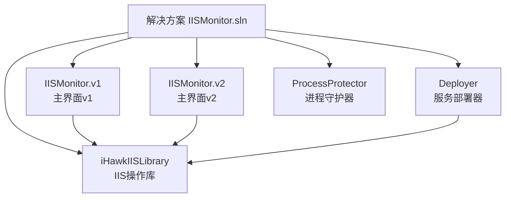
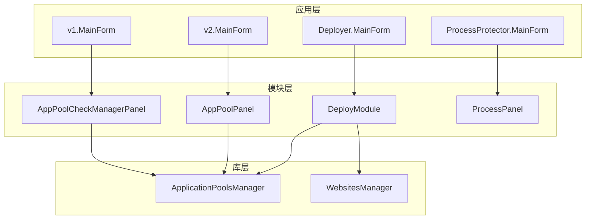
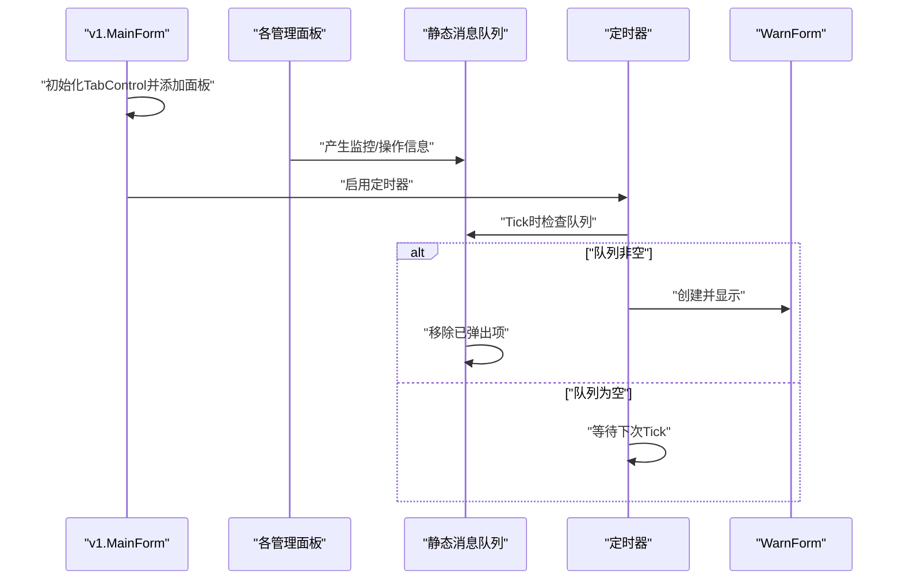
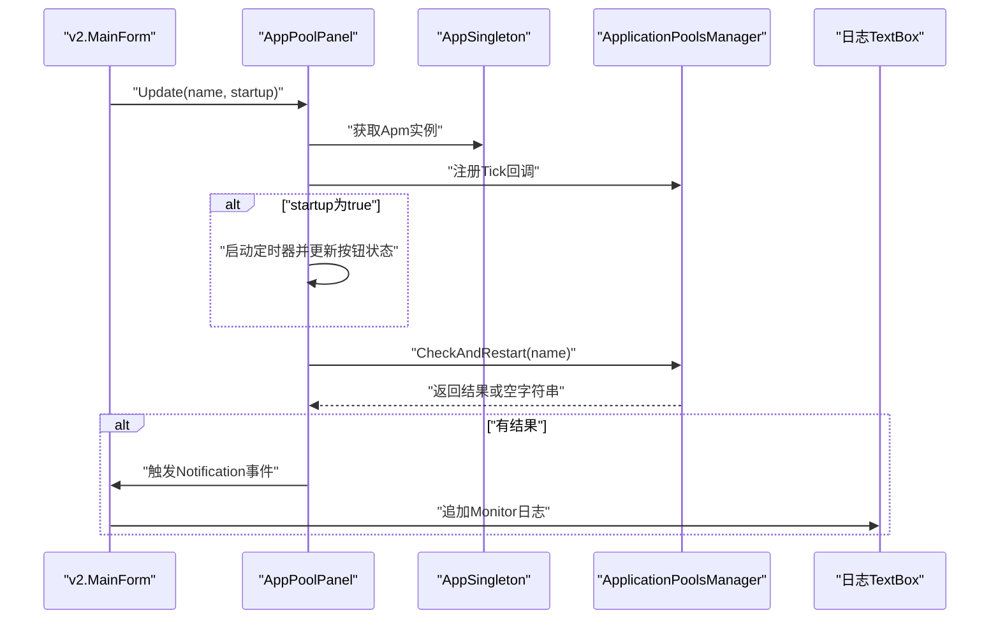
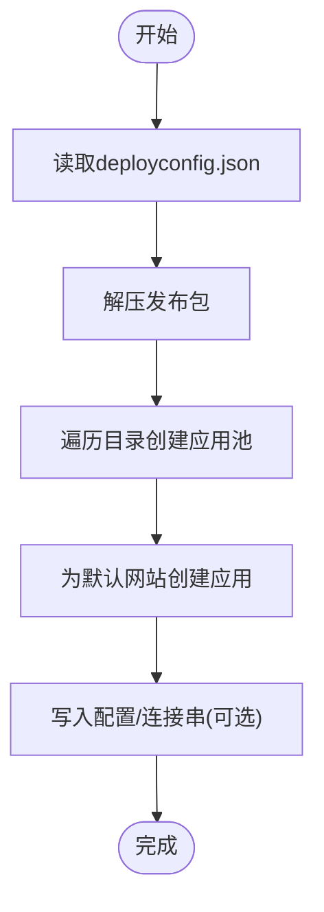
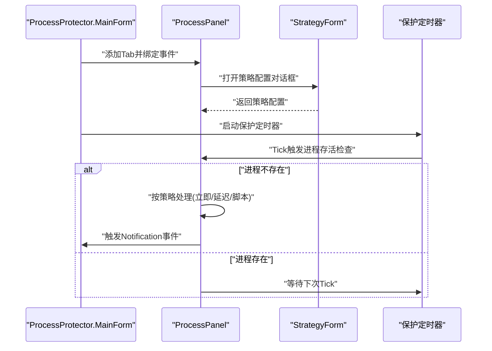
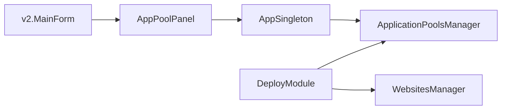

# 扩展开发

<cite>
**本文引用的文件**
- [README.md](file://README.md)
- [IISMonitor.sln](file://IISMonitor.sln)
- [IISMonitor.v1/MainForm.cs](file://IISMonitor.v1/MainForm.cs)
- [IISMonitor.v1/AppPoolCheckManagement/AppPoolCheckManagerPanel.cs](file://IISMonitor.v1/AppPoolCheckManagement/AppPoolCheckManagerPanel.cs)
- [IISMonitor.v1/WarnForm.cs](file://IISMonitor.v1/WarnForm.cs)
- [IISMonitor.v2/MainForm.cs](file://IISMonitor.v2/MainForm.cs)
- [IISMonitor.v2/AppPoolPanel.cs](file://IISMonitor.v2/AppPoolPanel.cs)
- [IISMonitor.v2/AppSingleton.cs](file://IISMonitor.v2/AppSingleton.cs)
- [Deployer/MainForm.cs](file://Deployer/MainForm.cs)
- [Deployer/Modules/DeployModule.cs](file://Deployer/Modules/DeployModule.cs)
- [iHawkIISLibrary/ApplicationPoolsManager.cs](file://iHawkIISLibrary/ApplicationPoolsManager.cs)
- [iHawkIISLibrary/WebsitesManager.cs](file://iHawkIISLibrary/WebsitesManager.cs)
- [ProcessProtector/MainForm.cs](file://ProcessProtector/MainForm.cs)
- [ProcessProtector/ProcessPanel.cs](file://ProcessProtector/ProcessPanel.cs)
</cite>

## 目录
1. [简介](#简介)
2. [项目结构](#项目结构)
3. [核心组件](#核心组件)
4. [架构总览](#架构总览)
5. [详细组件分析](#详细组件分析)
6. [依赖分析](#依赖分析)
7. [性能考虑](#性能考虑)
8. [故障排查指南](#故障排查指南)
9. [结论](#结论)
10. [附录](#附录)

## 简介
本指南面向希望在IISMonitor项目基础上进行扩展开发的工程师，系统讲解如何基于现有架构新增功能模块、开发与集成UserControl组件、设计新的监控面板、对接第三方能力、实现插件化扩展以及自定义管理器类。文档同时提供UI组件定制与样式修改建议，并给出从零到一的完整开发路线图。

## 项目结构
IISMonitor采用多项目解决方案，包含IIS操作库、多个功能子应用（v1/v2主界面、部署器、进程守护器）及共享库。核心关系如下：

图表来源
- [IISMonitor.sln](file://IISMonitor.sln#L1-L62)

章节来源
- [IISMonitor.sln](file://IISMonitor.sln#L1-L62)
- [README.md](file://README.md#L1-L10)

## 核心组件
- IIS操作库（iHawkIISLibrary）
  - ApplicationPoolsManager：封装应用程序池的查询、启停、创建、自动检测与重启等能力。
  - WebsitesManager：封装网站与应用的查询、创建等能力。
- 主界面v1（IISMonitor.v1）
  - MainForm：通过TabControl加载多个管理面板（如AppPoolCheckManagerPanel、HttpCheckManagerPanel、WebServiceCheckManagerPanel、ReleaseManagerPanel），并以定时器轮询消息队列弹出警告窗体。
  - WarnForm：右下角置顶显示告警信息的轻量窗体。
- 主界面v2（IISMonitor.v2）
  - MainForm：左侧展示应用池面板集合，右侧日志区域；通过AppSingleton统一访问IIS操作库。
  - AppPoolPanel：单个应用池的监控控制单元，支持启动/停止监控、事件通知。
  - AppSingleton：全局静态容器，持有ApplicationPoolsManager实例。
- 部署器（Deployer）
  - MainForm：Tab页承载多个模块，如DeployModule、ConnectionStringModule、AppSettingModule。
  - DeployModule：读取配置文件，解压发布包、创建应用池、创建网站应用。
- 进程守护器（ProcessProtector）
  - MainForm：工具栏+Tab页，动态添加ProcessPanel。
  - ProcessPanel：选择进程、设定守护策略（立即/延迟/脚本）、日志输出、启停控制。

章节来源
- [IISMonitor.v1/MainForm.cs](file://IISMonitor.v1/MainForm.cs#L1-L82)
- [IISMonitor.v1/WarnForm.cs](file://IISMonitor.v1/WarnForm.cs#L1-L77)
- [IISMonitor.v2/MainForm.cs](file://IISMonitor.v2/MainForm.cs#L1-L131)
- [IISMonitor.v2/AppPoolPanel.cs](file://IISMonitor.v2/AppPoolPanel.cs#L1-L105)
- [IISMonitor.v2/AppSingleton.cs](file://IISMonitor.v2/AppSingleton.cs#L1-L14)
- [Deployer/MainForm.cs](file://Deployer/MainForm.cs#L1-L78)
- [Deployer/Modules/DeployModule.cs](file://Deployer/Modules/DeployModule.cs#L1-L204)
- [iHawkIISLibrary/ApplicationPoolsManager.cs](file://iHawkIISLibrary/ApplicationPoolsManager.cs#L1-L143)
- [iHawkIISLibrary/WebsitesManager.cs](file://iHawkIISLibrary/WebsitesManager.cs#L1-L94)
- [ProcessProtector/MainForm.cs](file://ProcessProtector/MainForm.cs#L1-L187)
- [ProcessProtector/ProcessPanel.cs](file://ProcessProtector/ProcessPanel.cs#L1-L231)

## 架构总览
整体采用“库-应用-模块”分层：
- 库层：iHawkIISLibrary提供IIS操作抽象，屏蔽底层ServerManager细节。
- 应用层：各子应用（v1/v2/Deployer/ProcessProtector）作为宿主，负责UI与业务编排。
- 模块层：每个应用内部按功能拆分为UserControl模块，便于复用与替换。

图表来源
- [IISMonitor.v1/MainForm.cs](file://IISMonitor.v1/MainForm.cs#L48-L77)
- [IISMonitor.v2/MainForm.cs](file://IISMonitor.v2/MainForm.cs#L34-L81)
- [Deployer/MainForm.cs](file://Deployer/MainForm.cs#L54-L74)
- [Deployer/Modules/DeployModule.cs](file://Deployer/Modules/DeployModule.cs#L105-L153)
- [iHawkIISLibrary/ApplicationPoolsManager.cs](file://iHawkIISLibrary/ApplicationPoolsManager.cs#L1-L143)
- [iHawkIISLibrary/WebsitesManager.cs](file://iHawkIISLibrary/WebsitesManager.cs#L1-L94)

## 详细组件分析

### v1 主界面与消息推送
- v1通过TabControl将多个管理面板加入Tab页；通过静态列表与定时器轮询，逐条弹出WarnForm，实现非阻塞提醒。
- 设计要点
  - 面板均继承UserControl，由宿主Form集中装配。
  - 使用静态消息队列避免跨线程UI更新问题。
  - WarnForm采用置顶与固定尺寸，保证可见性。

图表来源
- [IISMonitor.v1/MainForm.cs](file://IISMonitor.v1/MainForm.cs#L48-L77)
- [IISMonitor.v1/WarnForm.cs](file://IISMonitor.v1/WarnForm.cs#L1-L77)

章节来源
- [IISMonitor.v1/MainForm.cs](file://IISMonitor.v1/MainForm.cs#L1-L82)
- [IISMonitor.v1/WarnForm.cs](file://IISMonitor.v1/WarnForm.cs#L1-L77)

### v2 主界面与单池面板
- v2采用左侧FlowLayoutPanel展示多个AppPoolPanel，右侧SplitContainer显示两类日志；通过AppSingleton统一访问IIS库。
- 设计要点
  - AppPoolPanel暴露Notification事件，供宿主Form聚合日志。
  - 面板内部使用Timer周期调用AppSingleton.Apm.CheckAndRestart实现自动检测与重启。
  - 启动/停止按钮状态与背景色联动，直观反馈当前状态。

图表来源
- [IISMonitor.v2/MainForm.cs](file://IISMonitor.v2/MainForm.cs#L34-L81)
- [IISMonitor.v2/AppPoolPanel.cs](file://IISMonitor.v2/AppPoolPanel.cs#L28-L54)
- [IISMonitor.v2/AppSingleton.cs](file://IISMonitor.v2/AppSingleton.cs#L9-L12)
- [iHawkIISLibrary/ApplicationPoolsManager.cs](file://iHawkIISLibrary/ApplicationPoolsManager.cs#L127-L138)

章节来源
- [IISMonitor.v2/MainForm.cs](file://IISMonitor.v2/MainForm.cs#L1-L131)
- [IISMonitor.v2/AppPoolPanel.cs](file://IISMonitor.v2/AppPoolPanel.cs#L1-L105)
- [IISMonitor.v2/AppSingleton.cs](file://IISMonitor.v2/AppSingleton.cs#L1-L14)
- [iHawkIISLibrary/ApplicationPoolsManager.cs](file://iHawkIISLibrary/ApplicationPoolsManager.cs#L1-L143)

### 部署器模块化
- Deployer通过TabControl承载多个模块，DeployModule负责读取deployconfig.json，执行解压、创建应用池、创建网站应用等流程，并通过BackgroundWorker异步执行与进度上报。
- 设计要点
  - 模块化：每个Tab页对应一个UserControl模块，职责单一。
  - 异步化：使用BackgroundWorker避免UI阻塞。
  - 可扩展：预留写入配置、连接字符串、数据库初始化等分支。

图表来源
- [Deployer/Modules/DeployModule.cs](file://Deployer/Modules/DeployModule.cs#L40-L153)

章节来源
- [Deployer/MainForm.cs](file://Deployer/MainForm.cs#L1-L78)
- [Deployer/Modules/DeployModule.cs](file://Deployer/Modules/DeployModule.cs#L1-L204)

### 进程守护器面板
- ProcessPanel支持选择进程、设定守护策略（立即/延迟/脚本）、日志输出与启停控制；MainForm动态添加多个ProcessPanel标签页。
- 设计要点
  - 事件驱动：ProcessPanel通过Notification事件向宿主传递状态变更。
  - 策略可配：StrategyForm配置Method/DelaySeconds/ScriptFileName。
  - UI自适应：按钮与文本框根据父容器尺寸调整位置。

图表来源
- [ProcessProtector/MainForm.cs](file://ProcessProtector/MainForm.cs#L25-L111)
- [ProcessProtector/ProcessPanel.cs](file://ProcessProtector/ProcessPanel.cs#L68-L144)

章节来源
- [ProcessProtector/MainForm.cs](file://ProcessProtector/MainForm.cs#L1-L187)
- [ProcessProtector/ProcessPanel.cs](file://ProcessProtector/ProcessPanel.cs#L1-L231)

## 依赖分析
- 组件耦合
  - v2.MainForm与AppPoolPanel：通过事件聚合日志，低耦合高内聚。
  - AppPoolPanel与AppSingleton/Apm：仅通过静态单例访问，简化依赖。
  - DeployModule与iHawkIISLibrary：直接依赖ApplicationPoolsManager/WebsitesManager。
- 外部依赖
  - Microsoft.Web.Administration：IIS管理API。
  - Newtonsoft.Json：配置反序列化。
  - Windows Forms：UI框架。

图表来源
- [IISMonitor.v2/MainForm.cs](file://IISMonitor.v2/MainForm.cs#L34-L81)
- [IISMonitor.v2/AppPoolPanel.cs](file://IISMonitor.v2/AppPoolPanel.cs#L28-L54)
- [IISMonitor.v2/AppSingleton.cs](file://IISMonitor.v2/AppSingleton.cs#L9-L12)
- [Deployer/Modules/DeployModule.cs](file://Deployer/Modules/DeployModule.cs#L105-L153)
- [iHawkIISLibrary/ApplicationPoolsManager.cs](file://iHawkIISLibrary/ApplicationPoolsManager.cs#L1-L143)
- [iHawkIISLibrary/WebsitesManager.cs](file://iHawkIISLibrary/WebsitesManager.cs#L1-L94)

章节来源
- [IISMonitor.v2/MainForm.cs](file://IISMonitor.v2/MainForm.cs#L1-L131)
- [IISMonitor.v2/AppPoolPanel.cs](file://IISMonitor.v2/AppPoolPanel.cs#L1-L105)
- [IISMonitor.v2/AppSingleton.cs](file://IISMonitor.v2/AppSingleton.cs#L1-L14)
- [Deployer/Modules/DeployModule.cs](file://Deployer/Modules/DeployModule.cs#L1-L204)
- [iHawkIISLibrary/ApplicationPoolsManager.cs](file://iHawkIISLibrary/ApplicationPoolsManager.cs#L1-L143)
- [iHawkIISLibrary/WebsitesManager.cs](file://iHawkIISLibrary/WebsitesManager.cs#L1-L94)

## 性能考虑
- 定时器频率与粒度
  - v2中AppPoolPanel使用1秒间隔，建议根据实际需求调整，避免频繁IIS查询造成负载。
- UI刷新与日志输出
  - v1的WarnForm与v2的日志TextBox均为UI控件，建议在高频场景下合并日志批次或使用异步刷新。
- 异步执行
  - DeployModule使用BackgroundWorker执行耗时任务，保持UI响应；建议为其他长耗时操作也采用异步模式。
- 资源释放
  - iHawkIISLibrary中的Manager类实现IDisposable，确保ServerManager正确Dispose，避免句柄泄漏。

## 故障排查指南
- IIS权限不足
  - 现象：创建应用池/应用失败或状态查询异常。
  - 排查：确认运行账户对IIS有足够权限；检查ApplicationPoolsManager/WebsitesManager的异常返回。
- 配置文件缺失
  - 现象：DeployModule无法读取deployconfig.json。
  - 排查：确认配置文件路径与格式；检查读取逻辑与目录存在性。
- 日志未显示
  - 现象：v1未弹出WarnForm，v2日志不更新。
  - 排查：检查静态消息队列是否被消费；确认AppPoolPanel的Notification事件是否被宿主订阅。
- 进程守护无效
  - 现象：进程被结束但未按策略重启。
  - 排查：确认策略配置、脚本路径与DelaySeconds；检查定时器是否启用。

章节来源
- [iHawkIISLibrary/ApplicationPoolsManager.cs](file://iHawkIISLibrary/ApplicationPoolsManager.cs#L105-L121)
- [iHawkIISLibrary/WebsitesManager.cs](file://iHawkIISLibrary/WebsitesManager.cs#L42-L58)
- [Deployer/Modules/DeployModule.cs](file://Deployer/Modules/DeployModule.cs#L40-L53)
- [IISMonitor.v1/MainForm.cs](file://IISMonitor.v1/MainForm.cs#L67-L77)
- [IISMonitor.v2/AppPoolPanel.cs](file://IISMonitor.v2/AppPoolPanel.cs#L32-L38)
- [ProcessProtector/ProcessPanel.cs](file://ProcessProtector/ProcessPanel.cs#L83-L106)

## 结论
IISMonitor通过清晰的库-应用-模块三层架构，提供了良好的扩展基础。开发者可遵循以下原则快速扩展：
- 基于UserControl的模块化开发，降低耦合。
- 通过事件与单例容器实现松耦合交互。
- 对IIS操作统一收敛到iHawkIISLibrary，保证一致性与可测试性。
- 在长耗时场景采用异步执行与资源释放，提升稳定性。

## 附录

### 开发新监控面板的完整示例与模板
- 步骤
  1) 新建UserControl，命名为XxxManagerPanel，实现基本UI布局与交互。
  2) 在宿主Form（v1或v2）的TabControl中添加该面板。
  3) 如需IIS操作，通过iHawkIISLibrary提供的Manager类完成。
  4) 若需要日志/告警，参考v2的Notification事件或v1的静态消息队列与定时器弹窗。
- 参考路径
  - v1面板模板：[IISMonitor.v1/AppPoolCheckManagement/AppPoolCheckManagerPanel.cs](file://IISMonitor.v1/AppPoolCheckManagement/AppPoolCheckManagerPanel.cs#L1-L110)
  - v2面板模板：[IISMonitor.v2/AppPoolPanel.cs](file://IISMonitor.v2/AppPoolPanel.cs#L1-L105)
  - v1宿主装配：[IISMonitor.v1/MainForm.cs](file://IISMonitor.v1/MainForm.cs#L48-L77)
  - v2宿主装配：[IISMonitor.v2/MainForm.cs](file://IISMonitor.v2/MainForm.cs#L34-L81)

章节来源
- [IISMonitor.v1/AppPoolCheckManagement/AppPoolCheckManagerPanel.cs](file://IISMonitor.v1/AppPoolCheckManagement/AppPoolCheckManagerPanel.cs#L1-L110)
- [IISMonitor.v2/AppPoolPanel.cs](file://IISMonitor.v2/AppPoolPanel.cs#L1-L105)
- [IISMonitor.v1/MainForm.cs](file://IISMonitor.v1/MainForm.cs#L48-L77)
- [IISMonitor.v2/MainForm.cs](file://IISMonitor.v2/MainForm.cs#L34-L81)

### 第三方集成的指导原则与实现方法
- 指导原则
  - 将第三方能力封装为独立类或模块，避免污染UI层。
  - 通过接口或抽象类定义契约，便于替换与测试。
  - 对外部调用进行异常捕获与降级处理。
- 实现方法
  - 在DeployModule中新增模块UserControl，读取第三方配置，调用其API完成部署/配置写入。
  - 在ProcessProtector中新增策略类型，扩展策略表单与执行逻辑。
- 参考路径
  - 部署模块装配：[Deployer/MainForm.cs](file://Deployer/MainForm.cs#L54-L74)
  - 部署流程：[Deployer/Modules/DeployModule.cs](file://Deployer/Modules/DeployModule.cs#L55-L84)

章节来源
- [Deployer/MainForm.cs](file://Deployer/MainForm.cs#L1-L78)
- [Deployer/Modules/DeployModule.cs](file://Deployer/Modules/DeployModule.cs#L1-L204)

### 插件系统的扩展机制与开发规范
- 机制建议
  - 使用约定式命名与目录结构组织插件（如Modules/PluginXxx）。
  - 通过反射或配置清单发现并加载插件UserControl。
  - 插件实现统一接口（如IPlugin），提供Initialize/Dispose等生命周期方法。
- 开发规范
  - 插件间避免强耦合，通过事件或消息总线通信。
  - 插件应自行处理异常，避免影响宿主稳定性。
  - 提供最小可用配置与默认值，降低接入成本。
- 参考路径
  - v1/v2中模块装配方式可作为插件化改造的起点：[IISMonitor.v1/MainForm.cs](file://IISMonitor.v1/MainForm.cs#L48-L77), [IISMonitor.v2/MainForm.cs](file://IISMonitor.v2/MainForm.cs#L34-L81)

章节来源
- [IISMonitor.v1/MainForm.cs](file://IISMonitor.v1/MainForm.cs#L48-L77)
- [IISMonitor.v2/MainForm.cs](file://IISMonitor.v2/MainForm.cs#L34-L81)

### 自定义管理器类的开发指南
- 设计要点
  - 明确职责边界：每个管理器专注一类资源（如应用池、网站、连接串）。
  - 提供统一的CRUD与状态查询方法，隐藏底层ServerManager细节。
  - 支持异常转换与日志记录，便于定位问题。
- 开发步骤
  1) 新建Manager类，构造函数中初始化ServerManager。
  2) 编写资源查询/创建/启停等方法，必要时返回统一的结果对象。
  3) 在Dispose中释放ServerManager。
  4) 在宿主模块中注入并使用。
- 参考路径
  - 应用池管理器：[iHawkIISLibrary/ApplicationPoolsManager.cs](file://iHawkIISLibrary/ApplicationPoolsManager.cs#L1-L143)
  - 网站管理器：[iHawkIISLibrary/WebsitesManager.cs](file://iHawkIISLibrary/WebsitesManager.cs#L1-L94)

章节来源
- [iHawkIISLibrary/ApplicationPoolsManager.cs](file://iHawkIISLibrary/ApplicationPoolsManager.cs#L1-L143)
- [iHawkIISLibrary/WebsitesManager.cs](file://iHawkIISLibrary/WebsitesManager.cs#L1-L94)

### UI组件定制与样式修改
- 定制建议
  - 使用Anchor/Dock/FlowLayoutPanel等布局控件，适配不同分辨率与窗口大小。
  - 通过事件（如Notification）实现跨面板数据联动，避免硬编码耦合。
  - 控制按钮状态与颜色，提供即时反馈（如v2中监控按钮的颜色变化）。
- 修改方法
  - 在UserControl的InitUi中调整控件尺寸、字体、颜色与事件绑定。
  - 在宿主Form中统一设置容器的Padding/Margin与滚动条。
- 参考路径
  - v2面板UI布局：[IISMonitor.v2/AppPoolPanel.cs](file://IISMonitor.v2/AppPoolPanel.cs#L76-L101)
  - v2宿主布局：[IISMonitor.v2/MainForm.cs](file://IISMonitor.v2/MainForm.cs#L84-L127)

章节来源
- [IISMonitor.v2/AppPoolPanel.cs](file://IISMonitor.v2/AppPoolPanel.cs#L1-L105)
- [IISMonitor.v2/MainForm.cs](file://IISMonitor.v2/MainForm.cs#L1-L131)

### 创建新功能模块的完整开发路线图
- 阶段一：需求与设计
  - 明确模块职责与输入输出。
  - 设计UserControl布局与交互流程。
- 阶段二：实现与集成
  - 实现UserControl与必要的管理器类。
  - 在宿主Form中注册与装配模块。
- 阶段三：测试与优化
  - 单元测试与端到端验证。
  - 性能与稳定性优化（异步、日志、异常）。
- 阶段四：文档与发布
  - 编写使用说明与变更记录。
  - 打包发布与回滚预案。