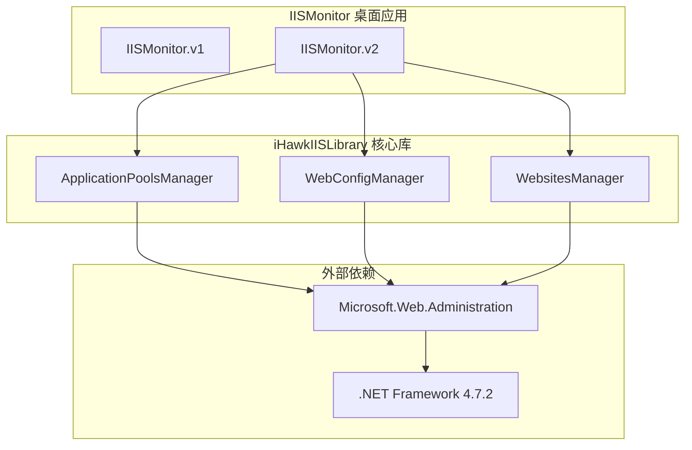
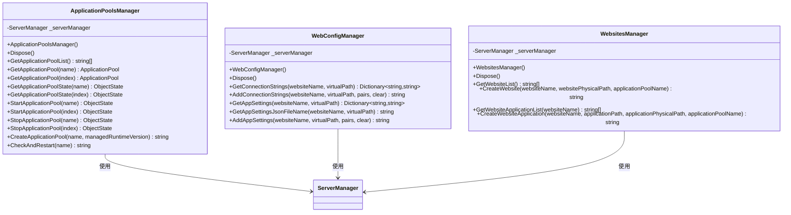
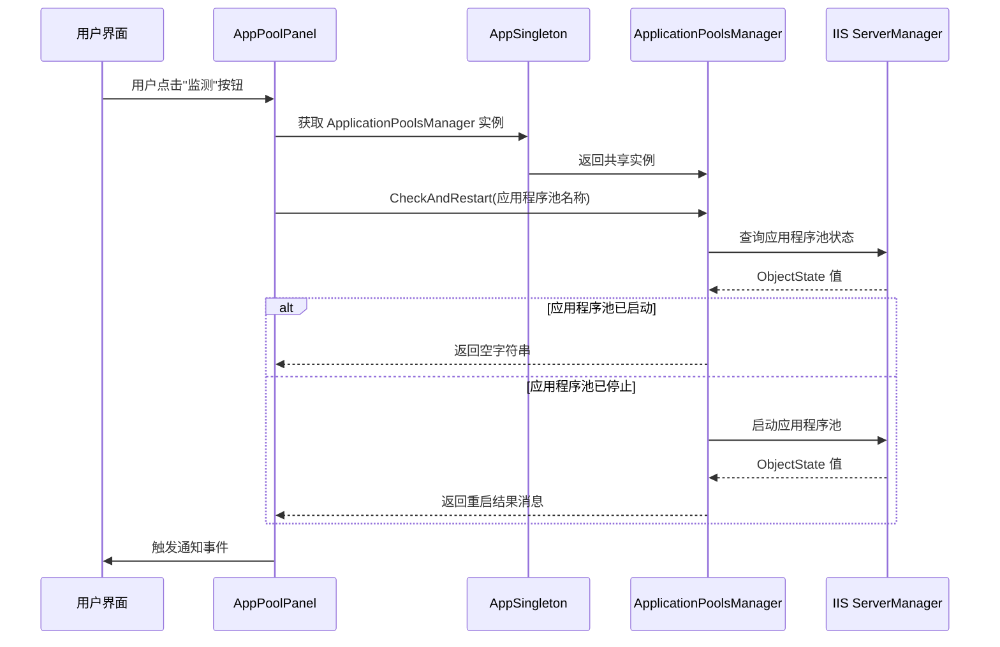
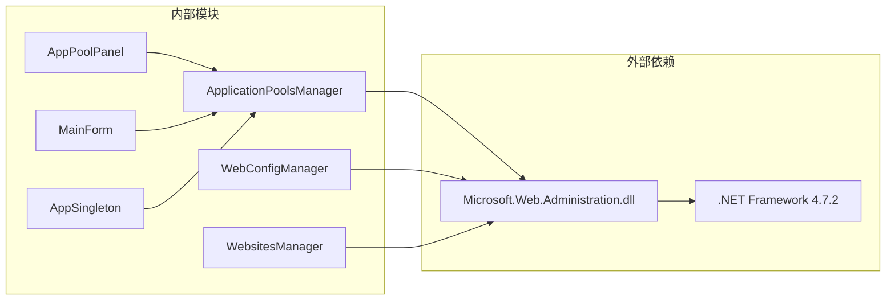

# ApplicationPoolsManager 应用程序池管理器

<cite>
**本文档引用的文件**
- [ApplicationPoolsManager.cs](file://iHawkIISLibrary/ApplicationPoolsManager.cs)
- [WebConfigManager.cs](file://iHawkIISLibrary/WebConfigManager.cs)
- [WebsitesManager.cs](file://iHawkIISLibrary/WebsitesManager.cs)
- [AppPoolPanel.cs](file://IISMonitor.v2/AppPoolPanel.cs)
- [MainForm.cs](file://IISMonitor.v2/MainForm.cs)
- [AppSingleton.cs](file://IISMonitor.v2/AppSingleton.cs)
- [iHawkIISLibrary.csproj](file://iHawkIISLibrary/iHawkIISLibrary.csproj)
- [packages.config](file://iHawkIISLibrary/packages.config)
- [README.md](file://README.md)
</cite>

## 目录
1. [简介](#简介)
2. [项目结构](#项目结构)
3. [核心组件](#核心组件)
4. [架构概览](#架构概览)
5. [详细组件分析](#详细组件分析)
6. [依赖关系分析](#依赖关系分析)
7. [性能考虑](#性能考虑)
8. [故障排除指南](#故障排除指南)
9. [结论](#结论)

## 简介

ApplicationPoolsManager 是 iHawkIISLibrary 库中的核心类，专门负责管理 IIS 应用程序池的各种操作。该类提供了完整的应用程序池生命周期管理功能，包括获取应用程序池列表、查询应用程序池状态、启动和停止应用程序池、创建新应用程序池以及自动重启监控等关键功能。

该项目是 IIS 监控和操作桌面软件的重要组成部分，为 IIS 环境下的应用程序池管理提供了统一的 API 接口。

## 项目结构

项目的整体架构采用分层设计，主要包含以下模块：

**图表来源**
- [ApplicationPoolsManager.cs](file://iHawkIISLibrary/ApplicationPoolsManager.cs#L1-L143)
- [WebConfigManager.cs](file://iHawkIISLibrary/WebConfigManager.cs#L1-L157)
- [WebsitesManager.cs](file://iHawkIISLibrary/WebsitesManager.cs#L1-L94)

**章节来源**
- [README.md](file://README.md#L1-L10)
- [iHawkIISLibrary.csproj](file://iHawkIISLibrary/iHawkIISLibrary.csproj#L1-L63)

## 核心组件

ApplicationPoolsManager 类是整个系统的核心，它继承自 IDisposable 接口，确保正确释放 IIS ServerManager 资源。该类提供了以下主要功能：

### 主要功能特性
- **应用程序池列表管理**：获取所有应用程序池的名称列表
- **应用程序池状态查询**：实时查询应用程序池的运行状态
- **应用程序池控制**：启动、停止应用程序池
- **应用程序池创建**：动态创建新的应用程序池
- **自动监控重启**：监控应用程序池状态并自动重启停止的服务

### 关键属性和方法

**图表来源**
- [ApplicationPoolsManager.cs](file://iHawkIISLibrary/ApplicationPoolsManager.cs#L11-L142)
- [WebConfigManager.cs](file://iHawkIISLibrary/WebConfigManager.cs#L10-L156)
- [WebsitesManager.cs](file://iHawkIISLibrary/WebsitesManager.cs#L11-L93)

**章节来源**
- [ApplicationPoolsManager.cs](file://iHawkIISLibrary/ApplicationPoolsManager.cs#L11-L142)

## 架构概览

ApplicationPoolsManager 在整个 IIS 监控系统中扮演着关键角色，与桌面应用界面紧密集成：

**图表来源**
- [AppPoolPanel.cs](file://IISMonitor.v2/AppPoolPanel.cs#L28-L54)
- [AppSingleton.cs](file://IISMonitor.v2/AppSingleton.cs#L9-L12)
- [ApplicationPoolsManager.cs](file://iHawkIISLibrary/ApplicationPoolsManager.cs#L127-L138)

**章节来源**
- [AppPoolPanel.cs](file://IISMonitor.v2/AppPoolPanel.cs#L1-L105)
- [MainForm.cs](file://IISMonitor.v2/MainForm.cs#L35-L63)

## 详细组件分析

### 应用程序池列表管理

#### GetApplicationPoolList 方法
- **功能**：获取所有应用程序池的名称列表
- **参数**：无
- **返回值**：List<string> - 包含所有应用程序池名称的列表
- **异常处理**：捕获任何异常并返回包含错误信息的列表
- **使用场景**：初始化应用程序池监控界面时加载可用的应用程序池列表

#### GetApplicationPool 方法（重载）
- **功能**：根据名称或索引获取特定的应用程序池对象
- **参数**：
  - name: string - 应用程序池名称
  - index: int - 应用程序池在集合中的索引位置
- **返回值**：ApplicationPool - 对应的应用程序池对象
- **异常处理**：直接访问集合元素，可能抛出 IndexOutOfRangeException 或 ArgumentException

**章节来源**
- [ApplicationPoolsManager.cs](file://iHawkIISLibrary/ApplicationPoolsManager.cs#L47-L68)

### 应用程序池状态查询

#### GetApplicationPoolState 方法（重载）
- **功能**：查询应用程序池的当前运行状态
- **参数**：
  - name: string - 应用程序池名称
  - index: int - 应用程序池在集合中的索引位置
- **返回值**：ObjectState - 应用程序池的状态枚举值
- **状态含义**：
  - Unknown: 未知状态
  - Stopping: 正在停止
  - Stopped: 已停止
  - Starting: 正在启动
  - Started: 已启动
  - Recycling: 正在回收

**章节来源**
- [ApplicationPoolsManager.cs](file://iHawkIISLibrary/ApplicationPoolsManager.cs#L70-L78)

### 应用程序池控制操作

#### StartApplicationPool 和 StopApplicationPool 方法（重载）
- **功能**：启动或停止指定的应用程序池
- **参数**：
  - name: string - 应用程序池名称
  - index: int - 应用程序池在集合中的索引位置
- **返回值**：ObjectState - 执行操作后的应用程序池状态
- **异常处理**：直接调用 IIS API，可能抛出权限不足或其他 IIS 相关异常

**章节来源**
- [ApplicationPoolsManager.cs](file://iHawkIISLibrary/ApplicationPoolsManager.cs#L80-L98)

### 应用程序池创建功能

#### CreateApplicationPool 方法
- **功能**：创建新的应用程序池
- **参数**：
  - name: string - 新应用程序池的名称
  - managedRuntimeVersion: string - 托管代码版本，默认值为 "v4.0"
- **返回值**：string - 操作结果状态
  - 成功："success"
  - 失败："fail: [错误信息]"
- **配置默认值**：
  - Enable32BitAppOnWin64: false
  - ManagedPipelineMode: Integrated
- **异常处理**：捕获创建过程中的异常并返回详细错误信息

**章节来源**
- [ApplicationPoolsManager.cs](file://iHawkIISLibrary/ApplicationPoolsManager.cs#L100-L121)

### 自动监控重启功能

#### CheckAndRestart 方法
- **功能**：监控应用程序池状态并在需要时自动重启
- **参数**：
  - name: string - 要监控的应用程序池名称
- **返回值**：string - 监控和重启操作的结果消息
  - 无需重启：空字符串
  - 需要重启：包含重启信息的消息
  - 失败：包含错误信息的消息
- **工作流程**：
  1. 检查应用程序池当前状态
  2. 如果已启动则返回空字符串
  3. 如果已停止则尝试启动并返回结果
  4. 捕获并报告任何异常

**章节来源**
- [ApplicationPoolsManager.cs](file://iHawkIISLibrary/ApplicationPoolsManager.cs#L123-L138)

### ObjectState 枚举详解

ObjectState 是 Microsoft.Web.Administration 命名空间中的标准枚举，用于表示应用程序池的运行状态：

| 状态值 | 含义 | 描述 |
|--------|------|------|
| Unknown | 未知 | 无法确定应用程序池的当前状态 |
| Stopping | 正在停止 | 应用程序池正在执行停止操作 |
| Stopped | 已停止 | 应用程序池已完全停止运行 |
| Starting | 正在启动 | 应用程序池正在执行启动操作 |
| Started | 已启动 | 应用程序池已成功启动并运行 |
| Recycling | 正在回收 | 应用程序池正在进行进程回收 |

**章节来源**
- [ApplicationPoolsManager.cs](file://iHawkIISLibrary/ApplicationPoolsManager.cs#L70-L78)

### 应用程序池配置最佳实践

基于 CreateApplicationPool 方法的实现，以下是推荐的应用程序池配置实践：

#### 托管代码版本设置
- **默认值**："v4.0" - 支持 .NET Framework 4.0 及以上版本
- **无托管代码**：传入空字符串 "" 来创建无托管代码的应用程序池
- **建议**：根据应用程序的实际需求选择合适的托管版本

#### 32位应用程序支持
- **默认值**：false - 不启用 32 位应用程序支持
- **使用场景**：当应用程序需要使用 32 位 DLL 或 COM 组件时才启用
- **注意事项**：启用后会增加内存占用并影响性能

#### 管道模式配置
- **默认值**：Integrated - 集成管道模式
- **优势**：更好的性能和功能支持
- **兼容性**：现代 ASP.NET 应用程序的标准选择

**章节来源**
- [ApplicationPoolsManager.cs](file://iHawkIISLibrary/ApplicationPoolsManager.cs#L105-L121)

## 依赖关系分析

ApplicationPoolsManager 依赖于多个外部组件和内部模块：

**图表来源**
- [iHawkIISLibrary.csproj](file://iHawkIISLibrary/iHawkIISLibrary.csproj#L34-L36)
- [packages.config](file://iHawkIISLibrary/packages.config#L3)

**章节来源**
- [iHawkIISLibrary.csproj](file://iHawkIISLibrary/iHawkIISLibrary.csproj#L34-L36)
- [packages.config](file://iHawkIISLibrary/packages.config#L1-L4)

### 外部依赖详情

#### Microsoft.Web.Administration
- **版本**：8.5.9600.17042
- **用途**：提供 IIS 管理 API 访问能力
- **架构**：MSIL（可移植可执行文件）

#### .NET Framework
- **目标框架**：v4.7.2
- **最低要求**：v4.5
- **编译选项**：Debug 和 Release 配置

**章节来源**
- [iHawkIISLibrary.csproj](file://iHawkIISLibrary/iHawkIISLibrary.csproj#L12-L14)
- [iHawkIISLibrary.csproj](file://iHawkIISLibrary/iHawkIISLibrary.csproj#L16-L32)

## 性能考虑

### 资源管理
- **ServerManager 实例复用**：ApplicationPoolsManager 在构造函数中创建 ServerManager 实例，并在整个生命周期内复用，避免频繁创建销毁带来的性能开销
- **及时释放资源**：通过 IDisposable 接口确保 ServerManager 资源得到正确释放

### 异常处理策略
- **局部异常捕获**：每个方法都包含 try-catch 块，防止单个操作失败影响整个系统
- **错误信息返回**：异常被捕获后转换为用户友好的错误消息字符串
- **日志记录**：部分异常通过 Console.WriteLine 输出到控制台

### 并发访问
- **线程安全**：ServerManager 实例不是线程安全的，多线程环境下需要额外的同步机制
- **建议**：在桌面应用环境中，通常由 UI 线程调用这些方法，避免并发问题

## 故障排除指南

### 常见问题及解决方案

#### 权限不足错误
**症状**：创建或修改应用程序池时抛出权限相关异常
**原因**：运行应用程序的用户账户没有足够的 IIS 管理权限
**解决方案**：
- 以管理员身份运行应用程序
- 确保用户账户属于 IIS_WPG 组
- 检查 IIS 管理服务是否正常运行

#### 应用程序池不存在
**症状**：查询或操作特定应用程序池时返回异常
**原因**：指定的应用程序池名称不正确或已被删除
**解决方案**：
- 使用 GetApplicationPoolList() 方法获取有效的应用程序池列表
- 验证应用程序池名称的大小写和特殊字符

#### IIS 服务不可用
**症状**：所有 IIS 相关操作都失败
**原因**：IIS 服务未启动或出现故障
**解决方案**：
- 检查 World Wide Web Publishing Service 服务状态
- 重启 IIS 服务
- 运行 iisreset 命令重置 IIS

### 调试技巧

#### 启用详细日志
- 在开发环境中，可以修改异常处理逻辑，将错误信息输出到调试窗口
- 使用 Debug.WriteLine 替代 Console.WriteLine 进行调试输出

#### 测试连接
- 使用 Test() 方法（已标记为 Obsolete）验证 IIS 连接是否正常
- 检查 ServerManager 是否能够正确访问 IIS 配置

**章节来源**
- [ApplicationPoolsManager.cs](file://iHawkIISLibrary/ApplicationPoolsManager.cs#L35-L45)
- [WebConfigManager.cs](file://iHawkIISLibrary/WebConfigManager.cs#L34-L45)

## 结论

ApplicationPoolsManager 类为 IIS 应用程序池管理提供了完整而实用的 API 接口。通过精心设计的方法签名、完善的异常处理机制和清晰的配置选项，该类能够满足大多数 IIS 管理场景的需求。

### 主要优势
- **功能完整性**：涵盖了应用程序池管理的所有核心功能
- **易于使用**：简洁的 API 设计，方法命名直观易懂
- **健壮性**：全面的异常处理和错误恢复机制
- **性能优化**：合理的资源管理和操作优化

### 使用建议
- 在生产环境中始终检查返回值和异常信息
- 根据应用程序的实际需求配置托管版本和管道模式
- 定期监控应用程序池状态，及时发现和解决问题
- 在多线程环境中注意线程安全问题

该类作为 IISMonitor 桌面应用的核心组件，为用户提供了一个可靠、高效的 IIS 应用程序池管理解决方案。