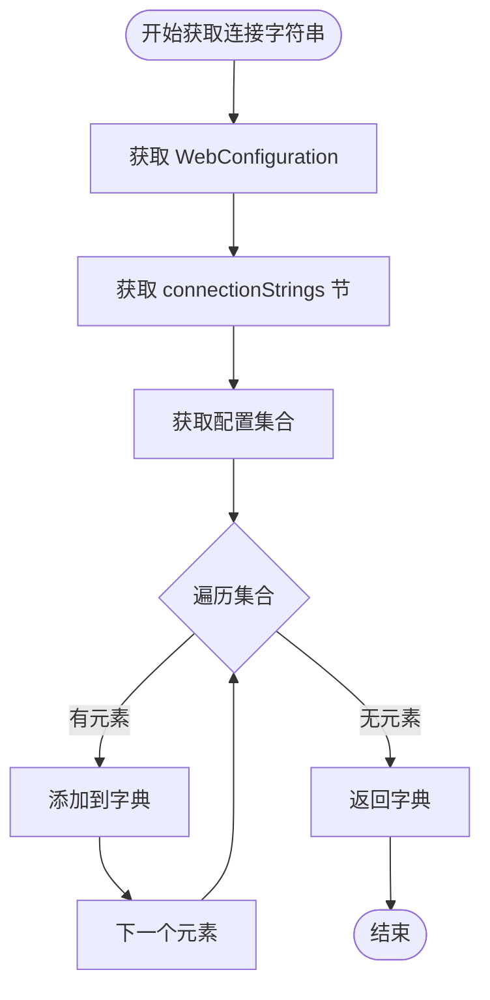

# WebConfigManager 配置文件管理器

<cite>
**本文档引用的文件**
- [WebConfigManager.cs](file://iHawkIISLibrary/WebConfigManager.cs)
- [iHawkIISLibrary.csproj](file://iHawkIISLibrary/iHawkIISLibrary.csproj)
- [AppSettingModule.cs](file://Deployer/Modules/AppSettingModule.cs)
- [ConnectionStringModule.cs](file://Deployer/Modules/ConnectionStringModule.cs)
- [MainForm.cs](file://Deployer/MainForm.cs)
- [deployconfig.json](file://Deployer/deployconfig.json)
- [App.config](file://IISMonitor.v1/App.config)
- [App.config](file://IISMonitor.v2/App.config)
</cite>

## 目录
1. [简介](#简介)
2. [项目结构](#项目结构)
3. [核心组件](#核心组件)
4. [架构概览](#架构概览)
5. [详细组件分析](#详细组件分析)
6. [依赖关系分析](#依赖关系分析)
7. [性能考虑](#性能考虑)
8. [故障排除指南](#故障排除指南)
9. [结论](#结论)
10. [附录](#附录)

## 简介

WebConfigManager 是一个专门用于管理 IIS Web.config 文件的配置管理器类。它基于 Microsoft.Web.Administration 库构建，提供了对 IIS 网站配置的读取、修改和管理功能。该类支持连接字符串管理和应用程序设置管理，并且能够处理现代 ASP.NET Core 的 appsettings.json 文件。

主要功能包括：
- 连接字符串的读取和写入
- 应用程序设置的读取和写入  
- JSON 配置文件路径解析
- 批量配置更新
- 错误处理和异常管理

## 项目结构

该项目采用模块化架构设计，主要包含以下关键组件：


**图表来源**
- [WebConfigManager.cs](file://iHawkIISLibrary/WebConfigManager.cs#L1-L157)
- [iHawkIISLibrary.csproj](file://iHawkIISLibrary/iHawkIISLibrary.csproj#L34-L37)

**章节来源**
- [WebConfigManager.cs](file://iHawkIISLibrary/WebConfigManager.cs#L1-L157)
- [iHawkIISLibrary.csproj](file://iHawkIISLibrary/iHawkIISLibrary.csproj#L1-L63)

## 核心组件

WebConfigManager 类是整个配置管理系统的核心，提供了以下主要功能：

### 主要特性
- **IIS 集成**: 直接与 IIS 服务器管理器交互
- **配置读取**: 支持从 Web.config 和 appsettings.json 读取配置
- **配置写入**: 提供安全的配置更新机制
- **错误处理**: 完善的异常处理和错误报告
- **资源管理**: 实现 IDisposable 接口进行资源清理

### 关键方法概览

| 方法名 | 参数 | 返回值 | 功能描述 |
|--------|------|--------|----------|
| GetConnectionStrings | websiteName, virtualPath | Dictionary<string,string> | 获取连接字符串集合 |
| AddConnectionStrings | websiteName, virtualPath, pairs, clear | string | 添加连接字符串 |
| GetAppSettings | websiteName, virtualPath | Dictionary<string,string> | 获取应用程序设置 |
| AddAppSettings | websiteName, virtualPath, pairs, clear | string | 添加应用程序设置 |
| GetAppSettingsJsonFileName | websiteName, virtualPath | string | 获取 JSON 配置文件路径 |

**章节来源**
- [WebConfigManager.cs](file://iHawkIISLibrary/WebConfigManager.cs#L47-L152)

## 架构概览

WebConfigManager 采用分层架构设计，通过 Microsoft.Web.Administration 库与 IIS 进行交互：


**图表来源**
- [WebConfigManager.cs](file://iHawkIISLibrary/WebConfigManager.cs#L34-L45)
- [WebConfigManager.cs](file://iHawkIISLibrary/WebConfigManager.cs#L72-L84)

## 详细组件分析

### WebConfigManager 类结构


**图表来源**
- [WebConfigManager.cs](file://iHawkIISLibrary/WebConfigManager.cs#L10-L30)
- [WebConfigManager.cs](file://iHawkIISLibrary/WebConfigManager.cs#L34-L45)

### 连接字符串管理功能

连接字符串管理是 WebConfigManager 的核心功能之一，支持以下操作：

#### 获取连接字符串


**图表来源**
- [WebConfigManager.cs](file://iHawkIISLibrary/WebConfigManager.cs#L47-L66)

#### 添加连接字符串


**图表来源**
- [WebConfigManager.cs](file://iHawkIISLibrary/WebConfigManager.cs#L68-L92)

### 应用程序设置管理功能

应用程序设置管理功能提供了与连接字符串类似的操作模式：

#### 获取应用程序设置
应用程序设置的获取流程与连接字符串相同，只是访问不同的配置节（appSettings）。

#### 添加应用程序设置


**图表来源**
- [WebConfigManager.cs](file://iHawkIISLibrary/WebConfigManager.cs#L128-L152)

### JSON 配置文件处理

WebConfigManager 提供了对 ASP.NET Core appsettings.json 文件的支持：

#### JSON 文件路径解析


**图表来源**
- [WebConfigManager.cs](file://iHawkIISLibrary/WebConfigManager.cs#L115-L126)

**章节来源**
- [WebConfigManager.cs](file://iHawkIISLibrary/WebConfigManager.cs#L47-L152)

## 依赖关系分析

WebConfigManager 依赖于多个外部组件和内部模块：


**图表来源**
- [iHawkIISLibrary.csproj](file://iHawkIISLibrary/iHawkIISLibrary.csproj#L34-L37)
- [AppSettingModule.cs](file://Deployer/Modules/AppSettingModule.cs#L44-L55)
- [ConnectionStringModule.cs](file://Deployer/Modules/ConnectionStringModule.cs#L107-L118)

### 外部依赖详情

| 依赖包 | 版本 | 用途 |
|--------|------|------|
| Microsoft.Web.Administration | 7.0.0.0 | IIS 服务器管理 |
| System | 4.7.2 | 基础 .NET 功能 |
| System.Xml.Linq | 4.7.2 | LINQ to XML 处理 |
| System.Data | 4.7.2 | 数据访问支持 |

**章节来源**
- [iHawkIISLibrary.csproj](file://iHawkIISLibrary/iHawkIISLibrary.csproj#L34-L44)

## 性能考虑

在使用 WebConfigManager 时需要考虑以下性能因素：

### 连接管理
- **ServerManager 复用**: 在单个会话中复用 ServerManager 实例
- **批量操作**: 合并多个配置更改以减少提交次数
- **异常处理**: 及时捕获和处理异常以避免资源泄漏

### 内存优化
- **字典使用**: 使用 Dictionary<string,string> 存储配置数据
- **字符串处理**: 避免不必要的字符串复制
- **资源释放**: 确保正确实现 IDisposable 接口

### 并发考虑
- **线程安全**: ServerManager 不是线程安全的
- **同步访问**: 在多线程环境中使用适当的同步机制
- **超时处理**: 设置合理的超时时间避免长时间阻塞

## 故障排除指南

### 常见问题及解决方案

#### 权限问题
**问题**: 访问 IIS 配置时出现权限错误
**解决方案**: 
- 以管理员身份运行应用程序
- 确保应用程序池身份具有足够权限
- 检查 IIS 管理员组成员资格

#### 配置节不存在
**问题**: 获取配置节时返回 null
**解决方案**:
- 验证网站名称和虚拟路径的正确性
- 检查目标应用程序是否已发布
- 确认配置文件存在且格式正确

#### 提交更改失败
**问题**: CommitChanges() 调用失败
**解决方案**:
- 检查磁盘空间和文件权限
- 验证配置数据的有效性
- 确认 IIS 服务正在运行

### 错误处理最佳实践

WebConfigManager 提供了完善的错误处理机制：


**图表来源**
- [WebConfigManager.cs](file://iHawkIISLibrary/WebConfigManager.cs#L49-L65)
- [WebConfigManager.cs](file://iHawkIISLibrary/WebConfigManager.cs#L88-L91)

**章节来源**
- [WebConfigManager.cs](file://iHawkIISLibrary/WebConfigManager.cs#L49-L65)
- [WebConfigManager.cs](file://iHawkIISLibrary/WebConfigManager.cs#L88-L91)

## 结论

WebConfigManager 是一个功能完整、设计良好的 IIS 配置管理解决方案。它提供了以下优势：

### 技术优势
- **简洁的 API 设计**: 清晰的方法命名和参数设计
- **完善的错误处理**: 全面的异常捕获和错误报告
- **资源管理**: 正确的 IDisposable 实现
- **扩展性**: 易于扩展新的配置类型支持

### 使用场景
- **批量配置更新**: 支持同时更新多个网站的配置
- **配置迁移**: 从 Web.config 迁移到 appsettings.json
- **配置验证**: 验证配置的完整性和有效性
- **配置备份**: 为配置更改提供回滚能力

### 发展建议
- **版本控制集成**: 添加配置版本控制功能
- **配置模板**: 提供常用配置模板
- **配置比较**: 添加配置差异比较功能
- **批量操作**: 扩展批量配置操作支持

## 附录

### API 参考

#### 连接字符串管理
- `Dictionary<string,string> GetConnectionStrings(string websiteName, string virtualPath)`
- `string AddConnectionStrings(string websiteName, string virtualPath, Dictionary<string,string> nameConnectionStringPair, bool clear)`

#### 应用程序设置管理
- `Dictionary<string,string> GetAppSettings(string websiteName, string virtualPath)`
- `string AddAppSettings(string websiteName, string virtualPath, Dictionary<string,string> keyValuePair, bool clear)`

#### JSON 配置文件处理
- `string GetAppSettingsJsonFileName(string websiteName, string virtualPath)`

### 配置示例

#### Web.config 结构
```xml
<configuration>
  <connectionStrings>
    <add name="DefaultConnection" connectionString="..." />
  </connectionStrings>
  <appSettings>
    <add key="Environment" value="Production" />
  </appSettings>
</configuration>
```

#### appsettings.json 结构
```json
{
  "ConnectionStrings": {
    "DefaultConnection": "..."
  },
  "Logging": {
    "LogLevel": {
      "Default": "Information"
    }
  }
}
```

### 最佳实践

#### 配置管理最佳实践
1. **使用字典存储**: 将配置数据存储在 Dictionary<string,string> 中便于处理
2. **批量操作**: 合并多个配置更改以减少提交次数
3. **错误处理**: 始终检查返回值并处理可能的异常
4. **资源管理**: 确保正确释放 ServerManager 实例
5. **权限验证**: 在执行配置操作前验证用户权限

#### 安全考虑
- **最小权限原则**: 仅授予必要的 IIS 管理权限
- **配置验证**: 验证配置数据的有效性和安全性
- **审计日志**: 记录重要的配置更改操作
- **备份策略**: 在进行重大配置更改前创建备份