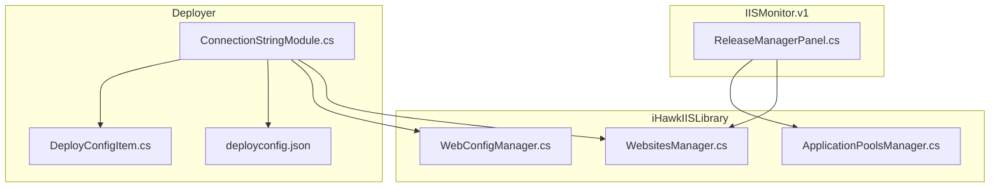
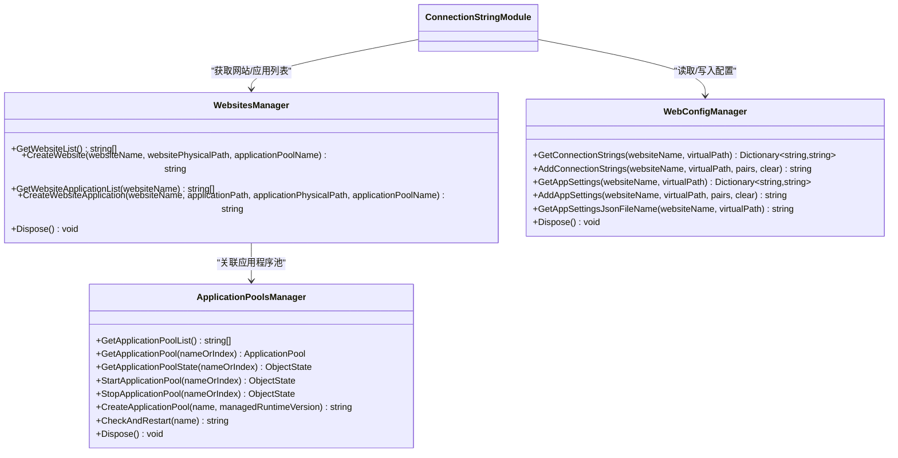
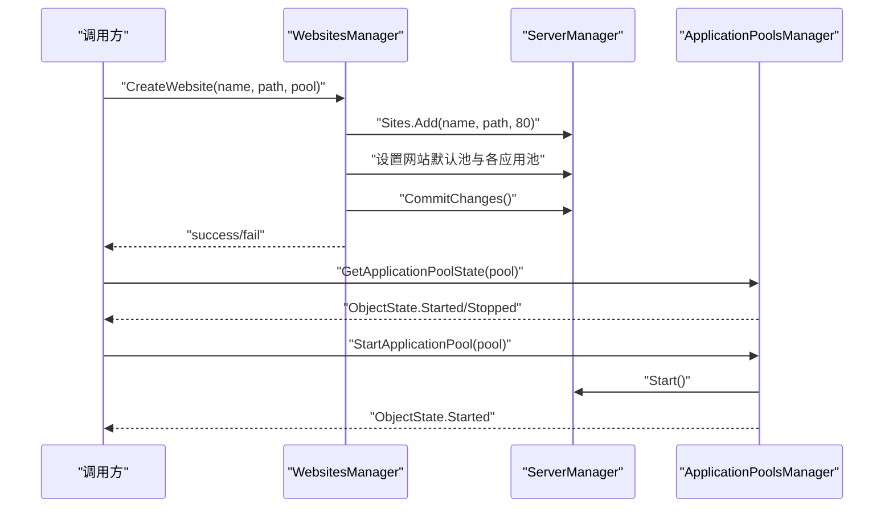
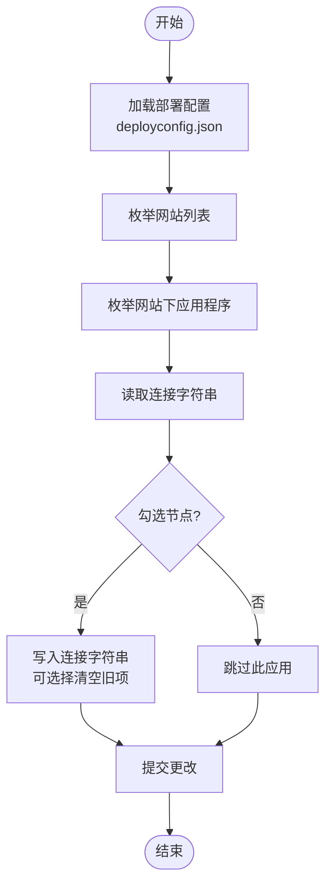
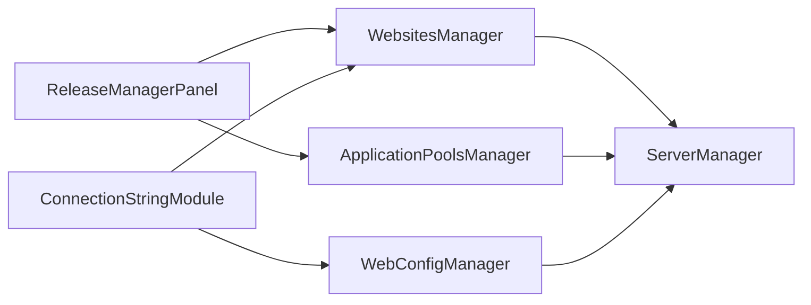

# WebsitesManager 网站管理器

<cite>
**本文引用的文件**
- [WebsitesManager.cs](file://iHawkIISLibrary/WebsitesManager.cs)
- [ApplicationPoolsManager.cs](file://iHawkIISLibrary/ApplicationPoolsManager.cs)
- [WebConfigManager.cs](file://iHawkIISLibrary/WebConfigManager.cs)
- [ReleaseManagerPanel.cs](file://IISMonitor.v1/ReleaseManagement/ReleaseManagerPanel.cs)
- [ConnectionStringModule.cs](file://Deployer/Modules/ConnectionStringModule.cs)
- [deployconfig.json](file://Deployer/deployconfig.json)
- [DeployConfigItem.cs](file://Deployer/DeployConfigItem.cs)
- [README.md](file://README.md)
</cite>

## 目录
1. [简介](#简介)
2. [项目结构](#项目结构)
3. [核心组件](#核心组件)
4. [架构总览](#架构总览)
5. [详细组件分析](#详细组件分析)
6. [依赖关系分析](#依赖关系分析)
7. [性能考虑](#性能考虑)
8. [故障排查指南](#故障排查指南)
9. [结论](#结论)
10. [附录](#附录)

## 简介
本文件为 WebsitesManager 类的详细 API 文档，面向需要通过代码管理 IIS 网站与应用程序的开发者与运维人员。内容涵盖：
- 网站列表获取、网站状态查询、网站启动和停止（通过应用程序池管理）
- 网站创建与删除（通过网站管理器）
- 网站配置管理：绑定信息、物理路径、默认文档、应用程序池关联
- 网站与应用程序池的关系及批量管理与自动化部署实践
- 实际使用场景与调用流程图

WebsitesManager 基于 Microsoft.Web.Administration 提供的 ServerManager 对象进行 IIS 配置读写，所有变更均通过 CommitChanges 提交生效。

**章节来源**
- [README.md](file://README.md#L1-L10)

## 项目结构
该项目包含多个子模块，WebsitesManager 位于 iHawkIISLibrary 中，同时配合 ApplicationPoolsManager 和 WebConfigManager 完成网站与配置的全生命周期管理。IISMonitor.v1 提供了图形界面的发布管理面板，Deployer 模块提供了自动化部署能力。

**图表来源**
- [WebsitesManager.cs](file://iHawkIISLibrary/WebsitesManager.cs#L1-L94)
- [ApplicationPoolsManager.cs](file://iHawkIISLibrary/ApplicationPoolsManager.cs#L1-L143)
- [WebConfigManager.cs](file://iHawkIISLibrary/WebConfigManager.cs#L1-L157)
- [ReleaseManagerPanel.cs](file://IISMonitor.v1/ReleaseManagement/ReleaseManagerPanel.cs#L1-L117)
- [ConnectionStringModule.cs](file://Deployer/Modules/ConnectionStringModule.cs#L1-L182)
- [deployconfig.json](file://Deployer/deployconfig.json#L1-L8)
- [DeployConfigItem.cs](file://Deployer/DeployConfigItem.cs#L1-L37)

**章节来源**
- [WebsitesManager.cs](file://iHawkIISLibrary/WebsitesManager.cs#L1-L94)
- [ApplicationPoolsManager.cs](file://iHawkIISLibrary/ApplicationPoolsManager.cs#L1-L143)
- [WebConfigManager.cs](file://iHawkIISLibrary/WebConfigManager.cs#L1-L157)
- [ReleaseManagerPanel.cs](file://IISMonitor.v1/ReleaseManagement/ReleaseManagerPanel.cs#L1-L117)
- [ConnectionStringModule.cs](file://Deployer/Modules/ConnectionStringModule.cs#L1-L182)
- [deployconfig.json](file://Deployer/deployconfig.json#L1-L8)
- [DeployConfigItem.cs](file://Deployer/DeployConfigItem.cs#L1-L37)

## 核心组件
- WebsitesManager：负责网站与应用程序的增删改查、网站列表获取、应用程序列表获取。
- ApplicationPoolsManager：负责应用程序池的创建、启停、状态查询与自动重启检测。
- WebConfigManager：负责读取/写入站点与应用程序的连接字符串与应用设置。
- ReleaseManagerPanel：图形化界面，演示网站与应用程序池的交互。
- ConnectionStringModule：展示如何批量读取/写入连接字符串，并结合部署配置进行自动化。

**章节来源**
- [WebsitesManager.cs](file://iHawkIISLibrary/WebsitesManager.cs#L11-L94)
- [ApplicationPoolsManager.cs](file://iHawkIISLibrary/ApplicationPoolsManager.cs#L11-L143)
- [WebConfigManager.cs](file://iHawkIISLibrary/WebConfigManager.cs#L10-L157)
- [ReleaseManagerPanel.cs](file://IISMonitor.v1/ReleaseManagement/ReleaseManagerPanel.cs#L14-L117)
- [ConnectionStringModule.cs](file://Deployer/Modules/ConnectionStringModule.cs#L16-L182)

## 架构总览
WebsitesManager 与 ApplicationPoolsManager、WebConfigManager 协同工作，形成“网站—应用程序池—配置”的三层管理模型。ReleaseManagerPanel 作为 UI 层调用 WebsitesManager 与 ApplicationPoolsManager；Deployer 的 ConnectionStringModule 则在自动化场景中调用 WebsitesManager 与 WebConfigManager。

**图表来源**
- [WebsitesManager.cs](file://iHawkIISLibrary/WebsitesManager.cs#L11-L94)
- [ApplicationPoolsManager.cs](file://iHawkIISLibrary/ApplicationPoolsManager.cs#L11-L143)
- [WebConfigManager.cs](file://iHawkIISLibrary/WebConfigManager.cs#L10-L157)
- [ConnectionStringModule.cs](file://Deployer/Modules/ConnectionStringModule.cs#L58-L128)

## 详细组件分析

### WebsitesManager API 详解
WebsitesManager 提供网站与应用程序的基础 CRUD 能力，所有方法均返回字符串表示结果，成功时返回 "success"，失败时返回 "fail: 错误信息"。

- 构造与析构
  - 构造函数：创建内部 ServerManager 实例。
  - Dispose：释放 ServerManager 资源。
  
- 方法清单与行为
  - GetWebsiteList()
    - 功能：获取当前 IIS 上所有网站名称列表。
    - 返回：List<string>，若异常则返回包含错误信息的单元素列表。
    - 异常处理：捕获异常并返回 fail: 错误信息。
    - 复杂度：O(n)，n 为网站数量。
    - 使用场景：UI 下拉框填充、自动化脚本枚举。
    - 参考实现路径：[GetWebsiteList](file://iHawkIISLibrary/WebsitesManager.cs#L30-L40)

  - CreateWebsite(websiteName, websitePhysicalPath, applicationPoolName)
    - 功能：创建新网站，默认端口 80，绑定到指定应用程序池。
    - 参数：
      - websiteName：网站名称，必须唯一。
      - websitePhysicalPath：网站物理路径，需存在。
      - applicationPoolName：目标应用程序池名称。
    - 返回："success" 或 "fail: 错误信息"。
    - 参数校验：
      - 若网站已存在，直接返回失败。
      - 物理路径由调用方保证存在（IIS 创建时不会自动创建目录）。
    - 行为细节：
      - 设置网站默认应用程序池与所有应用程序的应用程序池。
      - 调用 CommitChanges 提交。
    - 异常处理：捕获异常并返回 fail: 错误信息。
    - 复杂度：O(m)，m 为网站下应用程序数量。
    - 使用场景：自动化部署、批量创建网站。
    - 参考实现路径：[CreateWebsite](file://iHawkIISLibrary/WebsitesManager.cs#L42-L58)

  - GetWebsiteApplicationList(websiteName)
    - 功能：获取网站下所有应用程序的虚拟路径列表（不包含根 "/"）。
    - 参数：websiteName。
    - 返回：List<string>，若网站不存在返回包含错误信息的单元素列表。
    - 异常处理：捕获异常并返回 fail: 错误信息。
    - 复杂度：O(m)，m 为应用程序数量。
    - 使用场景：UI 展示、批量配置应用。
    - 参考实现路径：[GetWebsiteApplicationList](file://iHawkIISLibrary/WebsitesManager.cs#L60-L72)

  - CreateWebsiteApplication(websiteName, applicationPath, applicationPhysicalPath, applicationPoolName)
    - 功能：在指定网站下创建新的应用程序。
    - 参数：
      - websiteName：目标网站。
      - applicationPath：应用程序虚拟路径（如 "/app"）。
      - applicationPhysicalPath：应用程序物理路径。
      - applicationPoolName：应用程序池名称。
    - 返回："success" 或 "fail: 错误信息"。
    - 参数校验：
      - 网站必须存在。
      - 应用程序路径必须唯一。
    - 行为细节：
      - 设置应用程序池并提交更改。
    - 异常处理：捕获异常并返回 fail: 错误信息。
    - 复杂度：O(1)。
    - 使用场景：多应用部署、子站点管理。
    - 参考实现路径：[CreateWebsiteApplication](file://iHawkIISLibrary/WebsitesManager.cs#L74-L90)

- 状态查询与启动/停止
  - WebsitesManager 本身不直接提供网站启停接口。网站状态与启停通过 ApplicationPoolsManager 的应用程序池状态与启停方法间接实现。
  - 关系说明：网站运行依赖其应用程序池；当应用程序池处于 Started 状态时，网站可正常访问。
  - 参考实现路径：[ApplicationPoolsManager 启停方法](file://iHawkIISLibrary/ApplicationPoolsManager.cs#L80-L98)

- 删除网站
  - WebsitesManager 当前未提供删除网站的方法。可通过 ApplicationPoolsManager 的应用程序池管理或直接使用 ServerManager 的 Sites.Remove 进行扩展。
  - 注意：删除网站前应先停止其应用程序池并移除所有应用程序，避免残留引用导致失败。

**章节来源**
- [WebsitesManager.cs](file://iHawkIISLibrary/WebsitesManager.cs#L11-L94)
- [ApplicationPoolsManager.cs](file://iHawkIISLibrary/ApplicationPoolsManager.cs#L80-L98)

### 网站与应用程序池的关系
- 网站与应用程序池是“一对多”关系：一个网站可包含多个应用程序，这些应用程序共享同一应用程序池或各自独立池。
- WebsitesManager 在创建网站时会将网站默认应用程序池与网站下所有应用程序的应用程序池统一设置为目标池。
- ApplicationPoolsManager 提供应用程序池的启停与状态查询，从而间接控制网站可用性。

**图表来源**
- [WebsitesManager.cs](file://iHawkIISLibrary/WebsitesManager.cs#L42-L58)
- [ApplicationPoolsManager.cs](file://iHawkIISLibrary/ApplicationPoolsManager.cs#L70-L98)

**章节来源**
- [WebsitesManager.cs](file://iHawkIISLibrary/WebsitesManager.cs#L42-L58)
- [ApplicationPoolsManager.cs](file://iHawkIISLibrary/ApplicationPoolsManager.cs#L70-L98)

### 网站配置管理指南
- 绑定信息设置
  - WebsitesManager 在创建网站时默认绑定端口 80。若需自定义绑定（如主机头、SSL），可在现有基础上扩展，使用 ServerManager 的 Sites[site].Bindings.Add(...) 进行绑定配置。
  - 扩展建议：在 CreateWebsite 中增加绑定参数与校验逻辑，并在 CommitChanges 前完成绑定对象设置。

- 物理路径配置
  - 网站与应用程序的物理路径分别在 CreateWebsite 与 CreateWebsiteApplication 中传入。调用方需确保路径存在且有权限访问。
  - 建议：在调用前对路径进行存在性与权限检查，避免创建失败。

- 默认文档设置
  - WebsitesManager 未提供默认文档设置方法。可通过 WebConfigManager 在站点或应用程序级别添加或修改 defaultDocument 扩展名集合，或直接编辑 web.config。
  - 参考实现路径：[WebConfigManager](file://iHawkIISLibrary/WebConfigManager.cs#L47-L152)

- 应用程序池关联
  - 创建网站与应用程序时，统一设置应用程序池名称，确保资源隔离与回收策略一致。
  - 参考实现路径：[WebsitesManager 创建网站与应用](file://iHawkIISLibrary/WebsitesManager.cs#L42-L90)

**章节来源**
- [WebsitesManager.cs](file://iHawkIISLibrary/WebsitesManager.cs#L42-L90)
- [WebConfigManager.cs](file://iHawkIISLibrary/WebConfigManager.cs#L47-L152)

### 批量管理与自动化部署
- 批量读取连接字符串
  - ConnectionStringModule 展示了如何遍历网站下的应用程序，批量读取 connectionStrings 并输出到 UI。
  - 参考实现路径：[ConnectionStringModule.View](file://Deployer/Modules/ConnectionStringModule.cs#L59-L102)

- 批量写入连接字符串
  - ConnectionStringModule 支持勾选多个应用程序节点，批量写入连接字符串，支持清空旧项。
  - 参考实现路径：[ConnectionStringModule.WriteConnectionStrings](file://Deployer/Modules/ConnectionStringModule.cs#L104-L128)

- 自动化部署配置
  - deployconfig.json 定义了发布包目录、解压目录、应用程序池命名规则与 .NET 标识文件名。
  - DeployConfigItem 映射上述配置项，便于在自动化脚本中读取与拼接应用程序池名称。
  - 参考实现路径：
    - [deployconfig.json](file://Deployer/deployconfig.json#L1-L8)
    - [DeployConfigItem](file://Deployer/DeployConfigItem.cs#L9-L35)

**图表来源**
- [ConnectionStringModule.cs](file://Deployer/Modules/ConnectionStringModule.cs#L59-L128)
- [deployconfig.json](file://Deployer/deployconfig.json#L1-L8)
- [DeployConfigItem.cs](file://Deployer/DeployConfigItem.cs#L9-L35)

**章节来源**
- [ConnectionStringModule.cs](file://Deployer/Modules/ConnectionStringModule.cs#L59-L128)
- [deployconfig.json](file://Deployer/deployconfig.json#L1-L8)
- [DeployConfigItem.cs](file://Deployer/DeployConfigItem.cs#L9-L35)

### 实际使用场景与代码示例
- 场景一：创建网站并分配应用程序池
  - 步骤：
    1) 使用 ApplicationPoolsManager.CreateApplicationPool 创建应用程序池。
    2) 使用 WebsitesManager.CreateWebsite 创建网站并绑定应用程序池。
  - 参考实现路径：
    - [ApplicationPoolsManager.CreateApplicationPool](file://iHawkIISLibrary/ApplicationPoolsManager.cs#L105-L121)
    - [WebsitesManager.CreateWebsite](file://iHawkIISLibrary/WebsitesManager.cs#L42-L58)

- 场景二：在网站下新增应用程序
  - 步骤：
    1) 确认网站存在。
    2) 使用 WebsitesManager.CreateWebsiteApplication 添加应用程序并绑定池。
  - 参考实现路径：
    - [WebsitesManager.CreateWebsiteApplication](file://iHawkIISLibrary/WebsitesManager.cs#L74-L90)

- 场景三：批量读取与设置连接字符串
  - 步骤：
    1) 使用 WebsitesManager.GetWebsiteList 获取网站列表。
    2) 使用 WebsitesManager.GetWebsiteApplicationList 获取应用列表。
    3) 使用 WebConfigManager.GetConnectionStrings 读取。
    4) 使用 WebConfigManager.AddConnectionStrings 写入（可清空）。
  - 参考实现路径：
    - [WebsitesManager.GetWebsiteList](file://iHawkIISLibrary/WebsitesManager.cs#L30-L40)
    - [WebsitesManager.GetWebsiteApplicationList](file://iHawkIISLibrary/WebsitesManager.cs#L60-L72)
    - [WebConfigManager.GetConnectionStrings](file://iHawkIISLibrary/WebConfigManager.cs#L47-L66)
    - [WebConfigManager.AddConnectionStrings](file://iHawkIISLibrary/WebConfigManager.cs#L68-L92)

- 场景四：图形化界面集成
  - ReleaseManagerPanel 展示了如何在 WinForms 中调用 WebsitesManager 与 ApplicationPoolsManager，实现网站与应用程序池的可视化管理。
  - 参考实现路径：
    - [ReleaseManagerPanel 初始化与事件绑定](file://IISMonitor.v1/ReleaseManagement/ReleaseManagerPanel.cs#L35-L112)

**章节来源**
- [WebsitesManager.cs](file://iHawkIISLibrary/WebsitesManager.cs#L30-L90)
- [ApplicationPoolsManager.cs](file://iHawkIISLibrary/ApplicationPoolsManager.cs#L105-L121)
- [WebConfigManager.cs](file://iHawkIISLibrary/WebConfigManager.cs#L47-L92)
- [ReleaseManagerPanel.cs](file://IISMonitor.v1/ReleaseManagement/ReleaseManagerPanel.cs#L35-L112)
- [ConnectionStringModule.cs](file://Deployer/Modules/ConnectionStringModule.cs#L59-L128)

## 依赖关系分析
- WebsitesManager 依赖 Microsoft.Web.Administration 的 ServerManager 进行 IIS 配置读写。
- ApplicationPoolsManager 与 WebsitesManager 共享 ServerManager 实例，二者协同完成网站与池的管理。
- WebConfigManager 通过 ServerManager.GetWebConfiguration 访问站点/应用的 web.config，实现连接字符串与应用设置的读写。
- UI 层（ReleaseManagerPanel）与 Deployer（ConnectionStringModule）通过 WebsitesManager 与 WebConfigManager 实现业务闭环。

**图表来源**
- [WebsitesManager.cs](file://iHawkIISLibrary/WebsitesManager.cs#L11-L27)
- [ApplicationPoolsManager.cs](file://iHawkIISLibrary/ApplicationPoolsManager.cs#L11-L29)
- [WebConfigManager.cs](file://iHawkIISLibrary/WebConfigManager.cs#L10-L28)
- [ReleaseManagerPanel.cs](file://IISMonitor.v1/ReleaseManagement/ReleaseManagerPanel.cs#L56-L109)
- [ConnectionStringModule.cs](file://Deployer/Modules/ConnectionStringModule.cs#L65-L127)

**章节来源**
- [WebsitesManager.cs](file://iHawkIISLibrary/WebsitesManager.cs#L11-L27)
- [ApplicationPoolsManager.cs](file://iHawkIISLibrary/ApplicationPoolsManager.cs#L11-L29)
- [WebConfigManager.cs](file://iHawkIISLibrary/WebConfigManager.cs#L10-L28)
- [ReleaseManagerPanel.cs](file://IISMonitor.v1/ReleaseManagement/ReleaseManagerPanel.cs#L56-L109)
- [ConnectionStringModule.cs](file://Deployer/Modules/ConnectionStringModule.cs#L65-L127)

## 性能考虑
- 网站列表与应用列表获取为 O(n)/O(m) 操作，适合在 UI 初次加载时执行。
- 创建网站与应用涉及 CommitChanges，建议批量操作后再提交，减少 IIS 配置写入次数。
- 连接字符串读取与写入为轻量级操作，但涉及多次集合遍历，建议在 UI 中缓存结果以提升交互体验。
- 应用程序池启停为即时操作，注意避免频繁启停导致服务抖动。

[本节为通用指导，无需具体文件来源]

## 故障排查指南
- 网站已存在
  - 现象：CreateWebsite 返回 "fail: ... exists."
  - 排查：确认网站名称是否重复；必要时先删除旧网站或更换名称。
  - 参考实现路径：[CreateWebsite 存在性校验](file://iHawkIISLibrary/WebsitesManager.cs#L46)

- 应用程序路径已存在
  - 现象：CreateWebsiteApplication 返回 "fail: ... exists."
  - 排查：确认 applicationPath 是否唯一；清理冲突路径后重试。
  - 参考实现路径：[CreateWebsiteApplication 路径校验](file://iHawkIISLibrary/WebsitesManager.cs#L80)

- 网站不存在
  - 现象：GetWebsiteApplicationList 返回 "fail: ... no exists."
  - 排查：确认网站名称正确；使用 GetWebsiteList 校验网站是否存在。
  - 参考实现路径：[GetWebsiteApplicationList 不存在校验](file://iHawkIISLibrary/WebsitesManager.cs#L64)

- 物理路径不存在
  - 现象：UI 层提示物理路径不存在。
  - 排查：确认路径存在且有访问权限；在调用前进行路径检查。
  - 参考实现路径：[ReleaseManagerPanel 路径校验](file://IISMonitor.v1/ReleaseManagement/ReleaseManagerPanel.cs#L95-L99)

- 应用程序池状态异常
  - 现象：网站无法访问。
  - 排查：使用 ApplicationPoolsManager.GetApplicationPoolState 查询状态；必要时调用 StartApplicationPool 启动。
  - 参考实现路径：
    - [GetApplicationPoolState](file://iHawkIISLibrary/ApplicationPoolsManager.cs#L70-L78)
    - [StartApplicationPool](file://iHawkIISLibrary/ApplicationPoolsManager.cs#L80-L88)

**章节来源**
- [WebsitesManager.cs](file://iHawkIISLibrary/WebsitesManager.cs#L46-L80)
- [ReleaseManagerPanel.cs](file://IISMonitor.v1/ReleaseManagement/ReleaseManagerPanel.cs#L95-L99)
- [ApplicationPoolsManager.cs](file://iHawkIISLibrary/ApplicationPoolsManager.cs#L70-L88)

## 结论
WebsitesManager 为 IIS 网站与应用程序的管理提供了简洁而实用的 API，结合 ApplicationPoolsManager 与 WebConfigManager，能够覆盖从创建、配置到批量管理与自动化的完整链路。通过 ReleaseManagerPanel 与 ConnectionStringModule 的示例，可以快速构建图形化与自动化工具，满足日常运维与发布需求。

[本节为总结性内容，无需具体文件来源]

## 附录
- API 方法一览表
  - GetWebsiteList(): 返回网站名称列表
  - CreateWebsite(name, path, pool): 创建网站并绑定池
  - GetWebsiteApplicationList(name): 获取应用虚拟路径列表
  - CreateWebsiteApplication(name, appPath, appPath, pool): 在网站下创建应用
  - Dispose(): 释放资源

- 相关类与职责
  - WebsitesManager：网站与应用管理
  - ApplicationPoolsManager：应用程序池管理
  - WebConfigManager：站点/应用配置读写
  - ReleaseManagerPanel：UI 展示与交互
  - ConnectionStringModule：批量配置连接字符串

[本节为概览性内容，无需具体文件来源]