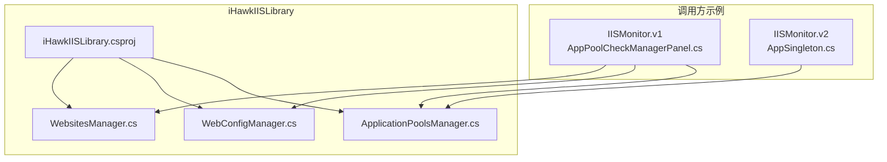
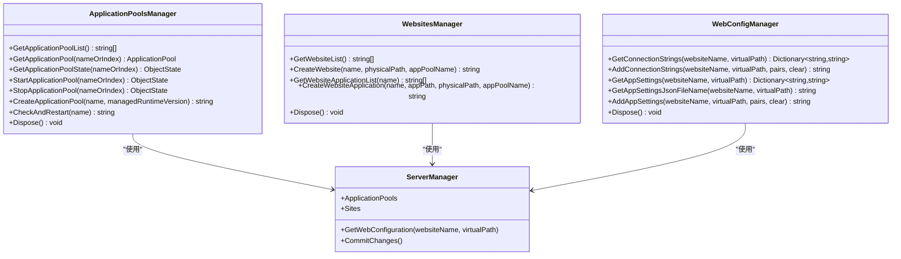
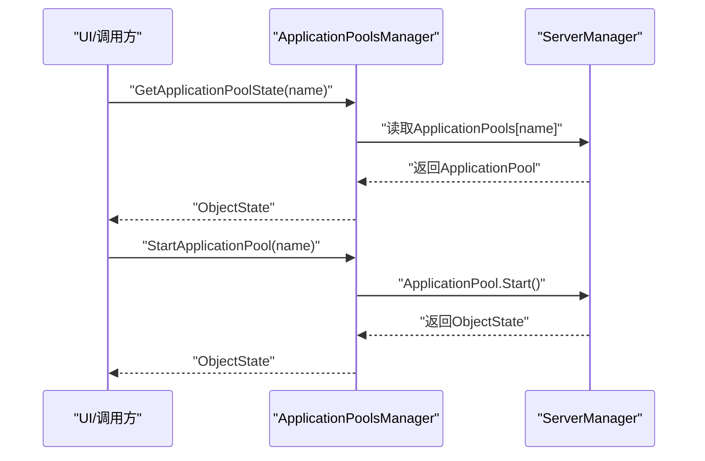
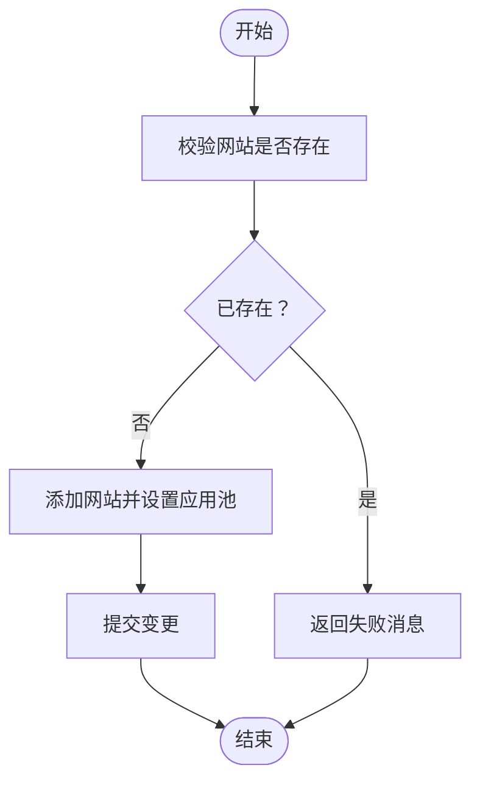
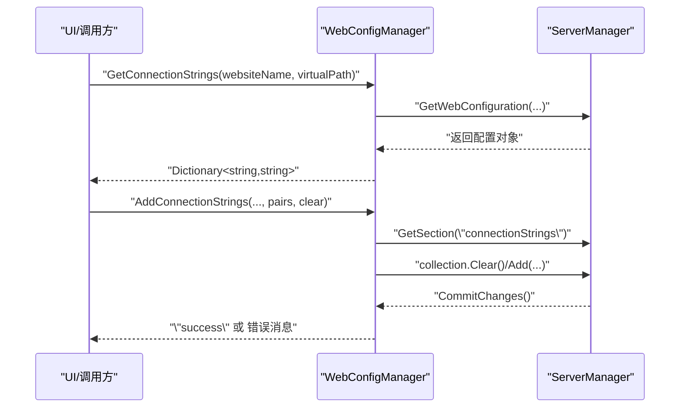
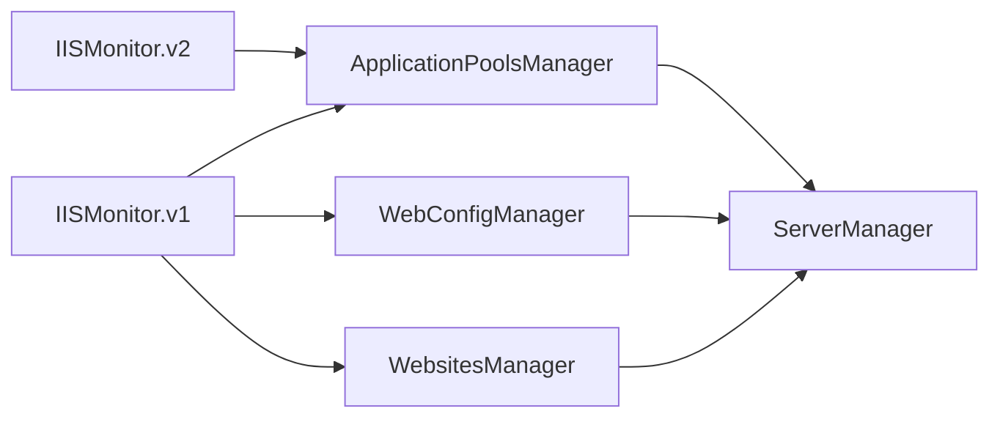

# 核心库文档 (iHawkIISLibrary)

<cite>
**本文引用的文件**
- [ApplicationPoolsManager.cs](file://iHawkIISLibrary/ApplicationPoolsManager.cs)
- [WebConfigManager.cs](file://iHawkIISLibrary/WebConfigManager.cs)
- [WebsitesManager.cs](file://iHawkIISLibrary/WebsitesManager.cs)
- [iHawkIISLibrary.csproj](file://iHawkIISLibrary/iHawkIISLibrary.csproj)
- [AppSingleton.cs](file://IISMonitor.v2/AppSingleton.cs)
- [AppPoolCheckManagerPanel.cs](file://IISMonitor.v1/AppPoolCheckManagement/AppPoolCheckManagerPanel.cs)
- [README.md](file://README.md)
</cite>

## 目录
1. [简介](#简介)
2. [项目结构](#项目结构)
3. [核心组件](#核心组件)
4. [架构总览](#架构总览)
5. [详细组件分析](#详细组件分析)
6. [依赖关系分析](#依赖关系分析)
7. [性能考量](#性能考量)
8. [故障排查指南](#故障排查指南)
9. [结论](#结论)
10. [附录](#附录)

## 简介
本文件面向iHawkIISLibrary核心库，聚焦于三大管理器类：ApplicationPoolsManager（应用程序池管理器）、WebsitesManager（网站管理器）与WebConfigManager（Web配置管理器）。文档从设计理念、方法签名、参数与返回值、异常处理机制入手，结合仓库中的使用示例，系统阐述三者在IIS环境下的职责边界、协作模式、性能与安全注意事项，并为高级开发者提供扩展与定制建议。

## 项目结构
iHawkIISLibrary作为独立类库，通过Microsoft.Web.Administration封装IIS服务器管理能力，提供对应用程序池、网站与Web配置的读取与写入操作。项目以“功能域”组织代码，核心文件位于iHawkIISLibrary目录下，其他模块（如IISMonitor.v1、IISMonitor.v2等）演示了如何在实际应用中使用这些管理器。

图表来源
- [ApplicationPoolsManager.cs](file://iHawkIISLibrary/ApplicationPoolsManager.cs#L1-L143)
- [WebConfigManager.cs](file://iHawkIISLibrary/WebConfigManager.cs#L1-L157)
- [WebsitesManager.cs](file://iHawkIISLibrary/WebsitesManager.cs#L1-L94)
- [iHawkIISLibrary.csproj](file://iHawkIISLibrary/iHawkIISLibrary.csproj#L1-L63)
- [AppPoolCheckManagerPanel.cs](file://IISMonitor.v1/AppPoolCheckManagement/AppPoolCheckManagerPanel.cs#L1-L110)
- [AppSingleton.cs](file://IISMonitor.v2/AppSingleton.cs#L1-L14)

章节来源
- [README.md](file://README.md#L1-L10)
- [iHawkIISLibrary.csproj](file://iHawkIISLibrary/iHawkIISLibrary.csproj#L1-L63)

## 核心组件
- ApplicationPoolsManager：负责应用程序池的列举、状态查询、启动/停止、创建以及“检测并重启”等运维操作。
- WebsitesManager：负责网站与子应用程序的列举、创建与关联的应用程序池设置。
- WebConfigManager：负责读取/写入站点的连接字符串与应用设置集合，以及定位appsettings.json物理路径。

章节来源
- [ApplicationPoolsManager.cs](file://iHawkIISLibrary/ApplicationPoolsManager.cs#L1-L143)
- [WebsitesManager.cs](file://iHawkIISLibrary/WebsitesManager.cs#L1-L94)
- [WebConfigManager.cs](file://iHawkIISLibrary/WebConfigManager.cs#L1-L157)

## 架构总览
三者均以内置ServerManager实例进行IIS读写操作，遵循“按需打开、及时释放”的资源管理模式（实现IDisposable），并在关键写入操作后调用CommitChanges提交变更。调用方通过直接实例化或单例持有管理器对象，完成业务逻辑编排。

图表来源
- [ApplicationPoolsManager.cs](file://iHawkIISLibrary/ApplicationPoolsManager.cs#L11-L142)
- [WebsitesManager.cs](file://iHawkIISLibrary/WebsitesManager.cs#L11-L93)
- [WebConfigManager.cs](file://iHawkIISLibrary/WebConfigManager.cs#L10-L156)

## 详细组件分析

### ApplicationPoolsManager（应用程序池管理器）
- 设计理念
  - 面向运维场景：提供“列举—查询—启停—创建—自检重启”的完整闭环。
  - 异常隔离：所有公共方法均try/catch包裹，返回字符串或集合，便于上层统一处理。
  - 资源管理：实现IDisposable，确保ServerManager正确释放。
- 关键方法与行为
  - 列举与索引访问：支持按名称或索引获取ApplicationPool对象。
  - 状态查询：返回ObjectState枚举，便于判断Started/Stopped等。
  - 启停操作：返回ObjectState，表示操作结果。
  - 创建应用池：默认集成管道、非32位、可指定运行时版本；若同名已存在则返回失败提示。
  - 自检重启：若状态非Started，则尝试启动并返回日志字符串。
- 参数与返回
  - 名称/索引重载：名称为string，索引为int。
  - 返回值：状态为ObjectState；创建/重启/网站创建等返回string（成功或错误消息）。
- 异常处理
  - 方法内部捕获异常并返回错误消息；部分方法会输出到控制台或调试输出。
- 使用示例（参考）
  - 在IISMonitor.v1中，AppPoolCheckManagerPanel通过定时器周期性检查应用池状态并尝试启动。
  - 在IISMonitor.v2中，AppSingleton持有全局ApplicationPoolsManager实例，便于跨界面共享。

图表来源
- [ApplicationPoolsManager.cs](file://iHawkIISLibrary/ApplicationPoolsManager.cs#L70-L98)
- [AppPoolCheckManagerPanel.cs](file://IISMonitor.v1/AppPoolCheckManagement/AppPoolCheckManagerPanel.cs#L87-L104)

章节来源
- [ApplicationPoolsManager.cs](file://iHawkIISLibrary/ApplicationPoolsManager.cs#L1-L143)
- [AppPoolCheckManagerPanel.cs](file://IISMonitor.v1/AppPoolCheckManagement/AppPoolCheckManagerPanel.cs#L1-L110)
- [AppSingleton.cs](file://IISMonitor.v2/AppSingleton.cs#L1-L14)

### WebsitesManager（网站管理器）
- 设计理念
  - 提供网站与子应用程序的生命周期管理：列举、创建、绑定应用池。
  - 对外返回统一字符串消息，便于UI显示与日志记录。
- 关键方法与行为
  - 列举网站：返回网站名称列表。
  - 创建网站：校验名称唯一性，设置默认端口与应用池。
  - 列举网站下的应用：返回应用路径列表。
  - 创建网站应用：校验应用路径唯一性，设置应用池。
- 参数与返回
  - CreateWebsite：名称、物理路径、应用池名称；返回字符串消息。
  - CreateWebsiteApplication：网站名、应用路径、物理路径、应用池名称；返回字符串消息。
- 异常处理
  - 所有方法均try/catch，失败时返回带前缀的错误消息；成功时返回“success”。

图表来源
- [WebsitesManager.cs](file://iHawkIISLibrary/WebsitesManager.cs#L42-L58)

章节来源
- [WebsitesManager.cs](file://iHawkIISLibrary/WebsitesManager.cs#L1-L94)

### WebConfigManager（Web配置管理器）
- 设计理念
  - 基于ServerManager.GetWebConfiguration访问站点配置，支持读取/写入connectionStrings与appSettings集合。
  - 提供appsettings.json物理路径推导能力，便于外部工具或脚本使用。
- 关键方法与行为
  - 读取连接字符串：返回键值对字典。
  - 写入连接字符串：可选择清空后再批量写入；写入后提交变更。
  - 读取应用设置：返回键值对字典。
  - 获取appsettings.json物理路径：根据站点与虚拟路径拼接。
  - 写入应用设置：可选择清空后再批量写入；写入后提交变更。
- 参数与返回
  - Get/AddConnectionStrings：websiteName、virtualPath、键值对集合、是否清空；返回字符串消息。
  - Get/AddAppSettings：websiteName、virtualPath、键值对集合、是否清空；返回字符串消息。
  - GetAppSettingsJsonFileName：websiteName、virtualPath；返回字符串（路径或错误消息）。
- 异常处理
  - 所有方法均try/catch，失败时返回错误消息；成功时返回“success”。

图表来源
- [WebConfigManager.cs](file://iHawkIISLibrary/WebConfigManager.cs#L47-L92)

章节来源
- [WebConfigManager.cs](file://iHawkIISLibrary/WebConfigManager.cs#L1-L157)

## 依赖关系分析
- 外部依赖
  - Microsoft.Web.Administration：IIS服务器管理API，提供ServerManager、ApplicationPool、Site、Configuration等对象。
- 内部耦合
  - 三管理器均依赖ServerManager，但彼此无直接依赖，保持高内聚低耦合。
  - 调用方（IISMonitor.v1/v2）通过直接实例化或单例持有管理器，形成松散耦合的使用模式。

图表来源
- [ApplicationPoolsManager.cs](file://iHawkIISLibrary/ApplicationPoolsManager.cs#L11-L142)
- [WebsitesManager.cs](file://iHawkIISLibrary/WebsitesManager.cs#L11-L93)
- [WebConfigManager.cs](file://iHawkIISLibrary/WebConfigManager.cs#L10-L156)
- [iHawkIISLibrary.csproj](file://iHawkIISLibrary/iHawkIISLibrary.csproj#L34-L37)
- [AppPoolCheckManagerPanel.cs](file://IISMonitor.v1/AppPoolCheckManagement/AppPoolCheckManagerPanel.cs#L31-L32)
- [AppSingleton.cs](file://IISMonitor.v2/AppSingleton.cs#L11-L11)

章节来源
- [iHawkIISLibrary.csproj](file://iHawkIISLibrary/iHawkIISLibrary.csproj#L34-L37)

## 性能考量
- ServerManager生命周期
  - 每个管理器内部持有ServerManager实例，频繁创建/销毁可能带来开销。建议在长生命周期场景复用同一实例，或采用单例模式（见IISMonitor.v2中的AppSingleton）。
- 批量写入
  - AddConnectionStrings/AddAppSettings支持clear参数，建议在需要完全替换时使用clear=true，避免重复项导致配置膨胀。
- I/O与网络
  - CommitChanges会触发IIS配置写盘，应避免高频提交；合并多次修改后再一次性提交。
- 状态查询
  - GetApplicationPoolState等查询为轻量操作，可在UI轮询中使用，但注意频率控制，避免过度请求IIS。
- 平台与权限
  - 运行时需具备IIS管理权限；在容器或受限环境中可能无法访问ServerManager。

[本节为通用性能建议，不直接分析具体文件]

## 故障排查指南
- 常见异常与处理
  - 访问不存在的应用池/网站：返回错误消息字符串，UI可据此提示用户。
  - 创建失败（如名称冲突）：返回包含“fail: ...”的消息，调用方可据此回退或重试。
  - 写入配置失败：返回异常消息字符串，建议记录日志并提示用户检查权限与路径。
- 日志与诊断
  - ApplicationPoolsManager在某些路径使用Console输出；WebConfigManager使用Debug输出；建议在生产环境统一接入NLog或类似日志框架。
- 权限问题
  - 若出现“拒绝访问”，请确认运行账户具有IIS管理权限；在Windows服务或计划任务中需提升权限。
- 配置一致性
  - 写入配置后务必调用CommitChanges；否则变更不会生效。

章节来源
- [ApplicationPoolsManager.cs](file://iHawkIISLibrary/ApplicationPoolsManager.cs#L49-L58)
- [WebConfigManager.cs](file://iHawkIISLibrary/WebConfigManager.cs#L61-L66)
- [WebsitesManager.cs](file://iHawkIISLibrary/WebsitesManager.cs#L46-L58)

## 结论
iHawkIISLibrary以简洁的API抽象了IIS常见运维场景，ApplicationPoolsManager、WebsitesManager与WebConfigManager分别覆盖应用池、网站与配置三大领域。通过统一的异常处理与资源管理策略，库既适合快速集成，也便于在复杂业务中扩展。建议在生产环境中结合日志体系与权限治理，确保稳定与安全。

[本节为总结性内容，不直接分析具体文件]

## 附录

### API速查表（概要）
- ApplicationPoolsManager
  - GetApplicationPoolList(): 返回应用池名称列表
  - GetApplicationPool(name/index): 返回ApplicationPool对象
  - GetApplicationPoolState(name/index): 返回ObjectState
  - StartApplicationPool(name/index): 返回ObjectState
  - StopApplicationPool(name/index): 返回ObjectState
  - CreateApplicationPool(name, managedRuntimeVersion="v4.0"): 返回字符串消息
  - CheckAndRestart(name): 返回字符串消息
- WebsitesManager
  - GetWebsiteList(): 返回网站名称列表
  - CreateWebsite(name, physicalPath, appPoolName): 返回字符串消息
  - GetWebsiteApplicationList(name): 返回应用路径列表
  - CreateWebsiteApplication(name, appPath, physicalPath, appPoolName): 返回字符串消息
- WebConfigManager
  - GetConnectionStrings(websiteName, virtualPath): 返回键值对字典
  - AddConnectionStrings(websiteName, virtualPath, pairs, clear): 返回字符串消息
  - GetAppSettings(websiteName, virtualPath): 返回键值对字典
  - GetAppSettingsJsonFileName(websiteName, virtualPath): 返回字符串（路径或错误消息）
  - AddAppSettings(websiteName, virtualPath, pairs, clear): 返回字符串消息

章节来源
- [ApplicationPoolsManager.cs](file://iHawkIISLibrary/ApplicationPoolsManager.cs#L47-L138)
- [WebsitesManager.cs](file://iHawkIISLibrary/WebsitesManager.cs#L30-L90)
- [WebConfigManager.cs](file://iHawkIISLibrary/WebConfigManager.cs#L47-L152)

### 使用示例（参考）
- 应用池监控与自动重启：IISMonitor.v1的AppPoolCheckManagerPanel展示了定时器+状态检查+启动流程。
- 全局单例持有：IISMonitor.v2的AppSingleton演示了在应用范围内复用ApplicationPoolsManager实例。

章节来源
- [AppPoolCheckManagerPanel.cs](file://IISMonitor.v1/AppPoolCheckManagement/AppPoolCheckManagerPanel.cs#L58-L104)
- [AppSingleton.cs](file://IISMonitor.v2/AppSingleton.cs#L9-L12)