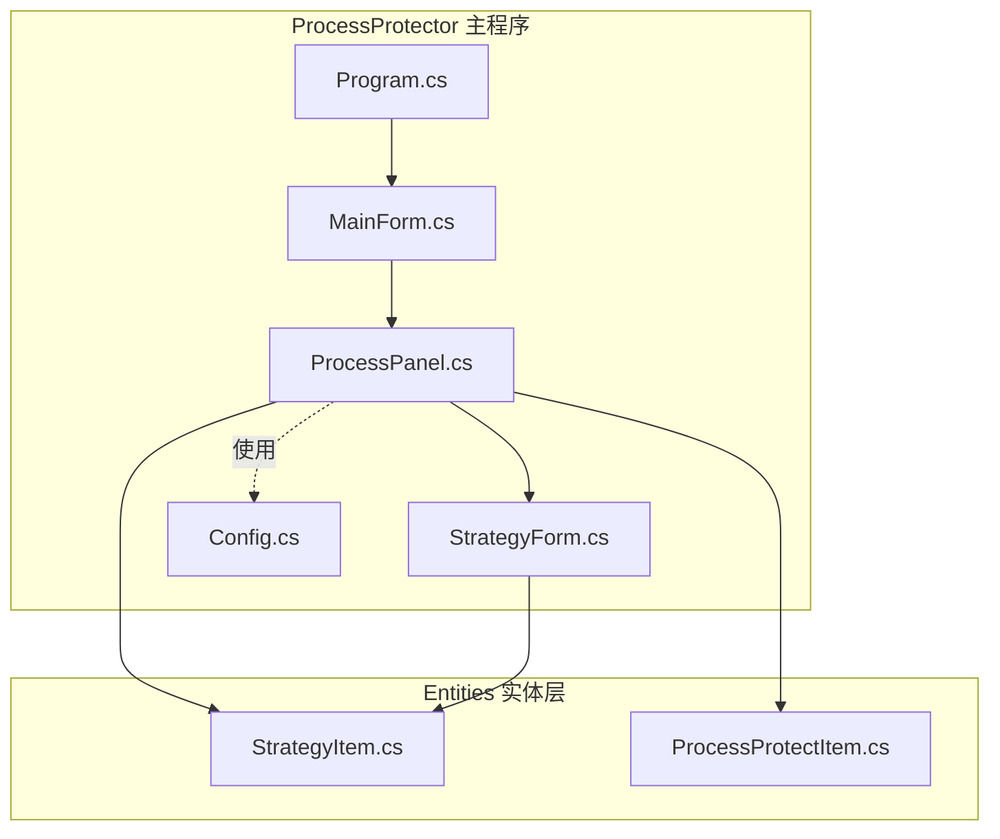
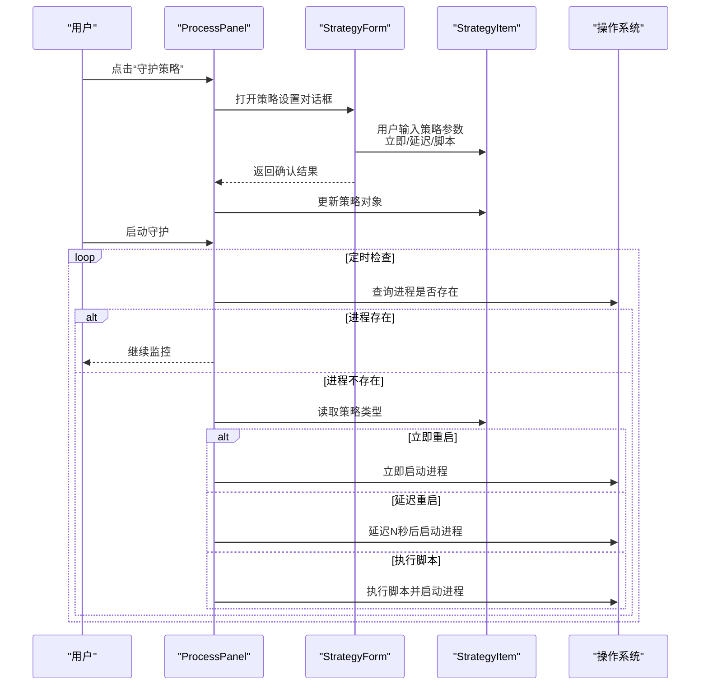
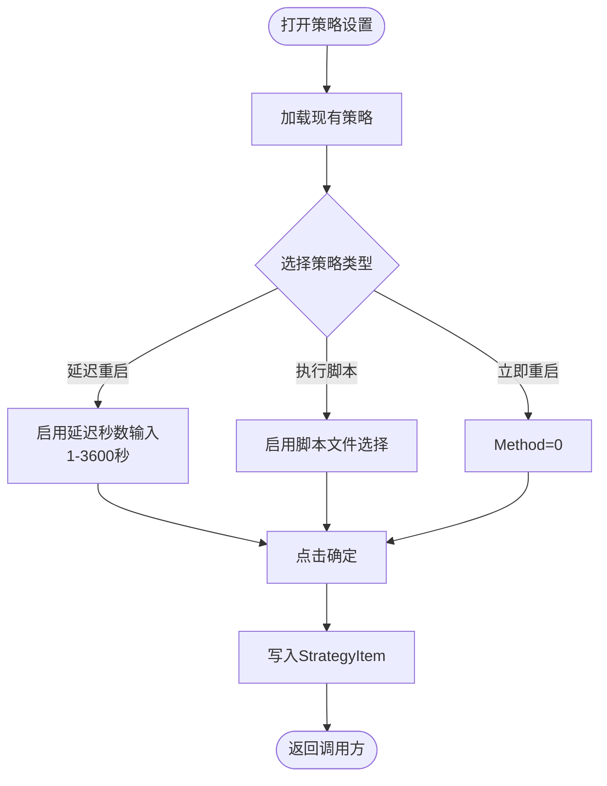
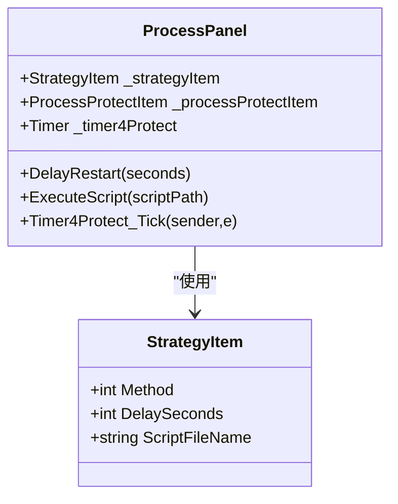
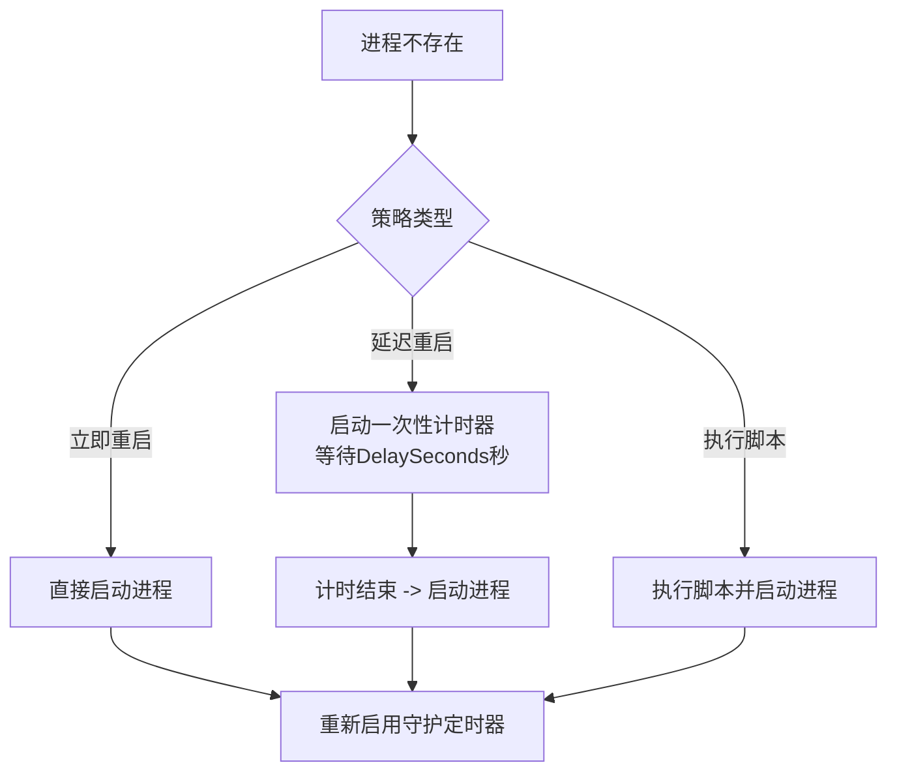
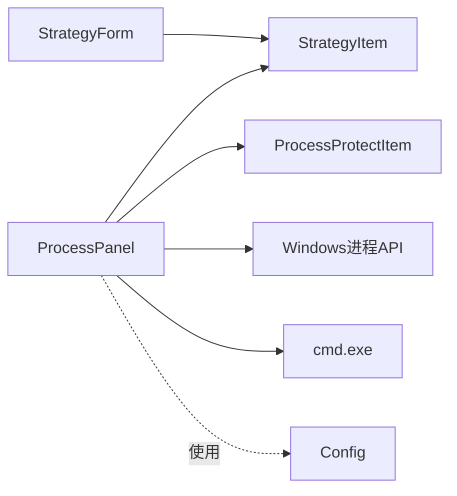

# 保护策略配置

<cite>
**本文引用的文件**
- [StrategyForm.cs](file://ProcessProtector/StrategyForm.cs)
- [StrategyForm.Designer.cs](file://ProcessProtector/StrategyForm.Designer.cs)
- [StrategyItem.cs](file://ProcessProtector/Entities/StrategyItem.cs)
- [ProcessPanel.cs](file://ProcessProtector/ProcessPanel.cs)
- [ProcessProtectItem.cs](file://ProcessProtector/Entities/ProcessProtectItem.cs)
- [MainForm.cs](file://ProcessProtector/MainForm.cs)
- [Config.cs](file://ProcessProtector/Config.cs)
- [Program.cs](file://ProcessProtector/Program.cs)
</cite>

## 目录
1. [简介](#简介)
2. [项目结构](#项目结构)
3. [核心组件](#核心组件)
4. [架构总览](#架构总览)
5. [详细组件分析](#详细组件分析)
6. [依赖关系分析](#依赖关系分析)
7. [性能考虑](#性能考虑)
8. [故障排查指南](#故障排查指南)
9. [结论](#结论)
10. [附录](#附录)

## 简介
本文件面向“保护策略配置”的功能文档，围绕进程守护中的策略设置与执行展开，重点覆盖：
- StrategyForm 的界面设计与策略配置流程
- StrategyItem 数据模型的属性定义与策略规则实现
- 进程重启策略的配置选项（立即重启、延迟重启、执行脚本）
- 自定义策略的创建方法与高级配置建议
- 策略验证、冲突检测与回滚机制的实现细节
- 不同应用场景下的策略配置示例与性能调优建议

## 项目结构
本项目采用 WinForms 桌面应用结构，核心模块如下：
- ProcessProtector 主程序：包含主窗体、策略表单、进程面板等
- Entities 实体层：封装策略项与进程守护项的数据模型
- Config 配置常量：统一控件间距与边距参数
- Program 入口：应用程序启动点

图表来源
- [MainForm.cs](file://ProcessProtector/MainForm.cs#L1-L188)
- [ProcessPanel.cs](file://ProcessProtector/ProcessPanel.cs#L1-L232)
- [StrategyForm.cs](file://ProcessProtector/StrategyForm.cs#L1-L148)
- [StrategyItem.cs](file://ProcessProtector/Entities/StrategyItem.cs#L1-L22)
- [ProcessProtectItem.cs](file://ProcessProtector/Entities/ProcessProtectItem.cs#L1-L22)
- [Config.cs](file://ProcessProtector/Config.cs#L1-L9)
- [Program.cs](file://ProcessProtector/Program.cs#L1-L23)

章节来源
- [MainForm.cs](file://ProcessProtector/MainForm.cs#L1-L188)
- [ProcessPanel.cs](file://ProcessProtector/ProcessPanel.cs#L1-L232)
- [StrategyForm.cs](file://ProcessProtector/StrategyForm.cs#L1-L148)
- [StrategyItem.cs](file://ProcessProtector/Entities/StrategyItem.cs#L1-L22)
- [ProcessProtectItem.cs](file://ProcessProtector/Entities/ProcessProtectItem.cs#L1-L22)
- [Config.cs](file://ProcessProtector/Config.cs#L1-L9)
- [Program.cs](file://ProcessProtector/Program.cs#L1-L23)

## 核心组件
- StrategyForm：策略设置对话框，负责用户输入策略参数并返回 StrategyItem
- StrategyItem：策略数据模型，包含策略类型、延迟秒数、脚本文件名
- ProcessPanel：进程守护面板，负责进程监控与策略执行
- ProcessProtectItem：进程守护实体，记录进程名称、路径与状态
- Config：UI 布局常量（控件间距、内边距）

章节来源
- [StrategyForm.cs](file://ProcessProtector/StrategyForm.cs#L1-L148)
- [StrategyItem.cs](file://ProcessProtector/Entities/StrategyItem.cs#L1-L22)
- [ProcessPanel.cs](file://ProcessProtector/ProcessPanel.cs#L1-L232)
- [ProcessProtectItem.cs](file://ProcessProtector/Entities/ProcessProtectItem.cs#L1-L22)
- [Config.cs](file://ProcessProtector/Config.cs#L1-L9)

## 架构总览
策略配置从界面到执行的端到端流程如下：

图表来源
- [ProcessPanel.cs](file://ProcessProtector/ProcessPanel.cs#L84-L107)
- [StrategyForm.cs](file://ProcessProtector/StrategyForm.cs#L28-L57)
- [StrategyItem.cs](file://ProcessProtector/Entities/StrategyItem.cs#L1-L22)

## 详细组件分析

### StrategyForm 界面设计与策略配置流程
- 界面元素
  - 单选按钮：立即重启、延迟重启、执行脚本
  - 数值输入框：延迟秒数（范围 1-3600 秒）
  - 文本框：脚本文件路径（只读，通过点击弹出文件选择对话框）
  - 确定按钮：返回确认结果
- 配置流程
  - 初始化 UI：设置窗体尺寸、边框、居中显示
  - 加载策略：根据 StrategyItem 设置当前选中项与数值
  - 保存策略：将用户输入映射为 StrategyItem 对象
  - 文件选择：点击脚本文件文本框打开文件对话框，仅允许 .bat/.cmd

图表来源
- [StrategyForm.cs](file://ProcessProtector/StrategyForm.cs#L76-L145)
- [StrategyForm.Designer.cs](file://ProcessProtector/StrategyForm.Designer.cs#L1-L39)

章节来源
- [StrategyForm.cs](file://ProcessProtector/StrategyForm.cs#L1-L148)
- [StrategyForm.Designer.cs](file://ProcessProtector/StrategyForm.Designer.cs#L1-L39)

### StrategyItem 数据模型与策略规则
- 属性定义
  - Method：策略类型（0=立即重启，1=延迟重启，2=执行脚本）
  - DelaySeconds：延迟重启的等待秒数（默认 60）
  - ScriptFileName：执行脚本的完整路径（可空）
- 规则实现
  - 立即重启：进程不存在时直接启动
  - 延迟重启：进程不存在时等待指定秒数后再启动
  - 执行脚本：进程不存在时先执行脚本，再启动进程

图表来源
- [StrategyItem.cs](file://ProcessProtector/Entities/StrategyItem.cs#L1-L22)
- [ProcessPanel.cs](file://ProcessProtector/ProcessPanel.cs#L36-L107)

章节来源
- [StrategyItem.cs](file://ProcessProtector/Entities/StrategyItem.cs#L1-L22)
- [ProcessPanel.cs](file://ProcessProtector/ProcessPanel.cs#L1-L232)

### 进程重启策略的配置选项与实现
- 立即重启
  - 触发条件：进程不存在
  - 执行动作：直接启动进程
  - 日志输出：记录启动时间与进程名
- 延迟重启
  - 触发条件：进程不存在
  - 配置项：DelaySeconds（1-3600 秒）
  - 执行动作：禁用定时器，启动一次性计时器，到期后启动进程并重新启用守护定时器
- 执行脚本
  - 触发条件：进程不存在
  - 配置项：ScriptFileName（必须为 .bat/.cmd）
  - 执行动作：使用 cmd.exe /c 调用脚本，读取标准输出并打印，随后启动进程

图表来源
- [ProcessPanel.cs](file://ProcessProtector/ProcessPanel.cs#L84-L107)
- [StrategyItem.cs](file://ProcessProtector/Entities/StrategyItem.cs#L1-L22)

章节来源
- [ProcessPanel.cs](file://ProcessProtector/ProcessPanel.cs#L36-L107)
- [StrategyItem.cs](file://ProcessProtector/Entities/StrategyItem.cs#L1-L22)

### 自定义策略的创建方法与高级配置
- 创建策略
  - 在策略设置对话框中选择策略类型并填写参数
  - 立即重启：无需额外配置
  - 延迟重启：设置 DelaySeconds（建议结合业务恢复时间）
  - 执行脚本：选择 .bat/.cmd 脚本文件，确保脚本具备执行权限
- 高级配置建议
  - 脚本健壮性：在脚本中加入日志记录与错误处理，避免阻塞或异常导致进程无法启动
  - 资源占用：延迟重启可减少频繁重启对系统的影响
  - 权限控制：确保脚本与目标进程具有必要的执行权限
  - 失败重试：可在脚本中实现重试逻辑，配合 DelaySeconds 形成退避策略

章节来源
- [StrategyForm.cs](file://ProcessProtector/StrategyForm.cs#L28-L57)
- [ProcessPanel.cs](file://ProcessProtector/ProcessPanel.cs#L48-L66)

### 策略验证、冲突检测与回滚机制
- 策略验证
  - 延迟秒数范围校验：1-3600 秒（由数值控件限制）
  - 脚本文件存在性：未在代码中进行显式校验，建议在脚本执行前增加存在性与可执行性检查
- 冲突检测
  - 策略类型互斥：单选按钮保证一次只能选择一种策略
  - 参数冲突：延迟重启与执行脚本可同时存在，但需注意脚本执行耗时可能影响延迟重启的时机
- 回滚机制
  - 当前实现未提供策略回滚功能。建议在策略切换时记录上一版本，并在失败时自动回退

章节来源
- [StrategyForm.cs](file://ProcessProtector/StrategyForm.cs#L101-L111)
- [ProcessPanel.cs](file://ProcessProtector/ProcessPanel.cs#L84-L107)

### 不同应用场景下的策略配置示例
- Web 服务（IIS）守护
  - 策略：延迟重启（DelaySeconds=60）
  - 原因：IIS 重启需要时间，延迟可避免频繁重启
- 数据库代理进程
  - 策略：执行脚本（ScriptFileName=数据库健康检查.bat）
  - 原因：脚本中执行连接测试与修复命令，成功后再启动进程
- 高频交易服务
  - 策略：立即重启（Method=0）
  - 原因：快速恢复，容忍短时间停机

章节来源
- [StrategyItem.cs](file://ProcessProtector/Entities/StrategyItem.cs#L1-L22)
- [ProcessPanel.cs](file://ProcessProtector/ProcessPanel.cs#L84-L107)

## 依赖关系分析
- 组件耦合
  - ProcessPanel 依赖 StrategyItem 与 ProcessProtectItem
  - StrategyForm 与 StrategyItem 双向交互（读取/写入）
  - Config 提供 UI 布局常量，被多个窗体使用
- 外部依赖
  - Windows 进程 API：用于查询进程是否存在
  - cmd.exe：用于执行脚本
- 潜在问题
  - 策略切换未持久化：当前策略仅在内存中生效，重启后丢失
  - 缺少脚本执行超时与错误处理：建议增加超时与异常捕获

图表来源
- [ProcessPanel.cs](file://ProcessProtector/ProcessPanel.cs#L1-L232)
- [StrategyForm.cs](file://ProcessProtector/StrategyForm.cs#L1-L148)
- [StrategyItem.cs](file://ProcessProtector/Entities/StrategyItem.cs#L1-L22)
- [ProcessProtectItem.cs](file://ProcessProtector/Entities/ProcessProtectItem.cs#L1-L22)
- [Config.cs](file://ProcessProtector/Config.cs#L1-L9)

章节来源
- [ProcessPanel.cs](file://ProcessProtector/ProcessPanel.cs#L1-L232)
- [StrategyForm.cs](file://ProcessProtector/StrategyForm.cs#L1-L148)
- [StrategyItem.cs](file://ProcessProtector/Entities/StrategyItem.cs#L1-L22)
- [ProcessProtectItem.cs](file://ProcessProtector/Entities/ProcessProtectItem.cs#L1-L22)
- [Config.cs](file://ProcessProtector/Config.cs#L1-L9)

## 性能考虑
- 定时器频率
  - 守护定时器间隔为 1 秒，建议根据业务场景调整（如 5-10 秒），降低 CPU 占用
- 脚本执行
  - 脚本应尽量轻量化，避免长时间阻塞；必要时使用异步执行
- 延迟重启
  - 合理设置 DelaySeconds，避免过长导致业务长时间不可用
- 日志输出
  - 日志频繁写入会影响性能，建议在生产环境降低日志级别或按需输出

## 故障排查指南
- 进程无法启动
  - 检查进程路径是否正确（由进程名解析得到）
  - 检查权限与依赖项
- 脚本执行失败
  - 确认脚本路径有效且可执行
  - 查看脚本标准输出与错误信息
- 策略不生效
  - 确认已点击“启动”启用守护
  - 检查策略类型与参数是否正确
- UI 布局异常
  - 检查 Config 中的 ControlMargin 与 ControlPadding 是否合理

章节来源
- [ProcessPanel.cs](file://ProcessProtector/ProcessPanel.cs#L156-L170)
- [ProcessPanel.cs](file://ProcessProtector/ProcessPanel.cs#L48-L66)
- [Config.cs](file://ProcessProtector/Config.cs#L1-L9)

## 结论
本方案提供了简洁高效的进程守护策略配置能力，支持立即重启、延迟重启与执行脚本三种模式。通过 StrategyForm 与 StrategyItem 的清晰分离，实现了良好的可扩展性。建议后续增强脚本执行健壮性、策略持久化与回滚机制，以满足更复杂的生产环境需求。

## 附录
- 启动入口
  - Program.Main：应用程序启动点，运行 MainForm
- 主窗体职责
  - 提供标签页容器与工具栏，承载进程守护面板
- 实体类职责
  - StrategyItem：策略数据载体
  - ProcessProtectItem：进程信息载体

章节来源
- [Program.cs](file://ProcessProtector/Program.cs#L1-L23)
- [MainForm.cs](file://ProcessProtector/MainForm.cs#L1-L188)
- [StrategyItem.cs](file://ProcessProtector/Entities/StrategyItem.cs#L1-L22)
- [ProcessProtectItem.cs](file://ProcessProtector/Entities/ProcessProtectItem.cs#L1-L22)