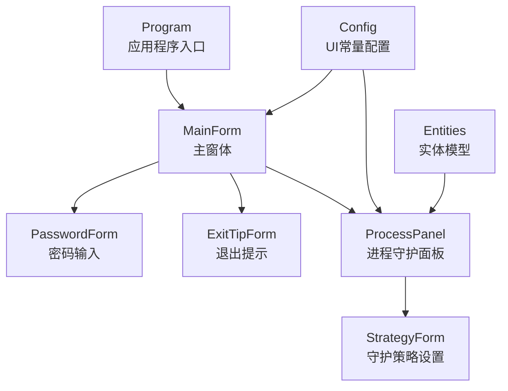
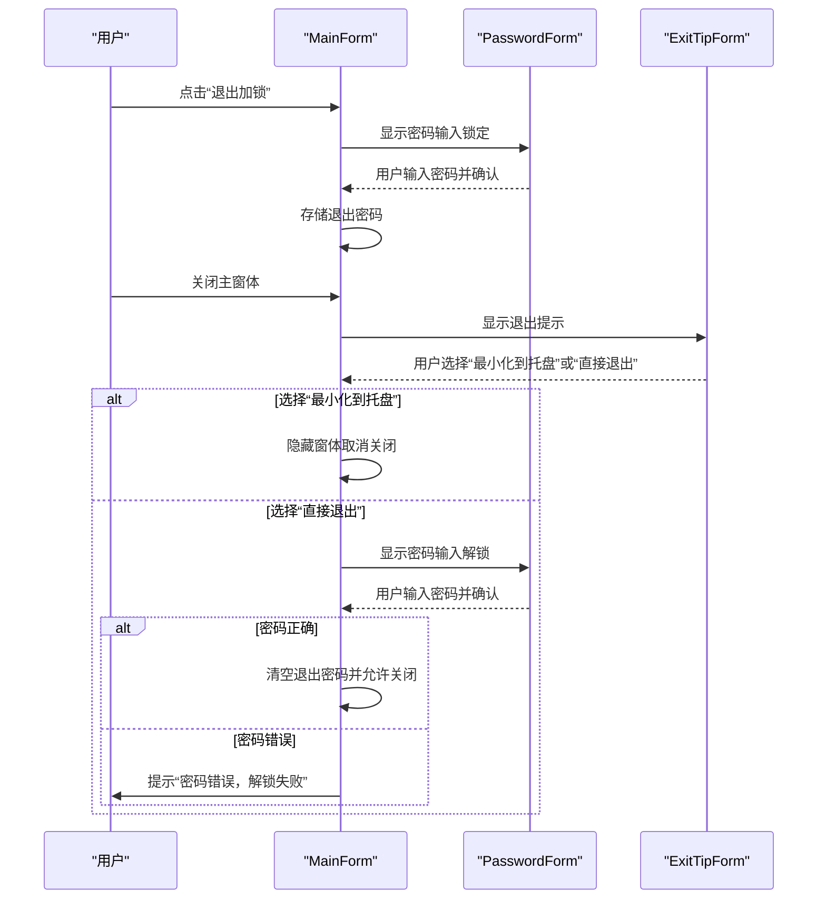
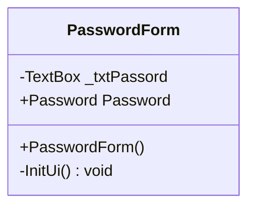
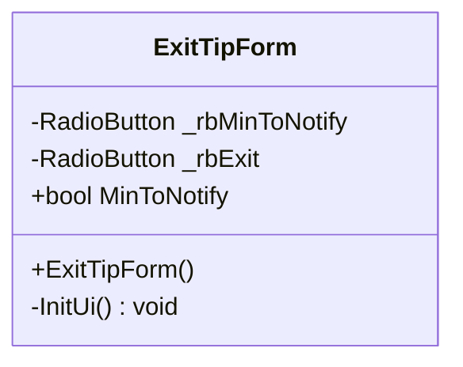
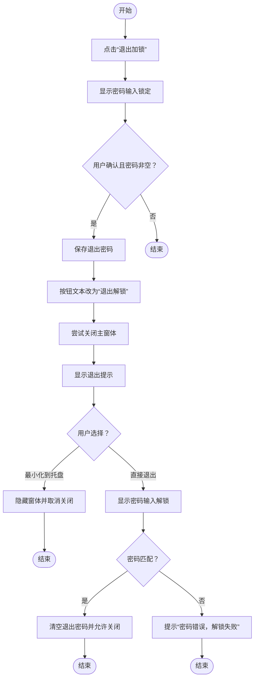
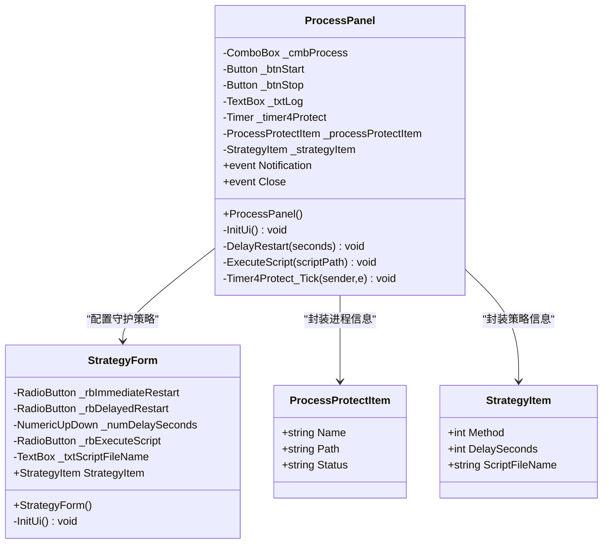
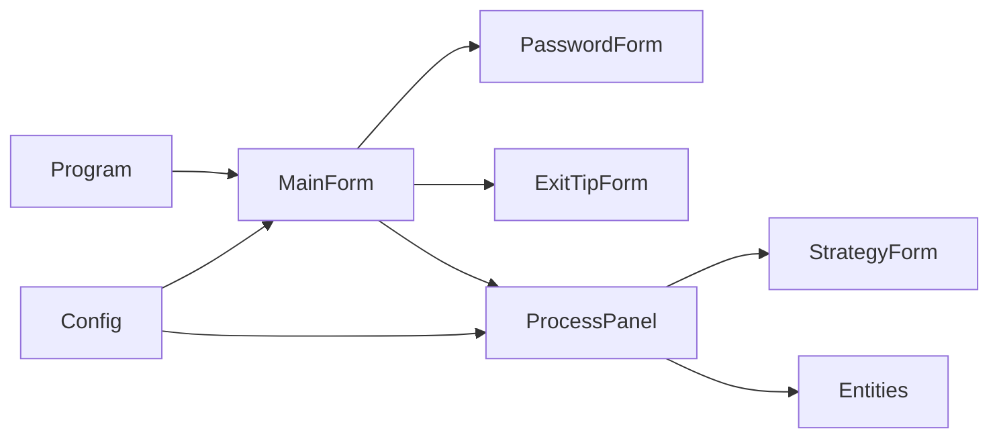

# 安全保护功能

<cite>
**本文引用的文件**
- [ProcessProtector/PasswordForm.cs](file://ProcessProtector/PasswordForm.cs)
- [ProcessProtector/PasswordForm.Designer.cs](file://ProcessProtector/PasswordForm.Designer.cs)
- [ProcessProtector/ExitTipForm.cs](file://ProcessProtector/ExitTipForm.cs)
- [ProcessProtector/MainForm.cs](file://ProcessProtector/MainForm.cs)
- [ProcessProtector/Program.cs](file://ProcessProtector/Program.cs)
- [ProcessProtector/Config.cs](file://ProcessProtector/Config.cs)
- [ProcessProtector/ProcessPanel.cs](file://ProcessProtector/ProcessPanel.cs)
- [ProcessProtector/StrategyForm.cs](file://ProcessProtector/StrategyForm.cs)
- [ProcessProtector/Entities/ProcessProtectItem.cs](file://ProcessProtector/Entities/ProcessProtectItem.cs)
- [ProcessProtector/Entities/StrategyItem.cs](file://ProcessProtector/Entities/StrategyItem.cs)
</cite>

## 目录
1. [引言](#引言)
2. [项目结构](#项目结构)
3. [核心组件](#核心组件)
4. [架构总览](#架构总览)
5. [详细组件分析](#详细组件分析)
6. [依赖关系分析](#依赖关系分析)
7. [性能与可用性考量](#性能与可用性考量)
8. [安全威胁分析与防护](#安全威胁分析与防护)
9. [应急响应方案](#应急响应方案)
10. [安全配置示例与最佳实践](#安全配置示例与最佳实践)
11. [故障排查指南](#故障排查指南)
12. [结论](#结论)

## 引言
本文件聚焦于 ProcessProtector 模块中的安全保护功能，围绕以下目标展开：
- PasswordForm 的密码输入界面设计与安全校验机制
- 退出确认机制 ExitTipForm 的交互与安全控制
- 与“退出加锁”流程相关的数据存储与验证逻辑
- 多用户管理与权限控制的建议实践
- 安全威胁分析、防护措施与应急响应
- 安全配置示例与常见问题解决方案

## 项目结构
ProcessProtector 是一个基于 WinForms 的桌面应用模块，主要由以下部分组成：
- 入口与主窗体：Program、MainForm
- 安全交互窗体：PasswordForm（密码输入）、ExitTipForm（退出提示）
- 功能面板：ProcessPanel（进程守护）、StrategyForm（守护策略）
- 配置与实体：Config、Entities 下的实体类

图表来源
- [ProcessProtector/Program.cs](file://ProcessProtector/Program.cs#L1-L23)
- [ProcessProtector/MainForm.cs](file://ProcessProtector/MainForm.cs#L1-L188)
- [ProcessProtector/PasswordForm.cs](file://ProcessProtector/PasswordForm.cs#L1-L55)
- [ProcessProtector/ExitTipForm.cs](file://ProcessProtector/ExitTipForm.cs#L1-L66)
- [ProcessProtector/ProcessPanel.cs](file://ProcessProtector/ProcessPanel.cs#L1-L232)
- [ProcessProtector/StrategyForm.cs](file://ProcessProtector/StrategyForm.cs#L1-L149)
- [ProcessProtector/Config.cs](file://ProcessProtector/Config.cs#L1-L9)
- [ProcessProtector/Entities/ProcessProtectItem.cs](file://ProcessProtector/Entities/ProcessProtectItem.cs#L1-L22)
- [ProcessProtector/Entities/StrategyItem.cs](file://ProcessProtector/Entities/StrategyItem.cs#L1-L22)

章节来源
- [ProcessProtector/Program.cs](file://ProcessProtector/Program.cs#L1-L23)
- [ProcessProtector/MainForm.cs](file://ProcessProtector/MainForm.cs#L1-L188)
- [ProcessProtector/Config.cs](file://ProcessProtector/Config.cs#L1-L9)

## 核心组件
- PasswordForm：提供密码输入界面，用于“退出加锁”的设置与解锁操作。界面采用固定对话框样式，禁用最大化/最小化，不显示在任务栏，居中父窗体显示，仅包含一个文本框与“确定”按钮。
- ExitTipForm：提供退出行为选择，支持“最小化到系统托盘”或“直接退出”，通过单选框进行二选一，并以“确定”按钮确认。
- MainForm：承载“退出加锁”业务逻辑，负责弹出 PasswordForm 获取密码、与 ExitTipForm 协作处理退出流程，并维护当前退出密码状态。
- ProcessPanel：进程守护的核心面板，包含启动/停止/关闭等操作，以及与守护策略的交互。
- StrategyForm：守护策略配置窗体，支持三种策略：立即重启、延迟重启、执行脚本。
- Config：UI 布局常量（控件间距、边距）。
- Entities：进程守护与策略的轻量实体模型。

章节来源
- [ProcessProtector/PasswordForm.cs](file://ProcessProtector/PasswordForm.cs#L1-L55)
- [ProcessProtector/ExitTipForm.cs](file://ProcessProtector/ExitTipForm.cs#L1-L66)
- [ProcessProtector/MainForm.cs](file://ProcessProtector/MainForm.cs#L1-L188)
- [ProcessProtector/ProcessPanel.cs](file://ProcessProtector/ProcessPanel.cs#L1-L232)
- [ProcessProtector/StrategyForm.cs](file://ProcessProtector/StrategyForm.cs#L1-L149)
- [ProcessProtector/Config.cs](file://ProcessProtector/Config.cs#L1-L9)
- [ProcessProtector/Entities/ProcessProtectItem.cs](file://ProcessProtector/Entities/ProcessProtectItem.cs#L1-L22)
- [ProcessProtector/Entities/StrategyItem.cs](file://ProcessProtector/Entities/StrategyItem.cs#L1-L22)

## 架构总览
下图展示了“退出加锁”与“退出提示”的关键交互流程：

图表来源
- [ProcessProtector/MainForm.cs](file://ProcessProtector/MainForm.cs#L38-L111)
- [ProcessProtector/PasswordForm.cs](file://ProcessProtector/PasswordForm.cs#L9-L54)
- [ProcessProtector/ExitTipForm.cs](file://ProcessProtector/ExitTipForm.cs#L9-L65)

## 详细组件分析

### PasswordForm 组件分析
- 界面设计
  - 固定对话框样式，禁用最大化/最小化，不显示在任务栏，居中父窗体，标题为“密码”。
  - 包含一个文本框用于输入密码，以及一个“确定”按钮，点击返回 DialogResult.OK。
- 数据访问
  - 通过只读属性暴露当前输入的密码字符串（已去除首尾空白）。
- 安全要点
  - 当前实现未对输入内容进行任何加密或掩码处理；密码明文存储于内存变量中，生命周期与窗体一致。
  - 建议在后续版本中引入密码掩码输入、输入长度限制、字符集白名单、防暴力破解的输入限制与超时机制。

图表来源
- [ProcessProtector/PasswordForm.cs](file://ProcessProtector/PasswordForm.cs#L9-L54)

章节来源
- [ProcessProtector/PasswordForm.cs](file://ProcessProtector/PasswordForm.cs#L1-L55)
- [ProcessProtector/PasswordForm.Designer.cs](file://ProcessProtector/PasswordForm.Designer.cs#L1-L39)

### ExitTipForm 组件分析
- 界面设计
  - 固定对话框样式，禁用最大化/最小化，不显示在任务栏，居中父窗体，标题为“提示”。
  - 提供两个单选框：“最小化到系统托盘”（默认选中）与“直接退出”，以及“确定”按钮。
- 行为逻辑
  - 通过只读属性返回用户是否选择了“最小化到系统托盘”。
- 安全要点
  - 该窗体本身不涉及敏感信息输入，但其选择会影响退出流程的安全性（例如是否需要二次密码校验）。

图表来源
- [ProcessProtector/ExitTipForm.cs](file://ProcessProtector/ExitTipForm.cs#L9-L65)

章节来源
- [ProcessProtector/ExitTipForm.cs](file://ProcessProtector/ExitTipForm.cs#L1-L66)

### MainForm 中的“退出加锁”流程
- 设置加锁
  - 弹出 PasswordForm（标题为“锁定”），若用户确认且输入非空，则将输入的密码保存至内存变量，按钮文本切换为“退出解锁”。
- 解锁与退出
  - 若用户选择“最小化到托盘”，则隐藏窗体并取消关闭事件。
  - 若用户选择“直接退出”：
    - 弹出 PasswordForm（标题为“解锁”），要求再次输入密码；
    - 若密码匹配，清空内存中的退出密码并允许关闭；
    - 若密码不匹配，提示“密码错误，解锁失败”。

图表来源
- [ProcessProtector/MainForm.cs](file://ProcessProtector/MainForm.cs#L38-L111)
- [ProcessProtector/PasswordForm.cs](file://ProcessProtector/PasswordForm.cs#L9-L54)
- [ProcessProtector/ExitTipForm.cs](file://ProcessProtector/ExitTipForm.cs#L9-L65)

章节来源
- [ProcessProtector/MainForm.cs](file://ProcessProtector/MainForm.cs#L38-L111)

### ProcessPanel 与守护策略
- 启动/停止/关闭：用户可启动或停止进程守护定时器，关闭时释放资源。
- 守护策略：根据策略项执行立即重启、延迟重启或执行脚本后再启动。
- 安全要点
  - 执行脚本时使用命令行外壳，建议限制脚本来源与权限，避免执行不受信任的外部脚本。
  - 延迟重启参数需进行范围校验，防止异常值导致长时间阻塞。

图表来源
- [ProcessProtector/ProcessPanel.cs](file://ProcessProtector/ProcessPanel.cs#L12-L232)
- [ProcessProtector/StrategyForm.cs](file://ProcessProtector/StrategyForm.cs#L11-L149)
- [ProcessProtector/Entities/ProcessProtectItem.cs](file://ProcessProtector/Entities/ProcessProtectItem.cs#L6-L21)
- [ProcessProtector/Entities/StrategyItem.cs](file://ProcessProtector/Entities/StrategyItem.cs#L6-L21)

章节来源
- [ProcessProtector/ProcessPanel.cs](file://ProcessProtector/ProcessPanel.cs#L1-L232)
- [ProcessProtector/StrategyForm.cs](file://ProcessProtector/StrategyForm.cs#L1-L149)
- [ProcessProtector/Entities/ProcessProtectItem.cs](file://ProcessProtector/Entities/ProcessProtectItem.cs#L1-L22)
- [ProcessProtector/Entities/StrategyItem.cs](file://ProcessProtector/Entities/StrategyItem.cs#L1-L22)

## 依赖关系分析
- MainForm 依赖 PasswordForm 与 ExitTipForm 完成“退出加锁/解锁”与退出行为选择。
- ProcessPanel 依赖 StrategyForm 与实体类完成策略配置与执行。
- Config 为 UI 布局提供统一的间距与边距常量，降低耦合度。
- Program 作为应用入口，启动 MainForm。

图表来源
- [ProcessProtector/Program.cs](file://ProcessProtector/Program.cs#L9-L21)
- [ProcessProtector/MainForm.cs](file://ProcessProtector/MainForm.cs#L8-L187)
- [ProcessProtector/PasswordForm.cs](file://ProcessProtector/PasswordForm.cs#L9-L54)
- [ProcessProtector/ExitTipForm.cs](file://ProcessProtector/ExitTipForm.cs#L9-L65)
- [ProcessProtector/ProcessPanel.cs](file://ProcessProtector/ProcessPanel.cs#L12-L232)
- [ProcessProtector/StrategyForm.cs](file://ProcessProtector/StrategyForm.cs#L11-L149)
- [ProcessProtector/Config.cs](file://ProcessProtector/Config.cs#L3-L8)

章节来源
- [ProcessProtector/Program.cs](file://ProcessProtector/Program.cs#L1-L23)
- [ProcessProtector/MainForm.cs](file://ProcessProtector/MainForm.cs#L1-L188)
- [ProcessProtector/Config.cs](file://ProcessProtector/Config.cs#L1-L9)

## 性能与可用性考量
- UI 响应
  - PasswordForm 与 ExitTipForm 采用固定对话框样式，尺寸较小，确保快速交互。
  - MainForm 在关闭时弹出提示，避免误关机导致的业务中断。
- 守护策略
  - ProcessPanel 的定时器间隔为 1 秒，策略执行在 Tick 事件中触发，需注意策略执行耗时与日志输出频率。
- 可用性
  - “最小化到系统托盘”选项提升用户体验，避免频繁打开/关闭应用。
  - “直接退出”流程要求二次密码校验，增强安全性。

[本节为通用建议，无需特定文件引用]

## 安全威胁分析与防护
- 威胁场景
  - 本地暴力破解：攻击者可能尝试穷举退出密码，导致应用被强制退出。
  - 会话劫持：当前实现未使用会话令牌或加密通道，存在本地会话被旁路的风险。
  - 不受信任脚本执行：守护策略可执行脚本，若脚本来源不可信，可能导致恶意代码执行。
  - 明文密码存储：退出密码以明文形式存储在内存变量中，存在被内存转储或调试器读取的风险。
- 防护措施
  - 输入限制与超时：对 PasswordForm 的输入进行长度与字符集限制，增加输入超时与失败次数限制。
  - 加密存储：将退出密码以加密形式存储于受保护的内存区域或安全存储介质（如 DPAPI），并在退出时及时清理。
  - 策略白名单：限制可执行脚本的路径与扩展名，仅允许受信任目录内的脚本。
  - 会话安全：在多用户环境下，为每个用户单独维护退出密码，避免跨用户影响。
  - 日志审计：记录“退出加锁/解锁”与“直接退出”的关键事件，便于审计与追踪。
- 应急响应
  - 发现异常退出或暴力破解迹象时，立即清除内存中的退出密码，临时禁用“直接退出”功能，并通知管理员。
  - 对可疑脚本执行进行隔离与取证，必要时回滚策略配置。

[本节为通用建议，无需特定文件引用]

## 应急响应方案
- 密码泄露
  - 步骤：立即清除内存中的退出密码，修改新密码，重新启用“退出加锁”。
  - 工具：通过“退出解锁”流程重置密码。
- 被强制退出
  - 步骤：检查日志，确认是否为“直接退出”流程触发；若为暴力破解，启用失败次数限制与超时。
- 脚本异常
  - 步骤：回滚到上一个稳定策略，检查脚本完整性与权限，必要时隔离脚本。

[本节为通用建议，无需特定文件引用]

## 安全配置示例与最佳实践
- 密码策略
  - 最小长度：至少 8 位
  - 字符集：字母、数字与特殊字符组合
  - 失败次数：连续失败超过 5 次锁定 1 分钟
  - 超时：输入超时 60 秒自动取消
- 权限控制
  - 多用户：为每个用户独立设置退出密码，避免共享
  - 最小权限：仅授予必要的系统权限，避免以管理员身份运行
- 策略配置
  - 立即重启：适用于关键服务，确保高可用
  - 延迟重启：设置合理延迟（如 60 秒），避免雪崩效应
  - 执行脚本：仅允许受信任目录内的脚本，严格校验文件路径与扩展名
- 配置示例（描述性）
  - 退出加锁：启用“退出加锁”，设置复杂密码
  - 退出提示：默认选择“最小化到系统托盘”，减少误操作
  - 守护策略：优先选择“立即重启”，必要时启用“延迟重启”

[本节为通用建议，无需特定文件引用]

## 故障排查指南
- 无法退出
  - 现象：点击“直接退出”后提示“退出已加锁，请先解锁”
  - 排查：确认是否设置了退出密码；若忘记密码，可通过“退出解锁”流程重置
- 密码错误
  - 现象：提示“密码错误，解锁失败”
  - 排查：确认输入的密码与设置的密码一致；检查键盘布局与大小写
- 退出提示未出现
  - 现象：直接关闭主窗体无提示
  - 排查：确认 MainForm 的 FormClosing 事件是否正确绑定；检查 ExitTipForm 的显示逻辑
- 脚本未执行
  - 现象：选择“执行脚本”后未生效
  - 排查：确认脚本路径与扩展名；检查脚本权限与执行环境

章节来源
- [ProcessProtector/MainForm.cs](file://ProcessProtector/MainForm.cs#L97-L111)
- [ProcessProtector/ProcessPanel.cs](file://ProcessProtector/ProcessPanel.cs#L48-L66)

## 结论
本模块通过 PasswordForm 与 ExitTipForm 实现了基础的“退出加锁/解锁”与退出行为控制，满足日常使用场景下的安全需求。为进一步提升安全性，建议引入密码掩码、加密存储、输入限制与超时机制，强化脚本执行策略的白名单与权限控制，并在多用户环境下实施独立的权限隔离与审计日志。通过合理的安全配置与应急响应流程，可有效降低本地暴力破解与误操作风险，保障系统的稳定与安全。