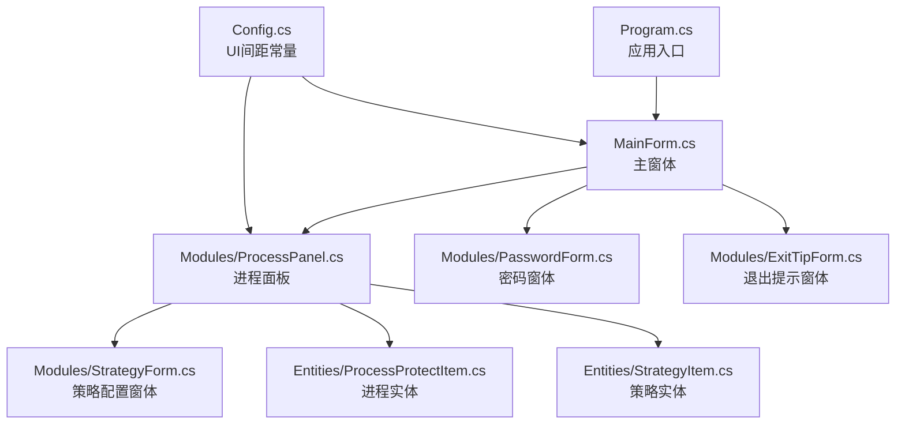
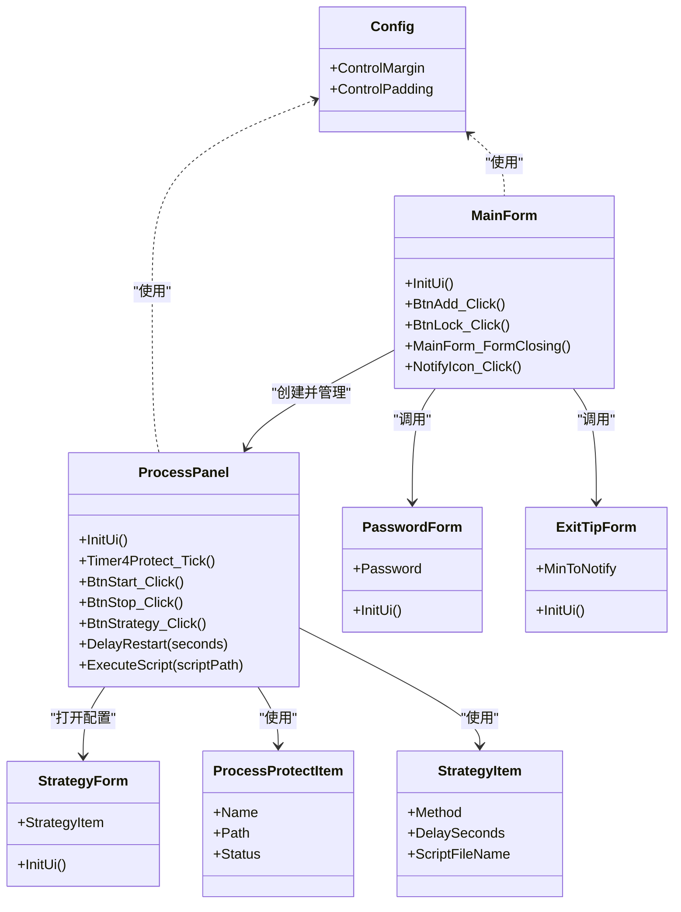
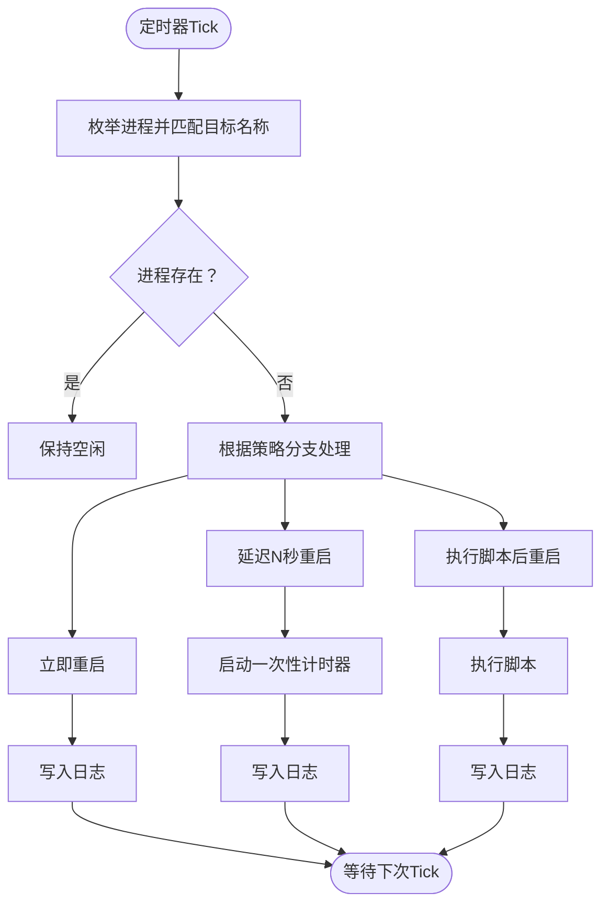
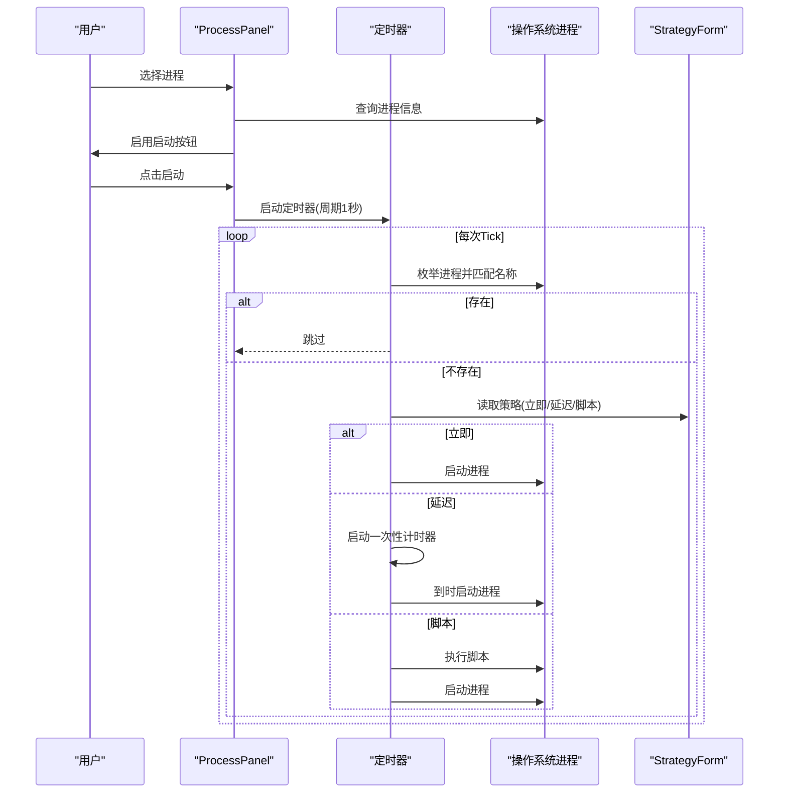
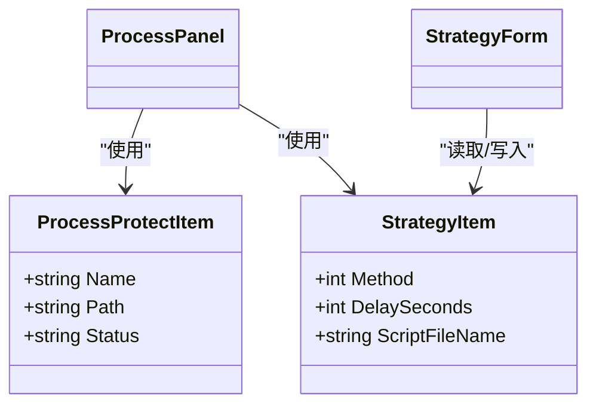
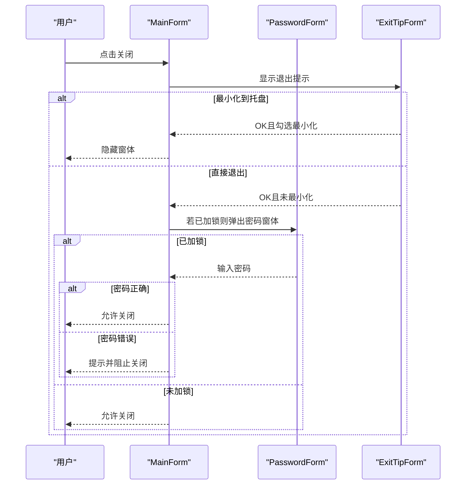
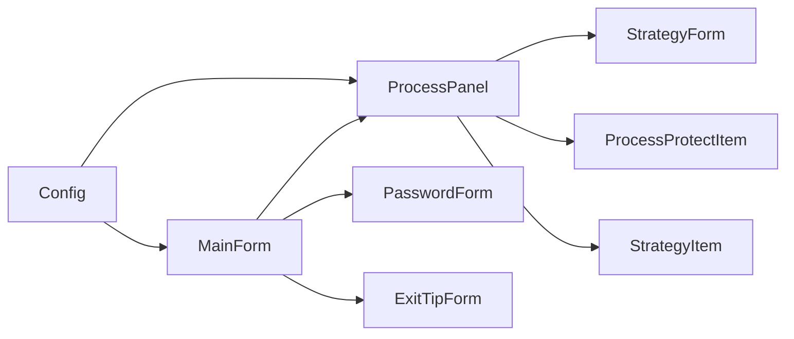

# 进程保护器功能详解

<cite>
**本文引用的文件**
- [MainForm.cs](file://ProcessProtector/MainForm.cs)
- [ProcessPanel.cs](file://ProcessProtector/Modules/ProcessPanel.cs)
- [ProcessProtectItem.cs](file://ProcessProtector/Entities/ProcessProtectItem.cs)
- [StrategyItem.cs](file://ProcessProtector/Entities/StrategyItem.cs)
- [StrategyForm.cs](file://ProcessProtector/Modules/StrategyForm.cs)
- [PasswordForm.cs](file://ProcessProtector/Modules/PasswordForm.cs)
- [ExitTipForm.cs](file://ProcessProtector/Modules/ExitTipForm.cs)
- [Config.cs](file://ProcessProtector/Config.cs)
- [Program.cs](file://ProcessProtector/Program.cs)
- [ProcessProtector.csproj](file://ProcessProtector/ProcessProtector.csproj)
</cite>

## 更新摘要
**变更内容**
- 更新项目结构以反映新的Entities和Modules子目录架构
- 更新文件路径引用以匹配新的目录组织方式
- 更新架构图以反映命名空间重构后的组件关系
- 更新依赖关系分析以体现新的命名空间引用

## 目录
1. [简介](#简介)
2. [项目结构](#项目结构)
3. [核心组件](#核心组件)
4. [架构总览](#架构总览)
5. [详细组件分析](#详细组件分析)
6. [依赖关系分析](#依赖关系分析)
7. [性能与可靠性考虑](#性能与可靠性考虑)
8. [安全配置与最佳实践](#安全配置与最佳实践)
9. [常见使用场景与配置示例](#常见使用场景与配置示例)
10. [故障排除指南](#故障排除指南)
11. [结论](#结论)

## 简介
本文件面向ProcessProtector进程保护器，系统性阐述其进程监控机制、保护策略配置、界面交互流程以及数据模型设计。重点覆盖以下方面：
- 进程监控与保护策略（立即重启、延迟重启、执行脚本后重启）
- ProcessPanel界面功能与操作流程
- ProcessProtectItem与StrategyItem数据模型的设计与使用
- 密码保护与退出确认机制及用户体验优化
- 自定义策略配置方法与最佳实践
- 常见问题排查与使用建议

## 项目结构
ProcessProtector采用WinForms桌面应用结构，经过重大架构重组后，采用Entities和Modules子目录来改善代码组织和可维护性。核心由主窗体、进程面板、策略配置窗体、密码窗体与退出提示窗体构成，并通过轻量配置类统一控件间距。

**更新** 项目结构已重构为Entities和Modules子目录，提升代码组织性和可维护性

**章节来源**
- [ProcessProtector.csproj](file://ProcessProtector/ProcessProtector.csproj#L50-L85)
- [MainForm.cs](file://ProcessProtector/MainForm.cs#L1-L189)
- [ProcessPanel.cs](file://ProcessProtector/Modules/ProcessPanel.cs#L1-L232)
- [ProcessProtectItem.cs](file://ProcessProtector/Entities/ProcessProtectItem.cs#L1-L22)
- [StrategyItem.cs](file://ProcessProtector/Entities/StrategyItem.cs#L1-L22)

## 核心组件
- 主窗体（MainForm）：负责工具栏按钮、标签页容器、托盘图标、退出确认与加锁控制。
- 进程面板（ProcessPanel）：负责进程选择、启动/停止、日志记录、定时器驱动的保护逻辑与策略配置入口。
- 策略窗体（StrategyForm）：提供三种策略配置（立即重启、延迟重启、执行脚本），并支持脚本文件选择。
- 数据模型：
  - ProcessProtectItem：封装被保护进程的名称、路径与状态。
  - StrategyItem：封装策略类型、延迟秒数与脚本文件名。
- 辅助窗体：PasswordForm（退出加锁密码输入）、ExitTipForm（退出时最小化或直接退出的选择）。
- 配置常量（Config）：统一控件边距与间距，保证界面一致性。

**更新** 所有组件文件已重新组织到Entities和Modules子目录中，命名空间相应调整

**章节来源**
- [MainForm.cs](file://ProcessProtector/MainForm.cs#L1-L189)
- [ProcessPanel.cs](file://ProcessProtector/Modules/ProcessPanel.cs#L1-L232)
- [ProcessProtectItem.cs](file://ProcessProtector/Entities/ProcessProtectItem.cs#L1-L22)
- [StrategyItem.cs](file://ProcessProtector/Entities/StrategyItem.cs#L1-L22)
- [StrategyForm.cs](file://ProcessProtector/Modules/StrategyForm.cs#L1-L149)
- [PasswordForm.cs](file://ProcessProtector/Modules/PasswordForm.cs#L1-L55)
- [ExitTipForm.cs](file://ProcessProtector/Modules/ExitTipForm.cs#L1-L66)
- [Config.cs](file://ProcessProtector/Config.cs#L1-L9)

## 架构总览
系统采用"主窗体承载多个进程面板"的多标签页模式，每个进程面板独立维护一个定时器与两个数据模型实例，实现对单个进程的独立保护。经过架构重组后，组件间的命名空间引用更加清晰。

**更新** 架构图已更新以反映新的命名空间组织方式，Entities和Modules子目录的组件关系更加清晰

**图表来源**
- [MainForm.cs](file://ProcessProtector/MainForm.cs#L1-L189)
- [ProcessPanel.cs](file://ProcessProtector/Modules/ProcessPanel.cs#L1-L232)
- [StrategyForm.cs](file://ProcessProtector/Modules/StrategyForm.cs#L1-L149)
- [PasswordForm.cs](file://ProcessProtector/Modules/PasswordForm.cs#L1-L55)
- [ExitTipForm.cs](file://ProcessProtector/Modules/ExitTipForm.cs#L1-L66)
- [ProcessProtectItem.cs](file://ProcessProtector/Entities/ProcessProtectItem.cs#L1-L22)
- [StrategyItem.cs](file://ProcessProtector/Entities/StrategyItem.cs#L1-L22)
- [Config.cs](file://ProcessProtector/Config.cs#L1-L9)

## 详细组件分析

### 进程监控与保护策略（ProcessPanel）
- 定时器驱动：面板内部维护一个定时器，周期性检查目标进程是否存活。
- 策略分支：
  - 立即重启：进程不存在时直接启动。
  - 延迟重启：设置倒计时后启动。
  - 执行脚本：先执行指定脚本，再启动进程。
- 日志输出：每次策略触发均写入日志文本框，便于审计与排障。
- 启动/停止：用户可手动启动/停止监控，面板状态同步更新并通过事件通知主窗体。

**更新** 代码已迁移到Modules目录，命名空间从ProcessProtector改为ProcessProtector.Modules

**图表来源**
- [ProcessPanel.cs](file://ProcessProtector/Modules/ProcessPanel.cs#L84-L107)

**章节来源**
- [ProcessPanel.cs](file://ProcessProtector/Modules/ProcessPanel.cs#L1-L232)

### 界面功能与操作流程（ProcessPanel）
- 进程选择：下拉框加载系统进程名，选中后解析主模块路径，启用启动按钮。
- 启动：禁用进程选择，启用停止按钮，开启定时器，更新状态并通知主窗体。
- 停止：恢复进程选择可用，关闭定时器，更新状态并通知主窗体。
- 关闭：停止定时器并触发关闭事件，主窗体负责释放标签页与控件资源。
- 守护策略：打开策略窗体进行配置，支持立即/延迟/脚本三种策略与脚本文件选择。

**更新** 所有组件引用已更新为新的命名空间，Entities和Modules目录结构更加清晰

**图表来源**
- [ProcessPanel.cs](file://ProcessProtector/Modules/ProcessPanel.cs#L136-L144)
- [StrategyForm.cs](file://ProcessProtector/Modules/StrategyForm.cs#L29-L58)

**章节来源**
- [ProcessPanel.cs](file://ProcessProtector/Modules/ProcessPanel.cs#L1-L232)
- [StrategyForm.cs](file://ProcessProtector/Modules/StrategyForm.cs#L1-L149)

### 数据模型设计与使用（ProcessProtectItem 与 StrategyItem）
- ProcessProtectItem
  - 字段：名称、路径、状态
  - 用途：在面板内保存当前选中进程的信息，并通过事件向主窗体反馈状态变化
- StrategyItem
  - 字段：策略方法（0/1/2）、延迟秒数、脚本文件名
  - 用途：在策略窗体内读取/写入策略配置，并传递给面板用于运行时决策

**更新** 数据模型已迁移到Entities目录，命名空间从ProcessProtector改为ProcessProtector.Entities

**图表来源**
- [ProcessProtectItem.cs](file://ProcessProtector/Entities/ProcessProtectItem.cs#L1-L22)
- [StrategyItem.cs](file://ProcessProtector/Entities/StrategyItem.cs#L1-L22)
- [ProcessPanel.cs](file://ProcessProtector/Modules/ProcessPanel.cs#L32-L33)
- [StrategyForm.cs](file://ProcessProtector/Modules/StrategyForm.cs#L29-L58)

**章节来源**
- [ProcessProtectItem.cs](file://ProcessProtector/Entities/ProcessProtectItem.cs#L1-L22)
- [StrategyItem.cs](file://ProcessProtector/Entities/StrategyItem.cs#L1-L22)
- [ProcessPanel.cs](file://ProcessProtector/Modules/ProcessPanel.cs#L32-L33)
- [StrategyForm.cs](file://ProcessProtector/Modules/StrategyForm.cs#L29-L58)

### 密码保护与退出确认机制
- 退出加锁
  - 用户点击"退出加锁"弹出密码窗体，输入非空密码后生效；再次点击"退出解锁"需验证密码一致方可解除。
  - 主窗体在FormClosing阶段检测是否处于加锁状态，若加锁则阻止关闭并提示。
- 退出确认
  - 用户尝试关闭主窗体时弹出退出提示窗体，提供"最小化到系统托盘"和"直接退出"两种选择。
  - 若选择最小化，则取消关闭并隐藏窗体；若选择直接退出且未加锁，则允许关闭。

**更新** 密码窗体和退出提示窗体已迁移到Modules目录，命名空间相应调整

**图表来源**
- [MainForm.cs](file://ProcessProtector/MainForm.cs#L98-L112)
- [PasswordForm.cs](file://ProcessProtector/Modules/PasswordForm.cs#L1-L55)
- [ExitTipForm.cs](file://ProcessProtector/Modules/ExitTipForm.cs#L1-L66)

**章节来源**
- [MainForm.cs](file://ProcessProtector/MainForm.cs#L39-L112)
- [PasswordForm.cs](file://ProcessProtector/Modules/PasswordForm.cs#L1-L55)
- [ExitTipForm.cs](file://ProcessProtector/Modules/ExitTipForm.cs#L1-L66)

### 策略窗体与自定义选项（StrategyForm）
- 策略类型
  - 立即重启：进程消失即刻启动
  - 延迟重启：设置延迟秒数，到期后启动
  - 执行脚本：先执行脚本，再启动进程
- 脚本选择
  - 支持通过对话框选择.bat/.cmd等脚本文件，路径保存于StrategyItem
- 数值范围
  - 延迟秒数上限为3600秒，下限为1秒，避免极端配置

**更新** 策略窗体已迁移到Modules目录，命名空间从ProcessProtector改为ProcessProtector.Modules

**章节来源**
- [StrategyForm.cs](file://ProcessProtector/Modules/StrategyForm.cs#L1-L149)
- [StrategyItem.cs](file://ProcessProtector/Entities/StrategyItem.cs#L1-L22)

## 依赖关系分析
- 组件耦合
  - MainForm与ProcessPanel通过事件通信（Notification/Close），降低直接耦合度
  - ProcessPanel内部持有StrategyForm实例以完成策略配置，形成"配置-执行"分离
- 外部依赖
  - Windows Forms UI框架
  - 系统进程枚举与进程启动能力
  - 文件系统访问（脚本执行）
- 命名空间重构
  - Entities命名空间：ProcessProtectItem、StrategyItem
  - Modules命名空间：ProcessPanel、StrategyForm、PasswordForm、ExitTipForm
  - 主命名空间：MainForm、Config、Program

**更新** 依赖关系已更新为新的命名空间组织，Entities和Modules子目录的职责更加明确

**图表来源**
- [MainForm.cs](file://ProcessProtector/MainForm.cs#L1-L189)
- [ProcessPanel.cs](file://ProcessProtector/Modules/ProcessPanel.cs#L1-L232)
- [StrategyForm.cs](file://ProcessProtector/Modules/StrategyForm.cs#L1-L149)
- [ProcessProtectItem.cs](file://ProcessProtector/Entities/ProcessProtectItem.cs#L1-L22)
- [StrategyItem.cs](file://ProcessProtector/Entities/StrategyItem.cs#L1-L22)
- [Config.cs](file://ProcessProtector/Config.cs#L1-L9)

**章节来源**
- [MainForm.cs](file://ProcessProtector/MainForm.cs#L1-L189)
- [ProcessPanel.cs](file://ProcessProtector/Modules/ProcessPanel.cs#L1-L232)
- [StrategyForm.cs](file://ProcessProtector/Modules/StrategyForm.cs#L1-L149)
- [ProcessProtectItem.cs](file://ProcessProtector/Entities/ProcessProtectItem.cs#L1-L22)
- [StrategyItem.cs](file://ProcessProtector/Entities/StrategyItem.cs#L1-L22)
- [Config.cs](file://ProcessProtector/Config.cs#L1-L9)

## 性能与可靠性考虑
- 定时器频率
  - 保护定时器默认1秒一次，平衡实时性与CPU占用；如需更低开销可适当增大间隔，但会增加进程不可用时间
- 进程枚举成本
  - 每次Tick都会枚举进程列表，建议仅在监控启用时开启定时器
- 脚本执行
  - 脚本执行为同步阻塞，建议脚本尽量短小、快速返回，避免影响后续重启时机
- 异常处理
  - 进程路径解析异常时，面板会记录错误并禁用启动按钮，防止无效操作

## 安全配置与最佳实践
- 退出加锁
  - 建议为退出加锁设置强口令，定期更换；解锁时务必核对口令，防止误操作
- 策略脚本
  - 仅放置可信脚本，限制脚本权限与执行环境；避免在脚本中硬编码敏感信息
- 系统托盘
  - 保持托盘可见，便于快速恢复主窗体；避免频繁最小化导致误关机
- 权限与兼容性
  - 在需要时以管理员权限运行，确保对目标进程的启动与枚举权限
- 日志审计
  - 定期查看日志，关注策略触发原因与结果，及时发现异常

## 常见使用场景与配置示例
- 场景一：业务服务进程稳定性保障
  - 选择服务进程 → 启动监控 → 设置"立即重启"策略 → 观察日志确认自动恢复
- 场景二：需要预热或依赖外部条件的进程
  - 选择进程 → 启动监控 → 设置"延迟重启"，如30秒 → 预留时间给依赖服务启动
- 场景三：需要执行修复脚本后再启动
  - 选择进程 → 启动监控 → 设置"执行脚本" → 选择.bat/.cmd脚本 → 启动监控
- 场景四：防止误关闭
  - 打开主窗体 → 点击"退出加锁" → 输入口令 → 关闭主窗体时将弹出密码窗体进行二次确认

**章节来源**
- [ProcessPanel.cs](file://ProcessProtector/Modules/ProcessPanel.cs#L109-L128)
- [StrategyForm.cs](file://ProcessProtector/Modules/StrategyForm.cs#L136-L145)
- [MainForm.cs](file://ProcessProtector/MainForm.cs#L39-L68)

## 故障排除指南
- 无法启动进程
  - 检查进程名称是否正确、路径是否有效；确认权限足够
- 策略未生效
  - 确认监控已启动（定时器已启用）；检查策略类型与参数（延迟秒数、脚本路径）
- 日志无输出
  - 确认日志文本框未被其他控件遮挡；检查面板是否仍处于活动标签页
- 退出被阻止
  - 若显示"退出已加锁，请先解锁"，请使用相同口令进行解锁；或取消加锁
- 最小化后无法恢复
  - 点击系统托盘图标恢复主窗体；若托盘图标消失，请重新启动应用

**章节来源**
- [ProcessPanel.cs](file://ProcessProtector/Modules/ProcessPanel.cs#L209-L218)
- [MainForm.cs](file://ProcessProtector/MainForm.cs#L98-L112)
- [PasswordForm.cs](file://ProcessProtector/Modules/PasswordForm.cs#L1-L55)

## 结论
ProcessProtector通过简洁的UI与明确的数据模型，提供了可靠的进程守护能力。经过重大架构重组后，项目结构更加清晰，Entities和Modules子目录的划分提升了代码组织性和可维护性。其策略配置灵活多样，既满足即时恢复需求，又支持延时与脚本扩展。配合退出加锁与托盘最小化，兼顾了易用性与安全性。建议在生产环境中结合日志审计与权限管控，持续优化策略参数与脚本内容，以获得更稳健的运行保障。