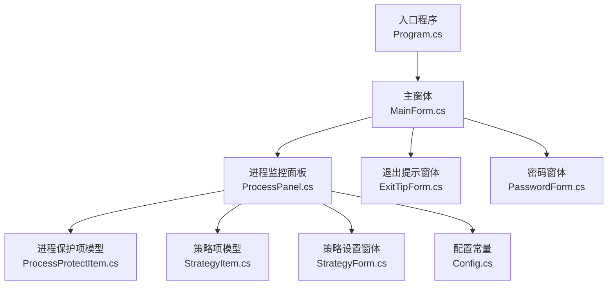
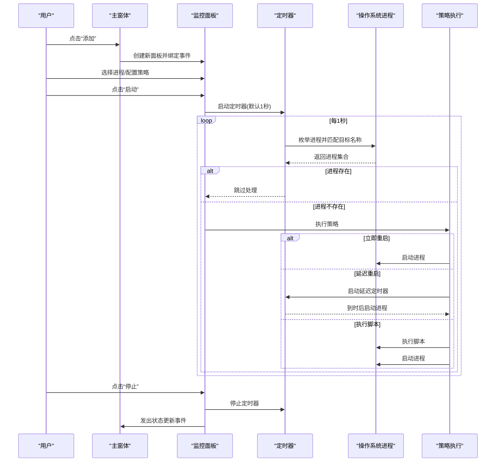
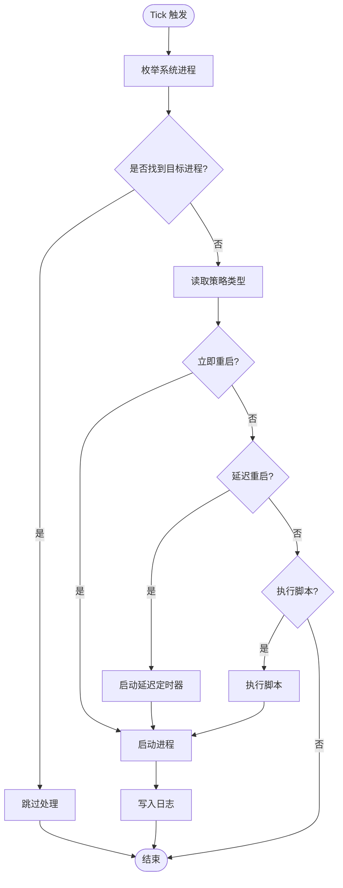
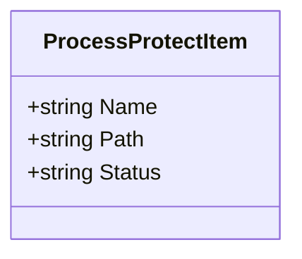
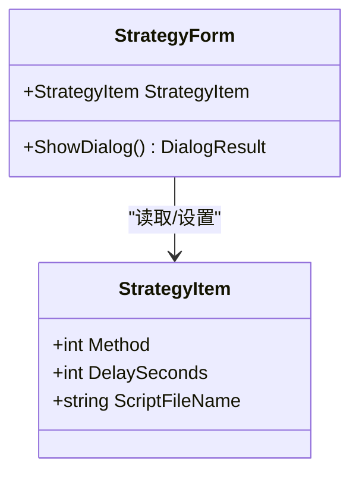
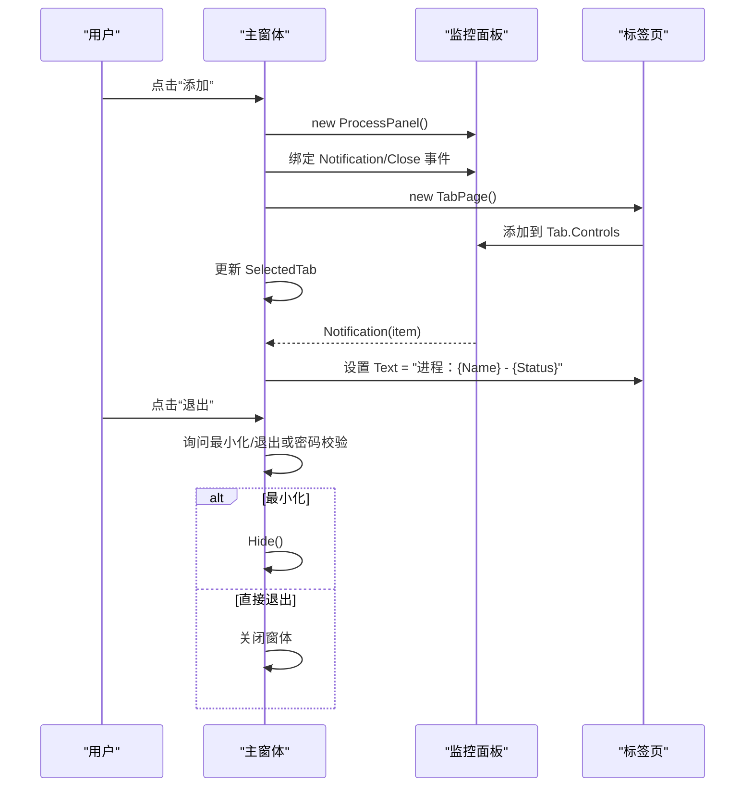
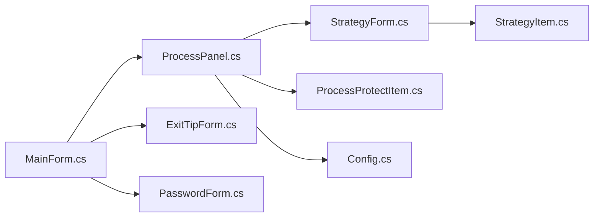

# 进程监控机制

<cite>
**本文引用的文件**
- [ProcessPanel.cs](file://ProcessProtector/ProcessPanel.cs)
- [ProcessProtectItem.cs](file://ProcessProtector/ProcessProtectItem.cs)
- [StrategyItem.cs](file://ProcessProtector/StrategyItem.cs)
- [StrategyForm.cs](file://ProcessProtector/StrategyForm.cs)
- [MainForm.cs](file://ProcessProtector/MainForm.cs)
- [Config.cs](file://ProcessProtector/Config.cs)
- [Program.cs](file://ProcessProtector/Program.cs)
- [ExitTipForm.cs](file://ProcessProtector/ExitTipForm.cs)
- [PasswordForm.cs](file://ProcessProtector/PasswordForm.cs)
- [ProcessPanel.Designer.cs](file://ProcessProtector/ProcessPanel.Designer.cs)
- [MainForm.Designer.cs](file://ProcessProtector/MainForm.Designer.cs)
</cite>

## 目录
1. [简介](#简介)
2. [项目结构](#项目结构)
3. [核心组件](#核心组件)
4. [架构总览](#架构总览)
5. [详细组件分析](#详细组件分析)
6. [依赖关系分析](#依赖关系分析)
7. [性能考虑](#性能考虑)
8. [故障排查指南](#故障排查指南)
9. [结论](#结论)
10. [附录](#附录)

## 简介
本技术文档围绕进程监控机制展开，重点解析以下方面：
- ProcessPanel 的监控实现原理与界面交互设计
- ProcessProtectItem 数据模型的属性定义与状态管理
- 进程状态检测算法、监控频率配置与性能优化策略
- 进程列表管理、状态更新通知与 UI 响应的实现细节
- 监控线程管理、异常处理与资源释放的最佳实践
- 常见监控场景的配置示例与调试技巧

该系统采用 WinForms 架构，通过定时器周期性检测目标进程是否存在，并根据策略进行重启或执行脚本等动作。界面层负责用户交互与状态展示，业务层负责策略执行与进程控制。

## 项目结构
ProcessProtector 子项目是本次文档关注的核心模块，主要由以下文件构成：
- 主窗体与入口：Program.cs、MainForm.cs、MainForm.Designer.cs
- 进程监控面板：ProcessPanel.cs、ProcessPanel.Designer.cs
- 数据模型与策略：ProcessProtectItem.cs、StrategyItem.cs、StrategyForm.cs
- 辅助窗体：ExitTipForm.cs、PasswordForm.cs
- 配置常量：Config.cs

图表来源
- [Program.cs](file://ProcessProtector/Program.cs#L1-L23)
- [MainForm.cs](file://ProcessProtector/MainForm.cs#L1-L187)
- [ProcessPanel.cs](file://ProcessProtector/ProcessPanel.cs#L1-L231)
- [ProcessProtectItem.cs](file://ProcessProtector/ProcessProtectItem.cs#L1-L28)
- [StrategyItem.cs](file://ProcessProtector/StrategyItem.cs#L1-L28)
- [StrategyForm.cs](file://ProcessProtector/StrategyForm.cs#L1-L155)
- [ExitTipForm.cs](file://ProcessProtector/ExitTipForm.cs#L1-L66)
- [PasswordForm.cs](file://ProcessProtector/PasswordForm.cs#L1-L55)
- [Config.cs](file://ProcessProtector/Config.cs#L1-L15)

章节来源
- [Program.cs](file://ProcessProtector/Program.cs#L1-L23)
- [MainForm.cs](file://ProcessProtector/MainForm.cs#L1-L187)
- [ProcessPanel.cs](file://ProcessProtector/ProcessPanel.cs#L1-L231)
- [ProcessProtectItem.cs](file://ProcessProtector/ProcessProtectItem.cs#L1-L28)
- [StrategyItem.cs](file://ProcessProtector/StrategyItem.cs#L1-L28)
- [StrategyForm.cs](file://ProcessProtector/StrategyForm.cs#L1-L155)
- [ExitTipForm.cs](file://ProcessProtector/ExitTipForm.cs#L1-L66)
- [PasswordForm.cs](file://ProcessProtector/PasswordForm.cs#L1-L55)
- [Config.cs](file://ProcessProtector/Config.cs#L1-L15)

## 核心组件
- ProcessPanel：监控面板，负责进程选择、策略配置、定时检测、日志输出与状态通知。
- ProcessProtectItem：进程保护项数据模型，包含进程名称、路径与状态。
- StrategyItem：策略项数据模型，包含策略类型、延迟秒数与脚本文件名。
- StrategyForm：策略设置对话框，提供策略选择与参数输入。
- MainForm：主窗体，负责动态添加监控面板、状态更新与退出流程控制。
- Config：界面布局常量（边距与间距）。
- ExitTipForm/PasswordForm：辅助窗体，分别处理退出行为与加锁/解锁。

章节来源
- [ProcessPanel.cs](file://ProcessProtector/ProcessPanel.cs#L1-L231)
- [ProcessProtectItem.cs](file://ProcessProtector/ProcessProtectItem.cs#L1-L28)
- [StrategyItem.cs](file://ProcessProtector/StrategyItem.cs#L1-L28)
- [StrategyForm.cs](file://ProcessProtector/StrategyForm.cs#L1-L155)
- [MainForm.cs](file://ProcessProtector/MainForm.cs#L1-L187)
- [Config.cs](file://ProcessProtector/Config.cs#L1-L15)
- [ExitTipForm.cs](file://ProcessProtector/ExitTipForm.cs#L1-L66)
- [PasswordForm.cs](file://ProcessProtector/PasswordForm.cs#L1-L55)

## 架构总览
系统采用“主窗体 + 多个监控面板”的布局，每个监控面板独立维护一个定时器与策略项，通过事件在主窗体中聚合状态变更与关闭事件。策略执行分为三类：立即重启、延迟重启、执行脚本后重启。

图表来源
- [MainForm.cs](file://ProcessProtector/MainForm.cs#L25-L84)
- [ProcessPanel.cs](file://ProcessProtector/ProcessPanel.cs#L83-L127)
- [StrategyForm.cs](file://ProcessProtector/StrategyForm.cs#L35-L64)

## 详细组件分析

### ProcessPanel 监控实现与界面交互
- 定时器与监控频率
  - 内部维护一个间隔为 1 秒的定时器，用于每秒检测目标进程是否存在。
  - 启动按钮会禁用进程选择下拉框并启用定时器；停止按钮则相反。
- 进程状态检测算法
  - 每次 Tick 时，枚举当前系统进程，判断是否存在与目标名称相同的进程。
  - 若进程存在则直接返回，不重复处理；若不存在则进入策略分支。
- 策略执行
  - 立即重启：直接启动目标进程路径。
  - 延迟重启：启动一个一次性定时器，按设定秒数后启动目标进程，并恢复主定时器。
  - 执行脚本：先执行指定脚本文件，再启动目标进程。
- 日志与通知
  - 在策略执行前后向日志文本框追加时间戳与描述信息。
  - 通过自定义事件向主窗体发送状态更新，主窗体据此更新标签页标题。
- UI 初始化
  - 动态创建下拉框、按钮、日志文本框等控件，设置布局与事件绑定。
  - 下拉框选中项变化时尝试解析进程路径并触发通知事件。
- 关闭与资源释放
  - 关闭按钮触发关闭事件，主窗体负责释放面板与标签页。
  - 设计器 Dispose 方法确保组件资源释放。

图表来源
- [ProcessPanel.cs](file://ProcessProtector/ProcessPanel.cs#L83-L106)

章节来源
- [ProcessPanel.cs](file://ProcessProtector/ProcessPanel.cs#L1-L231)
- [ProcessPanel.Designer.cs](file://ProcessProtector/ProcessPanel.Designer.cs#L1-L38)

### ProcessProtectItem 数据模型与状态管理
- 属性定义
  - Name：目标进程名称
  - Path：目标进程可执行文件路径
  - Status：当前保护状态（默认“未知”，启动后变为“已启动”，停止后变为“已停止”）
- 状态管理机制
  - 启动按钮点击后设置状态为“已启动”，并触发通知事件。
  - 停止按钮点击后设置状态为“已停止”，并触发通知事件。
  - 下拉框选中项变化时尝试解析路径并触发通知事件，便于主窗体更新标签页标题。

图表来源
- [ProcessProtectItem.cs](file://ProcessProtector/ProcessProtectItem.cs#L12-L26)

章节来源
- [ProcessProtectItem.cs](file://ProcessProtector/ProcessProtectItem.cs#L1-L28)
- [ProcessPanel.cs](file://ProcessProtector/ProcessPanel.cs#L108-L127)

### StrategyItem 与 StrategyForm 策略配置
- StrategyItem 属性
  - Method：策略类型（0 立即重启，1 延迟重启，2 执行脚本）
  - DelaySeconds：延迟秒数（默认 60）
  - ScriptFileName：脚本文件路径
- StrategyForm 行为
  - 提供单选按钮选择策略类型
  - 数值框设置延迟秒数范围（1~3600）
  - 文本框选择脚本文件（只读，点击弹出文件选择对话框）
  - 通过属性封装读取/设置策略项，便于与监控面板交互

图表来源
- [StrategyItem.cs](file://ProcessProtector/StrategyItem.cs#L12-L26)
- [StrategyForm.cs](file://ProcessProtector/StrategyForm.cs#L35-L64)

章节来源
- [StrategyItem.cs](file://ProcessProtector/StrategyItem.cs#L1-L28)
- [StrategyForm.cs](file://ProcessProtector/StrategyForm.cs#L1-L155)

### MainForm 主窗体与多面板管理
- 动态添加监控面板
  - 点击“添加”按钮创建新的监控面板，设置停靠填充，绑定通知与关闭事件。
  - 将面板放入新的标签页，选中该标签页。
- 状态更新与关闭处理
  - 接收来自监控面板的通知事件，更新对应标签页标题为“进程：名称 - 状态”。
  - 接收关闭事件，释放面板与标签页资源。
- 退出流程控制
  - 支持最小化到系统托盘或直接退出的选择。
  - 若设置了退出密码，则在退出前校验密码。
  - 系统托盘图标点击可显示主窗体。

图表来源
- [MainForm.cs](file://ProcessProtector/MainForm.cs#L25-L84)
- [MainForm.cs](file://ProcessProtector/MainForm.cs#L96-L111)

章节来源
- [MainForm.cs](file://ProcessProtector/MainForm.cs#L1-L187)
- [ExitTipForm.cs](file://ProcessProtector/ExitTipForm.cs#L1-L66)
- [PasswordForm.cs](file://ProcessProtector/PasswordForm.cs#L1-L55)

## 依赖关系分析
- 组件耦合
  - ProcessPanel 与 StrategyItem/StrategyForm 强耦合（策略读取与设置），弱耦合于 MainForm（通过事件通信）。
  - MainForm 与 ProcessPanel 通过事件解耦，仅依赖事件契约。
- 外部依赖
  - 使用 System.Diagnostics.Process 进行进程枚举与启动。
  - 使用 System.Windows.Forms.Timer 进行定时检测。
  - 使用 System.Windows.Forms.OpenFileDialog 选择脚本文件。
- 可能的循环依赖
  - 当前未发现循环依赖，事件单向从面板流向主窗体。

图表来源
- [MainForm.cs](file://ProcessProtector/MainForm.cs#L1-L187)
- [ProcessPanel.cs](file://ProcessProtector/ProcessPanel.cs#L1-L231)
- [StrategyForm.cs](file://ProcessProtector/StrategyForm.cs#L1-L155)
- [StrategyItem.cs](file://ProcessProtector/StrategyItem.cs#L1-L28)
- [ProcessProtectItem.cs](file://ProcessProtector/ProcessProtectItem.cs#L1-L28)
- [Config.cs](file://ProcessProtector/Config.cs#L1-L15)
- [ExitTipForm.cs](file://ProcessProtector/ExitTipForm.cs#L1-L66)
- [PasswordForm.cs](file://ProcessProtector/PasswordForm.cs#L1-L55)

章节来源
- [MainForm.cs](file://ProcessProtector/MainForm.cs#L1-L187)
- [ProcessPanel.cs](file://ProcessProtector/ProcessPanel.cs#L1-L231)
- [StrategyForm.cs](file://ProcessProtector/StrategyForm.cs#L1-L155)
- [StrategyItem.cs](file://ProcessProtector/StrategyItem.cs#L1-L28)
- [ProcessProtectItem.cs](file://ProcessProtector/ProcessProtectItem.cs#L1-L28)
- [Config.cs](file://ProcessProtector/Config.cs#L1-L15)
- [ExitTipForm.cs](file://ProcessProtector/ExitTipForm.cs#L1-L66)
- [PasswordForm.cs](file://ProcessProtector/PasswordForm.cs#L1-L55)

## 性能考虑
- 监控频率与开销
  - 默认 1 秒检测一次，对大多数场景足够，且开销较低。
  - 若目标进程数量较多或系统负载较高，可适当增大间隔（例如 3~5 秒）。
- 进程枚举成本
  - 每次 Tick 枚举所有进程，建议避免在高并发或大量进程场景下频繁启动多个监控面板。
- I/O 与脚本执行
  - 执行脚本时使用一次性定时器，避免阻塞主定时器。
  - 脚本输出被读取并打印到控制台，注意日志过多可能影响 UI 响应。
- UI 响应
  - 日志文本框为只读多行文本，滚动条开启，建议在高频日志场景下限制日志长度或分页输出。
- 资源释放
  - 定时器与进程对象均在合适时机释放，避免内存泄漏。
  - 关闭面板时调用 Dispose，确保控件资源回收。

[本节为通用性能建议，无需特定文件引用]

## 故障排查指南
- 进程无法启动
  - 检查进程路径是否正确（面板会在选择进程后解析主模块路径）。
  - 确认策略类型与脚本路径配置无误。
- 策略未生效
  - 确认定时器已启动（启动按钮会禁用下拉框并启用定时器）。
  - 查看日志文本框中的时间戳记录，确认策略分支被执行。
- 界面无响应
  - 高频日志可能导致 UI 卡顿，建议减少日志输出或降低监控频率。
- 退出受限
  - 若设置了退出密码，退出时会弹出密码窗体进行校验；最小化到托盘可避免误关。
- 资源未释放
  - 关闭标签页后主窗体会释放面板与标签页；如仍出现资源占用，检查是否手动保留了引用。

章节来源
- [ProcessPanel.cs](file://ProcessProtector/ProcessPanel.cs#L108-L127)
- [ProcessPanel.cs](file://ProcessProtector/ProcessPanel.cs#L83-L106)
- [MainForm.cs](file://ProcessProtector/MainForm.cs#L76-L84)
- [ExitTipForm.cs](file://ProcessProtector/ExitTipForm.cs#L1-L66)
- [PasswordForm.cs](file://ProcessProtector/PasswordForm.cs#L1-L55)

## 结论
本系统通过简洁的 WinForms 界面与定时器机制实现了可靠的进程监控与自动恢复能力。ProcessPanel 作为核心控制器，结合 StrategyItem 的灵活策略配置，满足多种监控场景需求。MainForm 提供多面板管理与状态聚合，配合辅助窗体完善用户体验。在性能与稳定性方面，系统通过合理的监控频率与资源释放策略，能够在保证功能的同时维持良好的运行效率。

[本节为总结性内容，无需特定文件引用]

## 附录

### 常见监控场景配置示例
- 场景一：即时恢复
  - 策略类型：立即重启
  - 适用：关键服务进程，要求尽快恢复
- 场景二：平滑恢复
  - 策略类型：延迟重启，延迟秒数设为 60
  - 适用：需要等待系统资源释放或外部依赖就绪
- 场景三：预处理恢复
  - 策略类型：执行脚本，脚本文件指向批处理或命令脚本
  - 适用：需要在重启前执行清理、备份或环境准备

章节来源
- [StrategyItem.cs](file://ProcessProtector/StrategyItem.cs#L12-L26)
- [StrategyForm.cs](file://ProcessProtector/StrategyForm.cs#L35-L64)
- [ProcessPanel.cs](file://ProcessProtector/ProcessPanel.cs#L89-L105)

### 调试技巧
- 启用详细日志：观察日志文本框中的时间戳与策略分支输出，定位问题发生阶段。
- 分步验证：先测试“立即重启”，再逐步引入“延迟重启”或“执行脚本”。
- 控制频率：在开发阶段可将定时器间隔调小（如 1 秒）以便快速验证，上线前调大。
- 资源检查：关闭面板后确认标签页与控件已被释放，避免残留引用导致内存泄漏。

章节来源
- [ProcessPanel.cs](file://ProcessProtector/ProcessPanel.cs#L83-L106)
- [ProcessPanel.cs](file://ProcessProtector/ProcessPanel.cs#L36-L65)
- [MainForm.cs](file://ProcessProtector/MainForm.cs#L76-L84)