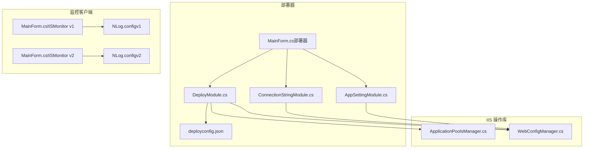
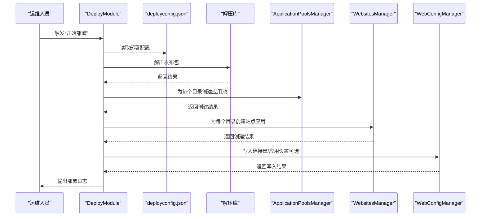
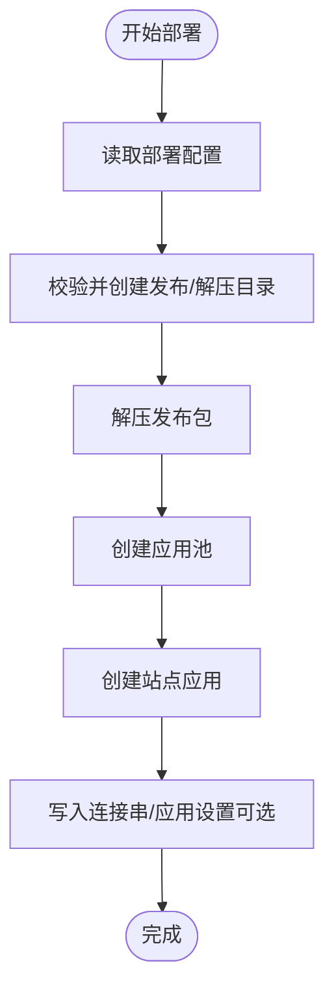
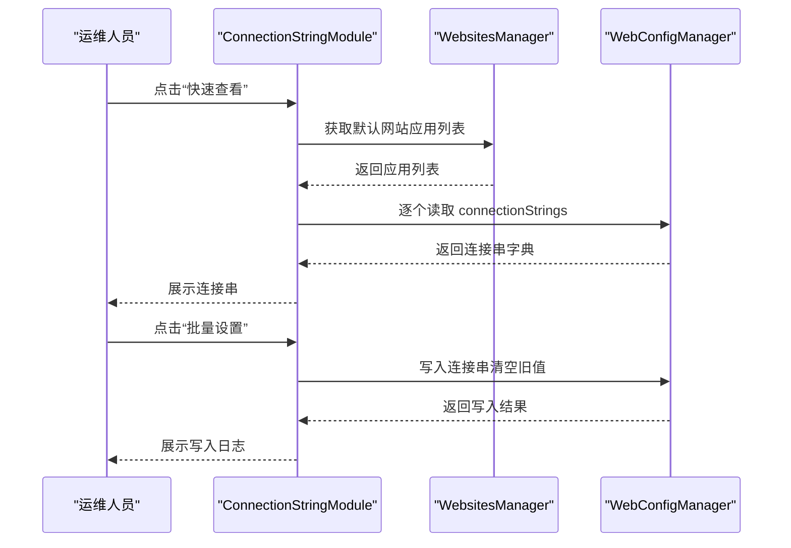
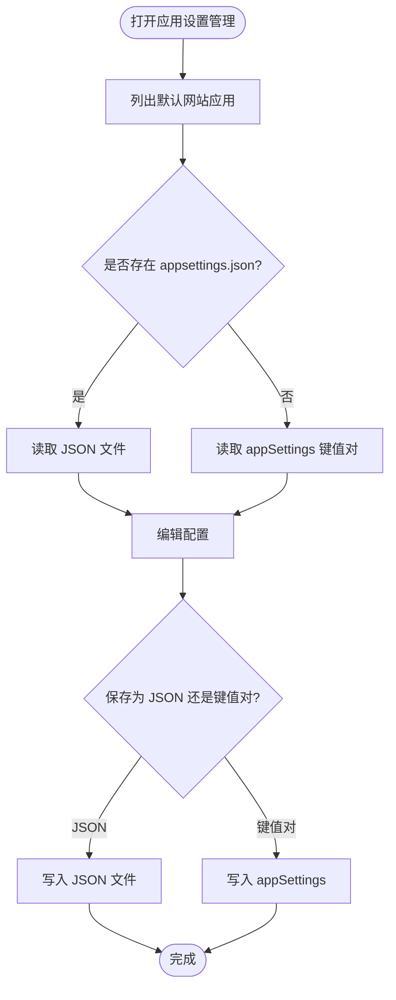
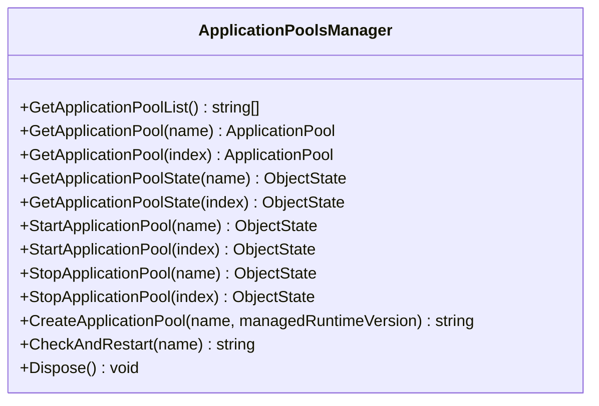
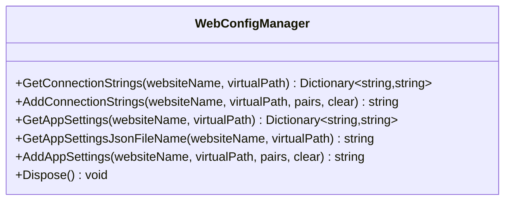
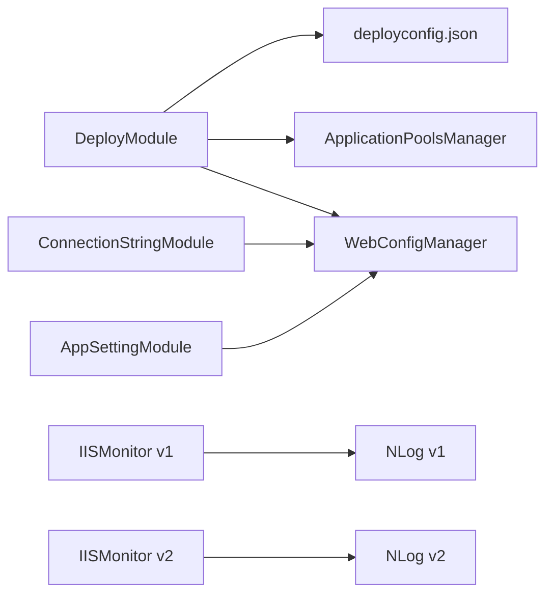

# 部署和运维

<cite>
**本文引用的文件**
- [README.md](file://README.md)
- [deployconfig.json](file://Deployer/deployconfig.json)
- [MainForm.cs（部署器）](file://Deployer/MainForm.cs)
- [DeployModule.cs](file://Deployer/Modules/DeployModule.cs)
- [ConnectionStringModule.cs](file://Deployer/Modules/ConnectionStringModule.cs)
- [AppSettingModule.cs](file://Deployer/Modules/AppSettingModule.cs)
- [MainForm.cs（IISMonitor v1）](file://IISMonitor.v1/MainForm.cs)
- [NLog.config（IISMonitor v1）](file://IISMonitor.v1/NLog.config)
- [MainForm.cs（IISMonitor v2）](file://IISMonitor.v2/MainForm.cs)
- [NLog.config（IISMonitor v2）](file://IISMonitor.v2/NLog.config)
- [ApplicationPoolsManager.cs](file://iHawkIISLibrary/ApplicationPoolsManager.cs)
- [WebConfigManager.cs](file://iHawkIISLibrary/WebConfigManager.cs)
- [App.config（IISMonitor v1）](file://IISMonitor.v1/App.config)
- [App.config（IISMonitor v2）](file://IISMonitor.v2/App.config)
- [App.config（ProcessProtector）](file://ProcessProtector/App.config)
</cite>

## 目录
1. [简介](#简介)
2. [项目结构](#项目结构)
3. [核心组件](#核心组件)
4. [架构总览](#架构总览)
5. [详细组件分析](#详细组件分析)
6. [依赖分析](#依赖分析)
7. [性能考虑](#性能考虑)
8. [故障排查指南](#故障排查指南)
9. [结论](#结论)
10. [附录](#附录)

## 简介
本指南面向生产环境的部署与运维，围绕 IISMonitor 项目的部署器、监控客户端与 IIS 操作库，给出从安装、配置、运行、监控、日志、性能优化到故障处理与灾备的完整方案。内容涵盖：
- 生产部署流程与前置条件
- 性能优化与资源使用最佳实践
- 监控告警配置与管理
- 日志记录策略与分析技巧
- 常见故障诊断与解决
- 备份恢复与灾难恢复
- 维护与升级操作指南

## 项目结构
IISMonitor 由多个子项目构成，包括部署器、IISMonitor v1/v2 监控客户端、ProcessProtector 进程保护工具以及 iHawkIISLibrary IIS 操作库。部署器通过读取配置文件与调用 IIS 操作库实现一键化部署与配置管理。

图表来源
- [MainForm.cs（部署器）](file://Deployer/MainForm.cs#L14-L77)
- [DeployModule.cs](file://Deployer/Modules/DeployModule.cs#L18-L203)
- [ConnectionStringModule.cs](file://Deployer/Modules/ConnectionStringModule.cs#L16-L181)
- [AppSettingModule.cs](file://Deployer/Modules/AppSettingModule.cs#L17-L245)
- [deployconfig.json](file://Deployer/deployconfig.json#L1-L8)
- [ApplicationPoolsManager.cs](file://iHawkIISLibrary/ApplicationPoolsManager.cs#L11-L142)
- [WebConfigManager.cs](file://iHawkIISLibrary/WebConfigManager.cs#L10-L156)
- [MainForm.cs（IISMonitor v1）](file://IISMonitor.v1/MainForm.cs#L17-L81)
- [MainForm.cs（IISMonitor v2）](file://IISMonitor.v2/MainForm.cs#L12-L130)
- [NLog.config（IISMonitor v1）](file://IISMonitor.v1/NLog.config#L1-L56)
- [NLog.config（IISMonitor v2）](file://IISMonitor.v2/NLog.config#L1-L48)

章节来源
- [README.md](file://README.md#L1-L10)
- [MainForm.cs（部署器）](file://Deployer/MainForm.cs#L14-L77)
- [DeployModule.cs](file://Deployer/Modules/DeployModule.cs#L18-L203)
- [deployconfig.json](file://Deployer/deployconfig.json#L1-L8)

## 核心组件
- 部署器（Deployer）
  - 提供批量部署、数据库连接串管理、应用设置管理三大功能页签，基于后台任务执行解压、创建应用程序池、创建站点应用、写入配置等操作。
- IIS 操作库（iHawkIISLibrary）
  - ApplicationPoolsManager：封装 IIS 应用程序池的列举、启动、停止、创建、状态查询与自动重启检测。
  - WebConfigManager：封装 IIS 站点/虚拟路径的 connectionStrings 与 appSettings 的读取与写入，并支持 JSON 形式配置文件的定位与写入。
- 监控客户端（IISMonitor v1/v2）
  - v1：包含 HTTP 检查、应用池检查、WebService 检查与发布管理面板；内置定时器轮询消息队列并弹窗提示。
  - v2：以应用池面板为核心，展示各池状态与事件，支持启动项配置文件加载与日志输出。
- 日志系统（NLog）
  - v1：按业务模块分目标输出 info/warn/error 日志文件，便于问题定位与审计。
  - v2：统一 info/warn/error 输出，便于集中分析。

章节来源
- [MainForm.cs（IISMonitor v1）](file://IISMonitor.v1/MainForm.cs#L17-L81)
- [MainForm.cs（IISMonitor v2）](file://IISMonitor.v2/MainForm.cs#L12-L130)
- [ApplicationPoolsManager.cs](file://iHawkIISLibrary/ApplicationPoolsManager.cs#L11-L142)
- [WebConfigManager.cs](file://iHawkIISLibrary/WebConfigManager.cs#L10-L156)
- [NLog.config（IISMonitor v1）](file://IISMonitor.v1/NLog.config#L1-L56)
- [NLog.config（IISMonitor v2）](file://IISMonitor.v2/NLog.config#L1-L48)

## 架构总览
下图展示了部署器如何通过配置文件与 IIS 操作库协作，完成从压缩包到 IIS 应用的自动化部署与配置注入。

图表来源
- [DeployModule.cs](file://Deployer/Modules/DeployModule.cs#L55-L153)
- [deployconfig.json](file://Deployer/deployconfig.json#L1-L8)
- [ApplicationPoolsManager.cs](file://iHawkIISLibrary/ApplicationPoolsManager.cs#L105-L121)
- [WebConfigManager.cs](file://iHawkIISLibrary/WebConfigManager.cs#L68-L92)

## 详细组件分析

### 部署器（DeployModule）
- 功能要点
  - 读取部署配置文件，确保发布包与解压目录存在。
  - 后台任务顺序执行：解压 → 创建应用池 → 创建站点应用 → 写入配置（预留）。
  - 支持按目录名生成应用池命名规则，结合 .net 标记文件决定托管版本。
- 关键流程
  - 解压：遍历发布包目录下的 zip 文件，逐个解压至指定目录。
  - 创建应用池：根据目录名拼接应用池名称，若存在 .net 标记文件则使用非托管版本。
  - 创建站点应用：在默认网站下为每个目录创建虚拟路径应用并绑定对应应用池。
  - 写入配置：预留写入连接串与应用设置的扩展点。

图表来源
- [DeployModule.cs](file://Deployer/Modules/DeployModule.cs#L88-L153)
- [deployconfig.json](file://Deployer/deployconfig.json#L1-L8)

章节来源
- [DeployModule.cs](file://Deployer/Modules/DeployModule.cs#L18-L203)
- [deployconfig.json](file://Deployer/deployconfig.json#L1-L8)

### 连接串管理（ConnectionStringModule）
- 功能要点
  - 快速查看默认网站下各应用的 connectionStrings。
  - 批量勾选应用后统一写入新的连接串集合。
  - 对异常情况进行错误提示与节点灰显处理。
- 关键流程
  - 列出默认网站的应用列表，逐一读取 connectionStrings 并展示。
  - 用户确认后，对勾选节点写入新连接串并提交更改。

图表来源
- [ConnectionStringModule.cs](file://Deployer/Modules/ConnectionStringModule.cs#L59-L128)
- [WebConfigManager.cs](file://iHawkIISLibrary/WebConfigManager.cs#L47-L92)

章节来源
- [ConnectionStringModule.cs](file://Deployer/Modules/ConnectionStringModule.cs#L16-L181)
- [WebConfigManager.cs](file://iHawkIISLibrary/WebConfigManager.cs#L47-L92)

### 应用设置管理（AppSettingModule）
- 功能要点
  - 支持两种配置格式：传统 appSettings（键值对）与 JSON 文件。
  - 自动识别是否存在 appsettings.json，优先读取 JSON 文件内容。
  - 支持将 JSON 或键值对形式写回目标应用。
- 关键流程
  - 列出默认网站应用，尝试读取 appSettings；若无则定位 appsettings.json 并读取。
  - 选择应用后，支持编辑并保存为键值对或 JSON。

图表来源
- [AppSettingModule.cs](file://Deployer/Modules/AppSettingModule.cs#L96-L192)
- [WebConfigManager.cs](file://iHawkIISLibrary/WebConfigManager.cs#L94-L152)

章节来源
- [AppSettingModule.cs](file://Deployer/Modules/AppSettingModule.cs#L17-L245)
- [WebConfigManager.cs](file://iHawkIISLibrary/WebConfigManager.cs#L94-L152)

### IIS 操作库（ApplicationPoolsManager）
- 能力概览
  - 应用池列表、状态查询、启动/停止、创建、自动重启检测。
  - 异常捕获与返回信息，便于上层 UI 反馈。
- 使用建议
  - 在创建应用池时根据是否包含 .net 标记文件决定托管版本，避免误配。
  - 定期调用状态检测并在停止时触发自动重启，保障可用性。

图表来源
- [ApplicationPoolsManager.cs](file://iHawkIISLibrary/ApplicationPoolsManager.cs#L11-L142)

章节来源
- [ApplicationPoolsManager.cs](file://iHawkIISLibrary/ApplicationPoolsManager.cs#L11-L142)

### IIS 操作库（WebConfigManager）
- 能力概览
  - 读取/写入 connectionStrings 与 appSettings。
  - 定位 appsettings.json 物理路径并支持直接写入。
- 使用建议
  - 写入前先清空旧值（可选），确保配置一致性。
  - JSON 文件写入需注意编码与换行符，避免解析异常。

图表来源
- [WebConfigManager.cs](file://iHawkIISLibrary/WebConfigManager.cs#L10-L156)

章节来源
- [WebConfigManager.cs](file://iHawkIISLibrary/WebConfigManager.cs#L10-L156)

### 监控客户端（IISMonitor v1/v2）
- v1 主界面
  - 包含 HTTP 检查、应用池检查、WebService 检查与发布管理四个标签页。
  - 使用定时器轮询全局消息列表并弹出警告窗。
- v2 主界面
  - 左侧应用池面板，右侧上下分栏显示操作日志与监控日志。
  - 支持从启动配置文件加载需要开机自启的应用池列表。

章节来源
- [MainForm.cs（IISMonitor v1）](file://IISMonitor.v1/MainForm.cs#L17-L81)
- [MainForm.cs（IISMonitor v2）](file://IISMonitor.v2/MainForm.cs#L12-L130)

### 日志系统（NLog）
- v1 日志
  - 按模块区分 info/warn/error 三类日志文件，便于分门别类排查。
- v2 日志
  - 统一输出 info/warn/error，适合集中采集与分析。
- 建议
  - 设置合理的滚动保留策略与大小上限，避免磁盘占用过大。
  - 结合外部日志平台进行聚合与检索。

章节来源
- [NLog.config（IISMonitor v1）](file://IISMonitor.v1/NLog.config#L1-L56)
- [NLog.config（IISMonitor v2）](file://IISMonitor.v2/NLog.config#L1-L48)

## 依赖分析
- 组件耦合
  - DeployModule 依赖 deployconfig.json 与 iHawkIISLibrary（ApplicationPoolsManager、WebsitesManager）。
  - ConnectionStringModule 与 AppSettingModule 依赖 WebConfigManager。
  - 监控客户端依赖各自 NLog 配置文件。
- 外部依赖
  - .NET Framework 4.7.2（各 App.config 指定）。
  - Microsoft.Web.Administration（IIS 管理）。
  - Newtonsoft.Json（部署器反序列化配置）。

图表来源
- [DeployModule.cs](file://Deployer/Modules/DeployModule.cs#L18-L203)
- [deployconfig.json](file://Deployer/deployconfig.json#L1-L8)
- [ApplicationPoolsManager.cs](file://iHawkIISLibrary/ApplicationPoolsManager.cs#L11-L142)
- [WebConfigManager.cs](file://iHawkIISLibrary/WebConfigManager.cs#L10-L156)
- [ConnectionStringModule.cs](file://Deployer/Modules/ConnectionStringModule.cs#L16-L181)
- [AppSettingModule.cs](file://Deployer/Modules/AppSettingModule.cs#L17-L245)
- [NLog.config（IISMonitor v1）](file://IISMonitor.v1/NLog.config#L1-L56)
- [NLog.config（IISMonitor v2）](file://IISMonitor.v2/NLog.config#L1-L48)

章节来源
- [App.config（IISMonitor v1）](file://IISMonitor.v1/App.config#L1-L15)
- [App.config（IISMonitor v2）](file://IISMonitor.v2/App.config#L1-L6)
- [App.config（ProcessProtector）](file://ProcessProtector/App.config#L1-L6)

## 性能考虑
- 部署阶段
  - 解压并发控制：避免同时解压过多包导致 IO 抖动，建议按目录顺序串行处理。
  - 应用池创建：按需创建，避免重复创建造成浪费。
  - 配置写入：批量写入前先清空旧值，减少冗余条目。
- 运行阶段
  - v2 应用池面板采用流式布局与滚动容器，建议限制面板数量或启用虚拟化。
  - 日志输出频繁时，建议降低日志级别或启用异步写入。
- 资源使用最佳实践
  - 将日志目录与应用目录分离，避免日志影响应用性能。
  - 合理设置 .NET 托管版本，非托管场景避免不必要的 CLR 开销。
  - 使用 IIS 应用池回收策略与内存阈值，防止长时运行导致内存泄漏。

## 故障排查指南
- 部署失败
  - 症状：解压失败或未找到 zip 文件。
  - 排查：确认发布包目录存在且包含 zip 文件；检查权限与磁盘空间。
  - 参考：解压流程与错误日志输出。
- 应用池创建失败
  - 症状：提示已存在或创建异常。
  - 排查：确认命名唯一性；检查 .net 标记文件与托管版本配置。
  - 参考：应用池创建逻辑与异常捕获。
- 站点应用创建失败
  - 症状：默认网站不存在或创建失败。
  - 排查：确认 IIS 默认网站存在；检查物理路径与权限。
- 配置写入失败
  - 症状：连接串或应用设置未生效。
  - 排查：确认目标应用存在；检查 JSON 文件路径与编码；验证写入权限。
- 监控界面无日志
  - 症状：v2 分栏日志为空。
  - 排查：确认启动配置文件存在且可读；检查日志输出事件绑定。
- 权限问题
  - 症状：IIS 管理操作失败。
  - 排查：以管理员身份运行；确认 IIS 管理员组成员身份。

章节来源
- [DeployModule.cs](file://Deployer/Modules/DeployModule.cs#L88-L153)
- [ApplicationPoolsManager.cs](file://iHawkIISLibrary/ApplicationPoolsManager.cs#L105-L121)
- [WebConfigManager.cs](file://iHawkIISLibrary/WebConfigManager.cs#L68-L92)
- [MainForm.cs（IISMonitor v2）](file://IISMonitor.v2/MainForm.cs#L67-L80)

## 结论
IISMonitor 提供了从部署到运维的一体化能力：部署器负责自动化部署与配置注入，IIS 操作库提供稳定可靠的 IIS 管理接口，监控客户端提供可视化观测与告警反馈。结合合理的日志策略与性能优化手段，可在生产环境中实现高可靠、易维护的 IIS 管理体系。

## 附录

### 生产部署流程清单
- 准备工作
  - 安装 .NET Framework 4.7.2。
  - 准备发布包与部署配置文件。
  - 确认 IIS 默认网站存在且具备写权限。
- 执行步骤
  - 启动部署器，确认发布/解压目录存在。
  - 执行“开始部署”，观察日志输出。
  - 验证应用池与站点应用创建结果。
  - 如需，进入连接串/应用设置模块完成配置写入。
- 验证与收尾
  - 登录 IIS 管理器核对应用池与站点状态。
  - 查看日志文件确认无异常。

章节来源
- [deployconfig.json](file://Deployer/deployconfig.json#L1-L8)
- [DeployModule.cs](file://Deployer/Modules/DeployModule.cs#L55-L153)

### 监控告警配置与管理
- v1 告警机制
  - 通过全局消息列表与定时器弹窗提示，适合本地运维值守。
- v2 建议
  - 将监控日志接入集中日志系统，设置告警规则（如错误率阈值、重启次数统计）。
  - 结合应用池面板事件回调，实现自动化处置与通知。

章节来源
- [MainForm.cs（IISMonitor v1）](file://IISMonitor.v1/MainForm.cs#L67-L77)
- [MainForm.cs（IISMonitor v2）](file://IISMonitor.v2/MainForm.cs#L48-L62)

### 日志记录策略与分析技巧
- 策略
  - 按模块/级别拆分日志文件，便于定位问题。
  - 控制单文件大小与保留天数，定期清理。
- 分析技巧
  - 使用时间范围过滤与关键字检索。
  - 对高频错误建立指标看板，持续跟踪。

章节来源
- [NLog.config（IISMonitor v1）](file://IISMonitor.v1/NLog.config#L31-L54)
- [NLog.config（IISMonitor v2）](file://IISMonitor.v2/NLog.config#L31-L46)

### 备份恢复与灾难恢复
- 备份
  - 备份 IIS 配置（应用池、站点、绑定等）。
  - 备份应用配置文件（web.config/appsettings.json）与日志目录。
- 恢复
  - 使用 IIS 备份还原配置。
  - 重新部署应用包并恢复配置文件。
- 灾难恢复
  - 制定最小恢复时间目标（RTO）与恢复点目标（RPO）。
  - 定期演练恢复流程，验证备份有效性。

### 系统维护与升级
- 维护
  - 定期检查应用池健康状态与日志增长情况。
  - 更新 IISMonitor 时先在测试环境验证。
- 升级
  - 升级前备份当前配置与日志。
  - 逐步替换二进制文件，验证功能正常后再切换流量。