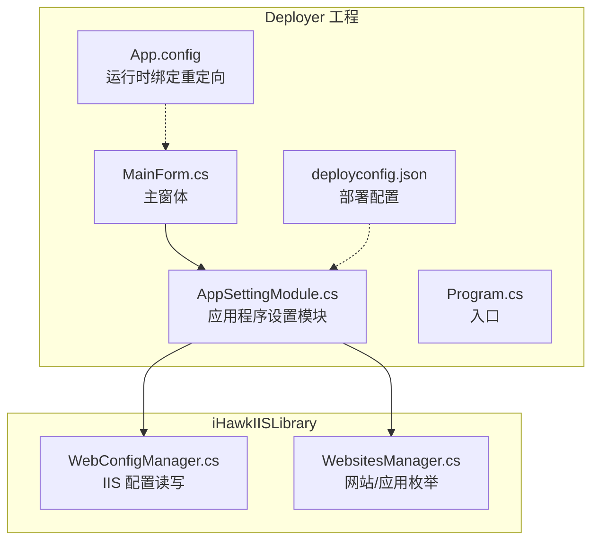
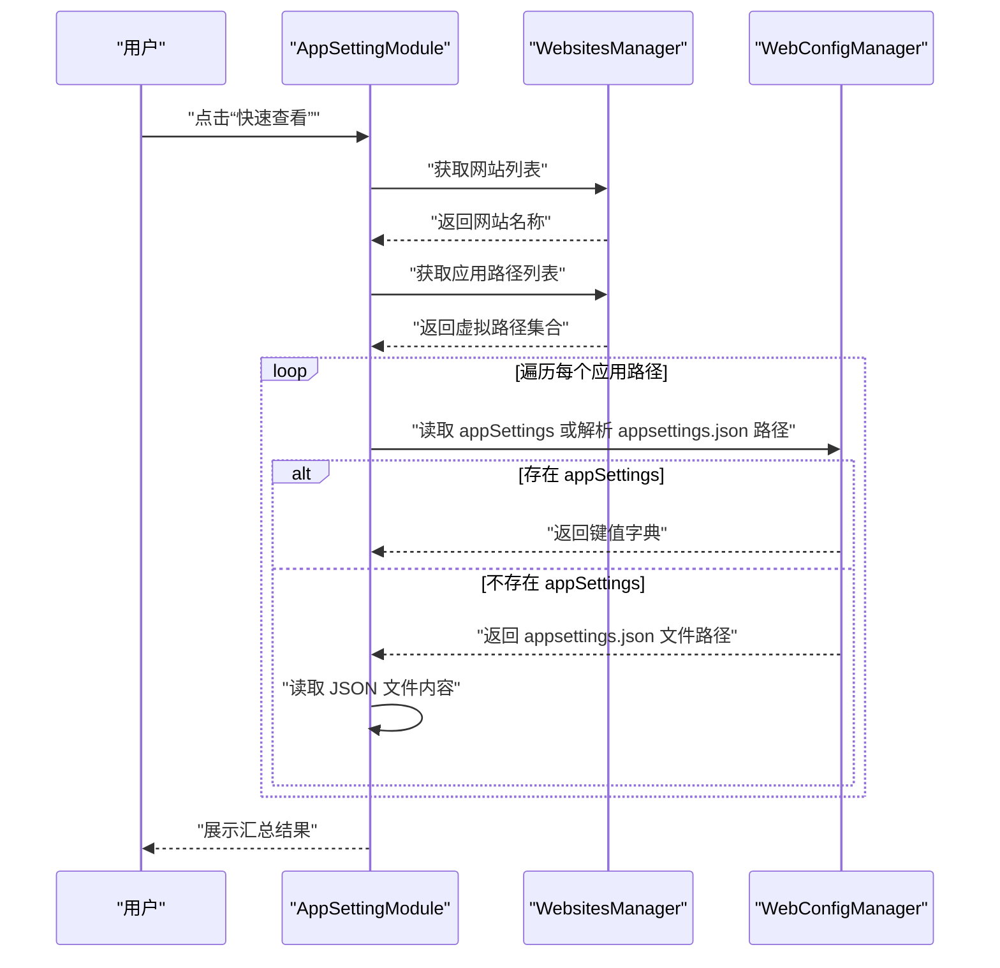
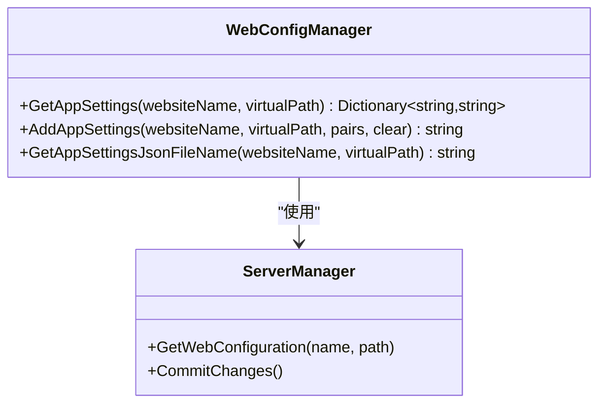
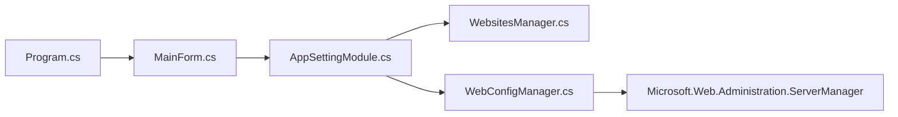

# 应用程序设置管理 (AppSettingModule)

<cite>
**本文引用的文件**
- [AppSettingModule.cs](file://Deployer/Modules/AppSettingModule.cs)
- [AppSettingModule.Designer.cs](file://Deployer/Modules/AppSettingModule.Designer.cs)
- [MainForm.cs](file://Deployer/MainForm.cs)
- [Program.cs](file://Deployer/Program.cs)
- [WebConfigManager.cs](file://iHawkIISLibrary/WebConfigManager.cs)
- [WebsitesManager.cs](file://iHawkIISLibrary/WebsitesManager.cs)
- [deployconfig.json](file://Deployer/deployconfig.json)
- [App.config](file://Deployer/App.config)
- [App.config](file://IISMonitor.v1/App.config)
- [App.config](file://IISMonitor.v2/App.config)
</cite>

## 目录
1. [简介](#简介)
2. [项目结构](#项目结构)
3. [核心组件](#核心组件)
4. [架构总览](#架构总览)
5. [详细组件分析](#详细组件分析)
6. [依赖关系分析](#依赖关系分析)
7. [性能考虑](#性能考虑)
8. [故障排查指南](#故障排查指南)
9. [结论](#结论)
10. [附录](#附录)

## 简介
本文件为 Deployer 工程中的“应用程序设置管理（AppSettingModule）”模块提供系统化功能文档。该模块用于在部署流程中查看与更新 IIS 站点的应用程序设置（appsettings），支持两种模式：
- 通过 IIS 配置节 appSettings 的键值对进行读取与写入；
- 或直接写入站点物理路径下的 appsettings.json 文件。

模块还包含部署配置项，如目标 JSON 文件名等，便于统一管理。

## 项目结构
AppSettingModule 所属工程与关键文件组织如下：
- Deployer 工程：包含模块 UI、主窗体与入口程序
- iHawkIISLibrary：封装 IIS 管理能力（网站、应用、配置）
- 配置文件：deployconfig.json 定义部署相关参数；各子项目包含 App.config



图表来源
- [MainForm.cs](file://Deployer/MainForm.cs#L48-L74)
- [AppSettingModule.cs](file://Deployer/Modules/AppSettingModule.cs#L17-L26)
- [WebConfigManager.cs](file://iHawkIISLibrary/WebConfigManager.cs#L10-L23)
- [WebsitesManager.cs](file://iHawkIISLibrary/WebsitesManager.cs#L11-L22)
- [deployconfig.json](file://Deployer/deployconfig.json#L1-L8)
- [App.config](file://Deployer/App.config#L1-L30)

章节来源
- [MainForm.cs](file://Deployer/MainForm.cs#L48-L74)
- [AppSettingModule.cs](file://Deployer/Modules/AppSettingModule.cs#L17-L26)
- [WebConfigManager.cs](file://iHawkIISLibrary/WebConfigManager.cs#L10-L23)
- [WebsitesManager.cs](file://iHawkIISLibrary/WebsitesManager.cs#L11-L22)
- [deployconfig.json](file://Deployer/deployconfig.json#L1-L8)
- [App.config](file://Deployer/App.config#L1-L30)

## 核心组件
- AppSettingModule：WinForms 用户控件，负责展示 IIS 应用的 appSettings 键值或 appsettings.json 内容，并支持保存修改。
- WebConfigManager：封装 IIS 配置读取与写入，提供 appSettings 读取、写入与 appsettings.json 路径解析。
- WebsitesManager：枚举 IIS 网站与应用路径列表，辅助定位目标虚拟路径。
- MainForm：承载多个功能页签，其中“应用程序设置管理”页签加载 AppSettingModule。
- Program：WinForms 应用入口。
- deployconfig.json：部署相关配置，包含目标 JSON 文件名等参数。

章节来源
- [AppSettingModule.cs](file://Deployer/Modules/AppSettingModule.cs#L17-L26)
- [WebConfigManager.cs](file://iHawkIISLibrary/WebConfigManager.cs#L94-L152)
- [WebsitesManager.cs](file://iHawkIISLibrary/WebsitesManager.cs#L30-L72)
- [MainForm.cs](file://Deployer/MainForm.cs#L61-L73)
- [Program.cs](file://Deployer/Program.cs#L14-L20)
- [deployconfig.json](file://Deployer/deployconfig.json#L1-L8)

## 架构总览
AppSettingModule 通过 WebsitesManager 获取 IIS 网站与应用列表，再通过 WebConfigManager 读取对应虚拟路径下的 appSettings 或 appsettings.json。保存时根据输入内容判断采用 IIS 配置节写入或直接写入 JSON 文件。



图表来源
- [AppSettingModule.cs](file://Deployer/Modules/AppSettingModule.cs#L96-L151)
- [WebsitesManager.cs](file://iHawkIISLibrary/WebsitesManager.cs#L30-L72)
- [WebConfigManager.cs](file://iHawkIISLibrary/WebConfigManager.cs#L94-L126)

## 详细组件分析

### AppSettingModule 组件
职责与行为
- UI 初始化：包含“快速查看”按钮、“保存修改”按钮、树形视图（应用路径）、文本框（显示/编辑设置）。
- 查看逻辑：遍历网站下所有应用路径，优先读取 IIS appSettings；若不存在则读取对应物理路径下的 appsettings.json。
- 保存逻辑：若输入以大括号开头则视为 JSON，直接写入 appsettings.json；否则按“key:value”逐行解析为键值对，写入 IIS appSettings。

数据流与处理规则
- 输入格式识别：以“{”开头按 JSON 处理；否则按“key:value”行分隔处理。
- 字符串类型：统一作为字符串存储（IIS appSettings 与 JSON 均为字符串）。
- 数字/布尔值：当前实现不进行显式类型转换，建议在业务侧自行解析。
- 覆盖策略：写入 IIS appSettings 时可选择清空后写入，避免残留项。

```mermaid
flowchart TD
Start(["进入保存流程"]) --> CheckType["检测输入是否以'{'开头"]
CheckType --> |是(JSON)| ResolveJSON["解析 appsettings.json 文件路径"]
ResolveJSON --> WriteJSON["写入 appsettings.json"]
WriteJSON --> Done(["完成"])
CheckType --> |否(键值对)| ParseKV["逐行解析 'key:value'"]
ParseKV --> AddToIIS["调用 AddAppSettings 写入 IIS appSettings"]
AddToIIS --> Done
```

图表来源
- [AppSettingModule.cs](file://Deployer/Modules/AppSettingModule.cs#L57-L82)

章节来源
- [AppSettingModule.cs](file://Deployer/Modules/AppSettingModule.cs#L33-L93)
- [AppSettingModule.cs](file://Deployer/Modules/AppSettingModule.cs#L95-L193)
- [AppSettingModule.Designer.cs](file://Deployer/Modules/AppSettingModule.Designer.cs#L24-L36)

### WebConfigManager 组件
职责与行为
- 读取 IIS appSettings：遍历 appSettings 集合，返回键值字典。
- 写入 IIS appSettings：可选择清空后再写入，逐对添加元素并提交变更。
- 解析 appsettings.json 文件路径：基于网站与虚拟路径计算物理路径并拼接 JSON 文件名。

复杂度与性能
- 读取与写入均为 O(n)（n 为配置项数量）。
- 提交 IIS 变更涉及服务器管理器操作，存在网络与权限开销。



图表来源
- [WebConfigManager.cs](file://iHawkIISLibrary/WebConfigManager.cs#L94-L152)

章节来源
- [WebConfigManager.cs](file://iHawkIISLibrary/WebConfigManager.cs#L94-L152)

### WebsitesManager 组件
职责与行为
- 获取网站列表与应用路径列表，供 AppSettingModule 选择目标应用路径。
- 异常情况下返回带错误前缀的字符串，便于上层 UI 显示。

复杂度与性能
- 枚举网站与应用为 O(m+k)（m 为网站数，k 为应用数）。

章节来源
- [WebsitesManager.cs](file://iHawkIISLibrary/WebsitesManager.cs#L30-L72)

### 部署配置 deployconfig.json
用途
- 定义部署相关参数，例如目标 JSON 文件名（如 appsettings.json）。

使用场景
- 在自动化部署流程中，统一指定配置文件名，便于批量替换与迁移。

章节来源
- [deployconfig.json](file://Deployer/deployconfig.json#L1-L8)

### 运行时配置 App.config
用途
- 部分第三方库的程序集绑定重定向（如 Newtonsoft.Json、SharpZipLib 等），确保运行时版本兼容。
- 各子项目（v1/v2）也包含 App.config，用于各自运行时配置。

章节来源
- [App.config](file://Deployer/App.config#L6-L29)
- [App.config](file://IISMonitor.v1/App.config#L7-L12)
- [App.config](file://IISMonitor.v2/App.config#L1-L6)

## 依赖关系分析
- AppSettingModule 依赖 WebsitesManager 与 WebConfigManager。
- WebConfigManager 依赖 Microsoft.Web.Administration 的 ServerManager。
- MainForm 作为宿主加载 AppSettingModule。
- Program 作为 WinForms 应用入口启动 MainForm。



图表来源
- [Program.cs](file://Deployer/Program.cs#L14-L20)
- [MainForm.cs](file://Deployer/MainForm.cs#L61-L73)
- [AppSettingModule.cs](file://Deployer/Modules/AppSettingModule.cs#L44-L55)
- [WebConfigManager.cs](file://iHawkIISLibrary/WebConfigManager.cs#L14-L17)

章节来源
- [Program.cs](file://Deployer/Program.cs#L14-L20)
- [MainForm.cs](file://Deployer/MainForm.cs#L61-L73)
- [AppSettingModule.cs](file://Deployer/Modules/AppSettingModule.cs#L44-L55)
- [WebConfigManager.cs](file://iHawkIISLibrary/WebConfigManager.cs#L14-L17)

## 性能考虑
- IIS 配置读取与写入涉及远程服务器管理器交互，建议：
  - 批量读取时减少往返次数（当前已按应用路径聚合处理）。
  - 写入时启用“清空后写入”以避免冗余项，降低后续解析成本。
- JSON 文件读写为本地 IO，注意编码一致性（当前使用默认编码）。
- UI 展示大量键值时建议分页或延迟加载，避免卡顿。

## 故障排查指南
常见问题与处理
- 默认网站不存在
  - 现象：UI 显示错误提示。
  - 处理：确认 IIS 中存在至少一个网站，或手动选择目标网站。
- 无法获取 appsettings.json
  - 现象：节点标记为灰色或提示暂时无法获取。
  - 处理：检查网站与应用路径映射、物理路径是否存在、权限是否足够。
- 写入失败
  - 现象：返回异常信息。
  - 处理：检查 IIS 权限、配置节是否被锁定、磁盘空间与文件权限。

章节来源
- [AppSettingModule.cs](file://Deployer/Modules/AppSettingModule.cs#L47-L51)
- [AppSettingModule.cs](file://Deployer/Modules/AppSettingModule.cs#L128-L133)
- [WebConfigManager.cs](file://iHawkIISLibrary/WebConfigManager.cs#L115-L126)
- [WebConfigManager.cs](file://iHawkIISLibrary/WebConfigManager.cs#L148-L151)

## 结论
AppSettingModule 提供了在部署流程中便捷查看与更新 IIS 应用设置的能力，既支持传统 appSettings 键值对，也支持现代 .NET 的 appsettings.json 文件。通过 WebsitesManager 与 WebConfigManager 的协作，模块实现了对多应用路径的统一管理。建议在实际使用中结合 deployconfig.json 统一配置文件命名，并在保存前做好备份与校验，确保配置安全与可追溯。

## 附录

### 使用指南与配置示例
- 开发环境
  - 直接在本地 IIS 上运行，使用“快速查看”浏览各应用设置；若应用未启用 appSettings，则会读取 appsettings.json。
  - 修改后点击“保存修改”，若输入以“{”开头则写入 JSON，否则按“key:value”写入 IIS。
- 生产环境
  - 建议先备份原配置，再执行写入操作。
  - 使用 deployconfig.json 统一目标 JSON 文件名，便于批量替换。
  - 注意 IIS 权限与远程访问策略，确保 ServerManager 可正常访问。

### 数据类型与更新规则
- 类型处理
  - 当前实现将所有值作为字符串处理（IIS appSettings 与 JSON 均为字符串）。
  - 数字、布尔值等需在业务侧自行解析。
- 更新规则
  - IIS appSettings：可选择清空后写入，避免历史残留。
  - appsettings.json：直接覆盖写入，注意备份与回滚策略。

### 优先级与覆盖机制
- 优先读取 IIS appSettings；若不存在则回退到 appsettings.json。
- 保存时：
  - JSON 模式：直接写入 JSON 文件。
  - 键值对模式：写入 IIS appSettings，并可选择清空旧项。