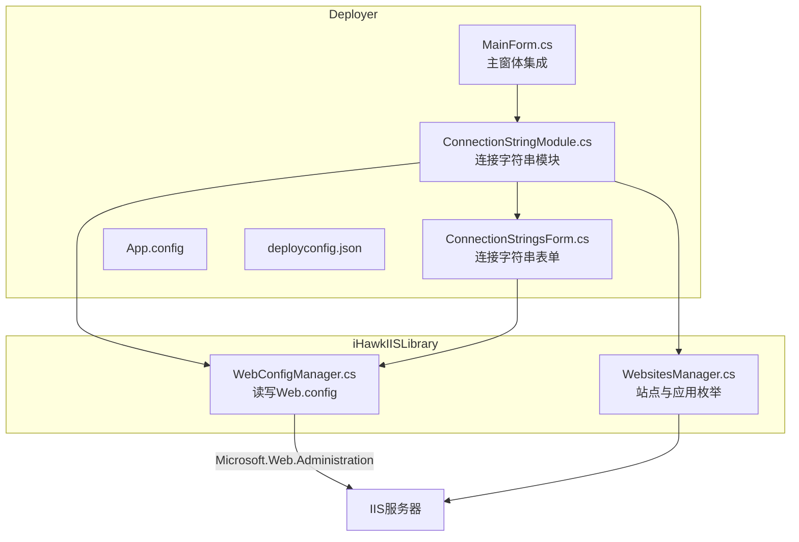
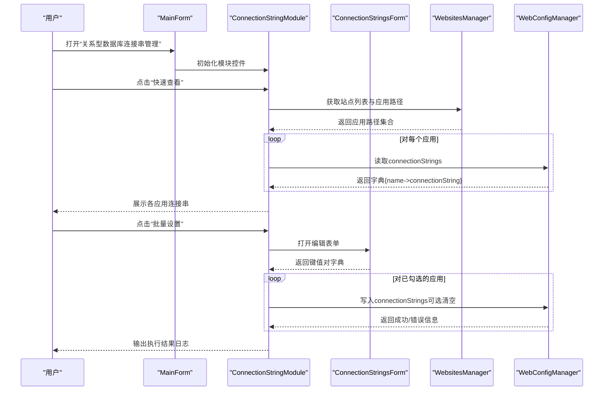
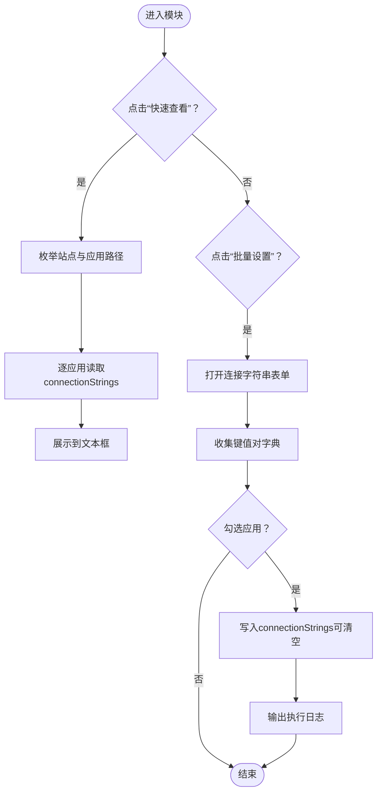
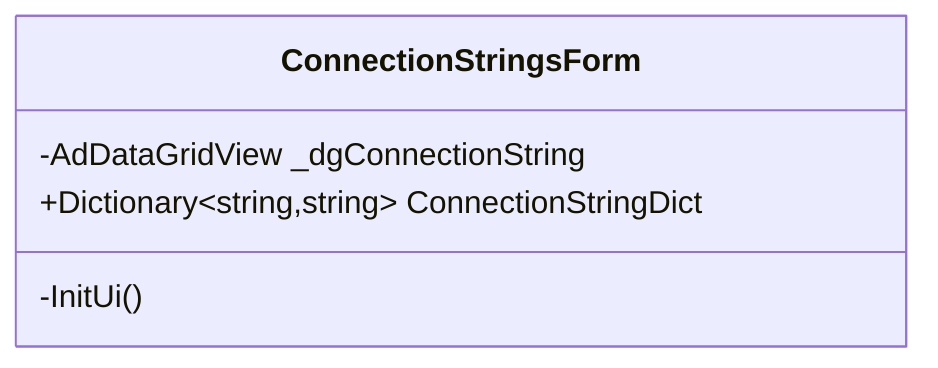
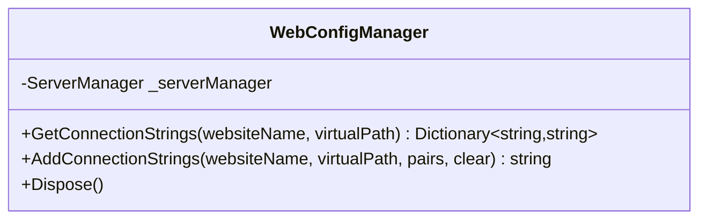
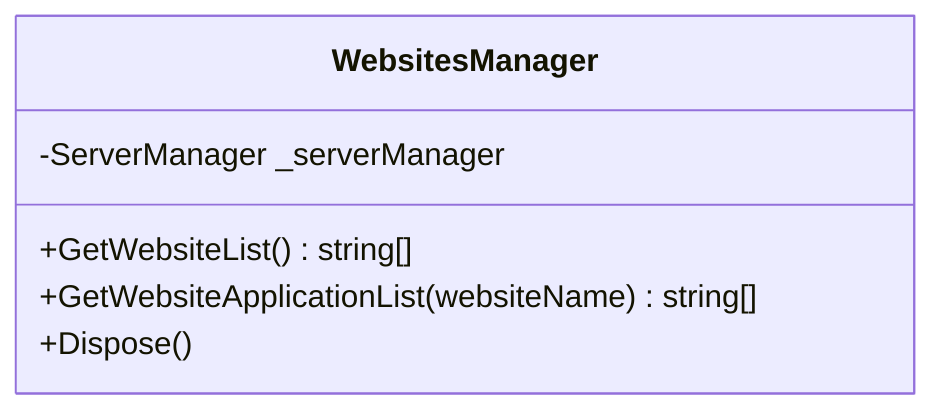
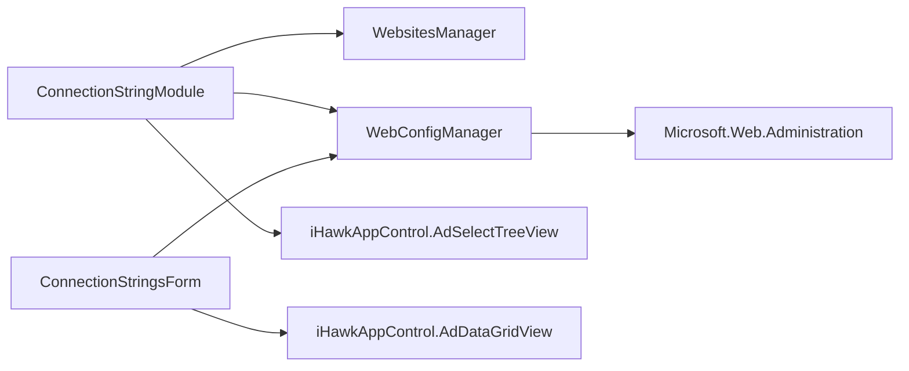

# 连接字符串管理 (ConnectionStringModule)

<cite>
**本文引用的文件**
- [ConnectionStringModule.cs](file://Deployer/Modules/ConnectionStringModule.cs)
- [ConnectionStringModule.Designer.cs](file://Deployer/Modules/ConnectionStringModule.Designer.cs)
- [ConnectionStringsForm.cs](file://Deployer/ConnectionStringsForm.cs)
- [ConnectionStringsForm.Designer.cs](file://Deployer/ConnectionStringsForm.Designer.cs)
- [WebConfigManager.cs](file://iHawkIISLibrary/WebConfigManager.cs)
- [WebsitesManager.cs](file://iHawkIISLibrary/WebsitesManager.cs)
- [MainForm.cs](file://Deployer/MainForm.cs)
- [App.config](file://Deployer/App.config)
- [deployconfig.json](file://Deployer/deployconfig.json)
</cite>

## 目录
1. [简介](#简介)
2. [项目结构](#项目结构)
3. [核心组件](#核心组件)
4. [架构总览](#架构总览)
5. [详细组件分析](#详细组件分析)
6. [依赖关系分析](#依赖关系分析)
7. [性能与可靠性考量](#性能与可靠性考量)
8. [故障排查指南](#故障排查指南)
9. [结论](#结论)
10. [附录：最佳实践与安全建议](#附录最佳实践与安全建议)

## 简介
本文件面向“连接字符串管理”模块（ConnectionStringModule），系统性阐述其设计目标、核心功能与使用方式，重点覆盖以下方面：
- 在部署流程中如何自动更新 IIS Web.config 中的 connectionStrings 节点
- ConnectionStringsForm 用户界面的功能与操作流程（新增、编辑、删除、批量管理）
- 与 IIS 配置读写交互的实现机制
- 最佳实践与安全注意事项（敏感信息处理、环境差异化配置）

该模块位于 Deployer 工程内，作为主界面的一个标签页出现，并通过 iHawkIISLibrary 提供的 WebConfigManager 与 WebsitesManager 实现对 IIS 站点及应用的连接字符串读取与写入。

## 项目结构
围绕连接字符串管理的相关文件组织如下：
- 模块界面与逻辑：Deployer/Modules/ConnectionStringModule.cs 及其设计器
- 连接字符串编辑对话框：Deployer/ConnectionStringsForm.cs 及其设计器
- IIS 配置读写：iHawkIISLibrary/WebConfigManager.cs
- IIS 站点枚举与应用路径获取：iHawkIISLibrary/WebsitesManager.cs
- 主窗体集成：Deployer/MainForm.cs
- 应用配置与部署参数：Deployer/App.config、Deployer/deployconfig.json

图表来源
- [MainForm.cs](file://Deployer/MainForm.cs#L54-L74)
- [ConnectionStringModule.cs](file://Deployer/Modules/ConnectionStringModule.cs#L16-L25)
- [ConnectionStringsForm.cs](file://Deployer/ConnectionStringsForm.cs#L13-L22)
- [WebConfigManager.cs](file://iHawkIISLibrary/WebConfigManager.cs#L10-L23)
- [WebsitesManager.cs](file://iHawkIISLibrary/WebsitesManager.cs#L11-L23)

章节来源
- [MainForm.cs](file://Deployer/MainForm.cs#L54-L74)
- [ConnectionStringModule.cs](file://Deployer/Modules/ConnectionStringModule.cs#L16-L25)
- [ConnectionStringsForm.cs](file://Deployer/ConnectionStringsForm.cs#L13-L22)
- [WebConfigManager.cs](file://iHawkIISLibrary/WebConfigManager.cs#L10-L23)
- [WebsitesManager.cs](file://iHawkIISLibrary/WebsitesManager.cs#L11-L23)
- [App.config](file://Deployer/App.config#L1-L30)
- [deployconfig.json](file://Deployer/deployconfig.json#L1-L8)

## 核心组件
- 连接字符串模块（ConnectionStringModule）：提供“快速查看”“批量设置”等能力，负责从 IIS 枚举应用并读取/写入 connectionStrings。
- 连接字符串表单（ConnectionStringsForm）：提供表格化编辑界面，收集用户输入的键值对集合。
- WebConfigManager：封装对 IIS Web.config 的读取与写入，支持清空后追加或直接替换。
- WebsitesManager：枚举 IIS 站点及其应用路径，用于批量选择目标应用。

章节来源
- [ConnectionStringModule.cs](file://Deployer/Modules/ConnectionStringModule.cs#L16-L25)
- [ConnectionStringsForm.cs](file://Deployer/ConnectionStringsForm.cs#L13-L22)
- [WebConfigManager.cs](file://iHawkIISLibrary/WebConfigManager.cs#L47-L92)
- [WebsitesManager.cs](file://iHawkIISLibrary/WebsitesManager.cs#L30-L72)

## 架构总览
下图展示连接字符串模块在部署流程中的调用链路与数据流。

图表来源
- [MainForm.cs](file://Deployer/MainForm.cs#L60-L74)
- [ConnectionStringModule.cs](file://Deployer/Modules/ConnectionStringModule.cs#L59-L128)
- [ConnectionStringsForm.cs](file://Deployer/ConnectionStringsForm.cs#L27-L40)
- [WebConfigManager.cs](file://iHawkIISLibrary/WebConfigManager.cs#L47-L92)
- [WebsitesManager.cs](file://iHawkIISLibrary/WebsitesManager.cs#L30-L72)

## 详细组件分析

### 连接字符串模块（ConnectionStringModule）
- 角色定位：承载 UI 控件与业务逻辑，负责站点与应用的枚举、连接串读取、批量写入。
- 关键行为
  - 快速查看：遍历默认站点下的应用，读取每个应用的 connectionStrings 并展示。
  - 批量设置：打开连接字符串表单，收集用户输入后，对勾选的应用逐个写入。
- 交互细节
  - 树形控件支持复选框，未选中的节点跳过写入。
  - 写入时可选择是否先清空已有项，再批量追加。
  - 错误场景：若无默认站点，会提示错误信息；读取失败返回空字典。

图表来源
- [ConnectionStringModule.cs](file://Deployer/Modules/ConnectionStringModule.cs#L59-L128)

章节来源
- [ConnectionStringModule.cs](file://Deployer/Modules/ConnectionStringModule.cs#L16-L25)
- [ConnectionStringModule.cs](file://Deployer/Modules/ConnectionStringModule.cs#L59-L128)
- [ConnectionStringModule.Designer.cs](file://Deployer/Modules/ConnectionStringModule.Designer.cs#L1-L38)

### 连接字符串表单（ConnectionStringsForm）
- 角色定位：提供表格化编辑界面，收集用户输入的连接串键值对。
- 关键属性
  - ConnectionStringDict：遍历表格行，过滤空值，构建字典返回给调用方。
- UI 特性
  - 固定对话框样式，居中显示，表格列头包含 name 与 connectionString。
  - 支持多行输入，便于批量维护。

图表来源
- [ConnectionStringsForm.cs](file://Deployer/ConnectionStringsForm.cs#L25-L40)

章节来源
- [ConnectionStringsForm.cs](file://Deployer/ConnectionStringsForm.cs#L13-L40)
- [ConnectionStringsForm.Designer.cs](file://Deployer/ConnectionStringsForm.Designer.cs#L1-L40)

### IIS 配置读写（WebConfigManager）
- 角色定位：封装对 IIS Web.config 的读取与写入，基于 Microsoft.Web.Administration。
- 关键方法
  - GetConnectionStrings：读取指定站点与应用的 connectionStrings，返回字典。
  - AddConnectionStrings：向指定站点与应用写入 connectionStrings，支持清空后再写入。
- 异常处理：捕获异常并返回错误消息，避免影响上层流程。

图表来源
- [WebConfigManager.cs](file://iHawkIISLibrary/WebConfigManager.cs#L10-L23)
- [WebConfigManager.cs](file://iHawkIISLibrary/WebConfigManager.cs#L47-L92)

章节来源
- [WebConfigManager.cs](file://iHawkIISLibrary/WebConfigManager.cs#L47-L92)

### 站点与应用枚举（WebsitesManager）
- 角色定位：提供 IIS 站点与应用路径的枚举能力，供连接字符串模块使用。
- 关键方法
  - GetWebsiteList：返回站点名称列表。
  - GetWebsiteApplicationList：返回指定站点的应用路径列表。

图表来源
- [WebsitesManager.cs](file://iHawkIISLibrary/WebsitesManager.cs#L11-L23)
- [WebsitesManager.cs](file://iHawkIISLibrary/WebsitesManager.cs#L30-L72)

章节来源
- [WebsitesManager.cs](file://iHawkIISLibrary/WebsitesManager.cs#L30-L72)

### 主窗体集成（MainForm）
- 角色定位：承载多个标签页，其中“关系型数据库连接串管理”即为连接字符串模块所在页签。
- 集成方式：通过 Dock 填充页签，实例化模块控件并加入容器。

章节来源
- [MainForm.cs](file://Deployer/MainForm.cs#L54-L74)

## 依赖关系分析
- 模块耦合
  - ConnectionStringModule 依赖 WebsitesManager 与 WebConfigManager，形成“UI -> 业务 -> IIS”的分层。
  - ConnectionStringsForm 仅负责数据采集，不直接访问 IIS，降低耦合度。
- 外部依赖
  - Microsoft.Web.Administration：用于读写 IIS 配置。
  - 自定义控件库（iHawkAppControl）：AdSelectTreeView 与 AdDataGridView，用于增强 UI 体验。
- 配置文件
  - App.config：运行时依赖重定向与启动配置。
  - deployconfig.json：部署相关参数（如 appsettings.json 文件名），与连接字符串模块无直接耦合。

图表来源
- [ConnectionStringModule.cs](file://Deployer/Modules/ConnectionStringModule.cs#L28-L30)
- [ConnectionStringsForm.cs](file://Deployer/ConnectionStringsForm.cs#L25-L26)
- [WebConfigManager.cs](file://iHawkIISLibrary/WebConfigManager.cs#L16-L17)
- [App.config](file://Deployer/App.config#L6-L29)
- [deployconfig.json](file://Deployer/deployconfig.json#L6-L7)

章节来源
- [ConnectionStringModule.cs](file://Deployer/Modules/ConnectionStringModule.cs#L28-L30)
- [ConnectionStringsForm.cs](file://Deployer/ConnectionStringsForm.cs#L25-L26)
- [WebConfigManager.cs](file://iHawkIISLibrary/WebConfigManager.cs#L16-L17)
- [App.config](file://Deployer/App.config#L6-L29)
- [deployconfig.json](file://Deployer/deployconfig.json#L6-L7)

## 性能与可靠性考量
- 性能
  - 读取阶段：按应用逐次读取 connectionStrings，复杂度 O(N×M)，N 为应用数，M 为每应用连接串条目数。
  - 写入阶段：逐应用写入，复杂度 O(N×M)，且每次写入都会提交一次变更，可能产生多次 IIS 配置写入。
- 可靠性
  - 异常捕获：读取与写入均包含 try/catch，失败时返回错误信息，避免崩溃。
  - 空站点保护：若默认站点不存在，模块会提示错误，防止后续操作无效。
  - 清空策略：写入前可选择清空，避免历史残留导致冲突。

章节来源
- [ConnectionStringModule.cs](file://Deployer/Modules/ConnectionStringModule.cs#L68-L128)
- [WebConfigManager.cs](file://iHawkIISLibrary/WebConfigManager.cs#L47-L92)

## 故障排查指南
- 无默认站点
  - 现象：快速查看时提示默认站点不存在。
  - 排查：确认 IIS 是否存在名为“Default Web Site”的站点；若不存在，请先创建或调整目标站点。
  - 参考位置：[ConnectionStringModule.cs](file://Deployer/Modules/ConnectionStringModule.cs#L68-L72)
- 读取失败
  - 现象：某应用的连接串为空或报错。
  - 排查：检查该应用的 Web.config 是否存在 connectionStrings 节点；确认 IIS 权限与配置是否正确。
  - 参考位置：[WebConfigManager.cs](file://iHawkIISLibrary/WebConfigManager.cs#L47-L66)
- 写入失败
  - 现象：写入后未生效或返回错误信息。
  - 排查：确认 IIS 管理权限；检查 Clear 参数是否导致历史连接串被清空；查看返回的错误消息。
  - 参考位置：[WebConfigManager.cs](file://iHawkIISLibrary/WebConfigManager.cs#L68-L92)
- 未勾选应用
  - 现象：点击“批量设置”无任何写入。
  - 排查：确保至少勾选一个应用；模块仅对勾选节点执行写入。
  - 参考位置：[ConnectionStringModule.cs](file://Deployer/Modules/ConnectionStringModule.cs#L120-L126)

## 结论
连接字符串管理模块以简洁的 UI 与清晰的职责划分，实现了对 IIS 站点与应用连接串的批量读取与写入。通过 WebsitesManager 与 WebConfigManager 的封装，模块在保证易用性的同时，也兼顾了错误处理与可维护性。建议在生产环境中配合安全策略与环境差异化配置，进一步提升安全性与可运维性。

## 附录：最佳实践与安全建议
- 环境差异化配置
  - 将不同环境（开发、测试、生产）的连接串分离，避免硬编码在共享配置中。
  - 可结合外部密钥管理服务或环境变量进行动态注入。
- 敏感信息保护
  - 避免在 Web.config 中明文存储密码；优先使用 Windows 身份验证或受控凭据管理。
  - 若必须存储，建议采用加密存储并在部署时解密写入。
- 部署自动化
  - 在 CI/CD 流程中，将连接串作为参数传入，由模块在部署阶段统一写入，减少手工干预。
- 审计与回滚
  - 写入前记录当前配置快照，以便失败时回滚。
  - 记录每次批量设置的日志，便于追踪与审计。