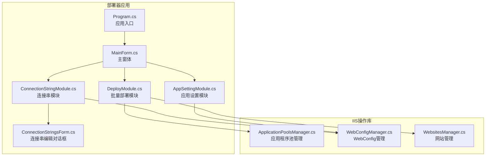
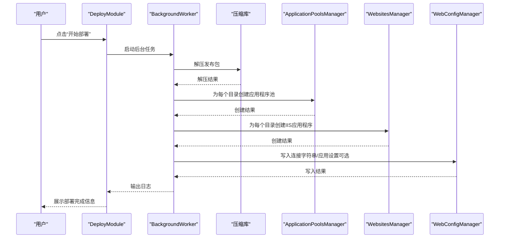
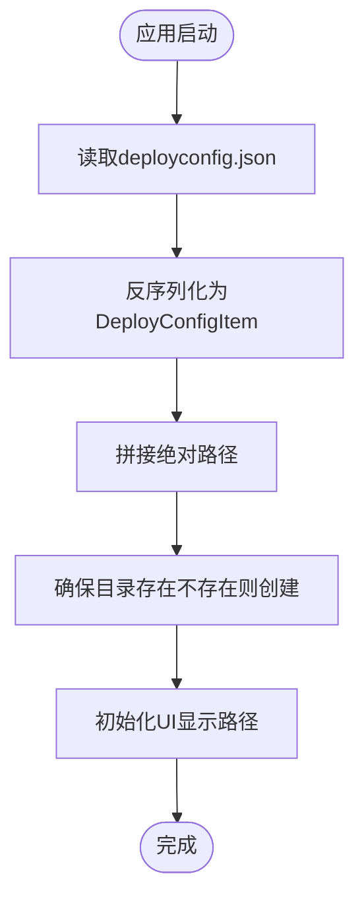
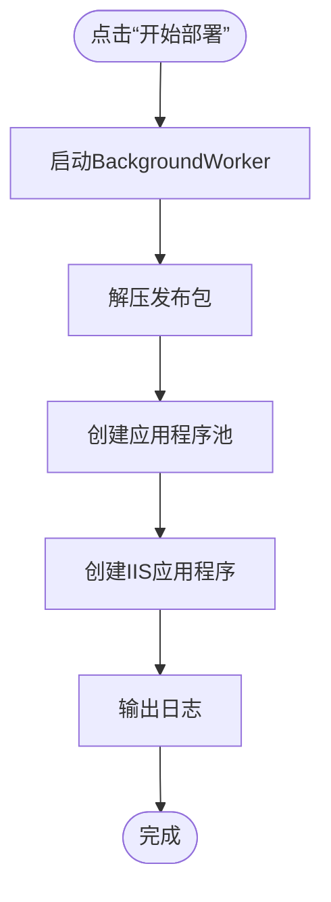
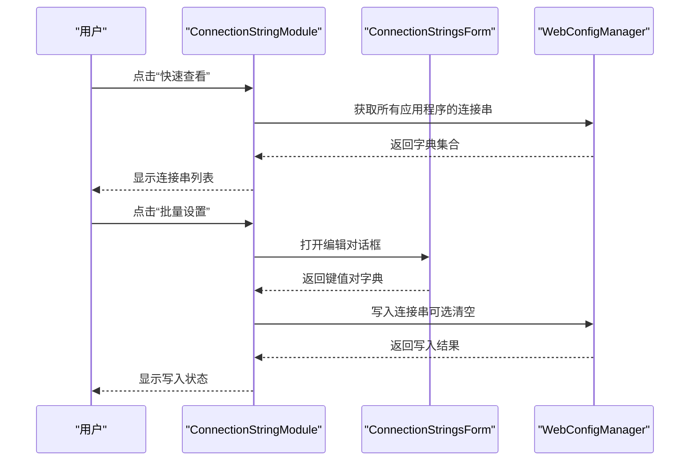
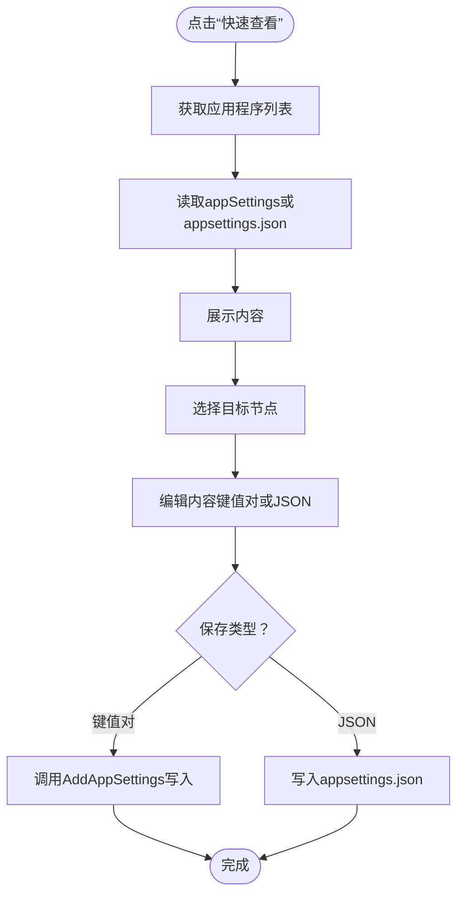
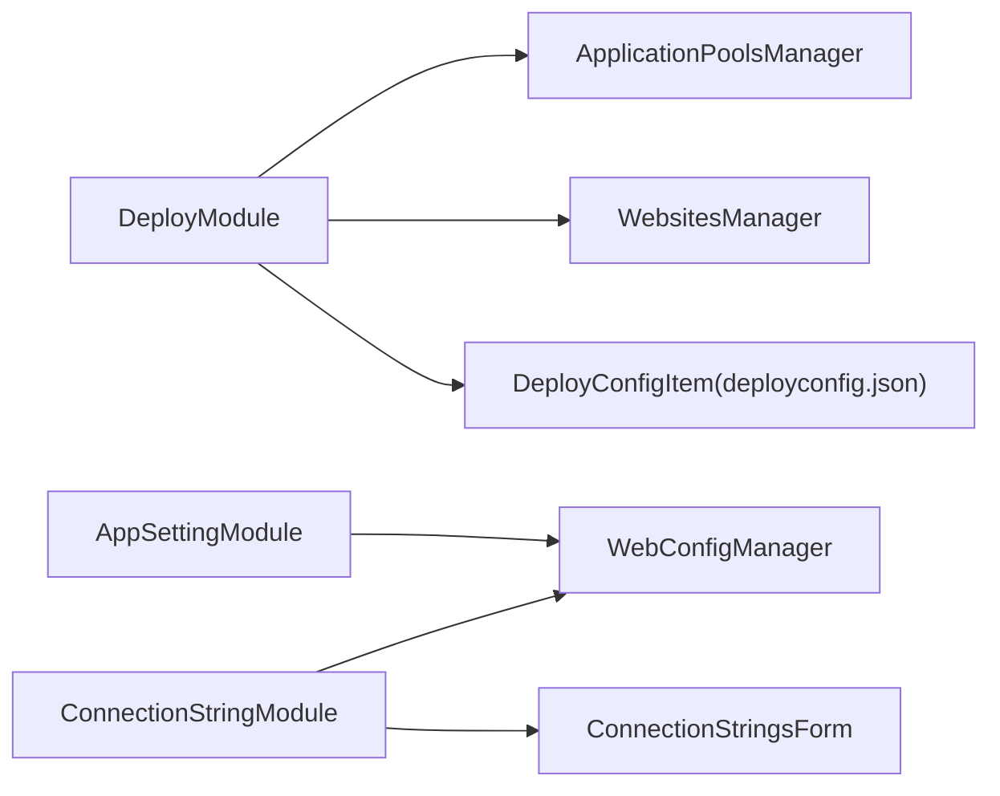

# 部署器功能详解

<cite>
**本文档引用的文件**
- [deployconfig.json](file://Deployer/deployconfig.json)
- [DeployConfigItem.cs](file://Deployer/DeployConfigItem.cs)
- [Program.cs](file://Deployer/Program.cs)
- [MainForm.cs](file://Deployer/MainForm.cs)
- [DeployModule.cs](file://Deployer/Modules/DeployModule.cs)
- [ConnectionStringModule.cs](file://Deployer/Modules/ConnectionStringModule.cs)
- [AppSettingModule.cs](file://Deployer/Modules/AppSettingModule.cs)
- [ConnectionStringsForm.cs](file://Deployer/ConnectionStringsForm.cs)
- [ApplicationPoolsManager.cs](file://iHawkIISLibrary/ApplicationPoolsManager.cs)
- [WebConfigManager.cs](file://iHawkIISLibrary/WebConfigManager.cs)
- [WebsitesManager.cs](file://iHawkIISLibrary/WebsitesManager.cs)
</cite>

## 目录
1. [简介](#简介)
2. [项目结构](#项目结构)
3. [核心组件](#核心组件)
4. [架构总览](#架构总览)
5. [详细组件分析](#详细组件分析)
6. [依赖关系分析](#依赖关系分析)
7. [性能考虑](#性能考虑)
8. [故障排除指南](#故障排除指南)
9. [结论](#结论)
10. [附录](#附录)

## 简介
本文件面向Deployer部署工具的使用者与维护者，系统性阐述部署配置文件deployconfig.json的结构与配置项，深入解析DeployModule、ConnectionStringModule、AppSettingModule三大核心模块的功能与使用方法，并提供从配置准备到执行部署的完整流程指南。同时涵盖批量部署、配置文件自动更新、应用程序池管理等主题，给出连接字符串与应用程序设置管理的最佳实践及常见场景的配置示例与故障排除建议。

## 项目结构
Deployer采用Windows Forms桌面应用架构，主要由以下部分构成：
- 配置层：deployconfig.json定义部署路径、应用程序池命名规则与.NET标识文件名
- 主界面层：MainForm承载三个功能标签页（批量部署、连接串管理、应用设置管理）
- 模块层：各功能模块封装UI与业务逻辑
- IIS操作库：iHawkIISLibrary提供应用程序池、网站与web.config读写的底层能力

图表来源
- [Program.cs](file://Deployer/Program.cs#L14-L20)
- [MainForm.cs](file://Deployer/MainForm.cs#L48-L74)
- [DeployModule.cs](file://Deployer/Modules/DeployModule.cs#L107-L152)
- [ConnectionStringModule.cs](file://Deployer/Modules/ConnectionStringModule.cs#L104-L128)
- [AppSettingModule.cs](file://Deployer/Modules/AppSettingModule.cs#L39-L82)
- [ApplicationPoolsManager.cs](file://iHawkIISLibrary/ApplicationPoolsManager.cs#L105-L121)
- [WebConfigManager.cs](file://iHawkIISLibrary/WebConfigManager.cs#L68-L92)
- [WebsitesManager.cs](file://iHawkIISLibrary/WebsitesManager.cs#L74-L90)

章节来源
- [Program.cs](file://Deployer/Program.cs#L14-L20)
- [MainForm.cs](file://Deployer/MainForm.cs#L48-L74)

## 核心组件
本节聚焦三个核心模块的功能职责与交互方式。

- DeployModule（批量部署模块）
  - 负责发布包解压、应用程序池创建、IIS应用程序创建与日志输出
  - 通过deployconfig.json加载配置，自动创建发布包与解压目录
  - 使用BackgroundWorker异步执行部署步骤，避免UI阻塞

- ConnectionStringModule（连接串模块）
  - 支持快速查看与批量设置IIS应用程序的连接字符串
  - 通过树形控件选择目标虚拟路径，支持勾选批量应用
  - 调用WebConfigManager进行读取与写入

- AppSettingModule（应用设置模块）
  - 支持查看与编辑IIS应用程序的appSettings
  - 自动识别web.config中的键值对或物理路径下的appsettings.json
  - 提供文本编辑与保存功能

章节来源
- [DeployModule.cs](file://Deployer/Modules/DeployModule.cs#L15-L29)
- [ConnectionStringModule.cs](file://Deployer/Modules/ConnectionStringModule.cs#L13-L25)
- [AppSettingModule.cs](file://Deployer/Modules/AppSettingModule.cs#L14-L26)

## 架构总览
下图展示部署器在IIS环境中的整体工作流：从配置文件加载，到发布包解压、应用程序池与应用程序创建，再到配置文件写入与日志记录。

图表来源
- [DeployModule.cs](file://Deployer/Modules/DeployModule.cs#L55-L84)
- [DeployModule.cs](file://Deployer/Modules/DeployModule.cs#L88-L103)
- [DeployModule.cs](file://Deployer/Modules/DeployModule.cs#L105-L124)
- [DeployModule.cs](file://Deployer/Modules/DeployModule.cs#L126-L153)
- [ApplicationPoolsManager.cs](file://iHawkIISLibrary/ApplicationPoolsManager.cs#L105-L121)
- [WebsitesManager.cs](file://iHawkIISLibrary/WebsitesManager.cs#L74-L90)
- [WebConfigManager.cs](file://iHawkIISLibrary/WebConfigManager.cs#L68-L92)

## 详细组件分析

### 部署配置文件deployconfig.json
deployconfig.json是部署器的核心配置文件，定义了发布包目录、解压目录、应用程序池命名规则以及.NET标识文件名。其字段含义如下：
- ReleasePackDir：发布包存放目录（相对路径，启动时会拼接为绝对路径）
- ReleaseUnpackDir：发布包解压目录（相对路径，启动时会拼接为绝对路径）
- AppPoolNamePrefix：应用程序池名称前缀
- AppPoolNameSuffix：应用程序池名称后缀
- NetTagFileName：用于判断是否为.NET 5/6+的标识文件名（若存在则不指定托管版本）

配置加载与初始化流程：
- DeployModule在窗体加载事件中读取JSON并反序列化为DeployConfigItem
- 将相对路径转换为绝对路径，并确保目录存在（不存在则创建）
- UI控件显示当前配置的绝对路径

图表来源
- [DeployModule.cs](file://Deployer/Modules/DeployModule.cs#L40-L53)
- [DeployConfigItem.cs](file://Deployer/DeployConfigItem.cs#L9-L36)

章节来源
- [deployconfig.json](file://Deployer/deployconfig.json#L1-L8)
- [DeployConfigItem.cs](file://Deployer/DeployConfigItem.cs#L9-L36)
- [DeployModule.cs](file://Deployer/Modules/DeployModule.cs#L40-L53)

### DeployModule（批量部署模块）
DeployModule负责完整的部署流程，包括发布包解压、应用程序池创建、IIS应用程序创建与日志输出。其关键处理逻辑如下：
- 发布包解压：扫描ReleasePackDir下的.zip文件，逐个解压至ReleaseUnpackDir
- 应用程序池创建：遍历ReleaseUnpackDir下的子目录，按约定生成应用程序池名称；若对应目录存在.NET标识文件，则不指定托管版本
- IIS应用程序创建：获取默认网站列表，为每个子目录创建IIS应用程序，绑定对应的应用程序池
- 日志输出：通过BackgroundWorker的进度回调向UI文本框追加日志

图表来源
- [DeployModule.cs](file://Deployer/Modules/DeployModule.cs#L55-L84)
- [DeployModule.cs](file://Deployer/Modules/DeployModule.cs#L88-L103)
- [DeployModule.cs](file://Deployer/Modules/DeployModule.cs#L105-L124)
- [DeployModule.cs](file://Deployer/Modules/DeployModule.cs#L126-L153)

章节来源
- [DeployModule.cs](file://Deployer/Modules/DeployModule.cs#L55-L153)

### ConnectionStringModule（连接串模块）
ConnectionStringModule提供连接字符串的查看与批量设置功能：
- 快速查看：列出默认网站的所有应用程序，读取其connectionStrings并展示
- 批量设置：弹出ConnectionStringsForm输入键值对，勾选目标节点后统一写入
- 读写实现：通过WebConfigManager的GetConnectionStrings与AddConnectionStrings完成

图表来源
- [ConnectionStringModule.cs](file://Deployer/Modules/ConnectionStringModule.cs#L59-L102)
- [ConnectionStringModule.cs](file://Deployer/Modules/ConnectionStringModule.cs#L104-L128)
- [ConnectionStringsForm.cs](file://Deployer/ConnectionStringsForm.cs#L27-L40)
- [WebConfigManager.cs](file://iHawkIISLibrary/WebConfigManager.cs#L47-L66)
- [WebConfigManager.cs](file://iHawkIISLibrary/WebConfigManager.cs#L68-L92)

章节来源
- [ConnectionStringModule.cs](file://Deployer/Modules/ConnectionStringModule.cs#L59-L128)
- [ConnectionStringsForm.cs](file://Deployer/ConnectionStringsForm.cs#L27-L40)

### AppSettingModule（应用设置模块）
AppSettingModule支持查看与编辑appSettings：
- 快速查看：列出默认网站的所有应用程序，读取其appSettings或物理路径下的appsettings.json
- 编辑保存：支持两种输入格式：键值对文本或JSON字符串；分别调用WebConfigManager的AddAppSettings或直接写入JSON文件
- 交互设计：左侧树形控件选择目标虚拟路径，右侧文本框显示与编辑内容

图表来源
- [AppSettingModule.cs](file://Deployer/Modules/AppSettingModule.cs#L96-L151)
- [AppSettingModule.cs](file://Deployer/Modules/AppSettingModule.cs#L153-L192)
- [AppSettingModule.cs](file://Deployer/Modules/AppSettingModule.cs#L39-L82)
- [WebConfigManager.cs](file://iHawkIISLibrary/WebConfigManager.cs#L94-L113)
- [WebConfigManager.cs](file://iHawkIISLibrary/WebConfigManager.cs#L115-L126)
- [WebConfigManager.cs](file://iHawkIISLibrary/WebConfigManager.cs#L128-L152)

章节来源
- [AppSettingModule.cs](file://Deployer/Modules/AppSettingModule.cs#L96-L192)

### 主界面与模块集成
MainForm作为应用主窗体，通过TabControl组织三个功能标签页：
- “批量部署”：嵌入DeployModule
- “关系型数据库连接串管理”：嵌入ConnectionStringModule
- “应用程序设置管理”：嵌入AppSettingModule

章节来源
- [MainForm.cs](file://Deployer/MainForm.cs#L48-L74)

## 依赖关系分析
- DeployModule依赖iHawkIISLibrary的ApplicationPoolsManager与WebsitesManager进行IIS操作
- ConnectionStringModule与AppSettingModule均依赖WebConfigManager进行配置读写
- ConnectionStringsForm为ConnectionStringModule提供键值对编辑界面
- deployconfig.json被DeployModule在运行时动态加载与解析

图表来源
- [DeployModule.cs](file://Deployer/Modules/DeployModule.cs#L107-L152)
- [ConnectionStringModule.cs](file://Deployer/Modules/ConnectionStringModule.cs#L104-L128)
- [AppSettingModule.cs](file://Deployer/Modules/AppSettingModule.cs#L39-L82)
- [ConnectionStringsForm.cs](file://Deployer/ConnectionStringsForm.cs#L27-L40)
- [DeployConfigItem.cs](file://Deployer/DeployConfigItem.cs#L9-L36)

章节来源
- [DeployModule.cs](file://Deployer/Modules/DeployModule.cs#L107-L152)
- [ConnectionStringModule.cs](file://Deployer/Modules/ConnectionStringModule.cs#L104-L128)
- [AppSettingModule.cs](file://Deployer/Modules/AppSettingModule.cs#L39-L82)

## 性能考虑
- 异步执行：部署流程通过BackgroundWorker异步执行，避免UI线程阻塞
- I/O优化：发布包解压与配置写入均为顺序I/O，建议确保磁盘空间充足与网络路径稳定
- 批量操作：连接串与应用设置支持批量勾选，减少重复操作
- 失败回退：IIS操作异常时返回错误信息，便于定位问题

## 故障排除指南
- 默认网站不存在
  - 现象：连接串/应用设置模块提示默认网站不存在
  - 原因：系统未安装IIS或默认网站未启用
  - 处理：确认IIS已安装并存在默认网站
  - 参考位置
    - [ConnectionStringModule.cs](file://Deployer/Modules/ConnectionStringModule.cs#L68-L72)
    - [AppSettingModule.cs](file://Deployer/Modules/AppSettingModule.cs#L105-L110)

- 发布包解压失败
  - 现象：日志显示解压失败或无zip文件
  - 原因：ReleasePackDir未放置zip文件或文件损坏
  - 处理：检查ReleasePackDir路径与zip文件完整性
  - 参考位置
    - [DeployModule.cs](file://Deployer/Modules/DeployModule.cs#L88-L103)

- 应用程序池创建失败
  - 现象：返回“已存在”或异常信息
  - 原因：同名应用程序池已存在或权限不足
  - 处理：修改AppPoolNamePrefix/AppPoolNameSuffix或提升权限
  - 参考位置
    - [ApplicationPoolsManager.cs](file://iHawkIISLibrary/ApplicationPoolsManager.cs#L105-L121)

- IIS应用程序创建失败
  - 现象：返回“已存在”或“站点不存在”
  - 原因：目标路径已存在或默认网站不存在
  - 处理：清理冲突路径或确认默认网站
  - 参考位置
    - [WebsitesManager.cs](file://iHawkIISLibrary/WebsitesManager.cs#L74-L90)

- 连接串写入失败
  - 现象：返回异常消息
  - 原因：权限不足或配置段异常
  - 处理：以管理员身份运行或检查web.config结构
  - 参考位置
    - [WebConfigManager.cs](file://iHawkIISLibrary/WebConfigManager.cs#L68-L92)

- 应用设置写入失败
  - 现象：键值对写入或JSON写入异常
  - 原因：路径不可写或JSON格式错误
  - 处理：检查appsettings.json物理路径与JSON格式
  - 参考位置
    - [AppSettingModule.cs](file://Deployer/Modules/AppSettingModule.cs#L57-L81)
    - [WebConfigManager.cs](file://iHawkIISLibrary/WebConfigManager.cs#L115-L126)

## 结论
Deployer部署工具通过简洁的配置文件与直观的模块化界面，实现了从发布包解压、应用程序池与IIS应用程序创建，到连接串与应用设置的自动化管理。结合iHawkIISLibrary提供的IIS操作能力，用户可以高效地完成批量部署与配置更新。建议在生产环境中遵循最佳实践，确保IIS权限、路径与配置文件的正确性，并利用日志与错误反馈机制进行问题排查。

## 附录

### 部署流程指南（从配置到执行）
- 准备发布包
  - 将待部署的zip包放入ReleasePackDir目录
- 配置deployconfig.json
  - 设置ReleasePackDir、ReleaseUnpackDir、AppPoolNamePrefix/Suffix、NetTagFileName
- 启动部署器
  - 运行主程序，进入“批量部署”标签页
- 执行部署
  - 点击“开始部署”，观察日志输出
  - 部署完成后，可在IIS中看到新创建的应用程序池与应用程序

章节来源
- [deployconfig.json](file://Deployer/deployconfig.json#L1-L8)
- [DeployModule.cs](file://Deployer/Modules/DeployModule.cs#L55-L84)

### 连接字符串与应用设置管理最佳实践
- 连接字符串管理
  - 使用ConnectionStringModule的“批量设置”功能，先在ConnectionStringsForm中编辑键值对，再勾选目标节点统一写入
  - 建议为不同环境（开发、测试、生产）维护独立的连接串字典
  - 写入前可选择清空现有连接串，避免残留配置影响

- 应用程序设置管理
  - 对于传统web.config：使用键值对文本格式，一行一个“key:value”
  - 对于.NET 5/6+：使用appsettings.json文件，直接粘贴JSON字符串
  - 修改后建议重启应用程序池以确保配置生效

章节来源
- [ConnectionStringModule.cs](file://Deployer/Modules/ConnectionStringModule.cs#L104-L128)
- [ConnectionStringsForm.cs](file://Deployer/ConnectionStringsForm.cs#L27-L40)
- [AppSettingModule.cs](file://Deployer/Modules/AppSettingModule.cs#L39-L82)
- [WebConfigManager.cs](file://iHawkIISLibrary/WebConfigManager.cs#L115-L126)

### 常见部署场景配置示例
- 场景一：多版本.NET混合部署
  - 在每个发布包根目录放置NetTagFileName对应的标识文件，DeployModule将自动识别并跳过托管版本设置
  - 参考位置
    - [DeployModule.cs](file://Deployer/Modules/DeployModule.cs#L114-L115)

- 场景二：批量更新连接串
  - 在ConnectionStringsForm中输入多组键值对，勾选多个应用程序节点，一次性写入
  - 参考位置
    - [ConnectionStringModule.cs](file://Deployer/Modules/ConnectionStringModule.cs#L120-L127)

- 场景三：按环境切换应用设置
  - 在AppSettingModule中选择目标应用程序，粘贴对应环境的JSON或键值对，保存后生效
  - 参考位置
    - [AppSettingModule.cs](file://Deployer/Modules/AppSettingModule.cs#L57-L81)