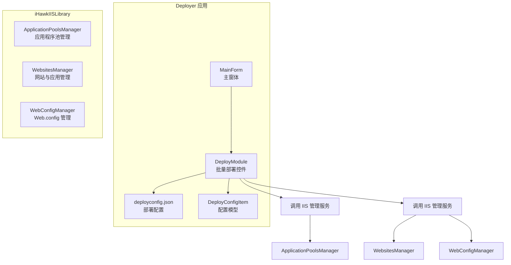
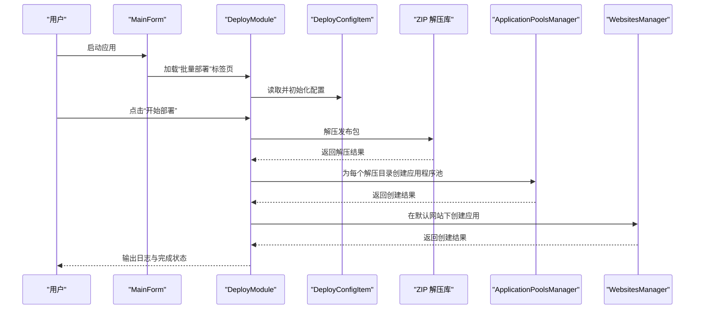
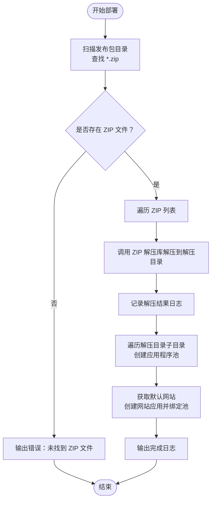
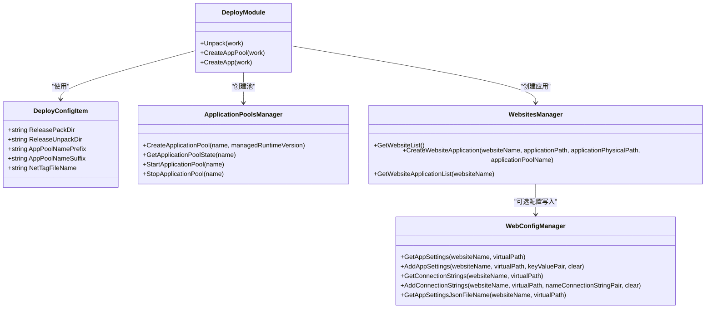
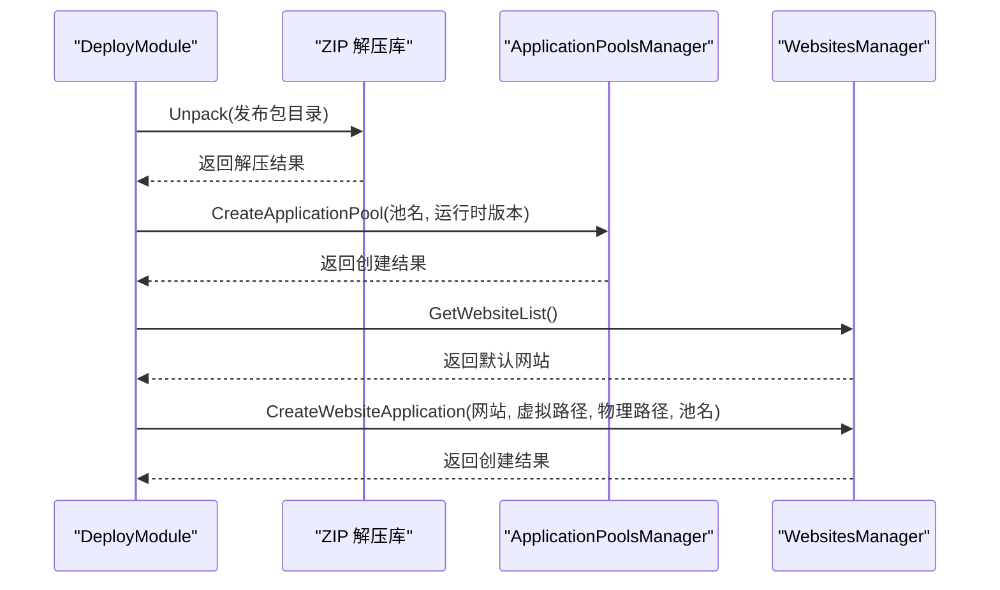
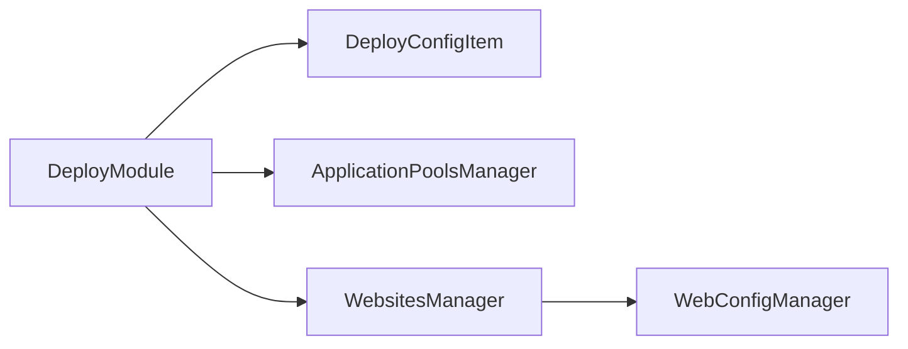

# 部署模块 (DeployModule)

<cite>
**本文引用的文件**
- [DeployModule.cs](file://Deployer/Modules/DeployModule.cs)
- [DeployConfigItem.cs](file://Deployer/DeployConfigItem.cs)
- [deployconfig.json](file://Deployer/deployconfig.json)
- [Program.cs](file://Deployer/Program.cs)
- [MainForm.cs](file://Deployer/MainForm.cs)
- [ApplicationPoolsManager.cs](file://iHawkIISLibrary/ApplicationPoolsManager.cs)
- [WebsitesManager.cs](file://iHawkIISLibrary/WebsitesManager.cs)
- [WebConfigManager.cs](file://iHawkIISLibrary/WebConfigManager.cs)
- [AppSettingModule.cs](file://Deployer/Modules/AppSettingModule.cs)
- [ConnectionStringModule.cs](file://Deployer/Modules/ConnectionStringModule.cs)
</cite>

## 目录
1. [简介](#简介)
2. [项目结构](#项目结构)
3. [核心组件](#核心组件)
4. [架构总览](#架构总览)
5. [详细组件分析](#详细组件分析)
6. [依赖关系分析](#依赖关系分析)
7. [性能考虑](#性能考虑)
8. [故障排除指南](#故障排除指南)
9. [结论](#结论)
10. [附录](#附录)

## 简介
本文件为 DeployModule 部署模块的详细功能文档，面向需要在 IIS 上进行批量部署的用户与开发者。文档深入解释了部署模块的核心功能与实现原理，涵盖以下内容：
- 部署配置项 DeployConfigItem 的结构与属性说明
- 部署流程的完整步骤：发布包目录扫描、ZIP 解压、应用程序池创建、网站应用创建
- 部署模块如何处理 ZIP 压缩包的解压、文件复制与 IIS 配置更新
- 使用示例与关键配置参数说明，如 ReleasePackDir、ReleaseUnpackDir、AppPoolNamePrefix 等

## 项目结构
Deployer 工程包含部署模块、配置文件以及 IIS 管理库。主要文件与职责如下：
- Deployer/Modules/DeployModule.cs：批量部署界面与逻辑实现
- Deployer/DeployConfigItem.cs：部署配置项的数据模型
- Deployer/deployconfig.json：部署配置文件
- iHawkIISLibrary/ApplicationPoolsManager.cs：IIS 应用程序池管理
- iHawkIISLibrary/WebsitesManager.cs：IIS 网站与应用管理
- iHawkIISLibrary/WebConfigManager.cs：Web.config 读写与 JSON 配置管理
- Deployer/MainForm.cs：主窗体，承载多个功能标签页（含“批量部署”）

图表来源
- [DeployModule.cs](file://Deployer/Modules/DeployModule.cs#L1-L204)
- [MainForm.cs](file://Deployer/MainForm.cs#L1-L78)
- [deployconfig.json](file://Deployer/deployconfig.json#L1-L8)
- [DeployConfigItem.cs](file://Deployer/DeployConfigItem.cs#L1-L37)
- [ApplicationPoolsManager.cs](file://iHawkIISLibrary/ApplicationPoolsManager.cs#L1-L143)
- [WebsitesManager.cs](file://iHawkIISLibrary/WebsitesManager.cs#L1-L94)
- [WebConfigManager.cs](file://iHawkIISLibrary/WebConfigManager.cs#L1-L157)

章节来源
- [DeployModule.cs](file://Deployer/Modules/DeployModule.cs#L1-L204)
- [MainForm.cs](file://Deployer/MainForm.cs#L1-L78)
- [deployconfig.json](file://Deployer/deployconfig.json#L1-L8)
- [DeployConfigItem.cs](file://Deployer/DeployConfigItem.cs#L1-L37)

## 核心组件
- DeployModule：负责批量部署的 UI 与业务流程，包含解压、创建应用程序池、创建网站应用等步骤，并通过后台线程异步执行。
- DeployConfigItem：定义部署所需的配置项，包括发布包目录、解压目录、应用程序池命名规则及 .NET 标识文件名。
- ApplicationPoolsManager：封装 IIS 应用程序池的查询、创建、启停等操作。
- WebsitesManager：封装 IIS 网站与应用的查询、创建等操作。
- WebConfigManager：封装 Web.config 中 appSettings 与 connectionStrings 的读取与写入，以及 appsettings.json 文件路径解析。

章节来源
- [DeployModule.cs](file://Deployer/Modules/DeployModule.cs#L1-L204)
- [DeployConfigItem.cs](file://Deployer/DeployConfigItem.cs#L1-L37)
- [ApplicationPoolsManager.cs](file://iHawkIISLibrary/ApplicationPoolsManager.cs#L1-L143)
- [WebsitesManager.cs](file://iHawkIISLibrary/WebsitesManager.cs#L1-L94)
- [WebConfigManager.cs](file://iHawkIISLibrary/WebConfigManager.cs#L1-L157)

## 架构总览
部署模块采用分层设计：
- 表现层：DeployModule 控件与 MainForm 主窗体
- 配置层：deployconfig.json 与 DeployConfigItem
- 业务层：部署流程（解压 -> 创建应用程序池 -> 创建网站应用）
- IIS 管理层：ApplicationPoolsManager、WebsitesManager、WebConfigManager

图表来源
- [MainForm.cs](file://Deployer/MainForm.cs#L69-L74)
- [DeployModule.cs](file://Deployer/Modules/DeployModule.cs#L55-L84)
- [DeployConfigItem.cs](file://Deployer/DeployConfigItem.cs#L1-L37)
- [ApplicationPoolsManager.cs](file://iHawkIISLibrary/ApplicationPoolsManager.cs#L105-L121)
- [WebsitesManager.cs](file://iHawkIISLibrary/WebsitesManager.cs#L74-L90)

## 详细组件分析

### DeployModule 批量部署模块
- 职责
  - 初始化 UI 并加载 deployconfig.json 配置
  - 异步执行部署流程：解压 ZIP 包、创建应用程序池、创建网站应用
  - 实时输出日志到文本框
- 关键流程
  - 部署按钮事件触发后台工作线程
  - Unpack：扫描发布包目录下的 .zip 文件并逐一解压到解压目录
  - CreateAppPool：遍历解压目录中的子目录，按命名规则创建应用程序池
  - CreateApp：获取默认网站，为每个子目录创建网站应用并绑定对应应用程序池
- 错误处理
  - 未找到 ZIP 文件时返回错误日志
  - 应用程序池或应用创建异常时记录错误信息
  - 默认网站不存在时提前终止并提示

图表来源
- [DeployModule.cs](file://Deployer/Modules/DeployModule.cs#L88-L153)

章节来源
- [DeployModule.cs](file://Deployer/Modules/DeployModule.cs#L1-L204)

### DeployConfigItem 部署配置项
- 字段说明
  - ReleasePackDir：发布包存放目录（相对路径，启动时会拼接为绝对路径）
  - ReleaseUnpackDir：发布包解压目录（相对路径，启动时会拼接为绝对路径）
  - AppPoolNamePrefix：应用程序池名称前缀
  - AppPoolNameSuffix：应用程序池名称后缀
  - NetTagFileName：.NET 标识文件名，用于判断是否为无托管代码（若存在则创建无托管池）
- 初始化与校验
  - 启动时读取 deployconfig.json 并转换为绝对路径
  - 若目录不存在则自动创建
  - UI 文本框显示当前配置的绝对路径

章节来源
- [DeployConfigItem.cs](file://Deployer/DeployConfigItem.cs#L1-L37)
- [deployconfig.json](file://Deployer/deployconfig.json#L1-L8)
- [DeployModule.cs](file://Deployer/Modules/DeployModule.cs#L42-L52)

### IIS 管理服务
- ApplicationPoolsManager
  - 功能：创建应用程序池、查询状态、启停池
  - 关键行为：根据是否为无托管代码设置运行时版本为空字符串
- WebsitesManager
  - 功能：获取网站列表、创建网站应用、查询应用列表
  - 关键行为：在默认网站下为每个子目录创建应用并绑定池
- WebConfigManager
  - 功能：读取/写入 appSettings 与 connectionStrings，解析 appsettings.json 文件路径
  - 当前部署流程中未直接调用该服务（保留扩展能力）

图表来源
- [DeployModule.cs](file://Deployer/Modules/DeployModule.cs#L88-L153)
- [DeployConfigItem.cs](file://Deployer/DeployConfigItem.cs#L1-L37)
- [ApplicationPoolsManager.cs](file://iHawkIISLibrary/ApplicationPoolsManager.cs#L105-L121)
- [WebsitesManager.cs](file://iHawkIISLibrary/WebsitesManager.cs#L74-L90)
- [WebConfigManager.cs](file://iHawkIISLibrary/WebConfigManager.cs#L47-L152)

章节来源
- [ApplicationPoolsManager.cs](file://iHawkIISLibrary/ApplicationPoolsManager.cs#L1-L143)
- [WebsitesManager.cs](file://iHawkIISLibrary/WebsitesManager.cs#L1-L94)
- [WebConfigManager.cs](file://iHawkIISLibrary/WebConfigManager.cs#L1-L157)

### 部署流程详解
- 步骤一：发布包目录扫描
  - 扫描 ReleasePackDir 下的 .zip 文件，若无文件则终止并输出错误日志
- 步骤二：ZIP 解压
  - 调用 ZIP 解压库将每个 ZIP 解压至 ReleaseUnpackDir
  - 记录每个文件的解压结果（成功或失败原因）
- 步骤三：应用程序池创建
  - 遍历 ReleaseUnpackDir 下的每个子目录
  - 应用程序池名称由前缀 + 子目录名 + 后缀组成
  - 若子目录包含 NetTagFileName，则创建无托管应用程序池；否则使用 v4.0
- 步骤四：网站应用创建
  - 获取默认网站（若不存在则终止并输出错误）
  - 为每个子目录在默认网站下创建应用，虚拟路径为 “/子目录名”，物理路径为子目录绝对路径
  - 将应用绑定到对应的池

图表来源
- [DeployModule.cs](file://Deployer/Modules/DeployModule.cs#L88-L153)
- [ApplicationPoolsManager.cs](file://iHawkIISLibrary/ApplicationPoolsManager.cs#L105-L121)
- [WebsitesManager.cs](file://iHawkIISLibrary/WebsitesManager.cs#L74-L90)

章节来源
- [DeployModule.cs](file://Deployer/Modules/DeployModule.cs#L88-L153)

### 配置参数说明与使用示例
- ReleasePackDir
  - 作用：发布包存放目录（相对路径），启动时会拼接为绝对路径
  - 设置方法：在 deployconfig.json 中配置
  - 示例值："releasepack"
- ReleaseUnpackDir
  - 作用：发布包解压目录（相对路径），启动时会拼接为绝对路径
  - 设置方法：在 deployconfig.json 中配置
  - 示例值："deploy"
- AppPoolNamePrefix
  - 作用：应用程序池名称前缀
  - 设置方法：在 deployconfig.json 中配置
  - 示例值："test"
- AppPoolNameSuffix
  - 作用：应用程序池名称后缀
  - 设置方法：在 deployconfig.json 中配置
  - 示例值："AppPool"
- NetTagFileName
  - 作用：.NET 标识文件名，用于判断是否为无托管代码
  - 设置方法：在 deployconfig.json 中配置
  - 示例值："appsettings.json"
- 使用示例
  - 将发布包放置于 ReleasePackDir 目录下（例如 releasepack）
  - 确保目录存在且包含若干 .zip 文件
  - 点击“开始部署”，系统会自动：
    - 解压 ZIP 到 ReleaseUnpackDir
    - 为每个解压目录创建应用程序池（名称形如 "test{目录名}AppPool"）
    - 在默认网站下创建应用（虚拟路径 "/{目录名}"），绑定对应池

章节来源
- [deployconfig.json](file://Deployer/deployconfig.json#L1-L8)
- [DeployConfigItem.cs](file://Deployer/DeployConfigItem.cs#L1-L37)
- [DeployModule.cs](file://Deployer/Modules/DeployModule.cs#L42-L52)

## 依赖关系分析
- 组件耦合
  - DeployModule 对 DeployConfigItem 具有强依赖（读取配置）
  - DeployModule 对 ApplicationPoolsManager 与 WebsitesManager 具有直接调用关系
  - WebsitesManager 对 WebConfigManager 存在潜在调用关系（当前部署流程未使用）
- 外部依赖
  - Microsoft.Web.Administration：用于 IIS 管理
  - Newtonsoft.Json：用于 JSON 配置反序列化
  - SharpZip（外部库）：用于 ZIP 解压
- 潜在循环依赖
  - 未发现循环依赖，模块职责清晰

图表来源
- [DeployModule.cs](file://Deployer/Modules/DeployModule.cs#L1-L204)
- [ApplicationPoolsManager.cs](file://iHawkIISLibrary/ApplicationPoolsManager.cs#L1-L143)
- [WebsitesManager.cs](file://iHawkIISLibrary/WebsitesManager.cs#L1-L94)
- [WebConfigManager.cs](file://iHawkIISLibrary/WebConfigManager.cs#L1-L157)

章节来源
- [DeployModule.cs](file://Deployer/Modules/DeployModule.cs#L1-L204)
- [ApplicationPoolsManager.cs](file://iHawkIISLibrary/ApplicationPoolsManager.cs#L1-L143)
- [WebsitesManager.cs](file://iHawkIISLibrary/WebsitesManager.cs#L1-L94)
- [WebConfigManager.cs](file://iHawkIISLibrary/WebConfigManager.cs#L1-L157)

## 性能考虑
- 异步执行：部署流程通过后台线程执行，避免 UI 卡顿
- 批量操作：ZIP 解压、应用程序池创建、应用创建均采用遍历方式，建议控制单次部署数量以减少 IIS 变更压力
- IIS 变更频率：频繁创建池与应用可能影响 IIS 性能，建议在维护窗口执行
- 日志输出：实时输出日志便于监控，但大量日志可能影响 UI 响应，建议在生产环境适当精简日志

## 故障排除指南
- 未找到 ZIP 文件
  - 现象：部署开始即输出错误日志
  - 排查：确认 ReleasePackDir 是否存在且包含 .zip 文件
  - 参考位置：[DeployModule.cs](file://Deployer/Modules/DeployModule.cs#L90-L95)
- 默认网站不存在
  - 现象：创建应用阶段输出错误日志并终止
  - 排查：确认 IIS 中存在默认网站
  - 参考位置：[DeployModule.cs](file://Deployer/Modules/DeployModule.cs#L131-L135)
- 应用程序池或应用创建失败
  - 现象：输出包含具体异常信息的日志
  - 排查：检查池名是否已存在、路径权限、IIS 管理员权限
  - 参考位置：[DeployModule.cs](file://Deployer/Modules/DeployModule.cs#L117-L121), [DeployModule.cs](file://Deployer/Modules/DeployModule.cs#L146-L150)
- 解压失败
  - 现象：输出包含失败原因的日志
  - 排查：检查 ZIP 文件完整性、磁盘空间、目标目录权限
  - 参考位置：[DeployModule.cs](file://Deployer/Modules/DeployModule.cs#L99-L101)

章节来源
- [DeployModule.cs](file://Deployer/Modules/DeployModule.cs#L88-L153)

## 结论
DeployModule 提供了完整的 IIS 批量部署能力，覆盖 ZIP 解压、应用程序池创建与网站应用创建三大核心环节。通过 deployconfig.json 与 DeployConfigItem 的配置，用户可以灵活定制部署行为。当前版本专注于基础部署流程，后续可扩展 Web.config 与 appsettings.json 的自动化配置写入，以进一步提升部署效率与一致性。

## 附录
- 相关模块参考
  - 应用程序设置管理：[AppSettingModule.cs](file://Deployer/Modules/AppSettingModule.cs#L1-L246)
  - 连接字符串管理：[ConnectionStringModule.cs](file://Deployer/Modules/ConnectionStringModule.cs#L1-L182)
- 应用入口
  - 程序入口：[Program.cs](file://Deployer/Program.cs#L1-L23)
- 主窗体布局
  - 主窗体承载“批量部署”、“关系型数据库连接串管理”、“应用程序设置管理”三个标签页
  - 参考位置：[MainForm.cs](file://Deployer/MainForm.cs#L69-L74)