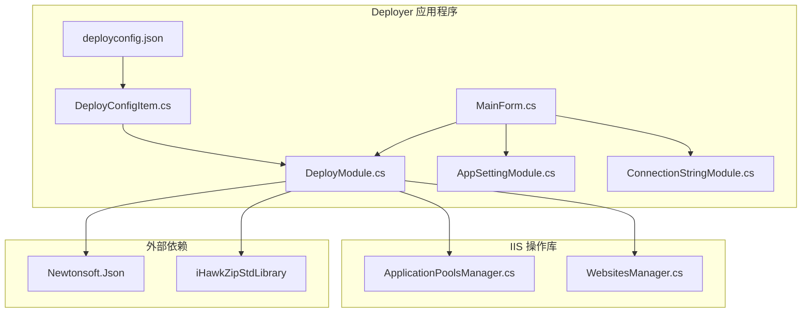
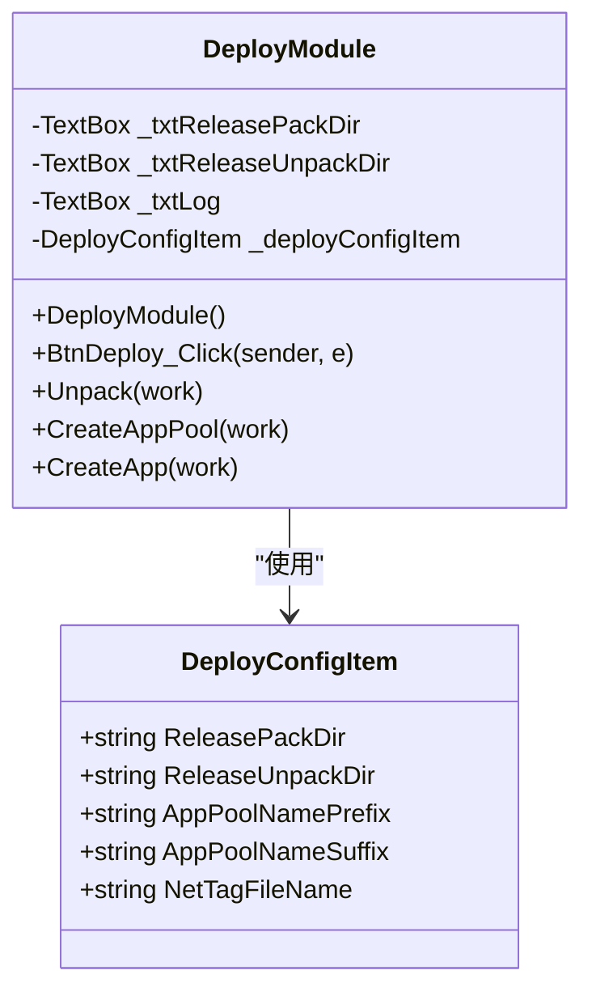
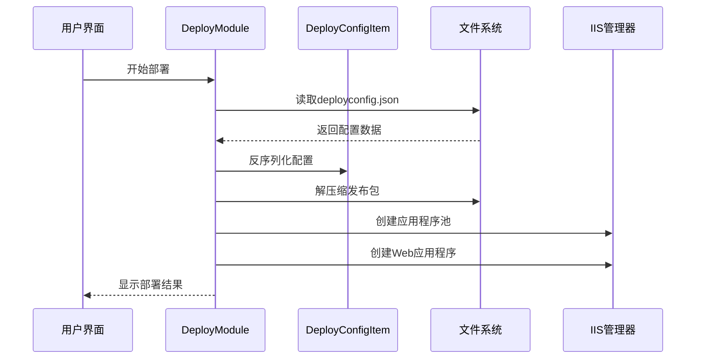
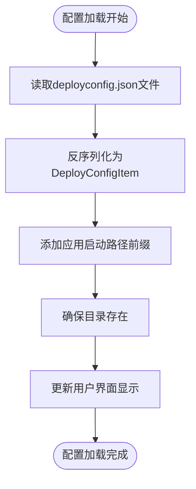
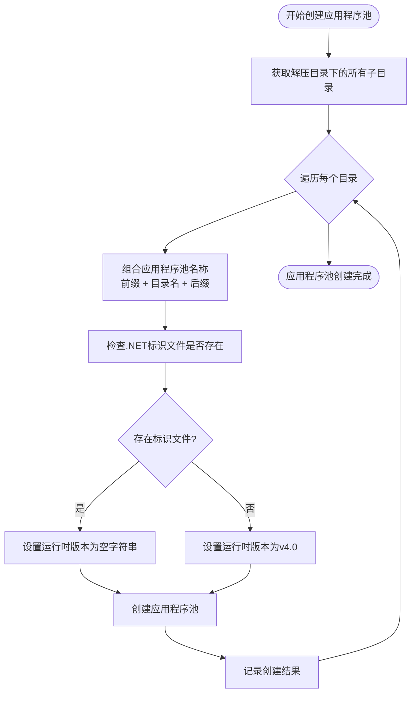
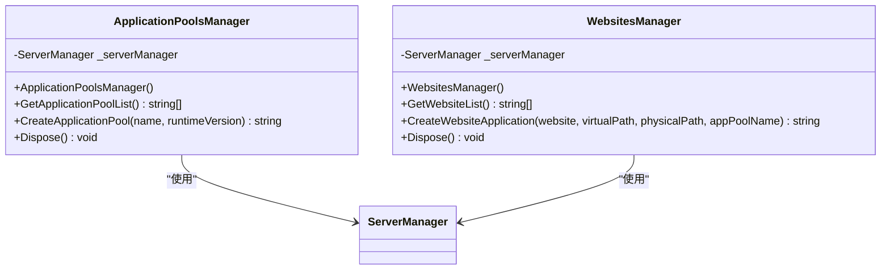
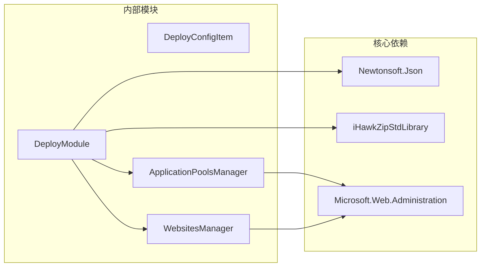
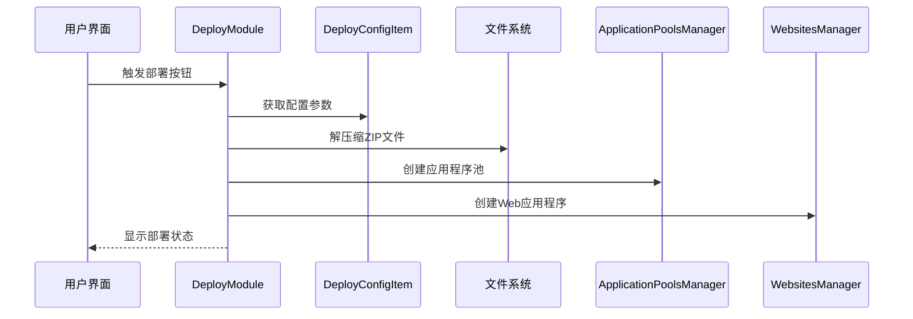

# 部署配置文件结构

<cite>
**本文档引用的文件**
- [deployconfig.json](file://Deployer/deployconfig.json)
- [DeployConfigItem.cs](file://Deployer/DeployConfigItem.cs)
- [DeployModule.cs](file://Deployer/Modules/DeployModule.cs)
- [MainForm.cs](file://Deployer/MainForm.cs)
- [AppSettingModule.cs](file://Deployer/Modules/AppSettingModule.cs)
- [ConnectionStringModule.cs](file://Deployer/Modules/ConnectionStringModule.cs)
- [ApplicationPoolsManager.cs](file://iHawkIISLibrary/ApplicationPoolsManager.cs)
- [WebsitesManager.cs](file://iHawkIISLibrary/WebsitesManager.cs)
</cite>

## 目录
1. [简介](#简介)
2. [项目结构](#项目结构)
3. [核心组件](#核心组件)
4. [架构概览](#架构概览)
5. [详细组件分析](#详细组件分析)
6. [依赖关系分析](#依赖关系分析)
7. [性能考虑](#性能考虑)
8. [故障排除指南](#故障排除指南)
9. [结论](#结论)
10. [附录](#附录)

## 简介

本文档为 IISMonitor 项目中的 deployconfig.json 部署配置文件提供了全面的结构文档。该配置文件用于定义 IIS 应用程序的部署参数，包括发布包处理、应用程序池配置和网站部署等关键设置。文档详细解析了配置文件的完整结构、每个配置项的含义和作用，并提供了 JSON Schema 定义、验证规则、配置示例和不同部署场景下的配置模板。

## 项目结构

IISMonitor 项目采用多层架构设计，主要包含以下核心组件：



**图表来源**
- [deployconfig.json](file://Deployer/deployconfig.json#L1-L8)
- [DeployConfigItem.cs](file://Deployer/DeployConfigItem.cs#L1-L37)
- [DeployModule.cs](file://Deployer/Modules/DeployModule.cs#L1-L204)

**章节来源**
- [MainForm.cs](file://Deployer/MainForm.cs#L1-L78)
- [DeployModule.cs](file://Deployer/Modules/DeployModule.cs#L1-L204)

## 核心组件

### DeployConfigItem 类结构

DeployConfigItem 是部署配置的核心数据模型，定义了所有部署相关的配置参数：



**图表来源**
- [DeployConfigItem.cs](file://Deployer/DeployConfigItem.cs#L9-L35)
- [DeployModule.cs](file://Deployer/Modules/DeployModule.cs#L31-L37)

**章节来源**
- [DeployConfigItem.cs](file://DeployConfigItem.cs#L1-L37)
- [DeployModule.cs](file://Deployer/Modules/DeployModule.cs#L31-L37)

## 架构概览

部署系统采用分层架构，实现了配置驱动的自动化部署流程：



**图表来源**
- [DeployModule.cs](file://Deployer/Modules/DeployModule.cs#L42-L52)
- [DeployModule.cs](file://Deployer/Modules/DeployModule.cs#L88-L153)

## 详细组件分析

### 配置文件结构详解

#### 基本配置结构

deployconfig.json 采用标准 JSON 格式，包含以下核心配置项：

| 配置项 | 数据类型 | 必填 | 默认值 | 描述 |
|--------|----------|------|--------|------|
| ReleasePackDir | string | 是 | 无 | 发布包存放目录路径 |
| ReleaseUnpackDir | string | 是 | 无 | 发布包解压目录路径 |
| AppPoolNamePrefix | string | 是 | 无 | 应用程序池名称前缀 |
| AppPoolNameSuffix | string | 是 | 无 | 应用程序池名称后缀 |
| NetTagFileName | string | 是 | 无 | .NET 标识文件名 |

#### 配置项详细说明

**ReleasePackDir（发布包存放目录）**
- **类型**: string
- **作用**: 指定包含待部署 ZIP 包的目录路径
- **解析方式**: 加载时会自动添加应用启动路径前缀
- **示例**: `"releasepack"` 或 `@".\releasepack\"`

**ReleaseUnpackDir（发布包解压目录）**
- **类型**: string  
- **作用**: 指定发布包解压后的目标目录
- **解析方式**: 同样会自动添加应用启动路径前缀
- **示例**: `"deploy"` 或 `@".\deploy\"`

**AppPoolNamePrefix（应用程序池名称前缀）**
- **类型**: string
- **作用**: 作为应用程序池名称的前缀部分
- **使用场景**: 与目录名组合形成完整的应用程序池名称
- **示例**: `"test"` → 最终名称为 `"test{目录名}AppPool"`

**AppPoolNameSuffix（应用程序池名称后缀）**
- **类型**: string
- **作用**: 作为应用程序池名称的后缀部分
- **使用场景**: 与目录名和前缀组合形成完整的应用程序池名称
- **示例**: `"AppPool"` → 最终名称为 `"test{目录名}AppPool"`

**NetTagFileName（.NET 标识文件名）**
- **类型**: string
- **作用**: 用于检测应用程序是否为 .NET 应用程序的标识文件
- **检测逻辑**: 通过检查目录中是否存在该文件来判断运行时版本
- **示例**: `"appsettings.json"` 或 `"web.config"`

**章节来源**
- [deployconfig.json](file://Deployer/deployconfig.json#L1-L8)
- [DeployConfigItem.cs](file://Deployer/DeployConfigItem.cs#L11-L34)

### 部署流程处理

#### 配置加载和解析

DeployModule 在窗体加载时执行配置文件的读取和解析：



**图表来源**
- [DeployModule.cs](file://Deployer/Modules/DeployModule.cs#L42-L52)

#### 应用程序池创建逻辑

应用程序池的创建基于目录结构和 .NET 标识文件检测：



**图表来源**
- [DeployModule.cs](file://Deployer/Modules/DeployModule.cs#L105-L124)

**章节来源**
- [DeployModule.cs](file://Deployer/Modules/DeployModule.cs#L42-L52)
- [DeployModule.cs](file://Deployer/Modules/DeployModule.cs#L105-L124)

### IIS 管理集成

#### 应用程序池管理

ApplicationPoolsManager 提供了完整的应用程序池管理功能：



**图表来源**
- [ApplicationPoolsManager.cs](file://iHawkIISLibrary/ApplicationPoolsManager.cs#L11-L54)
- [WebsitesManager.cs](file://iHawkIISLibrary/WebsitesManager.cs#L11-L47)

**章节来源**
- [ApplicationPoolsManager.cs](file://iHawkIISLibrary/ApplicationPoolsManager.cs#L1-L54)
- [WebsitesManager.cs](file://iHawkIISLibrary/WebsitesManager.cs#L1-L47)

## 依赖关系分析

### 外部依赖关系

部署系统依赖于多个外部组件和库：



**图表来源**
- [DeployModule.cs](file://Deployer/Modules/DeployModule.cs#L1-L11)
- [ApplicationPoolsManager.cs](file://iHawkIISLibrary/ApplicationPoolsManager.cs#L1-L5)
- [WebsitesManager.cs](file://iHawkIISLibrary/WebsitesManager.cs#L1-L5)

### 内部模块交互



**图表来源**
- [DeployModule.cs](file://Deployer/Modules/DeployModule.cs#L55-L84)
- [DeployModule.cs](file://Deployer/Modules/DeployModule.cs#L105-L153)

**章节来源**
- [DeployModule.cs](file://Deployer/Modules/DeployModule.cs#L55-L84)
- [DeployModule.cs](file://Deployer/Modules/DeployModule.cs#L105-L153)

## 性能考虑

### 配置文件处理性能

- **单次读取**: 配置文件仅在应用启动时读取一次，避免重复 I/O 操作
- **内存缓存**: DeployConfigItem 实例在内存中缓存，减少对象创建开销
- **异步处理**: 部署过程使用 BackgroundWorker 进行异步处理，保持 UI 响应性

### 部署流程优化

- **批量操作**: 应用程序池和应用程序的创建采用批量处理模式
- **错误隔离**: 每个应用程序的部署操作独立处理，避免单点故障影响整体流程
- **进度反馈**: 实时进度报告机制，提供良好的用户体验

## 故障排除指南

### 常见配置问题

**配置文件格式错误**
- 症状: 应用程序启动时报错，无法读取配置
- 解决方案: 确保 JSON 格式正确，使用双引号包围字符串值

**目录路径问题**
- 症状: 部署过程中提示找不到目录或权限不足
- 解决方案: 确认 ReleasePackDir 和 ReleaseUnpackDir 路径存在且具有读写权限

**应用程序池创建失败**
- 症状: 应用程序池创建返回错误
- 解决方案: 检查 AppPoolNamePrefix 和 AppPoolNameSuffix 组合后的名称是否符合 IIS 规范

### 调试建议

1. **启用详细日志**: 在 DeployModule 中检查工作线程的进度报告
2. **验证 IIS 权限**: 确保应用程序具有创建应用程序池和网站的权限
3. **检查 ZIP 文件**: 确认发布包格式正确且未损坏

**章节来源**
- [DeployModule.cs](file://Deployer/Modules/DeployModule.cs#L117-L119)
- [DeployModule.cs](file://Deployer/Modules/DeployModule.cs#L146-L148)

## 结论

deployconfig.json 部署配置文件为 IISMonitor 项目提供了灵活而强大的部署配置能力。通过合理的配置参数设计和完善的错误处理机制，该系统能够满足多种部署场景的需求。配置文件的简洁性和明确性使得部署过程既易于理解又便于维护。

## 附录

### JSON Schema 定义

以下是 deployconfig.json 的 JSON Schema 定义：

```json
{
    "$schema": "http://json-schema.org/draft-04/schema#",
    "title": "DeployConfig",
    "description": "IIS 部署配置",
    "type": "object",
    "required": ["ReleasePackDir", "ReleaseUnpackDir", "AppPoolNamePrefix", "AppPoolNameSuffix", "NetTagFileName"],
    "properties": {
        "ReleasePackDir": {
            "type": "string",
            "description": "发布包存放目录",
            "pattern": "^[^\\r\\n]*$"
        },
        "ReleaseUnpackDir": {
            "type": "string", 
            "description": "发布包解压目录",
            "pattern": "^[^\\r\\n]*$"
        },
        "AppPoolNamePrefix": {
            "type": "string",
            "description": "应用程序池名称前缀",
            "pattern": "^[^\\r\\n]*$"
        },
        "AppPoolNameSuffix": {
            "type": "string",
            "description": "应用程序池名称后缀", 
            "pattern": "^[^\\r\\n]*$"
        },
        "NetTagFileName": {
            "type": "string",
            "description": ".NET 标识文件名",
            "pattern": "^[^\\r\\n]*$"
        }
    },
    "additionalProperties": false
}
```

### 配置示例

**基础配置示例**
```json
{
    "ReleasePackDir": "releasepack",
    "ReleaseUnpackDir": "deploy",
    "AppPoolNamePrefix": "test",
    "AppPoolNameSuffix": "AppPool", 
    "NetTagFileName": "appsettings.json"
}
```

**生产环境配置示例**
```json
{
    "ReleasePackDir": ".\\packages\\release",
    "ReleaseUnpackDir": ".\\wwwroot\\deploy",
    "AppPoolNamePrefix": "ProdAppPool_",
    "AppPoolNameSuffix": "",
    "NetTagFileName": "web.config"
}
```

**开发环境配置示例**
```json
{
    "ReleasePackDir": "C:\\Temp\\releases",
    "ReleaseUnpackDir": "C:\\Temp\\deploy",
    "AppPoolNamePrefix": "Dev_",
    "AppPoolNameSuffix": "_Pool",
    "NetTagFileName": "appsettings.Development.json"
}
```

### 验证规则

**必填字段验证**
- 所有五个配置项均为必填字段
- 缺少任何字段都会导致配置加载失败

**数据类型验证**
- 所有配置项必须为字符串类型
- 支持包含空格的路径字符串

**命名规范验证**
- 应用程序池名称组合后必须符合 IIS 命名规范
- 路径字符串不能包含换行符

**章节来源**
- [deployconfig.json](file://Deployer/deployconfig.json#L1-L8)
- [DeployConfigItem.cs](file://Deployer/DeployConfigItem.cs#L11-L34)