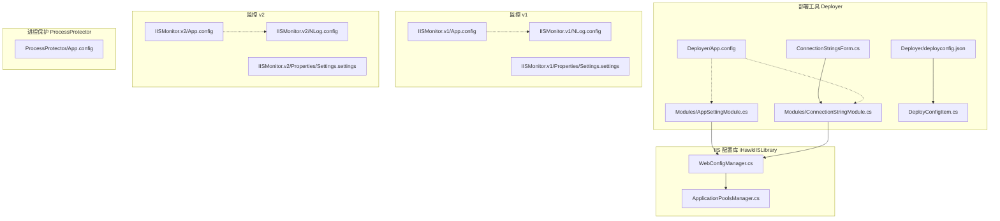
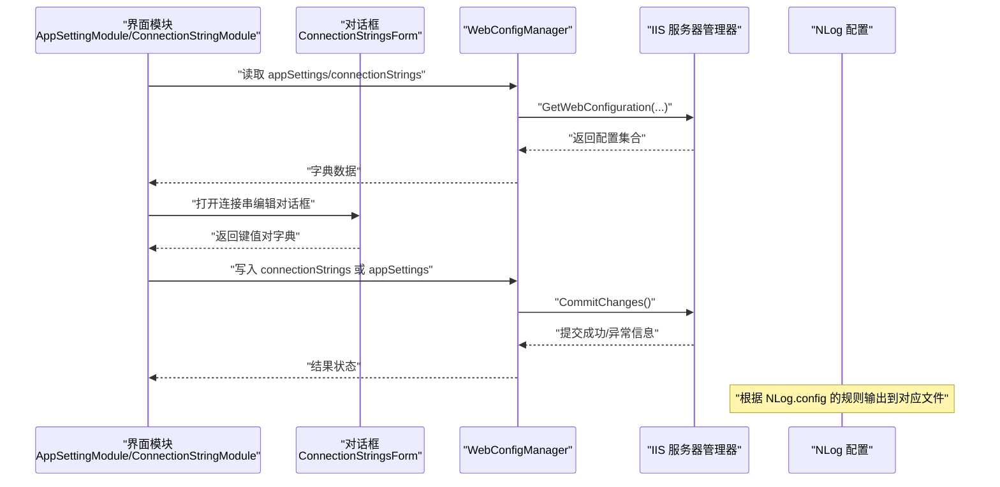
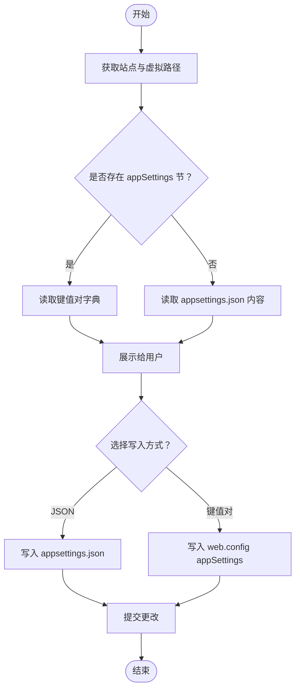
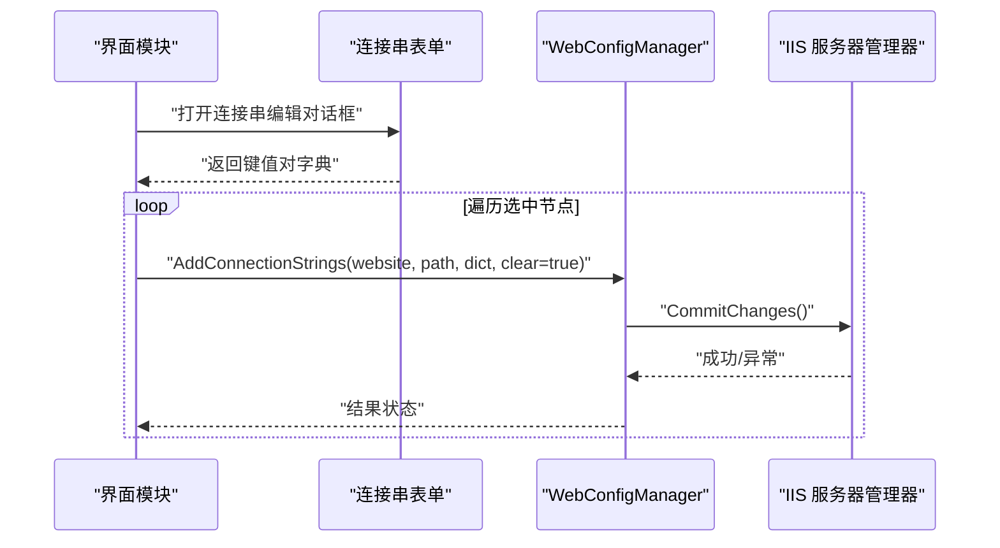
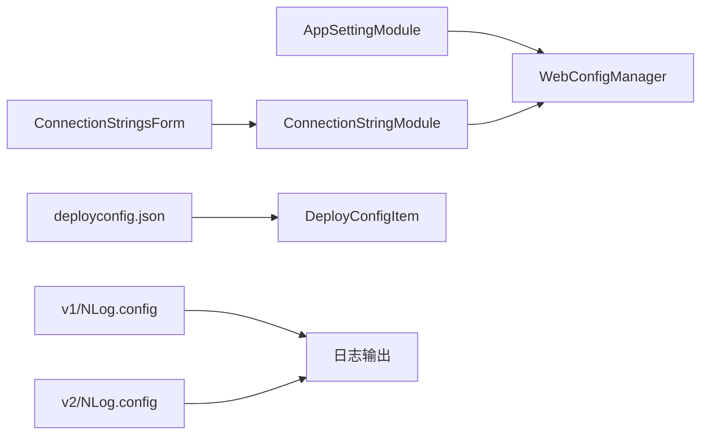

# 配置管理

<cite>
**本文引用的文件**
- [Deployer/App.config](file://Deployer/App.config)
- [IISMonitor.v1/App.config](file://IISMonitor.v1/App.config)
- [IISMonitor.v1/NLog.config](file://IISMonitor.v1/NLog.config)
- [IISMonitor.v2/App.config](file://IISMonitor.v2/App.config)
- [IISMonitor.v2/NLog.config](file://IISMonitor.v2/NLog.config)
- [Deployer/deployconfig.json](file://Deployer/deployconfig.json)
- [Deployer/Modules/AppSettingModule.cs](file://Deployer/Modules/AppSettingModule.cs)
- [Deployer/Modules/ConnectionStringModule.cs](file://Deployer/Modules/ConnectionStringModule.cs)
- [Deployer/ConnectionStringsForm.cs](file://Deployer/ConnectionStringsForm.cs)
- [Deployer/DeployConfigItem.cs](file://Deployer/DeployConfigItem.cs)
- [iHawkIISLibrary/WebConfigManager.cs](file://iHawkIISLibrary/WebConfigManager.cs)
- [iHawkIISLibrary/ApplicationPoolsManager.cs](file://iHawkIISLibrary/ApplicationPoolsManager.cs)
- [ProcessProtector/App.config](file://ProcessProtector/App.config)
- [IISMonitor.v1/Properties/Settings.settings](file://IISMonitor.v1/Properties/Settings.settings)
- [IISMonitor.v2/Properties/Settings.settings](file://IISMonitor.v2/Properties/Settings.settings)
</cite>

## 目录
1. [简介](#简介)
2. [项目结构](#项目结构)
3. [核心组件](#核心组件)
4. [架构总览](#架构总览)
5. [详细组件分析](#详细组件分析)
6. [依赖关系分析](#依赖关系分析)
7. [性能与可维护性考量](#性能与可维护性考量)
8. [故障排查指南](#故障排查指南)
9. [结论](#结论)
10. [附录](#附录)

## 简介
本文件系统化梳理 IISMonitor 项目的配置管理方案，覆盖以下方面：
- 各组件配置文件结构与作用：App.config、NLog.config、deployconfig.json
- 应用设置与连接字符串的读取、编辑与写入流程
- 日志级别与输出目标配置
- 环境变量与外部配置文件的使用建议
- 配置验证规则、默认值与常见错误排除
- 生产环境最佳实践与安全注意事项
- 管理员配置变更操作指南

## 项目结构
IISMonitor 由多个子项目组成，每个子项目通常包含独立的 App.config 与 NLog.config；部署工具 Deployer 还包含 deployconfig.json 用于发布流程的目录与命名约定配置。

图表来源
- [Deployer/App.config](file://Deployer/App.config#L1-L30)
- [Deployer/deployconfig.json](file://Deployer/deployconfig.json#L1-L8)
- [Deployer/Modules/AppSettingModule.cs](file://Deployer/Modules/AppSettingModule.cs#L1-L246)
- [Deployer/Modules/ConnectionStringModule.cs](file://Deployer/Modules/ConnectionStringModule.cs#L1-L182)
- [Deployer/ConnectionStringsForm.cs](file://Deployer/ConnectionStringsForm.cs#L1-L76)
- [Deployer/DeployConfigItem.cs](file://Deployer/DeployConfigItem.cs#L1-L37)
- [IISMonitor.v1/App.config](file://IISMonitor.v1/App.config#L1-L15)
- [IISMonitor.v1/NLog.config](file://IISMonitor.v1/NLog.config#L1-L56)
- [IISMonitor.v2/App.config](file://IISMonitor.v2/App.config#L1-L6)
- [IISMonitor.v2/NLog.config](file://IISMonitor.v2/NLog.config#L1-L47)
- [iHawkIISLibrary/WebConfigManager.cs](file://iHawkIISLibrary/WebConfigManager.cs#L1-L157)
- [iHawkIISLibrary/ApplicationPoolsManager.cs](file://iHawkIISLibrary/ApplicationPoolsManager.cs#L1-L143)

章节来源
- [Deployer/App.config](file://Deployer/App.config#L1-L30)
- [IISMonitor.v1/App.config](file://IISMonitor.v1/App.config#L1-L15)
- [IISMonitor.v2/App.config](file://IISMonitor.v2/App.config#L1-L6)
- [ProcessProtector/App.config](file://ProcessProtector/App.config#L1-L6)

## 核心组件
- App.config（.NET 启动与程序集绑定重定向）
  - 作用：声明运行时版本与程序集绑定重定向，确保第三方库兼容性。
  - 常见用途：在多版本依赖冲突时通过 bindingRedirect 解决加载问题。
- NLog.config（日志框架配置）
  - 作用：定义日志目标（targets）与规则（rules），控制日志级别与输出位置。
  - 建议：按模块划分不同日志文件，便于定位问题。
- deployconfig.json（部署流程配置）
  - 作用：定义发布包目录、解压目录、应用程序池命名前后缀及 .NET 标识文件名。
  - 建议：统一命名规范，避免与现有应用池冲突。

章节来源
- [Deployer/App.config](file://Deployer/App.config#L1-L30)
- [IISMonitor.v1/NLog.config](file://IISMonitor.v1/NLog.config#L1-L56)
- [IISMonitor.v2/NLog.config](file://IISMonitor.v2/NLog.config#L1-L47)
- [Deployer/deployconfig.json](file://Deployer/deployconfig.json#L1-L8)

## 架构总览
下图展示“配置读取/写入”在各组件中的交互路径，包括应用设置、连接字符串与日志配置。

图表来源
- [Deployer/Modules/AppSettingModule.cs](file://Deployer/Modules/AppSettingModule.cs#L96-L151)
- [Deployer/Modules/ConnectionStringModule.cs](file://Deployer/Modules/ConnectionStringModule.cs#L59-L102)
- [Deployer/ConnectionStringsForm.cs](file://Deployer/ConnectionStringsForm.cs#L27-L40)
- [iHawkIISLibrary/WebConfigManager.cs](file://iHawkIISLibrary/WebConfigManager.cs#L47-L92)

## 详细组件分析

### App.config 配置详解
- 版本与运行时
  - 指定 supportedRuntime 与 SKU，确保在目标 .NET Framework 上正确启动。
- 程序集绑定重定向
  - 通过 dependentAssembly/bindingRedirect 统一第三方库版本，减少加载失败风险。
- 典型场景
  - SharpZipLib、System.Buffers、System.Memory、System.Runtime.CompilerServices.Unsafe、Newtonsoft.Json 等库的版本冲突处理。

章节来源
- [Deployer/App.config](file://Deployer/App.config#L1-L30)
- [IISMonitor.v1/App.config](file://IISMonitor.v1/App.config#L1-L15)

### NLog.config 配置详解
- 关键节点
  - variable：自定义变量（示例中存在占位变量）。
  - targets：定义日志输出目标（如文件），支持基于日期的文件名模板。
  - rules：按 logger 名称与最小日志级别将事件路由到对应目标。
- v1 与 v2 差异
  - v1 对特定面板类设置了更细粒度的日志目标（HTTP 检查、WebService 检查）。
  - v2 使用通用目标（info/warn/error 文件），适合全局日志策略。
- 建议
  - 在生产环境启用自动重载与内部日志文件，便于诊断 NLog 自身问题。
  - 将日志目录设置为可写且有配额限制的路径，避免磁盘耗尽。

章节来源
- [IISMonitor.v1/NLog.config](file://IISMonitor.v1/NLog.config#L1-L56)
- [IISMonitor.v2/NLog.config](file://IISMonitor.v2/NLog.config#L1-L47)

### deployconfig.json 配置详解
- 字段说明
  - ReleasePackDir：发布包存放目录（相对路径）。
  - ReleaseUnpackDir：发布包解压目录（相对路径）。
  - AppPoolNamePrefix/Suffix：应用程序池命名前缀/后缀，组合生成唯一池名。
  - NetTagFileName：.NET 标识文件名（用于识别 .NET 应用）。
- 使用方式
  - 由 Deployer 读取并应用到部署流程，确保目录与命名一致性。
- 建议
  - 为不同环境（开发/测试/生产）准备独立的 deployconfig.json，或通过构建脚本注入。

章节来源
- [Deployer/deployconfig.json](file://Deployer/deployconfig.json#L1-L8)
- [Deployer/DeployConfigItem.cs](file://Deployer/DeployConfigItem.cs#L1-L37)

### 应用设置（appSettings）配置流程
- 读取流程
  - 通过 WebsitesManager 获取站点与虚拟路径列表，再调用 WebConfigManager.GetAppSettings 获取键值对。
  - 若未找到配置节，则尝试读取物理路径下的 appsettings.json 文件内容。
- 写入流程
  - 支持 JSON 文本直接写入 appsettings.json 或以键值对形式写入 web.config 的 appSettings 节点。
  - 写入后调用 CommitChanges 提交更改。
- 注意事项
  - 当选择 JSON 写入时，需确保输入为合法 JSON。
  - 键值对写入会清空旧配置（若开启 clear），请谨慎操作。

图表来源
- [Deployer/Modules/AppSettingModule.cs](file://Deployer/Modules/AppSettingModule.cs#L96-L151)
- [iHawkIISLibrary/WebConfigManager.cs](file://iHawkIISLibrary/WebConfigManager.cs#L94-L152)

章节来源
- [Deployer/Modules/AppSettingModule.cs](file://Deployer/Modules/AppSettingModule.cs#L1-L246)
- [iHawkIISLibrary/WebConfigManager.cs](file://iHawkIISLibrary/WebConfigManager.cs#L1-L157)

### 连接字符串（connectionStrings）配置流程
- 读取流程
  - 通过 WebConfigManager.GetConnectionStrings 获取连接串字典。
- 批量设置流程
  - 通过 ConnectionStringsForm 输入键值对，模块遍历选中的虚拟路径逐个写入。
- 写入流程
  - 清空旧连接串（可选），逐条添加新连接串并提交更改。

图表来源
- [Deployer/Modules/ConnectionStringModule.cs](file://Deployer/Modules/ConnectionStringModule.cs#L104-L128)
- [Deployer/ConnectionStringsForm.cs](file://Deployer/ConnectionStringsForm.cs#L27-L40)
- [iHawkIISLibrary/WebConfigManager.cs](file://iHawkIISLibrary/WebConfigManager.cs#L68-L92)

章节来源
- [Deployer/Modules/ConnectionStringModule.cs](file://Deployer/Modules/ConnectionStringModule.cs#L1-L182)
- [Deployer/ConnectionStringsForm.cs](file://Deployer/ConnectionStringsForm.cs#L1-L76)
- [iHawkIISLibrary/WebConfigManager.cs](file://iHawkIISLibrary/WebConfigManager.cs#L1-L157)

### 应用程序池配置与检查
- 列表与状态
  - 通过 ApplicationPoolsManager 获取池列表、状态，支持启动/停止。
- 创建池
  - 可指定托管运行时版本与管道模式，默认集成模式与非 32 位。
- 监测重启
  - 检测池状态，若停止则尝试重启并返回结果。

章节来源
- [iHawkIISLibrary/ApplicationPoolsManager.cs](file://iHawkIISLibrary/ApplicationPoolsManager.cs#L1-L143)

## 依赖关系分析
- 部署工具 Deployer 依赖 iHawkIISLibrary 完成 IIS 配置读写。
- NLog 配置独立于业务逻辑，但受运行目录与权限影响。
- Settings.settings 仅作为默认配置占位，实际运行时行为主要由 App.config 与外部 JSON/NLog 文件决定。

图表来源
- [Deployer/Modules/AppSettingModule.cs](file://Deployer/Modules/AppSettingModule.cs#L1-L246)
- [Deployer/Modules/ConnectionStringModule.cs](file://Deployer/Modules/ConnectionStringModule.cs#L1-L182)
- [Deployer/ConnectionStringsForm.cs](file://Deployer/ConnectionStringsForm.cs#L1-L76)
- [Deployer/deployconfig.json](file://Deployer/deployconfig.json#L1-L8)
- [IISMonitor.v1/NLog.config](file://IISMonitor.v1/NLog.config#L1-L56)
- [IISMonitor.v2/NLog.config](file://IISMonitor.v2/NLog.config#L1-L47)

## 性能与可维护性考量
- 日志性能
  - 使用文件目标时，建议启用自动重载与合适的内部日志级别，避免频繁 IO。
  - 按模块拆分日志文件，降低单文件过大带来的读写压力。
- 配置读写
  - 批量写入连接串时，尽量一次性提交（CommitChanges），减少多次提交开销。
- 版本兼容
  - 通过 App.config 的 bindingRedirect 保持第三方库版本一致，避免运行时反射失败。

[本节为通用指导，无需列出章节来源]

## 故障排查指南
- 无法读取 appSettings
  - 检查站点与虚拟路径是否正确，确认是否存在 appsettings.json 并可读。
  - 参考：[AppSettingModule.View](file://Deployer/Modules/AppSettingModule.cs#L96-L151)
- 写入失败
  - 查看返回的异常信息，确认 IIS 权限与配置节是否允许写入。
  - 参考：[WebConfigManager.AddAppSettings/AddConnectionStrings](file://iHawkIISLibrary/WebConfigManager.cs#L128-L152)
- 日志不输出
  - 检查 NLog.config 的 targets 与 rules 是否匹配当前命名空间或通配符。
  - 参考：[v1 NLog.config](file://IISMonitor.v1/NLog.config#L40-L54)、[v2 NLog.config](file://IISMonitor.v2/NLog.config#L36-L46)
- 应用程序池无法启动/状态异常
  - 使用 ApplicationPoolsManager 检查状态并尝试重启。
  - 参考：[ApplicationPoolsManager.CheckAndRestart](file://iHawkIISLibrary/ApplicationPoolsManager.cs#L127-L138)

章节来源
- [Deployer/Modules/AppSettingModule.cs](file://Deployer/Modules/AppSettingModule.cs#L96-L151)
- [iHawkIISLibrary/WebConfigManager.cs](file://iHawkIISLibrary/WebConfigManager.cs#L128-L152)
- [IISMonitor.v1/NLog.config](file://IISMonitor.v1/NLog.config#L40-L54)
- [IISMonitor.v2/NLog.config](file://IISMonitor.v2/NLog.config#L36-L46)
- [iHawkIISLibrary/ApplicationPoolsManager.cs](file://iHawkIISLibrary/ApplicationPoolsManager.cs#L127-L138)

## 结论
- App.config 与 NLog.config 是 IISMonitor 的两大基础配置载体，前者保证运行时稳定，后者保障可观测性。
- deployconfig.json 为部署流程提供标准化的目录与命名约定，建议结合环境差异化管理。
- 通过 WebConfigManager 与 ApplicationPoolsManager 实现对 IIS 配置与池状态的集中管控。
- 建议在生产环境采用严格的日志分级、权限最小化与配置版本化管理，确保可审计与可回滚。

[本节为总结，无需列出章节来源]

## 附录

### 环境变量与外部配置
- 现状
  - 仓库未提供显式的环境变量读取逻辑；日志路径与目标由 NLog.config 控制。
- 建议
  - 使用环境变量控制日志根目录与敏感连接串（通过外部密钥管理服务注入），并在启动前进行校验。

[本节为通用指导，无需列出章节来源]

### 日志级别与输出目标配置指南
- 级别映射
  - Info/Warn/Error 分别对应不同输出文件，便于按严重程度检索。
- 输出位置
  - 基于 ${basedir} 与 ${shortdate} 的文件名模板，建议将日志目录设置为可写且具备轮转策略的路径。
- 规则匹配
  - v1 通过类名精确匹配，v2 使用通配符匹配所有模块。

章节来源
- [IISMonitor.v1/NLog.config](file://IISMonitor.v1/NLog.config#L47-L53)
- [IISMonitor.v2/NLog.config](file://IISMonitor.v2/NLog.config#L43-L45)

### 连接字符串设置步骤
- 选择虚拟路径（可多选）
- 打开连接串编辑对话框，输入键值对
- 点击“批量设置”，系统逐项写入并提交
- 查看输出窗口确认结果

章节来源
- [Deployer/Modules/ConnectionStringModule.cs](file://Deployer/Modules/ConnectionStringModule.cs#L104-L128)
- [Deployer/ConnectionStringsForm.cs](file://Deployer/ConnectionStringsForm.cs#L27-L40)

### 配置验证规则与默认值
- deployconfig.json 默认值
  - ReleasePackDir：releasepack
  - ReleaseUnpackDir：deploy
  - AppPoolNamePrefix：test
  - AppPoolNameSuffix：AppPool
  - NetTagFileName：appsettings.json
- App.config 默认值
  - 运行时版本与 SKU 固定，bindingRedirect 用于解决依赖冲突
- Settings.settings
  - 为空占位，实际行为由其他配置文件决定

章节来源
- [Deployer/deployconfig.json](file://Deployer/deployconfig.json#L1-L8)
- [Deployer/App.config](file://Deployer/App.config#L1-L30)
- [IISMonitor.v1/Properties/Settings.settings](file://IISMonitor.v1/Properties/Settings.settings#L1-L8)
- [IISMonitor.v2/Properties/Settings.settings](file://IISMonitor.v2/Properties/Settings.settings#L1-L8)

### 常见配置错误与排除
- JSON 写入失败
  - 确认输入为合法 JSON；否则回退为键值对写入。
- 无默认网站
  - 界面提示“默认网站不存在”，请先创建或切换站点。
- 权限不足
  - 写入 web.config 或 appsettings.json 需要相应权限；检查 IIS_IUSRS 或应用池标识账户权限。
- 日志目录不可写
  - 确保日志目录存在且进程具有写权限；必要时调整 NLog.config 中的输出路径。

章节来源
- [Deployer/Modules/AppSettingModule.cs](file://Deployer/Modules/AppSettingModule.cs#L49-L54)
- [iHawkIISLibrary/WebConfigManager.cs](file://iHawkIISLibrary/WebConfigManager.cs#L115-L126)
- [IISMonitor.v1/NLog.config](file://IISMonitor.v1/NLog.config#L31-L37)
- [IISMonitor.v2/NLog.config](file://IISMonitor.v2/NLog.config#L31-L33)

### 生产环境最佳实践与安全考虑
- 最小权限原则
  - 仅授予读取 IIS 配置所需的最小权限；写入操作限定在受控环境。
- 密钥与连接串
  - 不在配置文件中存储明文敏感信息；通过外部密钥管理或环境变量注入。
- 日志与审计
  - 启用内部日志与自动重载；对日志文件实施轮转与保留策略。
- 版本与兼容性
  - 通过 bindingRedirect 管理第三方库版本；升级前进行回归测试。
- 配置版本化
  - 将 deployconfig.json 与 NLog.config 纳入版本控制，区分环境分支或使用模板替换。

[本节为通用指导，无需列出章节来源]

### 管理员配置变更指南
- 步骤总览
  - 备份当前配置与日志
  - 修改 deployconfig.json（目录/命名/标识文件名）
  - 修改 NLog.config（日志级别/输出路径）
  - 通过 Deployer 修改 appSettings 或 connectionStrings
  - 验证 IIS 配置与应用程序池状态
  - 回滚（如有需要）
- 注意事项
  - 批量写入前先预览目标路径，避免误改生产环境。
  - 在低峰期执行变更，并做好回滚预案。

[本节为通用指导，无需列出章节来源]