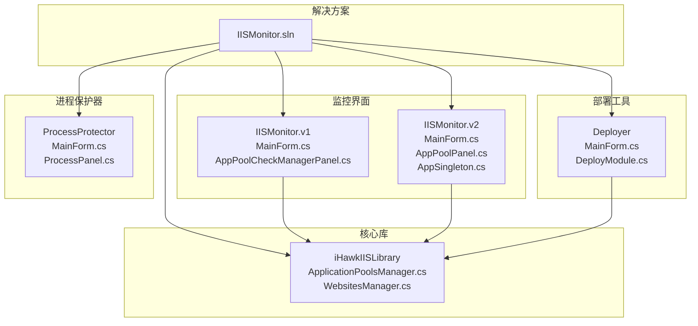
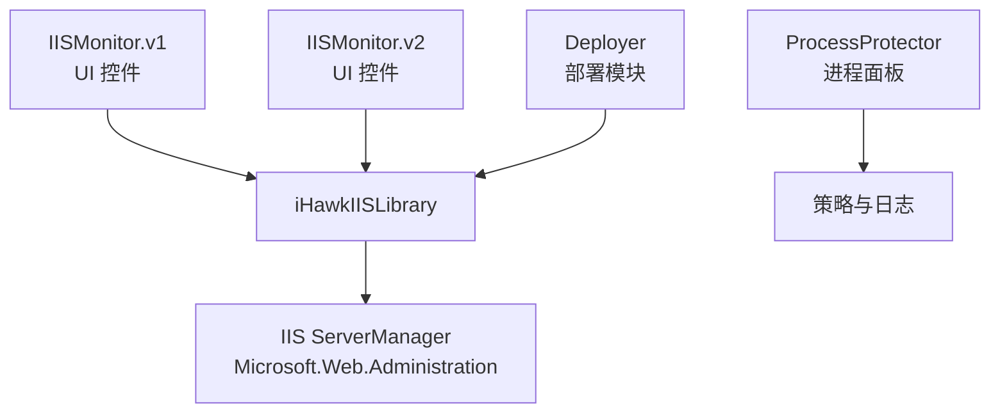
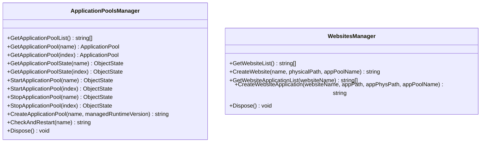
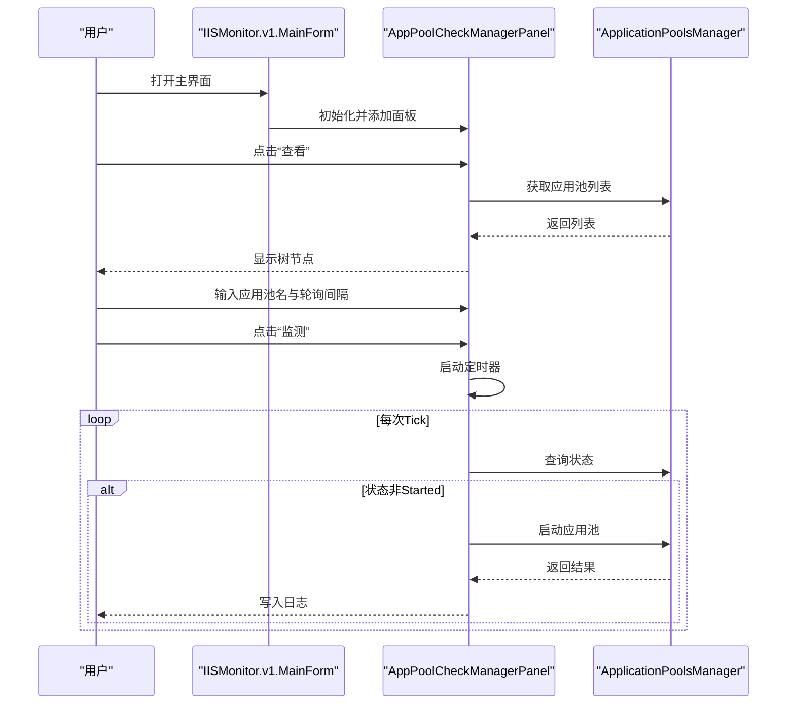
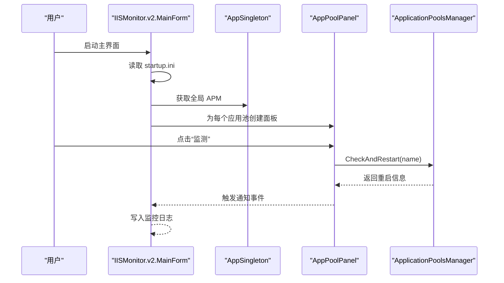
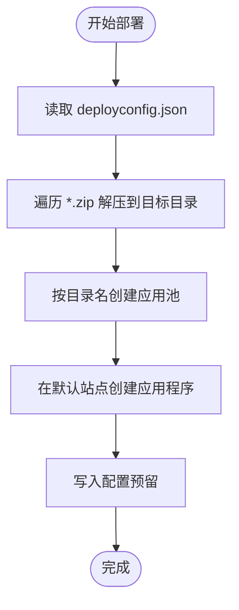
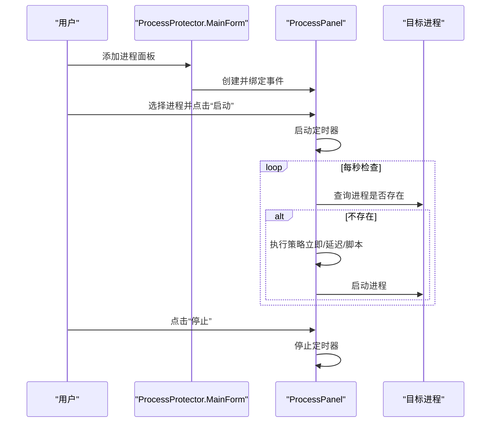
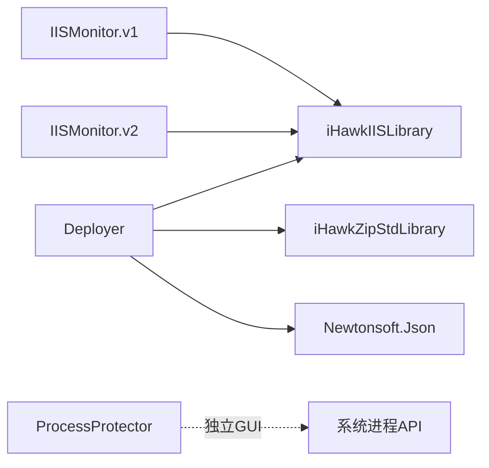

# 项目概述

<cite>
**本文档引用的文件**
- [README.md](file://README.md)
- [IISMonitor.sln](file://IISMonitor.sln)
- [iHawkIISLibrary.csproj](file://iHawkIISLibrary/iHawkIISLibrary.csproj)
- [ApplicationPoolsManager.cs](file://iHawkIISLibrary/ApplicationPoolsManager.cs)
- [WebsitesManager.cs](file://iHawkIISLibrary/WebsitesManager.cs)
- [IISMonitor.v1.csproj](file://IISMonitor.v1/IISMonitor.v1.csproj)
- [MainForm.cs（v1）](file://IISMonitor.v1/MainForm.cs)
- [AppPoolCheckManagerPanel.cs（v1）](file://IISMonitor.v1/AppPoolCheckManagement/AppPoolCheckManagerPanel.cs)
- [IISMonitor.v2.csproj](file://IISMonitor.v2/IISMonitor.v2.csproj)
- [MainForm.cs（v2）](file://IISMonitor.v2/MainForm.cs)
- [AppPoolPanel.cs（v2）](file://IISMonitor.v2/AppPoolPanel.cs)
- [AppSingleton.cs（v2）](file://IISMonitor.v2/AppSingleton.cs)
- [Deployer.csproj](file://Deployer/Deployer.csproj)
- [MainForm.cs（Deployer）](file://Deployer/MainForm.cs)
- [DeployModule.cs（Deployer）](file://Deployer/Modules/DeployModule.cs)
- [ProcessProtector.csproj](file://ProcessProtector/ProcessProtector.csproj)
- [MainForm.cs（ProcessProtector）](file://ProcessProtector/MainForm.cs)
- [ProcessPanel.cs（ProcessProtector）](file://ProcessProtector/ProcessPanel.cs)
</cite>

## 目录
1. [简介](#简介)
2. [项目结构](#项目结构)
3. [核心组件](#核心组件)
4. [架构总览](#架构总览)
5. [详细组件分析](#详细组件分析)
6. [依赖关系分析](#依赖关系分析)
7. [性能考虑](#性能考虑)
8. [故障排查指南](#故障排查指南)
9. [结论](#结论)
10. [附录](#附录)

## 简介
IISMonitor 是一套面向 IIS 的桌面应用与工具集合，旨在帮助运维与开发人员高效地监控、管理与部署基于 IIS 的 Web 应用。项目通过一个可复用的 IIS 操作库作为核心，向上提供两个版本的 IIS 监控界面（v1 复杂版、v2 简化版）、一个部署工具（Deployer）以及一个进程保护器（ProcessProtector），形成“库-界面-工具-守护”的完整体系。

- 核心目标
  - 提供稳定可靠的 IIS 应用池状态监控与自动重启能力
  - 简化 IIS 站点与应用程序的批量部署流程
  - 提供进程级守护与策略化恢复机制
  - 降低 IIS 运维的人工干预成本，提升可用性与稳定性

- 目标用户
  - 企业运维工程师
  - Web 应用开发与测试团队
  - 需要自动化部署与监控的 DevOps 团队

- 主要价值主张
  - 统一的 IIS 操作抽象，减少重复开发
  - 可视化的监控面板与日志输出，便于快速定位问题
  - 部署流程标准化与可扩展，支持多环境发布
  - 进程守护策略灵活配置，保障关键服务持续运行

**章节来源**
- [README.md](file://README.md#L1-L10)

## 项目结构
项目采用“解决方案 + 多子项目”的组织方式，核心库位于 iHawkIISLibrary，上层分别提供 GUI 监控界面（v1/v2）、部署工具与进程保护器，彼此通过 NuGet 引用与本地库进行耦合。

**图表来源**
- [IISMonitor.sln](file://IISMonitor.sln#L1-L62)
- [iHawkIISLibrary.csproj](file://iHawkIISLibrary/iHawkIISLibrary.csproj#L1-L63)
- [IISMonitor.v1.csproj](file://IISMonitor.v1/IISMonitor.v1.csproj#L1-L147)
- [IISMonitor.v2.csproj](file://IISMonitor.v2/IISMonitor.v2.csproj#L1-L109)
- [Deployer.csproj](file://Deployer/Deployer.csproj#L1-L148)
- [ProcessProtector.csproj](file://ProcessProtector/ProcessProtector.csproj#L1-L109)

**章节来源**
- [IISMonitor.sln](file://IISMonitor.sln#L1-L62)

## 核心组件
- iHawkIISLibrary（核心库）
  - 职责：封装 IIS ServerManager 的常用操作，提供应用池与网站的查询、创建、启停与状态检测等能力
  - 关键类型：ApplicationPoolsManager、WebsitesManager
  - 技术要点：基于 Microsoft.Web.Administration，统一异常处理与提交变更

- IISMonitor.v1（复杂监控界面）
  - 职责：提供多标签页的综合监控面板，包含 HTTP 检查、应用池检查、Web 服务检查与发布管理
  - 特性：内置定时器轮询、消息弹窗提醒、NLog 日志记录

- IISMonitor.v2（简化监控界面）
  - 职责：聚焦应用池监控，以卡片式面板展示每个应用池的状态与控制按钮
  - 特性：单实例应用池管理器、日志分栏输出、启动项配置文件支持

- Deployer（部署工具）
  - 职责：从压缩包目录批量解压、创建应用池、在默认站点下创建应用程序，并支持后续配置写入
  - 特性：JSON 配置驱动、后台任务异步执行、进度回调日志

- ProcessProtector（进程保护器）
  - 职责：对指定进程进行守护，支持立即重启、延迟重启与执行脚本后重启三种策略
  - 特性：托盘图标、密码加锁退出、动态策略配置

**章节来源**
- [iHawkIISLibrary.csproj](file://iHawkIISLibrary/iHawkIISLibrary.csproj#L1-L63)
- [ApplicationPoolsManager.cs](file://iHawkIISLibrary/ApplicationPoolsManager.cs#L1-L143)
- [WebsitesManager.cs](file://iHawkIISLibrary/WebsitesManager.cs#L1-L94)
- [IISMonitor.v1.csproj](file://IISMonitor.v1/IISMonitor.v1.csproj#L1-L147)
- [MainForm.cs（v1）](file://IISMonitor.v1/MainForm.cs#L1-L82)
- [AppPoolCheckManagerPanel.cs（v1）](file://IISMonitor.v1/AppPoolCheckManagement/AppPoolCheckManagerPanel.cs#L1-L110)
- [IISMonitor.v2.csproj](file://IISMonitor.v2/IISMonitor.v2.csproj#L1-L109)
- [MainForm.cs（v2）](file://IISMonitor.v2/MainForm.cs#L1-L131)
- [AppPoolPanel.cs（v2）](file://IISMonitor.v2/AppPoolPanel.cs#L1-L105)
- [AppSingleton.cs（v2）](file://IISMonitor.v2/AppSingleton.cs#L1-L14)
- [Deployer.csproj](file://Deployer/Deployer.csproj#L1-L148)
- [MainForm.cs（Deployer）](file://Deployer/MainForm.cs#L1-L78)
- [DeployModule.cs（Deployer）](file://Deployer/Modules/DeployModule.cs#L1-L204)
- [ProcessProtector.csproj](file://ProcessProtector/ProcessProtector.csproj#L1-L109)
- [MainForm.cs（ProcessProtector）](file://ProcessProtector/MainForm.cs#L1-L187)
- [ProcessPanel.cs（ProcessProtector）](file://ProcessProtector/ProcessPanel.cs#L1-L231)

## 架构总览
IISMonitor 采用“共享库 + 多客户端/工具”的分层架构：
- 共享库层：iHawkIISLibrary 将 IIS 操作抽象为稳定的 API，屏蔽底层 COM/ServerManager 差异
- 界面层：IISMonitor.v1/v2 基于 WinForms 提供可视化监控与交互
- 工具层：Deployer 与 ProcessProtector 分别承担部署与进程守护职责
- 数据与配置：各组件通过 JSON、INI、App.config 等配置文件协同工作

**图表来源**
- [ApplicationPoolsManager.cs](file://iHawkIISLibrary/ApplicationPoolsManager.cs#L1-L143)
- [WebsitesManager.cs](file://iHawkIISLibrary/WebsitesManager.cs#L1-L94)
- [IISMonitor.v1.csproj](file://IISMonitor.v1/IISMonitor.v1.csproj#L134-L137)
- [IISMonitor.v2.csproj](file://IISMonitor.v2/IISMonitor.v2.csproj#L103-L106)
- [Deployer.csproj](file://Deployer/Deployer.csproj#L142-L145)

## 详细组件分析

### 核心库：iHawkIISLibrary
- 设计模式：面向对象封装 + 使用者线程内 ServerManager 生命周期管理
- 关键数据结构：ApplicationPoolsManager、WebsitesManager
- 处理逻辑：统一异常捕获、状态查询、启停操作、变更提交
- 性能特征：I/O 密集（IIS 状态轮询），建议在 UI 层做节流与去抖

**图表来源**
- [ApplicationPoolsManager.cs](file://iHawkIISLibrary/ApplicationPoolsManager.cs#L1-L143)
- [WebsitesManager.cs](file://iHawkIISLibrary/WebsitesManager.cs#L1-L94)

**章节来源**
- [iHawkIISLibrary.csproj](file://iHawkIISLibrary/iHawkIISLibrary.csproj#L33-L51)
- [ApplicationPoolsManager.cs](file://iHawkIISLibrary/ApplicationPoolsManager.cs#L1-L143)
- [WebsitesManager.cs](file://iHawkIISLibrary/WebsitesManager.cs#L1-L94)

### IISMonitor.v1：复杂监控界面
- 功能组织：Tab 页划分，分别承载 HTTP 检查、应用池检查、Web 服务检查与发布管理
- 交互流程：点击“查看”加载树节点；输入应用池名与轮询间隔，点击“监测”启动定时器；日志输出与消息弹窗提示
- 错误处理：异常捕获并记录到日志文本框；NLog 记录运行时信息

**图表来源**
- [MainForm.cs（v1）](file://IISMonitor.v1/MainForm.cs#L1-L82)
- [AppPoolCheckManagerPanel.cs（v1）](file://IISMonitor.v1/AppPoolCheckManagement/AppPoolCheckManagerPanel.cs#L1-L110)
- [ApplicationPoolsManager.cs](file://iHawkIISLibrary/ApplicationPoolsManager.cs#L1-L143)

**章节来源**
- [IISMonitor.v1.csproj](file://IISMonitor.v1/IISMonitor.v1.csproj#L59-L97)
- [MainForm.cs（v1）](file://IISMonitor.v1/MainForm.cs#L1-L82)
- [AppPoolCheckManagerPanel.cs（v1）](file://IISMonitor.v1/AppPoolCheckManagement/AppPoolCheckManagerPanel.cs#L1-L110)

### IISMonitor.v2：简化监控界面
- 单例设计：AppSingleton 持有全局 ApplicationPoolsManager 实例，避免重复创建 ServerManager
- 卡片式面板：每个应用池生成一个 AppPoolPanel，包含名称显示与“监测/停止”按钮
- 启动项支持：读取 startup.ini，自动为匹配的应用池开启监测
- 日志分栏：上方操作日志、下方监控日志，便于区分

**图表来源**
- [MainForm.cs（v2）](file://IISMonitor.v2/MainForm.cs#L1-L131)
- [AppSingleton.cs（v2）](file://IISMonitor.v2/AppSingleton.cs#L1-L14)
- [AppPoolPanel.cs（v2）](file://IISMonitor.v2/AppPoolPanel.cs#L1-L105)
- [ApplicationPoolsManager.cs](file://iHawkIISLibrary/ApplicationPoolsManager.cs#L1-L143)

**章节来源**
- [IISMonitor.v2.csproj](file://IISMonitor.v2/IISMonitor.v2.csproj#L57-L62)
- [MainForm.cs（v2）](file://IISMonitor.v2/MainForm.cs#L1-L131)
- [AppPoolPanel.cs（v2）](file://IISMonitor.v2/AppPoolPanel.cs#L1-L105)
- [AppSingleton.cs（v2）](file://IISMonitor.v2/AppSingleton.cs#L1-L14)

### Deployer：部署工具
- 配置驱动：deployconfig.json 定义发布包目录、解压目录与应用池命名规则
- 流程编排：解压 -> 创建应用池 -> 在默认站点下创建应用程序 -> 写入配置（预留）
- 并发模型：使用 BackgroundWorker 异步执行，逐阶段报告进度

**图表来源**
- [DeployModule.cs（Deployer）](file://Deployer/Modules/DeployModule.cs#L1-L204)
- [MainForm.cs（Deployer）](file://Deployer/MainForm.cs#L1-L78)

**章节来源**
- [Deployer.csproj](file://Deployer/Deployer.csproj#L74-L104)
- [MainForm.cs（Deployer）](file://Deployer/MainForm.cs#L1-L78)
- [DeployModule.cs（Deployer）](file://Deployer/Modules/DeployModule.cs#L1-L204)

### ProcessProtector：进程保护器
- 策略化守护：支持立即重启、延迟重启、执行脚本后重启三种策略
- 用户交互：选择进程、设置策略、启动/停止守护、托盘最小化、密码加锁退出
- 事件通知：面板内部通过自定义事件向父容器传递状态变化

**图表来源**
- [MainForm.cs（ProcessProtector）](file://ProcessProtector/MainForm.cs#L1-L187)
- [ProcessPanel.cs（ProcessProtector）](file://ProcessProtector/ProcessPanel.cs#L1-L231)

**章节来源**
- [ProcessProtector.csproj](file://ProcessProtector/ProcessProtector.csproj#L51-L75)
- [MainForm.cs（ProcessProtector）](file://ProcessProtector/MainForm.cs#L1-L187)
- [ProcessPanel.cs（ProcessProtector）](file://ProcessProtector/ProcessPanel.cs#L1-L231)

## 依赖关系分析
- 项目间依赖
  - IISMonitor.v1 与 IISMonitor.v2 均引用 iHawkIISLibrary
  - Deployer 同时引用 iHawkIISLibrary 与 iHawkZipStdLibrary（用于解压）
  - ProcessProtector 为独立 GUI 工具，不直接依赖 iHawkIISLibrary
- 外部依赖
  - Microsoft.Web.Administration：IIS 管理核心
  - Newtonsoft.Json：Deployer 的配置解析
  - SharpZipLib：Deployer 的压缩包处理
  - NLog：监控界面的日志记录

**图表来源**
- [IISMonitor.v1.csproj](file://IISMonitor.v1/IISMonitor.v1.csproj#L134-L137)
- [IISMonitor.v2.csproj](file://IISMonitor.v2/IISMonitor.v2.csproj#L103-L106)
- [Deployer.csproj](file://Deployer/Deployer.csproj#L36-L44)
- [Deployer.csproj](file://Deployer/Deployer.csproj#L142-L145)

**章节来源**
- [IISMonitor.v1.csproj](file://IISMonitor.v1/IISMonitor.v1.csproj#L36-L58)
- [IISMonitor.v2.csproj](file://IISMonitor.v2/IISMonitor.v2.csproj#L39-L54)
- [Deployer.csproj](file://Deployer/Deployer.csproj#L36-L72)
- [ProcessProtector.csproj](file://ProcessProtector/ProcessProtector.csproj#L38-L48)

## 性能考虑
- IIS 操作
  - ServerManager 创建与提交变更属于高开销操作，应尽量复用实例（v2 已通过单例实现）
  - 轮询频率需合理设置，避免频繁访问 IIS 导致资源占用上升
- UI 刷新
  - v1 使用消息队列弹窗提示，建议限制并发弹窗数量，避免 UI 卡顿
  - v2 的日志输出建议启用只追加模式并限制最大行数，防止内存增长
- 部署流程
  - 解压与创建应用池/应用为 IO 密集任务，建议使用后台线程并分步报告进度
- 进程守护
  - 定时器间隔建议不低于 1 秒，避免过度扫描系统进程列表

## 故障排查指南
- IIS 权限不足
  - 症状：应用池启停失败、状态查询抛出异常
  - 排查：确认运行账户具有 IIS 管理员权限；检查 Windows 功能是否启用 Internet 管理服务
- 配置文件缺失
  - 症状：Deployer 无法读取 deployconfig.json 或解压目录不存在
  - 排查：确保 deployconfig.json 与发布包目录路径正确；检查相对路径与工作目录
- 进程选择错误
  - 症状：ProcessProtector 无法启动或找不到进程路径
  - 排查：确认进程名拼写正确；检查进程是否被其他安全策略阻止
- 日志定位
  - v1/v2：检查 NLog 配置与输出目录；查看日志滚动与保留策略
  - Deployer：关注 BackgroundWorker 的进度回调，定位失败步骤

**章节来源**
- [ApplicationPoolsManager.cs](file://iHawkIISLibrary/ApplicationPoolsManager.cs#L49-L58)
- [DeployModule.cs（Deployer）](file://Deployer/Modules/DeployModule.cs#L42-L53)
- [ProcessPanel.cs（ProcessProtector）](file://ProcessProtector/ProcessPanel.cs#L158-L169)

## 结论
IISMonitor 通过“共享库 + 多客户端/工具”的架构，实现了 IIS 监控、部署与进程守护的一体化方案。核心库提供稳定抽象，上层界面与工具围绕实际运维场景进行功能扩展与优化。建议在生产环境中结合权限、日志与告警策略，进一步完善可观测性与可维护性。

## 附录
- 系统边界
  - 内部：iHawkIISLibrary、IISMonitor.v1/v2、Deployer、ProcessProtector
  - 外部：IIS ServerManager、Windows 进程 API、文件系统、网络（用于脚本执行）
- 技术栈概览
  - .NET Framework 4.7.2
  - Microsoft.Web.Administration
  - Newtonsoft.Json
  - SharpZipLib
  - NLog
  - WinForms